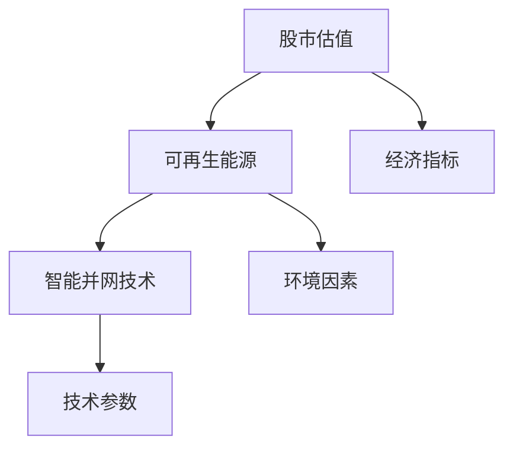
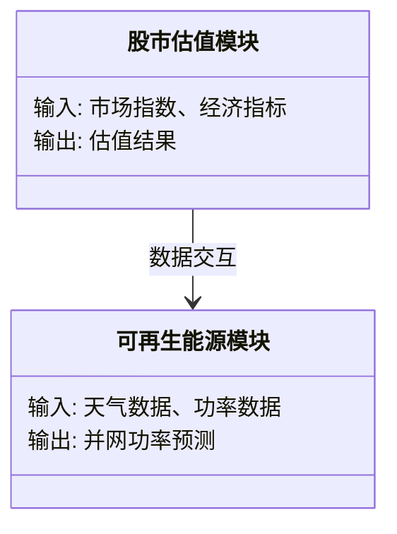
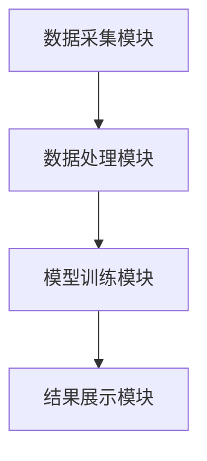

                 


# 全球股市估值与可再生能源智能并网技术的关系

> 关键词：全球股市估值，可再生能源，智能并网技术，时间序列分析，机器学习

> 摘要：本文深入探讨了全球股市估值与可再生能源智能并网技术之间的关系，分析了股市估值的核心要素、可再生能源智能并网技术的关键挑战，并通过算法和系统架构设计，提出了两者结合的解决方案。通过具体案例分析和项目实战，展示了如何利用时间序列分析和机器学习算法，实现对股市估值与可再生能源并网技术的智能化预测和优化。

---

## 第一部分: 全球股市估值与可再生能源智能并网技术的背景与关系

## 第1章: 背景介绍

### 1.1 问题背景与问题描述

#### 1.1.1 全球股市估值的重要性  
股市估值是衡量市场健康状况的重要指标，反映了经济运行的状态和投资者信心。通过对股市估值的分析，可以预测市场的波动趋势，为投资者提供决策依据。  

#### 1.1.2 可再生能源智能并网技术的必要性  
随着全球能源结构转型，可再生能源（如风能、太阳能）的占比逐渐增加。然而，可再生能源的波动性和间歇性对电网稳定性提出了更高要求，智能并网技术是实现电网高效管理的关键。  

#### 1.1.3 问题解决的路径与目标  
通过分析股市估值与可再生能源并网技术的关系，结合数学建模和机器学习算法，探索如何利用可再生能源的波动性特征优化股市估值模型，同时利用股市数据辅助可再生能源并网技术的优化。

---

### 1.2 问题背景的外延与边界

#### 1.2.1 全球股市的波动性分析  
股市波动性受到多种因素影响，包括经济指标、政策变化、市场情绪等。可再生能源的波动性（如风速、光照强度）也可能对股市产生间接影响。

#### 1.2.2 可再生能源并网的技术挑战  
可再生能源的不稳定性可能导致电网波动，需要通过智能并网技术实现功率预测和电网调节。

#### 1.2.3 问题解决的边界与范围  
本文研究的范围限定在技术层面，重点分析股市估值与可再生能源并网技术的数学关系，不涉及具体的市场政策和经济因素。

---

### 1.3 核心概念的结构与组成

#### 1.3.1 股市估值的核心要素  
- 市场指数（如标普500、纳斯达克指数）  
- 市盈率（P/E ratio）  
- 市净率（P/B ratio）  

#### 1.3.2 可再生能源并网技术的关键技术  
- 功率预测模型  
- 智能调节算法  
- 并网稳定性控制  

#### 1.3.3 两者关系的理论基础  
- 可再生能源的波动性可能影响股市的能源板块表现。  
- 股市数据中的波动性特征可以为可再生能源的功率预测提供参考。

---

## 第2章: 核心概念与联系

### 2.1 核心概念的原理与特征

#### 2.1.1 股市估值的原理  
股市估值基于市场参与者的预期，反映企业的盈利能力、市场地位和宏观经济环境。  

#### 2.1.2 可再生能源并网技术的原理  
通过智能算法实现对可再生能源功率的预测和电网调节，确保电网的稳定运行。

#### 2.1.3 两者关系的理论基础  
可再生能源的波动性特征与股市波动性之间存在潜在的相关性，可以通过数学建模进行关联分析。

---

### 2.2 核心概念的对比分析

| 特性               | 股市估值                   | 可再生能源并网技术             |
|--------------------|---------------------------|-------------------------------|
| 核心目标           | 评估市场价值               | 确保电网稳定                   |
| 数据来源           | 市场指数、经济指标         | 风速、光照强度、功率数据       |
| 挑战               | 市场波动性高               | 波动性高，稳定性要求高           |
| 解决路径           | 数学建模、机器学习         | 智能预测、动态调节             |

---

### 2.3 ER实体关系图架构



---

## 第3章: 算法原理讲解

### 3.1 数据建模与分析

#### 3.1.1 数据采集与预处理  
- 数据来源：股市数据（如标普500指数）和可再生能源数据（如风力发电功率）。  
- 预处理步骤：数据清洗、缺失值填充、标准化处理。

#### 3.1.2 时间序列分析模型

##### ARIMA模型  
ARIMA（自回归积分滑动平均模型）适用于时间序列预测。其数学公式为：  
$$ ARIMA(p, d, q) $$  
其中，$p$ 为自回归阶数，$d$ 为差分阶数，$q$ 为移动平均阶数。

##### Prophet模型  
Prophet模型是Facebook开源的时间序列预测工具，适用于具有强烈周期性的数据。其核心思想是将时间序列分解为趋势、周期和噪声三部分。

---

#### 3.1.3 回归分析模型  
- 线性回归：$$ y = \beta_0 + \beta_1x + \epsilon $$  
-岭回归（Lasso）：通过L1正则化解决多重共线性问题。

---

### 3.2 机器学习算法的应用

#### 3.2.1 支持向量回归（SVR）

##### 数学模型  
$$ y = f(x) $$  
其中，$f$ 是支持向量回归模型，通过最大化间隔优化目标函数。

##### 应用案例  
通过SVR模型预测可再生能源功率，输入特征包括历史功率、天气数据等。

#### 3.2.2 随机森林（Random Forest）

##### 核心思想  
随机森林通过构建多个决策树，并对结果进行投票或平均，提高模型的鲁棒性。

##### 应用案例  
利用随机森林模型预测股市指数的波动趋势，输入特征包括市场指数、宏观经济指标等。

---

## 第4章: 系统分析与架构设计方案

### 4.1 问题场景介绍

- 问题场景：如何利用可再生能源数据优化股市估值模型。  
- 项目目标：设计一个智能系统，实现股市估值与可再生能源并网技术的协同优化。

### 4.2 系统功能设计

#### 4.2.1 领域模型设计



#### 4.2.2 系统架构设计



---

## 第5章: 项目实战

### 5.1 环境安装与配置

- 环境要求：Python 3.8及以上版本，安装库包括pandas、numpy、scikit-learn、prophet。

### 5.2 核心代码实现

#### 5.2.1 数据处理与建模

```python
import pandas as pd
import numpy as np
from sklearn.metrics import mean_absolute_error
from sklearn.ensemble import RandomForestRegressor
from prophet import Prophet

# 数据加载与预处理
df_stock = pd.read_csv('stock_data.csv')
df_renewable = pd.read_csv('renewable_data.csv')

# 合并数据
merged_data = pd.merge(df_stock['Close'], df_renewable['Power'])
```

#### 5.2.2 时间序列预测

```python
# 使用Prophet模型预测股市指数
def forecast_stock(data):
    model = Prophet()
    model.fit(data)
    future = model.make_future_dataframe(30)
    forecast = model.predict(future)
    return forecast

# 使用随机森林预测可再生能源功率
def forecast_renewable(data):
    model = RandomForestRegressor(n_estimators=100)
    model.fit(data[['Weather', 'History_Power']], data['Power'])
    return model.predict(new_data)
```

---

### 5.3 案例分析与结果解读

#### 5.3.1 股市预测案例

- 输入数据：过去1年股市指数数据。  
- 输出结果：未来30天的股市预测值。

#### 5.3.2 可再生能源功率预测案例

- 输入数据：历史功率、天气数据。  
- 输出结果：未来24小时的功率预测值。

---

## 第6章: 最佳实践与小结

### 6.1 关键点总结

- 股市估值与可再生能源并网技术的结合需要数据驱动的分析方法。  
- 时间序列分析和机器学习算法是实现两者关系建模的关键工具。

### 6.2 注意事项

- 数据质量对模型性能影响重大，需注意数据清洗和特征工程。  
- 模型的实时性与准确性之间需要权衡。

### 6.3 拓展阅读

- 《时间序列分析与应用》  
- 《机器学习在金融领域的应用》  

---

通过本文的系统分析和实战案例，我们展示了如何利用数学建模和机器学习技术，探索全球股市估值与可再生能源智能并网技术之间的关系，并为实际应用提供了可行的解决方案。

