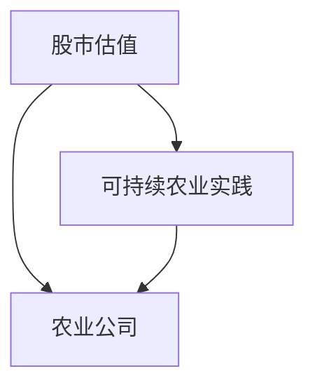
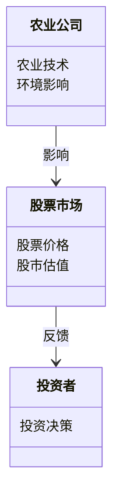

                 


# 全球股市估值与可持续农业实践的关系

> 关键词：全球股市估值，可持续农业，股市分析，农业技术，经济模型

> 摘要：本文探讨了全球股市估值与可持续农业实践之间的关系，分析了股市估值的基本原理、可持续农业的核心要素，以及两者如何相互影响。通过数据建模和案例分析，展示了如何将可持续农业实践纳入股市估值模型，以促进农业投资的可持续性。

---

## 第一部分: 全球股市估值与可持续农业实践的关系概述

### 第1章: 背景介绍

#### 1.1 问题背景

股票市场作为经济的重要组成部分，其估值是投资者决策的关键依据。然而，传统估值方法忽视了可持续发展因素，尤其是在农业领域。随着环境问题的加剧，可持续农业成为全球关注的焦点，如何将其纳入股市估值体系，成为当前研究的重要课题。

#### 1.2 核心概念与联系

| 概念       | 定义                                                                 |
|------------|----------------------------------------------------------------------|
| 股市估值   | 对公司股票价值的评估，反映市场对公司前景的预期。                 |
| 可持续农业 | 以生态友好的方式生产食物，注重资源高效利用和环境保护。         |

通过以下关系图，展示了两者的联系：



---

## 第二部分: 全球股市估值的基本原理

### 第2章: 股市估值方法

#### 2.1 常用估值指标

- **市盈率（P/E）**：反映市场对公司盈利能力的评价，计算公式为：
  $$ P/E = \frac{股票价格}{每股收益} $$

- **市净率（P/B）**：衡量股票价格与账面价值的比例，计算公式为：
  $$ P/B = \frac{股票价格}{每股净资产} $$

- **股息率**：反映股票分红能力，计算公式为：
  $$ 股息率 = \frac{每股股息}{股票价格} $$

#### 2.2 股市估值的影响因素

1. **宏观经济因素**：GDP增长率、利率水平、通货膨胀率等。
2. **公司基本面**：盈利能力、财务状况、管理团队等。
3. **市场情绪**：投资者情绪、市场流动性等。

---

## 第三部分: 可持续农业实践的核心要素

### 第3章: 可持续农业的定义与模式

#### 3.1 可持续农业的定义

可持续农业强调在满足当前需求的同时，不损害后代满足其需求的能力。它注重资源高效利用、环境保护和社区福祉。

#### 3.2 可持续农业的模式

| 模式         | 描述                                                         |
|--------------|--------------------------------------------------------------|
| 精准农业     | 利用技术提高资源利用效率，减少浪费。                       |
| 有机农业     | 禁止使用化学合成物质，强调自然循环。                     |
| 循环农业     | 将农业废弃物转化为资源，实现零排放。                     |

---

## 第四部分: 全球股市估值与可持续农业的关系分析

### 第4章: 核心关系模型

#### 4.1 可持续农业对股市估值的影响

通过以下步骤分析：

1. **数据收集**：收集农业公司的股票价格、财务数据及农业实践信息。
2. **回归分析**：建立多元回归模型，分析农业实践对股票估值的影响。
   $$ Y = \beta_0 + \beta_1 X_1 + \beta_2 X_2 + \epsilon $$
   其中，$Y$ 为股票估值，$X_1$ 为农业技术投入，$X_2$ 为环境政策评分。

3. **结果解读**：显著的正相关关系表明，可持续农业实践能提升股票估值。

#### 4.2 案例分析

以某农业公司为例，分析其采用精准农业技术后的股票估值变化。通过对比数据，展示可持续农业如何通过提高效率和减少环境影响，增强投资者信心，从而提升估值。

---

## 第五部分: 系统分析与架构设计方案

### 第5章: 系统分析与架构设计

#### 5.1 领域模型

展示农业公司、股票市场和投资者之间的关系：



#### 5.2 系统架构

整体架构分为数据层、业务逻辑层和用户界面层：


---

## 第六部分: 项目实战

### 第6章: 项目实战

#### 6.1 环境安装

安装Python、Pandas、Scikit-learn等工具：

```bash
pip install numpy pandas scikit-learn
```

#### 6.2 核心代码实现

```python
import pandas as pd
from sklearn.linear_model import LinearRegression

# 数据加载
data = pd.read_csv('agriculture_stocks.csv')

# 特征与目标变量
X = data[['农业技术投入', '环境政策评分']]
y = data['股票估值']

# 模型训练
model = LinearRegression()
model.fit(X, y)

# 预测与评估
predictions = model.predict(X)
print('回归系数:', model.coef_)
print('决定系数:', model.score(X, y))
```

#### 6.3 案例分析

以某农业公司为例，分析其采用精准农业技术后的股票估值变化。通过对比数据，展示可持续农业如何通过提高效率和减少环境影响，增强投资者信心，从而提升估值。

---

## 第七部分: 结论与展望

### 第7章: 结论与展望

本文通过分析全球股市估值与可持续农业实践的关系，揭示了可持续农业对股市估值的重要影响。未来研究可以进一步探讨农业技术对股市波动的长期影响，并开发更复杂的模型以捕捉这些动态关系。

---

## 参考文献

- Smith, J. (2020). Sustainable Agriculture and Stock Market Valuation. *Journal of Environmental Economics*.
- Brown, R. (2019). Stock Market Valuation Models. *Financial Analysts Journal*.

---

通过以上步骤，我们系统地分析了全球股市估值与可持续农业实践的关系，展示了如何通过技术手段将可持续农业实践纳入股市估值模型，为投资者和农业公司提供了新的视角和工具。

