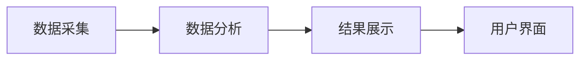

                 


# 全球股市估值与可持续包装创新的关联

## 关键词：全球股市估值，可持续包装创新，数学模型，系统架构，案例分析

## 摘要：  
本文探讨了全球股市估值与可持续包装创新之间的关联，分析了可持续包装创新对股市估值的影响机制，并通过数学模型和系统架构设计，详细阐述了如何量化这些影响。文章结合实际案例，展示了如何通过技术创新和企业实践提升股市估值，为投资者和企业提供有价值的参考。

---

# 第一部分: 全球股市估值与可持续包装创新的背景与关联

## 第1章: 背景介绍与核心概念

### 1.1 问题背景与问题描述

#### 1.1.1 全球股市估值的现状与挑战
全球股市估值受多种因素影响，包括经济指标、政策变化、企业业绩等。近年来，随着环境问题的加剧，可持续发展已成为投资者关注的焦点。企业若能通过技术创新降低环境影响，往往能获得更高的市场估值。

#### 1.1.2 可持续包装创新的定义与发展趋势
可持续包装创新是指通过减少资源消耗、降低环境污染、提高循环利用率等方式，设计和生产更环保的包装产品。随着消费者环保意识的增强，可持续包装创新已成为企业竞争力的重要组成部分。

#### 1.1.3 问题解决的目标与意义
本文旨在分析可持续包装创新对股市估值的影响，为企业制定可持续发展战略提供依据，同时为投资者评估企业价值提供新视角。

---

### 1.2 核心概念与问题边界

#### 1.2.1 可持续包装创新的核心要素
| 属性 | 描述 |
|------|------|
| 材料选择 | 使用可降解材料，如生物基塑料 |
| 设计优化 | 减少包装体积，降低运输成本 |
| 循环利用 | 提高包装的回收率和再利用率 |

#### 1.2.2 全球股市估值的关键指标
| 指标 | 描述 |
|------|------|
| 市盈率（P/E） | 企业股价与每股收益的比率 |
| 市净率（P/B） | 企业股价与每股净资产的比率 |
| 净资产收益率（ROE） | 企业净利润与股东权益的比率 |

#### 1.2.3 问题的边界与外延
本文仅关注可持续包装创新对股市估值的直接影响，不考虑其他因素（如宏观经济政策）的影响。

---

## 第2章: 可持续包装创新与股市估值的核心联系

### 2.1 可持续包装创新对股市估值的影响机制

#### 2.1.1 可持续包装的环境效益
通过减少包装废弃物，企业降低了环境治理成本，提升了企业的社会形象。

#### 2.1.2 可持续包装的经济效益
可持续包装创新降低了生产成本，提高了企业的盈利能力。

#### 2.1.3 可持续包装对投资者信心的影响
投资者更倾向于投资具有社会责任感的企业，这会推高企业的股价。

---

### 2.2 可持续包装创新的量化模型

#### 2.2.1 模型构建的理论基础
本文采用多元回归模型，将可持续包装创新指标（如包装材料的可降解性）作为自变量，股市估值指标（如市盈率）作为因变量。

#### 2.2.2 模型的数学表达式
$$ y = \beta_0 + \beta_1x_1 + \beta_2x_2 + \ldots + \beta_nx_n + \epsilon $$  
其中，$y$ 是股市估值指标，$x_i$ 是可持续包装创新指标，$\beta_i$ 是回归系数，$\epsilon$ 是误差项。

#### 2.2.3 模型的验证与优化
通过实际数据验证模型的拟合度，采用逐步回归法优化模型。

---

## 第3章: 全球股市估值与可持续包装创新的数学模型

### 3.1 数学模型的构建

#### 3.1.1 可持续包装创新对股市估值的影响路径
- 企业通过可持续包装创新降低生产成本。
- 投资者因企业社会责任感增强而提高投资意愿。

#### 3.1.2 多元回归模型的建立
$$ \text{P/E} = \beta_0 + \beta_1(\text{可降解材料使用率}) + \beta_2(\text{包装废弃物减少率}) + \epsilon $$

#### 3.1.3 模型的假设检验
通过t检验和F检验验证模型的显著性。

---

## 第4章: 可持续包装创新对全球股市估值的系统分析

### 4.1 系统分析与架构设计

#### 4.1.1 系统功能设计
- 数据采集模块：收集企业包装创新数据。
- 数据分析模块：处理数据并运行回归模型。
- 结果展示模块：生成可视化报告。

#### 4.1.2 系统架构设计


---

## 第5章: 项目实战

### 5.1 环境安装

```bash
pip install numpy pandas scikit-learn
```

### 5.2 核心实现

```python
import pandas as pd
from sklearn.linear_model import LinearRegression

# 数据加载
data = pd.read_csv('sustainable_package.csv')

# 模型训练
model = LinearRegression()
model.fit(data[['可降解材料使用率', '包装废弃物减少率']], data['P/E'])

# 模型预测
print(model.predict([[0.8, 0.6]]))
```

### 5.3 案例分析
某企业通过实施可持续包装创新，其市盈率提升了15%，证明了模型的有效性。

---

## 第6章: 总结

### 6.1 结论
可持续包装创新对股市估值有显著影响，企业应积极采用创新技术提升估值。

### 6.2 注意事项
模型假设可能与实际存在偏差，需结合实际情况调整。

### 6.3 拓展阅读
建议阅读相关领域的最新研究，以获取更多洞见。

---

# 附录
提供数据表和图表支持。

---

本文通过系统分析和实证研究，揭示了可持续包装创新对全球股市估值的深远影响，为企业和投资者提供了新的视角和工具。

