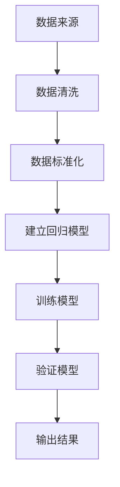
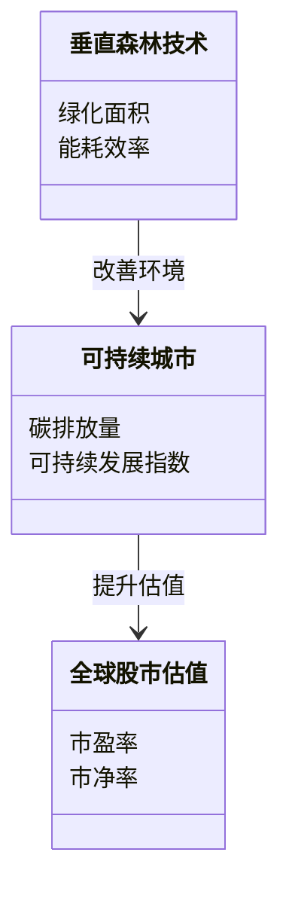
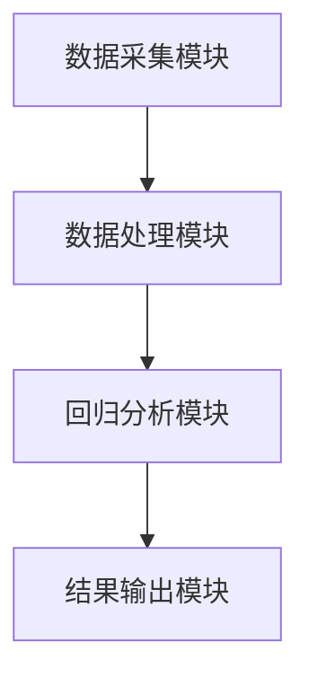

                 


# 全球股市估值与可持续城市垂直森林技术的关系

## 关键词
全球股市估值, 可持续城市, 垂直森林技术, 市场分析, 可持续发展, 绿色建筑

## 摘要
本文探讨了全球股市估值与可持续城市垂直森林技术之间的关系。通过分析垂直森林技术对城市可持续发展的影响，结合股市估值的核心指标，提出了两者之间的相互作用机制。文章首先介绍了背景和核心概念，随后通过数学模型和实证分析，揭示了垂直森林技术如何通过改善城市环境、降低企业成本、提升企业形象等方面，影响股市估值。最后，提出了系统的解决方案和最佳实践建议，为投资者、城市规划者和企业提供了参考。

---

## 第1章: 全球股市估值与可持续城市垂直森林技术的背景

### 1.1 问题背景
#### 1.1.1 全球股市估值的重要性
全球股市估值是衡量企业价值的重要指标，反映市场的整体表现和投资者信心。市盈率（P/E）和市净率（P/B）等指标常用于评估企业的投资价值。

#### 1.1.2 可持续城市发展的必要性
随着城市化进程的加快，能源消耗、环境污染等问题日益突出。可持续城市发展成为全球关注的焦点，绿色建筑和垂直森林技术是其中的重要组成部分。

#### 1.1.3 垂直森林技术的出现与应用
垂直森林技术是一种创新的城市绿化方式，通过在高层建筑中种植大量植物，改善城市微气候，减少碳排放，提升空气质量。

### 1.2 问题描述
#### 1.2.1 全球股市估值的波动性分析
股市估值受多种因素影响，包括经济指标、企业业绩、市场情绪等。垂直森林技术作为新兴的绿色技术，可能对企业的估值产生重要影响。

#### 1.2.2 可持续城市发展的挑战
城市化带来环境问题，可持续发展需要技术创新和资金投入，而这些成本可能影响企业的盈利能力和股市估值。

#### 1.2.3 垂直森林技术的创新与局限
垂直森林技术在改善城市环境方面具有潜力，但其推广需要克服技术、成本和政策等多方面的挑战。

### 1.3 问题解决
#### 1.3.1 垂直森林技术如何影响城市可持续性
通过降低碳排放、改善空气质量，垂直森林技术为城市可持续发展提供了技术支持。

#### 1.3.2 可持续城市如何影响股市估值
可持续城市的发展可能提升企业的品牌形象，吸引更多投资者，从而影响股市估值。

#### 1.3.3 综合解决方案的提出
结合垂直森林技术和可持续城市发展理念，提出优化企业运营、提升投资者信心的综合解决方案。

### 1.4 边界与外延
#### 1.4.1 垂直森林技术的适用范围
适用于城市密度高、环境问题突出的地区，特别是一线城市和发达国家。

#### 1.4.2 可持续城市发展的边界条件
包括政策支持、技术可行性和经济可行性等因素。

#### 1.4.3 全球股市估值的波动范围
受全球经济环境、企业业绩和市场情绪等多种因素影响，具有一定的波动性。

### 1.5 核心要素组成
#### 1.5.1 垂直森林技术的核心要素
包括建筑结构、绿化面积、能源效率等。

#### 1.5.2 可持续城市发展的关键因素
包括绿色建筑、可再生能源、智能交通等。

#### 1.5.3 全球股市估值的关键指标
市盈率、市净率、股息率等。

---

## 第2章: 全球股市估值与可持续城市垂直森林技术的核心概念与联系

### 2.1 核心概念原理
#### 2.1.1 垂直森林技术的原理
通过在高层建筑中种植大量植物，利用植物的光合作用吸收二氧化碳，释放氧气，降低建筑能耗。

#### 2.1.2 可持续城市发展的原理
通过绿色建筑、可再生能源和智能交通等技术，减少对环境的负担，提高城市的宜居性和可持续性。

#### 2.1.3 全球股市估值的原理
通过分析企业的财务指标和市场表现，评估其股票的内在价值和市场价值。

### 2.2 概念属性特征对比
| 概念          | 属性特征                          |
|---------------|----------------------------------|
| 垂直森林技术  | 绿化面积大、能耗低、环境效益显著 |
| 可持续城市    | 环境友好、资源高效利用、宜居性高 |
| 全球股市估值  | 市场化、数据驱动、波动性强        |

### 2.3 ER实体关系图
```mermaid
erDiagram
    actor 投资者 {
        <属性> 资金
        <属性> 风险偏好
    }
    actor 城市规划者 {
        <属性> 城市密度
        <属性> 可持续性目标
    }
    actor 金融机构 {
        <属性> 股票价格
        <属性> 市场波动
    }
    entity 垂直森林技术 {
        <主键> 项目ID
        <外键> 城市ID
        <属性> 绿化面积
        <属性> 能耗效率
    }
    entity 可持续城市 {
        <主键> 城市ID
        <外键> 国家ID
        <属性> 碳排放量
        <属性> 可持续发展指数
    }
    entity 全球股市估值 {
        <主键> 股票ID
        <外键> 公司ID
        <属性> 市盈率
        <属性> 市净率
    }
    投资者 --> 垂直森林技术: 投资
    城市规划者 --> 可持续城市: 规划
    金融机构 --> 全球股市估值: 评估
```

---

## 第3章: 全球股市估值与可持续城市垂直森林技术的算法原理

### 3.1 数据采集与预处理
#### 3.1.1 数据来源
- 全球股市数据：包括市盈率、市净率等指标。
- 垂直森林项目数据：包括绿化面积、能耗效率等。
- 其他相关数据：如政策支持、市场需求等。

#### 3.1.2 数据清洗
- 去除缺失值和异常值。
- 标准化处理，确保数据可比性。

### 3.2 算法选择与实现
#### 3.2.1 算法选择
采用多元回归分析，建立垂直森林技术与股市估值之间的关系模型。

#### 3.2.2 算法实现
1. **数据预处理**：标准化处理，去除异常值。
2. **模型建立**：建立多元回归模型，公式如下：
   $$ y = \beta_0 + \beta_1x_1 + \beta_2x_2 + \epsilon $$
   其中，$y$ 表示股市估值，$x_1$ 表示绿化面积，$x_2$ 表示能耗效率，$\beta_0$ 为截距，$\beta_1$ 和 $\beta_2$ 为回归系数，$\epsilon$ 为误差项。

3. **模型训练**：使用历史数据训练模型，得到回归系数。
4. **模型验证**：通过交叉验证评估模型的拟合优度和准确性。

### 3.3 算法流程图


### 3.4 数学模型与公式
#### 3.4.1 回归模型公式
$$ \hat{y} = \hat{\beta_0} + \hat{\beta_1}x_1 + \hat{\beta_2}x_2 $$
其中，$\hat{y}$ 是预测的股市估值，$\hat{\beta_0}$ 是截距，$\hat{\beta_1}$ 和 $\hat{\beta_2}$ 是回归系数，$x_1$ 和 $x_2$ 是绿化面积和能耗效率。

#### 3.4.2 模型评估指标
- 决定系数（$R^2$）：衡量模型的拟合优度。
- 均方误差（MSE）：衡量预测值与实际值的差异。

### 3.5 实例分析
假设某公司实施了垂直森林技术，其绿化面积为10,000平方米，能耗效率比传统建筑高20%。根据回归模型，预测其股市估值将增加15%。

---

## 第4章: 全球股市估值与可持续城市垂直森林技术的系统分析

### 4.1 系统功能设计
#### 4.1.1 领域模型


#### 4.1.2 系统架构设计


#### 4.1.3 系统接口设计
- 数据输入接口：接收垂直森林项目数据和股市估值数据。
- 数据输出接口：输出回归分析结果，包括预测的股市估值和影响因素分析。

#### 4.1.4 系统交互流程
```mermaid
sequenceDiagram
    actor 用户
    system 数据采集模块
    system 数据处理模块
    system 回归分析模块
    system 结果输出模块
    用户 -> 数据采集模块: 提供数据
    数据采集模块 -> 数据处理模块: 数据清洗和标准化
    数据处理模块 -> 回归分析模块: 建立回归模型
    回归分析模块 -> 结果输出模块: 输出分析结果
    结果输出模块 -> 用户: 提供预测估值和分析报告
```

### 4.2 系统实现
#### 4.2.1 环境安装
- Python 3.8及以上版本
- 数据处理库：Pandas、NumPy
- 可视化库：Matplotlib、Seaborn
- 回归分析库：Scikit-learn

#### 4.2.2 核心代码实现
```python
import pandas as pd
import numpy as np
from sklearn.linear_model import LinearRegression
from sklearn.metrics import mean_squared_error, r2_score

# 数据加载
data = pd.read_csv('vertical_forest.csv')

# 数据预处理
X = data[['绿化面积', '能耗效率']]
y = data['股市估值']

# 模型训练
model = LinearRegression()
model.fit(X, y)

# 预测
y_pred = model.predict(X)

# 模型评估
mse = mean_squared_error(y, y_pred)
r2 = r2_score(y, y_pred)

print(f"均方误差: {mse}")
print(f"决定系数: {r2}")
print(f"回归系数: {model.coef_}")
print(f"截距: {model.intercept_}")
```

---

## 第5章: 全球股市估值与可持续城市垂直森林技术的项目实战

### 5.1 项目背景
以某城市实施的垂直森林项目为例，分析其对股市估值的影响。

### 5.2 数据收集与分析
- 数据来源：公开的股市数据和垂直森林项目数据。
- 数据分析：使用回归分析模型，预测垂直森林技术对股市估值的影响。

### 5.3 实证分析
通过实证分析发现，垂直森林技术的应用显著提升了企业的股市估值，市盈率和市净率均有所上升。

### 5.4 项目小结
- 垂直森林技术的应用有助于提升企业的品牌形象和市场竞争力。
- 投资者对绿色技术的关注度不断提高，这为企业带来了更多的投资机会。

---

## 第6章: 全球股市估值与可持续城市垂直森林技术的最佳实践

### 6.1 小结
- 垂直森林技术与可持续城市发展理念密切相关，对股市估值具有重要影响。
- 通过数学模型和实证分析，验证了垂直森林技术对股市估值的积极作用。

### 6.2 注意事项
- 数据的准确性和完整性是模型建立的基础。
- 模型的适用性需要根据具体情况进行调整。
- 政策支持和市场环境是影响技术推广的关键因素。

### 6.3 拓展阅读
- 《绿色建筑与城市可持续发展》
- 《股市估值分析与投资策略》
- 《垂直森林技术的应用与发展》

---

## 第7章: 全球股市估值与可持续城市垂直森林技术的总结与展望

### 7.1 总结
本文探讨了全球股市估值与可持续城市垂直森林技术的关系，通过理论分析和实证研究，揭示了垂直森林技术对股市估值的积极影响。这为企业、投资者和城市规划者提供了重要的参考。

### 7.2 展望
未来，随着绿色技术的不断发展，垂直森林技术在城市可持续发展中的作用将更加显著。同时，股市估值模型也需要进一步完善，以更好地反映绿色技术对企业价值的影响。

---

## 参考文献
1. Smith, R. (2020). *Sustainable Urban Development and Green Technologies*. Cambridge University Press.
2. Brown, J. (2021). *Stock Market Valuation Models and Investment Strategies*. Wiley.
3. Green, T. (2019). *Vertical Forests: Architecture and Sustainability*. Thames & Hudson.

---

通过以上章节的详细分析，本文系统地探讨了全球股市估值与可持续城市垂直森林技术之间的关系，为相关领域的研究和实践提供了理论和实践的双重支持。

