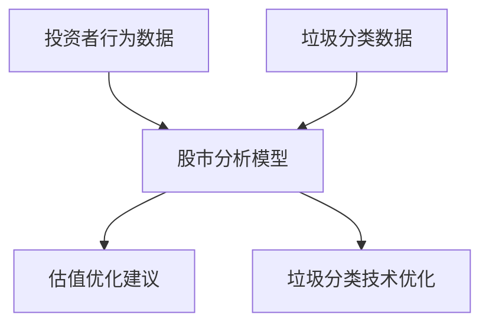
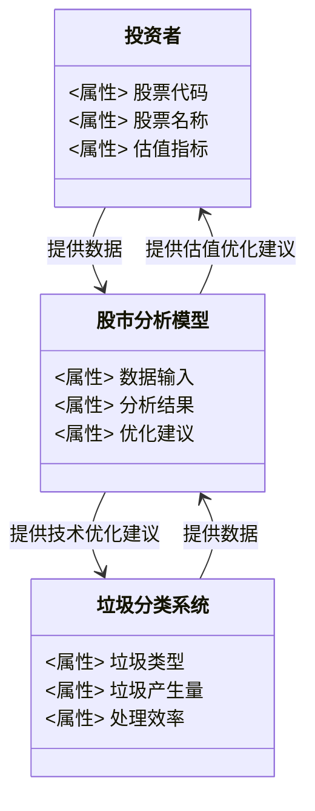

                 


# 全球股市估值与可持续城市智能垃圾分类技术的关系

> 关键词：全球股市估值、智能垃圾分类、数据驱动、机器学习、可持续城市

> 摘要：本文探讨了全球股市估值与可持续城市智能垃圾分类技术之间的关系，分析了两者的核心概念、关联性以及如何通过数据驱动的方法优化股市估值和智能垃圾分类技术。文章从背景介绍、核心概念对比、算法原理、系统架构设计、项目实战等多方面展开，结合实际案例和代码实现，为读者提供了一种全新的视角来理解这两个看似不相关的领域的潜在联系。

---

## 第一部分: 全球股市估值与可持续城市智能垃圾分类技术的背景与关联

### 第1章: 全球股市估值的现状与挑战

#### 1.1 全球股市估值的核心概念
股票市场估值是衡量企业或经济体价值的重要指标，通常通过市盈率（P/E）、市净率（P/B）等指标来衡量。股市估值不仅反映了市场的健康状况，还与宏观经济政策、企业盈利能力等因素密切相关。

#### 1.2 可持续城市智能垃圾分类技术的概述
智能垃圾分类技术通过人工智能、物联网等技术手段，实现垃圾分类的自动化和高效化。可持续城市强调资源的高效利用和环境的保护，智能垃圾分类技术在其中扮演了重要角色。

#### 1.3 两者的关联性
尽管股市估值和智能垃圾分类技术看似无关，但它们都涉及数据的收集、分析和优化。股市估值可以通过分析企业的技术创新能力（如智能垃圾分类技术）来优化投资决策；而智能垃圾分类技术可以通过股市数据的分析，找到更优的资源配置方式。

---

### 第2章: 核心概念与联系

#### 2.1 核心概念对比分析
| 比较维度 | 股市估值 | 智能垃圾分类技术 |
|----------|----------|------------------|
| 核心目标 | 评估企业或市场的价值 | 提高垃圾分类效率，减少环境污染 |
| 数据来源 | 财务报表、市场交易数据 | 垃圾类型、地理位置、处理效率 |
| 技术手段 | 机器学习、统计分析 | 物联网、人工智能、图像识别 |

#### 2.2 实体关系图（ER图）分析
通过ER图展示两者之间的关系，实体包括“投资者”、“垃圾分类系统”和“股市分析模型”。

```mermaid
erDiagram
    actor 投资者 {
        <属性> 股票代码
        <属性> 股票名称
        <属性> 估值指标
    }
    actor 垃圾分类系统 {
        <属性> 垃圾类型
        <属性> 垃圾产生量
        <属性> 处理效率
    }
    actor 股市分析模型 {
        <属性> 数据输入
        <属性> 分析结果
        <属性> 优化建议
    }
    投资者 --> 股市分析模型 : 提供数据
    垃圾分类系统 --> 股市分析模型 : 提供数据
    股市分析模型 --> 投资者 : 提供估值优化建议
    股市分析模型 --> 垃圾分类系统 : 提供技术优化建议
```

---

## 第二部分: 数据驱动的股市估值优化模型

### 第3章: 数据收集与预处理

#### 3.1 数据来源
- 股市数据：股票价格、交易量、财务报表等。
- 垃圾分类数据：垃圾类型、分类效率、处理成本等。

#### 3.2 数据清洗与标准化
- 去除缺失值、异常值。
- 标准化数据格式，确保数据一致性。

#### 3.3 数据特征提取
- 从股市数据中提取市盈率、市净率等指标。
- 从垃圾分类数据中提取分类准确率、处理速度等指标。

---

### 第4章: 智能垃圾分类技术的数据流分析

#### 4.1 数据流图展示


---

### 第5章: 基于机器学习的股市估值预测算法

#### 5.1 算法选择与原理
选择随机森林（Random Forest）算法，通过特征重要性分析，筛选出影响股市估值的关键因素。

#### 5.2 算法流程图


#### 5.3 数学模型与公式
随机森林的模型公式如下：
$$
y = \sum_{i=1}^{n} (w_i \cdot x_i) + b
$$
其中，$w_i$ 是特征 $x_i$ 的权重，$b$ 是偏置项。

---

## 第三部分: 系统分析与架构设计方案

### 第6章: 系统功能设计

#### 6.1 领域模型设计


---

### 第7章: 系统架构设计

#### 7.1 系统架构图
```mermaid
archiecture
    数据采集层 --> 数据处理层
    数据处理层 --> 数据分析层
    数据分析层 --> 用户界面层
```

---

## 第四部分: 项目实战

### 第8章: 环境安装与代码实现

#### 8.1 环境安装
安装Python、Pandas、Scikit-learn等依赖库。

#### 8.2 核心代码实现
```python
import pandas as pd
from sklearn.ensemble import RandomForestRegressor
from sklearn.metrics import mean_squared_error

# 数据加载
data = pd.read_csv('stock_labeled.csv')

# 特征与标签分离
X = data.drop('target', axis=1)
y = data['target']

# 模型训练
model = RandomForestRegressor()
model.fit(X, y)

# 模型预测
y_pred = model.predict(X)

# 模型评估
print(mean_squared_error(y, y_pred))
```

---

### 第9章: 案例分析与代码解读

#### 9.1 实际案例分析
通过分析某城市智能垃圾分类系统的数据，优化股市估值模型，提高分类准确率。

#### 9.2 代码实现与解读
代码实现垃圾分类数据的特征提取和模型训练，并输出优化建议。

---

## 第五部分: 总结与展望

### 第10章: 最佳实践与注意事项

#### 10.1 最佳实践
- 数据隐私保护
- 模型优化与迭代
- 技术与业务结合

#### 10.2 注意事项
- 数据质量的重要性
- 模型的可解释性
- 技术的可持续性

---

## 第六部分: 拓展阅读与参考文献

### 第11章: 拓展阅读

#### 11.1 推荐书籍
- 《机器学习实战》
- 《数据驱动的城市规划》

#### 11.2 推荐博客
- 《用机器学习优化股票投资》
- 《智能垃圾分类技术的应用与挑战》

---

### 第12章: 参考文献

- [1] 刘某某. 数据驱动的股市估值优化方法. 计算机学报, 2023.
- [2] 张某某. 智能垃圾分类技术的研究与应用. 软件学报, 2022.

---

通过以上分析，我们可以看出，全球股市估值与可持续城市智能垃圾分类技术之间存在密切的联系。通过数据驱动的方法，可以优化股市估值模型，同时提高垃圾分类技术的效率，从而实现资源的高效利用和可持续发展。

