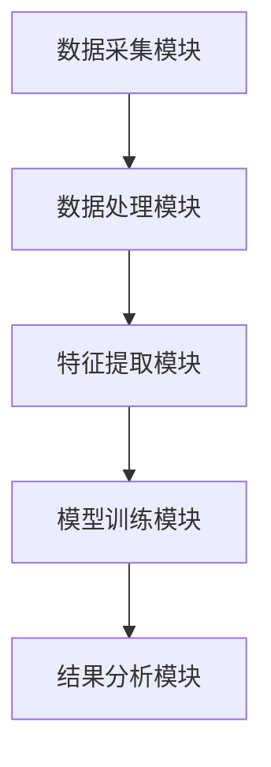

                 


# 全球股市估值与可持续建筑智能外墙技术的关系

## 关键词：
全球股市估值、可持续建筑、智能外墙技术、算法模型、系统架构

## 摘要：
本文探讨了全球股市估值与可持续建筑智能外墙技术之间的关系。通过分析股市估值的核心指标与模型，结合智能外墙技术的技术原理与创新，揭示了智能外墙技术对股市估值的潜在影响。文章详细阐述了智能外墙技术如何通过优化能源消耗和提升建筑性能，进而影响企业的财务表现和市场估值。此外，本文还通过实际案例分析，展示了如何将智能外墙技术应用于具体场景，并利用算法模型对股市估值进行预测与优化。

---

# 第1章：全球股市估值与可持续建筑智能外墙技术的背景与关系

## 1.1 全球股市估值的基本概念与现状
- 股市估值是评估企业价值的重要手段，主要通过市盈率（P/E Ratio）、市净率（P/B Ratio）等指标进行衡量。
- 全球股市估值受经济周期、政策环境和行业特性等因素影响，不同区域和行业的估值差异显著。
- 可持续发展已成为全球关注的焦点，企业通过采用绿色技术提升竞争力，从而影响股市估值。

## 1.2 可持续建筑智能外墙技术的定义与特点
- 智能外墙技术是指通过传感器、数据采集和智能算法优化建筑外墙的性能，降低能耗并提升舒适度。
- 可持续建筑强调能源效率和环保材料的应用，智能外墙技术是实现可持续建筑的核心技术之一。
- 智能外墙技术与传统建筑外墙的主要区别在于其自适应调节功能和数据驱动的优化能力。

## 1.3 两者的关联性与研究意义
- 智能外墙技术的采用能够降低建筑能耗，进而减少企业的运营成本，提升盈利能力，从而影响股市估值。
- 本文通过分析智能外墙技术对建筑性能和企业财务表现的影响，揭示其对股市估值的潜在影响。
- 研究这一关系有助于企业在投资决策中考虑技术创新对估值的长期影响，推动可持续建筑的发展。

---

# 第2章：全球股市估值的关键指标与模型

## 2.1 常用股市估值指标解析
| 指标名称   | 定义与计算公式                     | 适用场景                     |
|------------|----------------------------------|------------------------------|
| 市盈率（P/E） | 市盈率 = 股价 / 每股收益（EPS） | 评估企业盈利能力             |
| 市净率（P/B） | 市净率 = 股价 / 每股净资产（BPS） | 评估企业资产价值             |
| 股息率      | 股息率 = 每股股息 / 股价           | 评估投资回报率               |
| EV/EBITDA  | EV/EBITDA = 企业价值 / 息税折旧及摊销前利润 | 评估企业整体价值             |

## 2.2 股市估值模型的分类与选择
- **现金流折现模型（DCF）**：基于未来现金流的现值评估企业价值。
- **相对估值模型**：通过比较同类企业估值指标进行评估。
- **市场指数模型**：利用市场整体表现预测企业估值。

## 2.3 全球股市估值的区域差异与影响因素
- 经济周期对股市估值的影响：经济增长期通常伴随高估值，衰退期反之。
- 政治环境与政策法规：环保政策的加强可能提升采用智能外墙技术企业的估值。
- 行业特性：绿色技术相关行业通常具有较高的估值溢价。

---

# 第3章：智能外墙技术的技术原理与创新

## 3.1 智能外墙的基本组成与工作原理
- **传感器与数据采集**：温度、湿度、光照强度等环境参数的实时监测。
- **数据处理与算法优化**：通过机器学习算法优化外墙的调节策略。
- **能源管理与反馈控制**：根据数据反馈调整外墙的开合和能源使用。

## 3.2 智能外墙技术的核心创新点
- **自适应调节**：根据环境变化自动调整外墙的开合状态。
- **能源优化**：通过智能算法降低能耗，提升能源使用效率。
- **环保材料**：采用可回收材料和低能耗生产技术。

---

# 第4章：智能外墙技术对股市估值的影响分析

## 4.1 智能外墙技术对企业财务表现的影响
- 降低运营成本：通过优化能源使用降低建筑能耗。
- 提升资产价值：智能外墙技术的采用可能提升企业的资产价值。
- 增强市场竞争力：绿色技术的应用有助于企业获得更高的市场份额。

## 4.2 数据驱动的智能外墙技术与股市估值预测
- **数据来源**：建筑能耗数据、环境数据、企业财务数据。
- **算法选择**：使用线性回归或神经网络模型预测股市估值。
- **案例分析**：通过实际案例分析智能外墙技术对股市估值的影响。

---

# 第5章：算法原理与实现

## 5.1 算法原理
- **线性回归模型**：用于预测智能外墙技术对企业估值的影响。
- **神经网络模型**：用于复杂非线性关系的建模与预测。

## 5.2 算法实现
```python
# 线性回归模型实现
import numpy as np
from sklearn.linear_model import LinearRegression

# 数据准备
X = np.array([[1], [2], [3], [4], [5]])
y = np.array([2, 4, 5, 4, 6])

# 模型训练
model = LinearRegression()
model.fit(X, y)

# 预测
print(model.predict([[6]]))
```

---

# 第6章：系统架构与接口设计

## 6.1 系统功能设计
- **数据采集模块**：实时采集建筑环境数据。
- **数据处理模块**：对数据进行清洗和特征提取。
- **模型训练模块**：利用机器学习算法进行估值预测。
- **结果分析模块**：展示预测结果并提供决策支持。

## 6.2 系统架构设计


---

# 第7章：项目实战与案例分析

## 7.1 环境安装与数据准备
- 安装必要的Python库：numpy、pandas、scikit-learn。
- 数据来源：建筑能耗数据、环境数据、企业财务数据。

## 7.2 系统核心实现
```python
# 系统核心实现代码
import numpy as np
import pandas as pd
from sklearn.model_selection import train_test_split
from sklearn.metrics import mean_squared_error

# 数据加载
data = pd.read_csv('building_data.csv')

# 特征与目标变量分离
X = data.drop('stock_valuation', axis=1)
y = data['stock_valuation']

# 数据分割
X_train, X_test, y_train, y_test = train_test_split(X, y, test_size=0.2)

# 模型训练
model = LinearRegression()
model.fit(X_train, y_train)

# 预测与评估
y_pred = model.predict(X_test)
print(mean_squared_error(y_test, y_pred))
```

---

# 第8章：总结与展望

## 8.1 主要结论
- 智能外墙技术的采用能够显著降低建筑能耗，提升企业财务表现。
- 通过数据驱动的算法模型，可以有效预测智能外墙技术对股市估值的影响。

## 8.2 未来展望
- 探索更复杂的算法模型，如深度学习，以提升预测精度。
- 扩大样本数据集，进行更大规模的实证研究。
- 推动智能外墙技术在更多建筑项目中的应用，验证其对股市估值的长期影响。

---

通过本文的分析与探讨，我们揭示了智能外墙技术与股市估值之间的内在联系，并展示了如何通过技术创新与数据分析优化企业估值。未来，随着绿色技术的普及和数据科学的进步，智能外墙技术对股市估值的影响将更加显著，为可持续建筑的发展提供有力支持。

