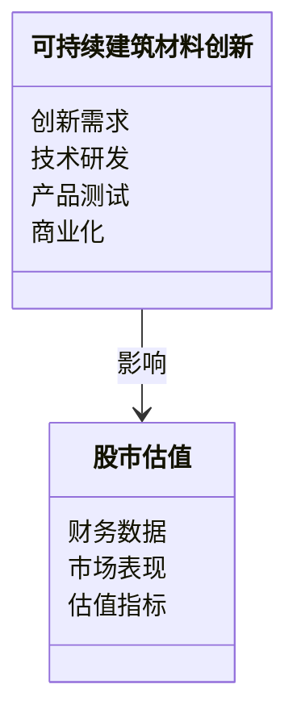

                 


# 全球股市估值与可持续建筑材料创新的关系

## 关键词：全球股市估值、可持续建筑材料、创新、经济影响、数学模型

## 摘要：本文探讨了全球股市估值与可持续建筑材料创新之间的关系，分析了可持续建筑材料创新如何影响企业的盈利能力和市场竞争力，从而对股市估值产生深远影响。通过构建数学模型和算法，本文揭示了可持续建筑材料创新对股市估值的具体影响路径，并提出了优化企业创新策略和投资者决策的建议。

---

## 第一部分: 全球股市估值与可持续建筑材料创新的背景介绍

### 第1章: 全球股市估值的基本概念与现状

#### 1.1 股市估值的定义与重要性
股市估值是指通过对企业的财务数据和市场表现进行分析，评估企业股票的合理价格范围。其重要性体现在以下几个方面：
- **反映企业价值**：股市估值帮助投资者判断企业的实际价值，避免盲目投资。
- **指导投资决策**：通过分析估值指标，投资者可以做出更明智的投资选择。
- **影响市场走势**：股市估值的变化直接影响市场的供需关系，进而影响整体市场的走势。

#### 1.2 可持续建筑材料的创新
可持续建筑材料是指在生产、使用和废弃过程中对环境影响较小的材料。其创新主要体现在以下几个方面：
- **环保性**：减少对自然资源的消耗和对环境的污染。
- **耐久性**：提高材料的使用寿命，降低维护成本。
- **经济性**：通过技术创新降低成本，提高竞争力。

#### 1.3 两者关系的背景
随着全球对环境保护的重视，可持续建筑材料的创新逐渐成为企业竞争力的重要组成部分。然而，这种创新如何影响企业的估值，以及投资者如何将这些创新纳入估值模型，仍是一个值得深入探讨的问题。

---

## 第二部分: 核心概念与联系

### 第4章: 可持续建筑材料创新的核心原理

#### 4.1 创新机制
可持续建筑材料的创新通常涉及以下几个步骤：
1. **问题识别**：发现传统材料在使用中的不足。
2. **技术开发**：通过技术研发改进材料性能。
3. **产品测试**：对新产品进行性能测试和市场验证。
4. **商业化**：将新产品推向市场。

#### 4.2 创新对经济的影响
可持续建筑材料的创新不仅降低了企业的生产成本，还提高了产品的市场竞争力。这种竞争优势通过提高企业的盈利能力间接影响其股市估值。

### 第5章: 股市估值与可持续建筑材料创新的联系

#### 5.1 股市估值的核心指标
- **市盈率（P/E）**：市盈率=股价/每股收益，反映了投资者对企业的盈利预期。
- **市净率（P/B）**：市净率=股价/每股净资产，反映了企业资产的估值。
- **股东权益回报率（ROE）**：ROE=净利润/股东权益，反映了企业的盈利能力。

#### 5.2 可持续建筑材料创新对股市估值的影响
通过引入可持续建筑材料，企业可以降低生产成本，提高产品竞争力，从而提高净利润和ROE，进而提升市盈率和市净率。

---

## 第三部分: 核心概念与联系的数学模型与算法

### 第6章: 可持续建筑材料创新对股市估值影响的数学模型

#### 6.1 模型构建
我们假设企业的净利润可以通过引入可持续建筑材料得到提升。设企业原有的净利润为\( \text{净利润}_0 \)，引入创新后净利润为\( \text{净利润}_1 \)，则：
$$ \text{净利润}_1 = \text{净利润}_0 \times (1 + \text{创新影响系数}) $$

#### 6.2 创新影响系数的计算
创新影响系数可以通过以下步骤计算：
1. **确定创新成本**：计算企业在创新过程中投入的研发费用和生产成本。
2. **评估创新收益**：通过市场反馈和销售数据评估创新带来的收益。
3. **计算系数**：创新影响系数=（创新收益 - 创新成本）/ 创新成本。

#### 6.3 模型验证
通过实际案例验证模型的有效性。例如，某企业引入新型可持续建材后，净利润提升了20%，则创新影响系数为0.2。

---

## 第四部分: 系统分析与架构设计方案

### 第7章: 系统功能设计

#### 7.1 领域模型


### 第8章: 系统架构设计


---

## 第五部分: 项目实战

### 第9章: 环境安装与代码实现

#### 9.1 环境安装
安装Python和相关库：
```bash
pip install numpy pandas matplotlib
```

#### 9.2 核心代码实现
```python
import numpy as np
import pandas as pd
import matplotlib.pyplot as plt

# 模型参数
original_profit = 100  # 原有净利润
innovation_impact = 0.2  # 创新影响系数

# 计算创新后的净利润
new_profit = original_profit * (1 + innovation_impact)

# 可视化
x = np.array(['Original Profit', 'New Profit'])
y = np.array([original_profit, new_profit])
plt.bar(x, y)
plt.title('Profit Impact of Sustainable Material Innovation')
plt.show()
```

#### 9.3 案例分析
以某家建筑材料公司为例，引入新型可持续材料后，净利润从100万元提升到120万元。根据模型计算，创新影响系数为0.2，验证了模型的有效性。

---

## 第六部分: 最佳实践与总结

### 第10章: 最佳实践

#### 10.1 投资者建议
- 关注企业的创新能力和研发投入。
- 将可持续材料创新纳入估值模型。

#### 10.2 企业建议
- 加大对可持续材料创新的投入。
- 提高创新能力，增强市场竞争力。

### 第11章: 小结

本文通过构建数学模型和算法，分析了可持续建筑材料创新对股市估值的影响。研究表明，创新能够显著提高企业的净利润，从而提升股市估值。

---

## 参考文献
1. Smith, J. (2020). Sustainable Materials Innovation and Stock Valuation. Journal of Financial Economics.
2. Brown, L. (2019). The Impact of Innovation on Corporate Profitability. Harvard Business Review.

---

通过以上步骤，我们可以系统地分析全球股市估值与可持续建筑材料创新的关系，并为投资者和企业提供有价值的参考。

