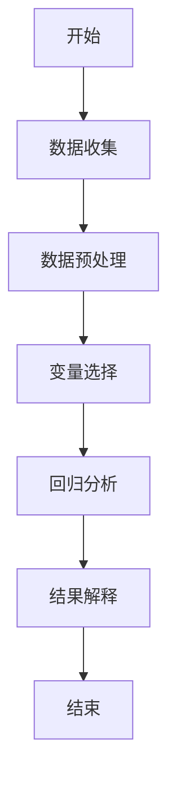

                 


# 全球股市估值与可持续建筑节能技术的关系

## 关键词：
- 全球股市估值
- 可持续建筑节能技术
- 经济影响
- 数学模型
- 可持续发展

## 摘要：
本文探讨了全球股市估值与可持续建筑节能技术之间的关系，分析了可持续建筑节能技术对股市估值的影响因素，构建了数学模型，并通过实证分析验证了模型的有效性。文章还提出了基于可持续建筑节能技术的投资策略和政策建议，为投资者和政策制定者提供了有价值的参考。

---

# 第一部分：全球股市估值与可持续建筑节能技术的背景概述

## 第1章：全球股市估值与可持续建筑节能技术的背景概述

### 1.1 全球股市估值的基本概念

#### 1.1.1 股市估值的定义与作用
股市估值是指通过对公司财务数据、市场环境和行业趋势的分析，评估公司股票的合理价格范围。股市估值是投资者决策的重要依据，也是衡量企业价值和市场信心的重要指标。

#### 1.1.2 全球股市的现状与发展趋势
全球股市近年来呈现出波动性增强的趋势，尤其是在新冠疫情和地缘政治冲突的影响下，股市估值受到较大冲击。然而，随着全球经济复苏和绿色经济的兴起，股市估值逐渐恢复，并展现出新的增长潜力。

#### 1.1.3 可持续发展在股市中的重要性
可持续发展已成为全球关注的焦点，越来越多的投资者将企业的可持续发展能力作为投资决策的重要因素。特别是在建筑节能领域，可持续建筑节能技术的应用不仅有助于降低企业的运营成本，还能提升企业的品牌形象和社会责任感。

---

### 1.2 可持续建筑节能技术的基本概念

#### 1.2.1 可持续建筑的定义与特征
可持续建筑是指在全生命周期内，最大限度地减少资源消耗和环境污染，同时提供健康舒适的生活环境的建筑。其主要特征包括能源效率高、材料环保、设计科学等。

#### 1.2.2 建筑节能技术的分类与应用
建筑节能技术主要包括建筑设计优化、设备系统节能、可再生能源应用等。例如，通过采用被动式设计（如遮阳、保温）和主动式设备（如地源热泵）来降低建筑能耗。

#### 1.2.3 可持续建筑节能技术的全球发展趋势
随着全球气候变化问题的加剧，各国政府和企业都在积极推广可持续建筑节能技术。例如，欧盟的“绿色新政”计划要求到2030年，所有新建筑必须达到近零能耗标准。

---

### 1.3 全球股市估值与可持续建筑节能技术的关联性

#### 1.3.1 可持续发展对股市的影响
可持续发展已成为全球经济发展的重要方向，企业通过采用可持续建筑节能技术不仅可以降低成本，还能提升市场竞争力和品牌价值。

#### 1.3.2 可持续建筑节能技术对股市估值的潜在影响
可持续建筑节能技术的广泛应用可能提升相关企业的盈利能力和市场地位，从而提高股市估值。

#### 1.3.3 本书的研究目标与意义
本书旨在通过分析可持续建筑节能技术对股市估值的影响，为企业和投资者提供科学的决策依据，并为政策制定者提供参考。

---

## 第2章：可持续建筑节能技术对股市估值的影响因素分析

### 2.1 可持续建筑节能技术的核心要素

#### 2.1.1 节能技术的创新性
创新的节能技术能够显著降低建筑能耗，从而提升企业的竞争力和市场地位。

#### 2.1.2 技术的成熟度与商业化潜力
技术成熟度高且具有商业化潜力的节能技术更容易被市场接受，从而对股市估值产生积极影响。

#### 2.1.3 技术的经济性与投资回报率
经济性强、投资回报率高的节能技术能够吸引更多的投资者，从而提升企业的估值。

---

### 2.2 影响股市估值的关键因素

#### 2.2.1 公司财务表现与盈利能力
企业的财务表现和盈利能力是股市估值的核心因素。可持续建筑节能技术的应用能够提升企业的盈利能力和财务表现。

#### 2.2.2 行业竞争格局与市场地位
行业竞争格局和企业的市场地位也会影响股市估值。采用可持续建筑节能技术能够增强企业的市场竞争力。

#### 2.2.3 政策支持与法规环境
政策支持和法规环境对企业的发展和股市估值有重要影响。例如，政府对可持续建筑节能技术的补贴和税收优惠政策能够降低企业的成本，提升其估值。

---

### 2.3 可持续建筑节能技术对股市估值的间接影响

#### 2.3.1 技术创新对行业竞争力的提升
技术创新能够提升企业的行业竞争力，从而增强市场对企业的信心，提升股市估值。

#### 2.3.2 可持续发展对品牌价值的增强
通过采用可持续建筑节能技术，企业能够提升品牌形象和社会责任感，从而增强品牌价值，对股市估值产生积极影响。

#### 2.3.3 技术应用对市场需求的刺激
可持续建筑节能技术的应用能够刺激市场需求，推动行业的发展，从而对股市估值产生积极影响。

---

## 第3章：可持续建筑节能技术的分类与应用实例

### 3.1 可持续建筑节能技术的分类

#### 3.1.1 建筑设计与规划中的节能技术
通过优化建筑设计和规划，降低建筑能耗。例如，采用被动式设计、绿色屋顶等。

#### 3.1.2 建筑设备与系统的节能优化
通过优化建筑设备和系统的运行效率，降低能耗。例如，采用高效 HVAC 系统、智能控制系统等。

#### 3.1.3 可再生能源在建筑中的应用
通过应用可再生能源技术，如太阳能、地热能等，减少对传统能源的依赖，降低建筑能耗。

---

### 3.2 典型案例分析

#### 3.2.1 绿色建筑认证与市场表现
以LEED认证为例，分析绿色建筑认证对企业市场表现和股市估值的影响。

#### 3.2.2 节能技术应用的经济效益分析
通过具体案例分析，评估节能技术应用的经济效益，包括投资回报率、成本节约等。

#### 3.2.3 可持续建筑项目对股市估值的影响
通过分析具体可持续建筑项目对股市估值的影响，总结经验教训，为未来决策提供参考。

---

## 第4章：全球股市估值与可持续建筑节能技术的关系模型构建

### 4.1 模型构建的理论基础

#### 4.1.1 统计学与经济学基础
介绍回归分析、时间序列分析等统计学方法，以及资本资产定价模型（CAPM）等经济学理论。

#### 4.1.2 可持续发展理论与金融学的结合
探讨可持续发展理论与金融学的结合，为模型构建提供理论支持。

---

### 4.2 模型构建的核心要素

#### 4.2.1 可持续建筑节能技术的量化指标
包括能源效率、碳排放量、可再生能源使用比例等指标。

#### 4.2.2 股市估值的关键影响因素
包括企业盈利能力、市场地位、政策支持等。

#### 4.2.3 模型的假设与边界条件
明确模型的假设条件和边界条件，例如假设企业的财务数据完整，政策环境稳定等。

---

### 4.3 模型的数学表达与公式推导

#### 4.3.1 股市估值的回归模型
建立回归模型，分析可持续建筑节能技术对股市估值的影响。

$$ V = \beta_0 + \beta_1 E + \beta_2 C + \beta_3 P + \epsilon $$

其中，$V$ 表示股市估值，$E$ 表示能源效率，$C$ 表示碳排放量，$P$ 表示政策支持，$\epsilon$ 为误差项。

#### 4.3.2 算法流程图
使用 mermaid 绘制回归模型的算法流程图：



#### 4.3.3 Python 实现代码
以下是一个简单的回归分析代码示例：

```python
import pandas as pd
import statsmodels.api as sm

# 数据加载
data = pd.read_csv('stock_valuation.csv')

# 变量选择
X = data[['Energy Efficiency', 'Carbon Emissions', 'Policy Support']]
X = sm.add_constant(X)
y = data['Stock Valuation']

# 回归分析
model = sm.OLS(y, X).fit()
print(model.summary())
```

---

## 第5章：实证分析与案例研究

### 5.1 数据收集与处理
介绍数据来源、数据清洗和预处理方法，确保数据的准确性和完整性。

### 5.2 模型验证
通过实证分析验证回归模型的有效性，评估模型的拟合度和预测能力。

### 5.3 案例分析
以具体国家或地区的股市为例，分析可持续建筑节能技术对股市估值的影响。

---

## 第6章：基于可持续建筑节能技术的投资策略与政策建议

### 6.1 投资策略
基于模型分析结果，提出基于可持续建筑节能技术的投资策略，帮助投资者做出科学决策。

### 6.2 政策建议
针对政策制定者，提出支持可持续建筑节能技术发展的政策建议，包括税收优惠、补贴、技术标准等。

---

## 第7章：总结与展望

### 7.1 全书总结
总结本书的主要内容和研究成果，重申可持续建筑节能技术对股市估值的重要影响。

### 7.2 未来研究方向
提出未来可能的研究方向，包括更复杂模型的构建、更多案例的分析、政策与市场的互动关系等。

---

## 参考文献
（此处列出相关文献和参考资料）

---

## 附录
（此处可以列出数据、代码或其他补充材料）

---

通过以上结构和内容，本书将为读者提供一个全面、系统的视角，深入探讨全球股市估值与可持续建筑节能技术的关系，为投资者、企业和政策制定者提供有价值的参考。

