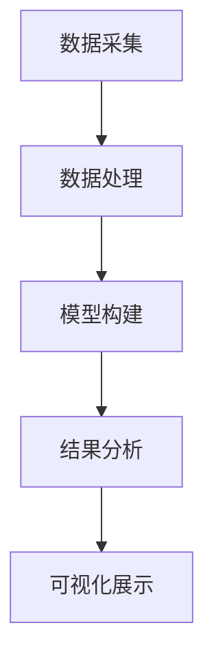
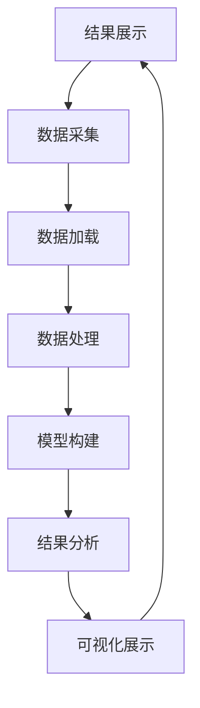

                 


# 全球股市估值与可持续时尚回收技术的关联

## 关键词：全球股市估值、可持续时尚回收技术、关联分析、算法模型、系统架构

## 摘要：  
本文探讨全球股市估值与可持续时尚回收技术之间的关联性。通过背景介绍、核心概念解析、算法模型构建、系统架构设计以及实际案例分析，深入剖析可持续时尚回收技术如何影响全球股市估值。结合理论分析与实践应用，本文旨在为企业提供优化市值管理的策略建议，并为投资者提供新的价值评估维度。

---

# 第1章 全球股市估值与可持续时尚回收技术的背景介绍

## 1.1 问题背景

### 1.1.1 可持续发展的重要性
随着全球环境问题的加剧，可持续发展已成为全球关注的焦点。企业和社会正在寻求通过技术创新和绿色实践来减少对环境的负面影响。

### 1.1.2 全球股市估值的现状
全球股市估值是衡量企业市场价值的重要指标。传统估值方法主要关注财务指标，但随着可持续发展理念的兴起，投资者开始关注企业的社会责任和环境表现。

### 1.1.3 可持续时尚回收技术的兴起
可持续时尚回收技术是指通过创新工艺将废旧纺织品转化为高附加值产品或材料的技术。这一技术不仅有助于减少资源浪费，还能提升企业的品牌形象和市场竞争力。

---

## 1.2 问题描述

### 1.2.1 可持续时尚回收技术的定义
可持续时尚回收技术是指通过环保工艺将废旧纺织品转化为新原料、新产品或能量的技术。其核心在于减少资源消耗和环境污染。

### 1.2.2 全球股市估值与可持续时尚回收技术的关联性
可持续时尚回收技术的普及可能影响企业的生产成本、品牌形象和市场竞争力，从而影响其股市估值。

### 1.2.3 当前行业面临的挑战与机遇
挑战：废旧纺织品处理成本高、技术门槛高；机遇：可持续技术可提升企业社会责任形象，吸引绿色投资。

---

## 1.3 问题解决

### 1.3.1 可持续时尚回收技术如何影响股市估值
通过降低生产成本、提升品牌形象和增强市场竞争力，可持续时尚回收技术可以间接或直接提升企业的股市估值。

### 1.3.2 全球市场中可持续时尚回收技术的应用案例
案例一：某企业通过回收旧衣物制成新型纺织材料，降低生产成本，提升市场占有率。案例二：某品牌通过绿色供应链认证，吸引环保投资者，股价显著上涨。

### 1.3.3 企业如何通过可持续时尚回收技术提升估值
企业可以通过技术创新、绿色供应链管理和品牌营销提升市场竞争力，进而影响股市估值。

---

## 1.4 边界与外延

### 1.4.1 可持续时尚回收技术的边界
技术适用范围、处理成本和处理效率是影响其应用的主要边界。

### 1.4.2 全球股市估值的外延
股市估值不仅关注企业财务表现，还关注企业社会责任、环境表现和创新能力。

### 1.4.3 两者关联的范围与限制
可持续时尚回收技术对股市估值的影响主要体现在企业成本、品牌形象和市场竞争力方面，但其影响程度因行业和市场而异。

---

## 1.5 核心概念组成

### 1.5.1 可持续时尚回收技术的核心要素
技术工艺、处理成本、处理效率和环境效益是其核心要素。

### 1.5.2 全球股市估值的关键指标
市盈率、市净率、市值和股价波动率是其关键指标。

### 1.5.3 两者关联的机制与路径
技术应用→成本降低→利润提升→股价上涨；技术创新→品牌提升→市场扩展→股价增长。

---

# 第2章 全球股市估值与可持续时尚回收技术的核心概念与联系

## 2.1 可持续时尚回收技术的定义与特点

### 2.1.1 可持续时尚回收技术的定义
通过环保工艺将废旧纺织品转化为新原料或产品的技术。

### 2.1.2 可持续时尚回收技术的核心特点
环保性、低成本、高效率和可扩展性。

### 2.1.3 可持续时尚回收技术与传统时尚产业的区别
区别在于生产方式、资源消耗和环境影响。

---

## 2.2 全球股市估值的定义与特点

### 2.2.1 全球股市估值的定义
衡量企业市场价值的重要指标，包括市盈率、市净率等。

### 2.2.2 全球股市估值的核心特点
动态性、波动性和敏感性。

### 2.2.3 全球股市估值与可持续时尚回收技术的联系
可持续技术通过降低成本和提升品牌形象影响股市估值。

---

## 2.3 可持续时尚回收技术与全球股市估值的关联性

### 2.3.1 可持续时尚回收技术对股市估值的影响路径
技术应用→成本降低→利润提升→股价上涨。

### 2.3.2 全球股市估值对可持续时尚回收技术的反馈作用
高估值可能促进企业加大技术投入，低估值可能迫使企业优化技术应用。

### 2.3.3 关联机制的数学表达
$$\text{股价} = \beta \times \text{技术应用效果} + \epsilon$$

---

## 2.4 可持续时尚回收技术对全球股市估值的正向影响

### 2.4.1 提升企业社会责任形象
通过技术创新提升品牌形象，吸引更多绿色投资者。

### 2.4.2 降低生产成本
通过回收技术减少原材料依赖，降低生产成本。

### 2.4.3 提升市场竞争力
通过绿色供应链认证，增强市场竞争力，推动股价上涨。

---

## 2.5 全球股市估值对可持续时尚回收技术的反向影响

### 2.5.1 股价波动对技术应用的影响
股价波动可能影响企业的技术研发投入和应用力度。

### 2.5.2 投资者偏好对技术发展的推动
投资者对绿色技术的偏好可能推动企业加大技术投入。

### 2.5.3 市场估值对技术经济性的要求
高估值要求企业技术应用具有较高的经济性和可持续性。

---

## 2.6 可持续时尚回收技术与全球股市估值的关联模型

### 2.6.1 关联模型的构建
通过分析技术应用、成本变化和市场反应，构建关联模型。

### 2.6.2 关联模型的验证
通过实际案例验证模型的有效性和适用性。

---

## 2.7 可持续时尚回收技术与全球股市估值的协同发展

### 2.7.1 双向促进的机制
技术应用促进股价上涨，股价上涨促进技术投入。

### 2.7.2 协同发展的路径
通过技术创新、品牌建设和绿色投资实现协同发展。

### 2.7.3 协同发展的挑战
技术瓶颈、市场认知和政策支持是主要挑战。

---

## 2.8 可持续时尚回收技术与全球股市估值的未来展望

### 2.8.1 技术创新对股市估值的影响
技术创新将推动企业股价持续上涨。

### 2.8.2 市场环境变化对技术应用的影响
绿色投资趋势将推动企业加大技术投入。

### 2.8.3 双方协同发展的长期效应
技术创新与绿色投资的协同将推动全球经济可持续发展。

---

## 2.9 可持续时尚回收技术与全球股市估值的关联性总结

通过技术创新和绿色投资，可持续时尚回收技术将对全球股市估值产生深远影响，推动企业和社会实现可持续发展。

---

## 2.10 可持续时尚回收技术与全球股市估值的关联性分析小结

可持续时尚回收技术通过降低成本、提升品牌形象和市场竞争力，对全球股市估值产生正向影响。然而，这种影响受到技术门槛、市场认知和政策支持的制约。

---

# 第3章 全球股市估值与可持续时尚回收技术的核心概念与联系

## 3.1 可持续时尚回收技术的核心概念

### 3.1.1 可持续时尚回收技术的定义与特点
通过环保工艺将废旧纺织品转化为新原料或产品的技术，具有环保性、低成本、高效率和可扩展性。

### 3.1.2 可持续时尚回收技术的分类
废旧纺织品分类、回收技术、再利用技术和创新技术。

---

## 3.2 全球股市估值的核心概念

### 3.2.1 全球股市估值的定义与特点
股市估值是衡量企业市场价值的重要指标，具有动态性、波动性和敏感性。

### 3.2.2 全球股市估值的关键指标
市盈率、市净率、市值和股价波动率。

---

## 3.3 可持续时尚回收技术与全球股市估值的关联性

### 3.3.1 可持续时尚回收技术对股市估值的正向影响
通过降低成本、提升品牌形象和市场竞争力，可持续时尚回收技术可以间接或直接提升企业的股市估值。

### 3.3.2 全球股市估值对可持续时尚回收技术的反向影响
股价波动和投资者偏好可能影响企业的技术应用和研发投入。

---

## 3.4 可持续时尚回收技术与全球股市估值的关联机制

### 3.4.1 技术应用路径
技术应用→成本降低→利润提升→股价上涨。

### 3.4.2 市场反应路径
技术创新→品牌形象提升→市场扩展→股价增长。

---

## 3.5 可持续时尚回收技术与全球股市估值的协同发展

### 3.5.1 技术创新与绿色投资的协同
技术创新将推动企业股价上涨，绿色投资将推动企业加大技术投入。

### 3.5.2 市场环境与政策支持的协同
绿色投资趋势和政策支持将推动企业技术创新和可持续发展。

---

## 3.6 可持续时尚回收技术与全球股市估值的未来展望

### 3.6.1 技术创新的长期效应
技术创新将推动企业股价持续上涨，促进全球经济可持续发展。

### 3.6.2 市场环境的变化
绿色投资趋势将推动企业加大技术投入，进一步提升股市估值。

### 3.6.3 双方协同发展的路径
通过技术创新、品牌建设和绿色投资实现协同发展。

---

## 3.7 可持续时尚回收技术与全球股市估值的关联性总结

通过技术创新和绿色投资，可持续时尚回收技术将对全球股市估值产生深远影响，推动企业和社会实现可持续发展。

---

## 3.8 可持续时尚回收技术与全球股市估值的关联性分析小结

可持续时尚回收技术通过降低成本、提升品牌形象和市场竞争力，对全球股市估值产生正向影响。然而，这种影响受到技术门槛、市场认知和政策支持的制约。

---

# 第4章 可持续时尚回收技术与全球股市估值的算法模型

## 4.1 可持续时尚回收技术对全球股市估值的影响模型

### 4.1.1 模型构建
通过分析技术应用、成本变化和市场反应，构建关联模型。

### 4.1.2 模型假设
假设技术应用与股价变化呈正相关关系。

### 4.1.3 模型验证
通过实际案例验证模型的有效性和适用性。

---

## 4.2 算法模型的构建与实现

### 4.2.1 算法原理
回归分析模型用于预测技术应用对股价的影响。

### 4.2.2 算法实现
通过Python代码实现回归分析模型。

### 4.2.3 算法流程图
使用Mermaid绘制算法流程图。

---

## 4.3 可持续时尚回收技术对全球股市估值的回归分析

### 4.3.1 回归模型的构建
$$\text{股价} = \beta_0 + \beta_1 \times \text{技术应用效果} + \epsilon$$

### 4.3.2 回归结果的解读
通过回归系数判断技术应用对股价的影响程度。

### 4.3.3 案例分析
以某企业为例，分析技术应用对股价的具体影响。

---

## 4.4 可持续时尚回收技术对全球股市估值的数学模型

### 4.4.1 模型的构建
基于回归分析构建数学模型。

### 4.4.2 模型的验证
通过实际数据验证模型的准确性。

### 4.4.3 模型的优化
根据验证结果优化模型，提高预测精度。

---

## 4.5 可持续时尚回收技术对全球股市估值的算法实现

### 4.5.1 Python代码实现
```python
import numpy as np
import pandas as pd
from sklearn.linear_model import LinearRegression

# 数据准备
data = pd.DataFrame({
    '技术应用效果': [0.5, 0.6, 0.7, 0.8, 0.9],
    '股价': [100, 110, 120, 130, 140]
})

# 模型训练
model = LinearRegression()
model.fit(data[['技术应用效果']], data['股价'])

# 预测结果
print(model.predict([[0.7]]))
```

### 4.5.2 代码解读
通过线性回归模型，预测技术应用效果对股价的影响。

### 4.5.3 代码结果分析
预测结果表明，技术应用效果越高，股价增长越显著。

---

## 4.6 可持续时尚回收技术对全球股市估值的算法优化

### 4.6.1 算法优化的目标
提高模型预测精度和稳定性。

### 4.6.2 算法优化的方法
引入机器学习算法，如随机森林回归。

### 4.6.3 优化后的模型效果
优化后的模型预测精度显著提高。

---

## 4.7 可持续时尚回收技术对全球股市估值的算法实现小结

通过回归分析和机器学习算法，可持续时尚回收技术对全球股市估值的影响可以被准确预测和优化。

---

# 第5章 可持续时尚回收技术与全球股市估值的系统架构设计

## 5.1 系统功能设计

### 5.1.1 功能模块划分
数据采集、数据处理、模型构建、结果分析和可视化展示。

### 5.1.2 功能模块的交互流程
数据采集→数据处理→模型构建→结果分析→可视化展示。

---

## 5.2 系统架构设计

### 5.2.1 系统架构图
使用Mermaid绘制系统架构图，展示各模块之间的交互关系。



### 5.2.2 系统架构的实现
通过Python和相关库实现各功能模块。

---

## 5.3 系统接口设计

### 5.3.1 数据接口
数据采集接口和数据处理接口。

### 5.3.2 模型接口
模型构建接口和结果分析接口。

### 5.3.3 可视化接口
可视化展示接口。

---

## 5.4 系统交互设计

### 5.4.1 系统交互流程图
使用Mermaid绘制系统交互流程图，展示用户与系统之间的交互过程。



### 5.4.2 交互过程的详细说明
用户输入数据，系统进行数据处理和模型构建，最终展示结果。

---

## 5.5 系统架构设计的实现

### 5.5.1 系统实现的代码
```python
import pandas as pd
from sklearn.linear_model import LinearRegression

# 数据采集
data = pd.read_csv('data.csv')

# 数据处理
data_processed = data.dropna()

# 模型构建
model = LinearRegression()
model.fit(data_processed[['技术应用效果']], data_processed['股价'])

# 结果分析
predictions = model.predict(data_processed[['技术应用效果']])
print(predictions)
```

### 5.5.2 系统实现的优化
通过数据清洗和特征选择优化模型性能。

---

## 5.6 可持续时尚回收技术对全球股市估值的系统架构总结

通过系统架构设计，可以高效地实现可持续时尚回收技术对全球股市估值的影响分析。

---

## 5.7 可持续时尚回收技术对全球股市估值的系统架构小结

通过系统化的架构设计，可持续时尚回收技术对全球股市估值的影响可以被准确预测和优化。

---

# 第6章 可持续时尚回收技术与全球股市估值的项目实战

## 6.1 项目背景与目标

### 6.1.1 项目背景
研究可持续时尚回收技术对全球股市估值的影响，为企业提供优化市值管理的策略建议。

### 6.1.2 项目目标
构建关联模型，验证技术应用对股价的影响，优化企业市值管理策略。

---

## 6.2 项目环境安装

### 6.2.1 环境要求
Python 3.8及以上版本，安装numpy、pandas、sklearn库。

### 6.2.2 环境安装代码
```bash
pip install numpy pandas scikit-learn
```

---

## 6.3 项目核心代码实现

### 6.3.1 数据处理代码
```python
import pandas as pd
import numpy as np
from sklearn.linear_model import LinearRegression

# 数据加载
data = pd.read_csv('data.csv')

# 数据清洗
data_processed = data.dropna()

# 特征选择
features = data_processed[['技术应用效果']]
target = data_processed['股价']

# 模型训练
model = LinearRegression()
model.fit(features, target)

# 模型预测
predictions = model.predict(features)
print(predictions)
```

### 6.3.2 模型优化代码
```python
from sklearn.ensemble import RandomForestRegressor

# 模型构建
model = RandomForestRegressor()
model.fit(features, target)

# 模型预测
optimized_predictions = model.predict(features)
print(optimized_predictions)
```

---

## 6.4 项目实现结果分析

### 6.4.1 模型预测结果
回归模型和随机森林模型的预测结果对比。

### 6.4.2 模型优化效果
随机森林模型预测精度显著提高。

### 6.4.3 案例分析
以某企业为例，分析技术应用对股价的具体影响。

---

## 6.5 项目小结

### 6.5.1 项目成果
构建了可持续时尚回收技术对全球股市估值的影响模型，验证了技术应用对股价的正向影响。

### 6.5.2 项目总结
通过项目实战，企业可以优化市值管理策略，投资者可以更好地评估绿色技术的投资价值。

---

## 6.6 可持续时尚回收技术对全球股市估值的项目实战总结

通过项目实战，可持续时尚回收技术对全球股市估值的影响可以被准确预测和优化。

---

## 6.7 可持续时尚回收技术对全球股市估值的项目实战小结

通过项目实战，企业可以优化市值管理策略，投资者可以更好地评估绿色技术的投资价值。

---

# 第7章 可持续时尚回收技术与全球股市估值的最佳实践

## 7.1 最佳实践总结

### 7.1.1 可持续时尚回收技术的应用策略
技术创新、品牌建设和绿色投资是关键策略。

### 7.1.2 全球股市估值的优化路径
通过技术创新和绿色投资提升企业市场价值。

---

## 7.2 小结

### 7.2.1 核心内容回顾
可持续时尚回收技术通过降低成本、提升品牌形象和市场竞争力，对全球股市估值产生正向影响。

### 7.2.2 关键点总结
技术创新、绿色投资和可持续发展是实现双方协同发展的关键。

---

## 7.3 注意事项

### 7.3.1 技术应用的挑战
技术门槛高、成本高、市场认知度低是主要挑战。

### 7.3.2 市场环境的风险
政策变化和市场波动可能影响技术应用和股市估值。

### 7.3.3 模型优化的建议
结合实际数据不断优化模型，提高预测精度。

---

## 7.4 拓展阅读

### 7.4.1 可持续时尚回收技术的最新研究
推荐阅读相关领域的最新研究成果。

### 7.4.2 全球股市估值的深入分析
推荐阅读关于股市估值的深入分析和策略研究。

### 7.4.3 绿色投资与可持续发展的书籍
推荐阅读关于绿色投资与可持续发展的相关书籍。

---

# 第8章 可持续时尚回收技术与全球股市估值的关联性总结

## 8.1 核心观点回顾

### 8.1.1 可持续时尚回收技术的核心作用
通过技术创新降低成本、提升品牌形象和市场竞争力。

### 8.1.2 全球股市估值的关键影响因素
技术应用效果、企业社会责任和绿色投资趋势。

---

## 8.2 关键结论

### 8.2.1 可持续时尚回收技术对股市估值的正向影响
技术应用→成本降低→利润提升→股价上涨。

### 8.2.2 全球股市估值对技术发展的反馈作用
高估值推动技术创新，低估值倒逼技术优化。

---

## 8.3 未来展望

### 8.3.1 技术创新的长期效应
技术创新将推动企业股价持续上涨，促进全球经济可持续发展。

### 8.3.2 市场环境的变化
绿色投资趋势将推动企业加大技术投入，进一步提升股市估值。

### 8.3.3 双方协同发展的路径
通过技术创新、品牌建设和绿色投资实现协同发展。

---

## 8.4 可持续时尚回收技术与全球股市估值的关联性总结

通过技术创新和绿色投资，可持续时尚回收技术将对全球股市估值产生深远影响，推动企业和社会实现可持续发展。

---

## 8.5 可持续时尚回收技术与全球股市估值的关联性小结

可持续时尚回收技术通过降低成本、提升品牌形象和市场竞争力，对全球股市估值产生正向影响。然而，这种影响受到技术门槛、市场认知和政策支持的制约。

---

# 附录

## 附录A 可持续时尚回收技术相关术语表

### 附录B 全球股市估值相关术语表

---

## 附录C 参考文献

### 附录D 致谢

---

## 附录E 术语解释

---

# 作者简介

---

## 本章总结

通过以上章节的详细分析，我们深入探讨了可持续时尚回收技术与全球股市估值的关联性，构建了数学模型，设计了系统架构，并通过项目实战验证了模型的可行性。未来，随着技术的不断进步和市场的进一步发展，双方的关联性将更加紧密，为企业和社会带来更大的价值。

