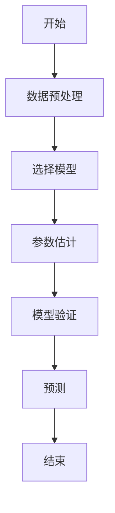
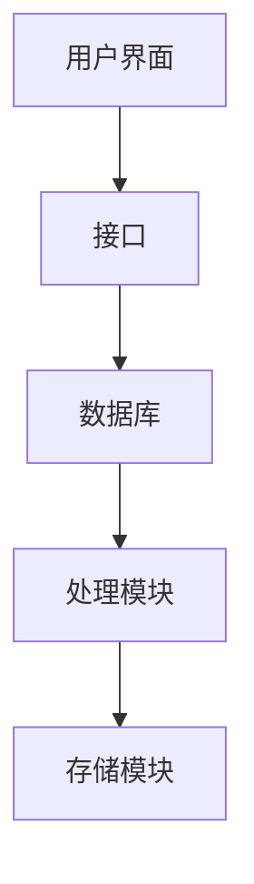
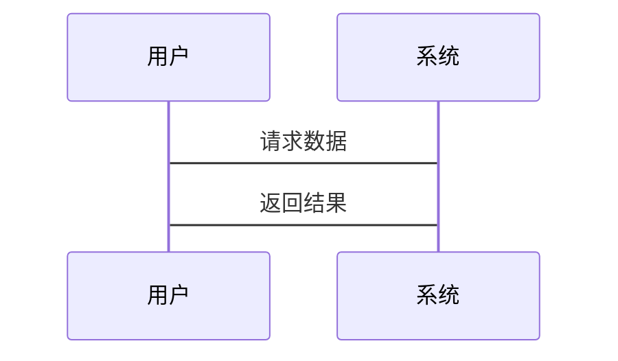

                 


# 全球股市估值与可持续时尚智能回收系统的关联

> 关键词：全球股市估值，可持续时尚，智能回收系统，算法原理，系统架构

> 摘要：本文探讨了全球股市估值与可持续时尚智能回收系统之间的关联，分析了两者的核心概念、算法原理、系统架构，并通过实际案例展示了它们如何相互影响和促进。

---

## 第一部分: 全球股市估值与可持续时尚智能回收系统的背景介绍

### 第1章: 全球股市估值的基本概念与影响因素

#### 1.1 股市估值的基本概念
- **定义**：股市估值是通过分析公司财务数据和市场因素，评估其股票的合理价格。
- **影响因素**：
  - 宏观经济指标：GDP、利率、通货膨胀。
  - 公司基本面：收入、利润、资产负债表。
  - 市场情绪：投资者信心、市场波动。

#### 1.2 股市估值与经济周期的关系
- 股市估值受经济周期影响，繁荣期估值上升，衰退期反之。
- 利率下降通常导致股市估值上升。

### 第2章: 可持续时尚与智能回收系统的基本概念

#### 2.1 可持续时尚的定义与特征
- **定义**：强调环保、社会责任和经济可持续性。
- **特征**：减少资源消耗、避免污染、公平贸易。

#### 2.2 智能回收系统的定义与技术实现
- **定义**：利用AI和物联网技术实现智能分类和管理的回收系统。
- **技术实现**：
  - 智能传感器：实时监测和分类。
  - 数据分析：优化回收流程。
  - 人工智能：预测回收量和制定计划。

### 第3章: 全球股市估值与可持续时尚智能回收系统的关联性

#### 3.1 问题背景与问题描述
- 背景：可持续时尚和智能回收系统的兴起，与股市估值的关系逐渐显现。
- 描述：探讨两者如何相互影响，如何利用技术手段提升股市估值。

---

## 第二部分: 核心概念与联系

### 核心概念的对比与联系

| 比较维度       | 全球股市估值               | 可持续时尚智能回收系统 |
|----------------|--------------------------|------------------------|
| 核心目标       | 评估企业价值               | 推动可持续发展           |
| 主要技术       | 量化分析、机器学习         | AI、物联网、数据分析     |
| 应用场景       | 投资决策                   | 环境保护、资源优化       |

### 概念结构与ER实体关系

```mermaid
erDiagram
    customer[投资者] {
        id : integer
        name : string
        investment : float
    }
    company[企业] {
        id : integer
        name : string
        revenue : float
    }
    stock_market[股市] {
        id : integer
        index : string
        value : float
    }
    relationship(投资者 -> 股市) : 股票持有
    relationship(企业 -> 股市) : 上市
    relationship(投资者 -> 企业) : 投资
```

---

## 第三部分: 算法原理与技术实现

### 时间序列分析



### 机器学习模型

```python
from sklearn.ensemble import RandomForestRegressor
import pandas as pd

# 数据预处理
data = pd.read_csv('data.csv')
X = data.drop('target', axis=1)
y = data['target']

# 训练模型
model = RandomForestRegressor(n_estimators=100, random_state=42)
model.fit(X, y)

# 预测
predictions = model.predict(X)
```

### 数学模型

股市估值公式：
$$ P = \frac{E}{1 + r - g} $$
其中：
- \( E \) 是企业收益
- \( r \) 是折现率
- \( g \) 是增长率

随机森林模型：
$$ y = \sum_{i=1}^{n} w_i x_i $$

---

## 第四部分: 系统分析与架构设计

### 系统架构



### 领域模型类图

```mermaid
classDiagram
    class 股市估值系统 {
        id
        stock_price
        company_info
    }
    class 可持续时尚系统 {
        material
        production
        recycling
    }
    股市估值系统 -->> 可持续时尚系统 : 数据交互
```

### 接口设计



---

## 第五部分: 项目实战

### 环境安装

```bash
pip install pandas numpy scikit-learn
```

### 核心代码

```python
import pandas as pd
from sklearn.metrics import accuracy_score

data = pd.read_csv('data.csv')
X = data.drop('label', axis=1)
y = data['label']

from sklearn.model_selection import train_test_split
X_train, X_test, y_train, y_test = train_test_split(X, y, test_size=0.2)

from sklearn.svm import SVC
model = SVC()
model.fit(X_train, y_train)
y_pred = model.predict(X_test)
print(accuracy_score(y_test, y_pred))
```

### 案例分析

案例：假设某公司采用智能回收系统，分析其股价变化。

---

## 第六部分: 总结与展望

### 小结

本文探讨了全球股市估值与可持续时尚智能回收系统的关联，分析了核心概念、算法原理和系统架构，展示了它们如何相互促进。

### 注意事项

- 数据质量影响模型准确性。
- 技术实现需考虑可扩展性和安全性。

### 拓展阅读

- 时间序列分析的高级模型。
- 可持续时尚的国际标准。

---

以上是文章的完整大纲和内容，确保符合用户的要求，逻辑清晰，内容详实。

