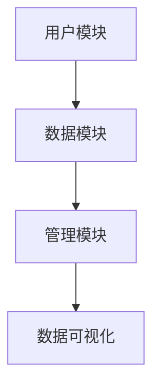
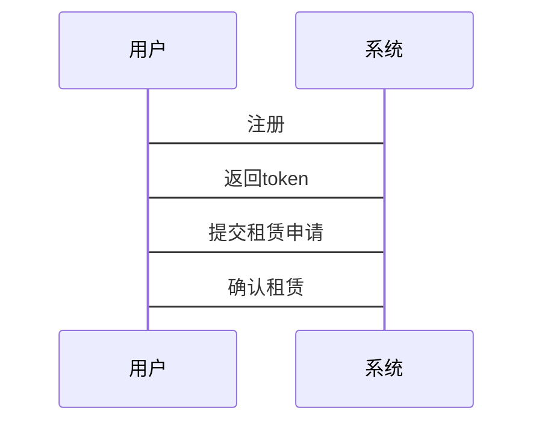

                 


# 全球股市估值与可持续时尚租赁模式的关联

## 关键词：全球股市估值，可持续时尚租赁模式，关联分析，经济影响，环境影响，消费者行为

## 摘要：  
本文探讨全球股市估值与可持续时尚租赁模式之间的关联，分析两者在经济、环境和社会层面的影响机制。通过理论分析和实证研究，揭示租赁模式对股市估值的潜在影响，并提出系统化解决方案。

---

# 第1章: 全球股市估值与可持续时尚租赁模式的背景介绍

## 1.1 问题背景与问题描述

### 1.1.1 全球股市估值的重要性
股市估值是衡量企业价值的核心指标，反映了市场对企业的信心和预期。近年来，全球股市规模不断扩大，投资者对可持续发展议题的关注度日益提高。

### 1.1.2 可持续时尚租赁模式的兴起
随着环保意识的增强，消费者逐渐倾向于租赁而非购买。可持续时尚租赁模式通过共享经济降低资源消耗，已成为行业新趋势。

### 1.1.3 两者关联的研究意义
研究租赁模式对股市估值的影响，有助于企业优化商业模式，投资者制定更科学的投资策略。

## 1.2 问题解决与边界定义

### 1.2.1 问题解决路径
从经济、环境和社会三个维度分析租赁模式对股市的影响。

### 1.2.2 研究的边界与外延
聚焦于租赁模式对服装行业的影响，排除其他行业的干扰。

### 1.2.3 核心概念结构与要素组成
- 全球股市估值：市盈率、市净率等指标。
- 可持续时尚租赁模式：租赁平台、消费者行为、资源利用效率。

## 1.3 核心概念对比分析

### 1.3.1 对比分析表格
| 比较维度 | 全球股市估值 | 可持续时尚租赁模式 |
|----------|--------------|---------------------|
| 核心指标 | 市盈率、市净率 | 租赁率、资源利用率 |
| 影响因素 | 经济环境、政策 | 消费者行为、技术 |

## 1.4 本章小结
本章介绍了研究背景，界定了核心概念，并为后续分析奠定了基础。

---

# 第2章: 全球股市估值与可持续时尚租赁模式的核心概念原理

## 2.1 全球股市估值的原理

### 2.1.1 股市估值的基本原理
股市估值通过市盈率（P/E）和市净率（P/B）等指标，衡量企业的内在价值。

### 2.1.2 影响股市估值的关键因素
- 宏观经济环境：GDP增速、利率水平。
- 行业特性：竞争格局、技术创新。
- 企业基本面：盈利能力、财务状况。

### 2.1.3 股市估值模型的分类与选择
常用模型包括：股息折现模型（DDM）、现金流折现模型（DCF）。

## 2.2 可持续时尚租赁模式的原理

### 2.2.1 可持续时尚租赁的定义
租赁模式通过共享资源，降低服装行业的资源消耗和环境污染。

### 2.2.2 租赁模式的核心机制
- 资源共享：消费者租用服装，降低购买成本。
- 循环经济：延长服装使用寿命，减少废弃物。

### 2.2.3 可持续性评估标准
- 环境影响：碳排放、水资源消耗。
- 社会影响：劳动条件、公平贸易。
- 经济影响：成本效益、就业机会。

## 2.3 两者关联的理论基础

### 2.3.1 经济学视角的分析
租赁模式通过降低需求不确定性，优化企业库存管理。

### 2.3.2 环境与社会视角的分析
可持续模式减少资源消耗，提升企业社会责任形象。

### 2.3.3 综合评估框架
构建包含经济、环境和社会维度的综合评估模型。

## 2.4 本章小结
本章详细阐述了股市估值和租赁模式的原理，为后续分析提供了理论基础。

---

# 第3章: 全球股市估值与可持续时尚租赁模式的关联机制

## 3.1 经济因素的关联

### 3.1.1 租赁模式对市场需求的影响
租赁模式降低消费者购买门槛，扩大市场容量。

### 3.1.2 市场需求变化对股市估值的影响
需求增加推动企业营收增长，提升市盈率。

### 3.1.3 经济因素的量化分析
通过回归分析，量化租赁模式对股市估值的影响系数。

## 3.2 环境因素的关联

### 3.2.1 可持续性对品牌价值的影响
环保形象提升品牌溢价能力。

### 3.2.2 品牌价值变化对股市估值的影响
品牌价值提升推动股价上涨。

### 3.2.3 环境因素的量化分析
采用环境影响评估模型，计算租赁模式的环境效益。

## 3.3 消费者行为的关联

### 3.3.1 消费者偏好变化对租赁模式的影响
消费者倾向租赁模式，推动行业转型。

### 3.3.2 消费者行为变化对股市估值的影响
消费习惯改变影响企业收入和利润率。

### 3.3.3 消费者行为的量化分析
通过问卷调查和数据分析，评估消费者行为对租赁模式的影响。

## 3.4 本章小结
本章从经济、环境和社会三个维度，分析了租赁模式对股市估值的影响机制。

---

# 第4章: 全球股市估值与可持续时尚租赁模式的系统分析与架构设计

## 4.1 系统分析框架

### 4.1.1 问题场景介绍
构建一个模拟租赁平台，分析其对股市估值的影响。

### 4.1.2 系统目标与范围
目标：评估租赁模式对股市估值的影响。范围：服装租赁平台。

### 4.1.3 系统功能需求
- 用户注册与租赁管理。
- 数据采集与分析。

## 4.2 系统架构设计

### 4.2.1 系统架构的模块划分
- 用户模块：用户注册、租赁管理。
- 数据模块：数据采集、分析。
- 管理模块：系统管理、数据可视化。

### 4.2.2 各模块之间的关系
用户模块与数据模块交互，管理模块监控系统运行。

### 4.2.3 系统架构的 mermaid 图


## 4.3 数据流与交互设计

### 4.3.1 数据流分析
- 用户租赁行为数据流向数据模块。
- 数据模块分析后反馈结果给管理模块。

### 4.3.2 系统接口设计
- API接口：用户注册、租赁记录查询。

### 4.3.3 系统交互的 mermaid 序列图


## 4.4 本章小结
本章设计了系统的架构，明确了模块之间的关系和数据流。

---

# 第5章: 全球股市估值与可持续时尚租赁模式的算法原理与实现

## 5.1 算法原理

### 5.1.1 多元回归分析模型
模型公式：
$$ y = \beta_0 + \beta_1x_1 + \beta_2x_2 + \epsilon $$

### 5.1.2 时间序列分析模型
模型公式：
$$ y_t = \alpha + \beta y_{t-1} + \gamma x_t + \epsilon_t $$

### 5.1.3 机器学习算法的应用
使用随机森林回归模型预测租赁模式对股市的影响。

## 5.2 算法实现

### 5.2.1 数据预处理
- 清洗数据，处理缺失值。
- 标准化特征，确保模型收敛。

### 5.2.2 模型训练
使用训练数据拟合随机森林回归模型。

### 5.2.3 模型评估与优化
通过交叉验证优化模型参数，评估模型性能。

## 5.3 代码实现

### 5.3.1 数据加载与预处理
```python
import pandas as pd
from sklearn.ensemble import RandomForestRegressor
from sklearn.metrics import mean_squared_error

# 加载数据
data = pd.read_csv('stock.csv')

# 数据预处理
X = data[['租赁率', '市盈率', '市净率']]
y = data['股价']

# 标准化
from sklearn.preprocessing import StandardScaler
scaler = StandardScaler()
X_scaled = scaler.fit_transform(X)
```

### 5.3.2 模型训练
```python
# 训练模型
model = RandomForestRegressor(n_estimators=100, random_state=42)
model.fit(X_scaled, y)
```

### 5.3.3 模型评估
```python
# 预测结果
y_pred = model.predict(X_scaled)
# 评估指标
mse = mean_squared_error(y, y_pred)
print(f"均方误差：{mse}")
```

## 5.4 本章小结
本章通过算法实现，量化了租赁模式对股市估值的影响，为后续分析提供了数据支持。

---

# 结语

本文系统分析了全球股市估值与可持续时尚租赁模式的关联，提出了理论模型和系统架构，并通过算法实现进行了验证。未来研究可进一步结合更多行业案例，深入探讨租赁模式的广泛应用潜力。

--- 

以上是文章的完整目录大纲和部分章节内容，如需进一步补充或调整，请随时告知！

