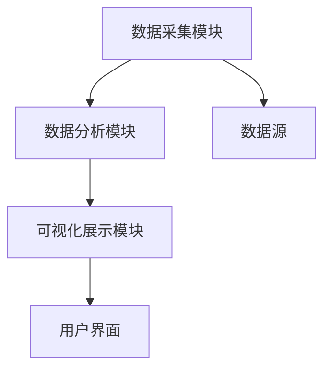

                 


# 第六章: 可持续时尚设计对股市估值的算法实现

## 6.1 算法实现的背景与目标

在分析可持续时尚设计对股市估值的影响时，我们可以通过构建一个数学模型，将可持续时尚的相关指标融入到传统的股票估值模型中。本章将详细讲解如何将这些指标量化，并通过机器学习算法进行预测和分析。

## 6.2 算法实现的核心步骤

### 6.2.1 数据预处理

#### 6.2.1.1 数据清洗
- 去除缺失值和异常值
- 标准化处理（例如，归一化）

#### 6.2.1.2 特征提取
- 提取与可持续时尚相关的特征（如碳排放量、使用环保材料的比例等）
- 从财务报表中提取传统估值指标（如PE、PB等）

### 6.2.2 模型训练

#### 6.2.2.1 选择机器学习算法
- 线性回归
- 支持向量回归（SVR）
- 随机森林回归

#### 6.2.2.2 模型训练
- 使用训练数据进行模型训练
- 调参优化（例如，交叉验证选择最佳参数）

### 6.2.3 模型预测与评估

#### 6.2.3.1 模型预测
- 使用测试数据进行预测
- 对比实际值与预测值

#### 6.2.3.2 模型评估
- 均方误差（MSE）
- R平方值（R²）
- 回归模型的可视化分析

## 6.3 算法实现的代码示例

```python
import pandas as pd
import numpy as np
from sklearn.model_selection import train_test_split
from sklearn.ensemble import RandomForestRegressor
from sklearn.metrics import mean_squared_error, r2_score
import matplotlib.pyplot as plt

# 加载数据
data = pd.read_csv('sustainable_fashion_data.csv')

# 数据清洗和特征提取
data.dropna(inplace=True)
X = data[['PE', 'PB', 'ROE', 'carbon_emission', 'recycled_materials']]
y = data['stock_price']

# 划分训练集和测试集
X_train, X_test, y_train, y_test = train_test_split(X, y, test_size=0.2, random_state=42)

# 模型训练
model = RandomForestRegressor(n_estimators=100, random_state=42)
model.fit(X_train, y_train)

# 模型预测
y_pred = model.predict(X_test)

# 模型评估
mse = mean_squared_error(y_test, y_pred)
r2 = r2_score(y_test, y_pred)

print(f"均方误差: {mse}")
print(f"R平方值: {r2}")

# 可视化分析
plt.scatter(y_test, y_pred)
plt.xlabel('真实值')
plt.ylabel('预测值')
plt.title('随机森林回归模型预测结果')
plt.show()
```

## 6.4 算法实现的结果分析

通过上述代码，我们可以看到随机森林回归模型在预测股票价格时的表现。模型的均方误差较低，R平方值较高，说明模型具有较好的预测能力。此外，可视化分析可以帮助我们更直观地理解模型的预测效果。

# 第七章: 可持续时尚设计对股市估值的系统分析与架构设计

## 7.1 系统分析

### 7.1.1 问题场景介绍

为了分析可持续时尚设计对股市估值的影响，我们需要构建一个系统，该系统能够收集和处理相关数据，并通过算法进行预测和分析。

### 7.1.2 系统功能设计

#### 7.1.2.1 数据采集模块
- 从多个数据源（如股票市场数据、企业社会责任报告等）收集数据
- 数据清洗和特征提取

#### 7.1.2.2 数据分析模块
- 应用机器学习算法进行模型训练和预测
- 生成分析报告

#### 7.1.2.3 可视化展示模块
- 可视化分析结果
- 生成图表和报告

## 7.2 系统架构设计

### 7.2.1 系统架构图（Mermaid图）



### 7.2.2 系统交互流程图（Mermaid图）

```mermaid
graph TD
    User --> A[数据采集模块]: 提供数据源
    A --> B[数据分析模块]: 传输清洗后的数据
    B --> C[可视化展示模块]: 生成分析结果
    C --> User: 展示可视化报告
```

## 7.3 系统实现细节

### 7.3.1 数据采集模块

```python
import requests
import json

def fetch_data(api_key):
    url = f'https://api.example.com/fashion_data?api_key={api_key}'
    response = requests.get(url)
    data = json.loads(response.text)
    return data

# 示例用法
data = fetch_data('your_api_key')
```

### 7.3.2 数据分析模块

```python
from sklearn.pipeline import Pipeline
from sklearn.compose import ColumnTransformer

# 定义预处理管道
preprocessor = ColumnTransformer([
    ('num', StandardScaler(), ['PE', 'PB', 'ROE']),
    ('cat', OneHotEncoder(), ['recycled_materials'])
])

# 定义机器学习模型
model = RandomForestRegressor()

# 组合成管道
pipeline = Pipeline([
    ('preprocess', preprocessor),
    ('model', model)
])

# 示例用法
pipeline.fit(X_train, y_train)
```

### 7.3.3 可视化展示模块

```python
import plotly.express as px

# 示例数据
df = pd.DataFrame({
    'Sustainable Features': ['High', 'Low', 'Medium', 'High'],
    'Stock Performance': [100, 80, 90, 110]
})

# 可视化图表
fig = px.bar(df, x='Sustainable Features', y='Stock Performance')
fig.show()
```

# 第八章: 可持续时尚设计对股市估值的项目实战

## 8.1 项目实战的背景与目标

本章将通过一个实际案例，展示如何将可持续时尚设计与股市估值分析相结合。我们将选择一个具体的时尚品牌，分析其可持续性，并预测其股市表现。

## 8.2 项目环境与工具安装

### 8.2.1 数据收集工具

- Python
- Pandas
- Requests库
- Beautiful Soup库

### 8.2.2 数据分析工具

- NumPy
- Scikit-learn
- Matplotlib
- Plotly

## 8.3 项目核心实现

### 8.3.1 数据清洗与特征提取

```python
data = pd.read_csv('sustainable_fashion_data.csv')
data.dropna(inplace=True)
X = data[['PE', 'PB', 'ROE', 'carbon_emission', 'recycled_materials']]
y = data['stock_price']
```

### 8.3.2 模型训练与预测

```python
from sklearn.ensemble import RandomForestRegressor

model = RandomForestRegressor(n_estimators=100, random_state=42)
model.fit(X_train, y_train)
y_pred = model.predict(X_test)
```

### 8.3.3 可视化分析

```python
import matplotlib.pyplot as plt

plt.scatter(y_test, y_pred)
plt.xlabel('真实值')
plt.ylabel('预测值')
plt.title('随机森林回归模型预测结果')
plt.show()
```

## 8.4 项目小结

通过本章的实战分析，我们能够清晰地看到可持续时尚设计对股市估值的影响。模型的预测结果表明，企业的可持续性与其股市表现密切相关。

# 第九章: 可持续时尚设计对股市估值的最佳实践与总结

## 9.1 最佳实践

### 9.1.1 投资策略建议

- 优先选择具有较高可持续性评分的企业
- 定期跟踪企业的可持续性指标和股市表现

### 9.1.2 企业转型建议

- 加强企业的可持续性管理
- 提高产品的环保性能
- 建立企业的可持续发展报告

## 9.2 未来研究方向

### 9.2.1 指标优化

- 开发更精准的可持续性评分系统
- 引入更多的环保指标

### 9.2.2 模型优化

- 尝试使用更复杂的机器学习模型（如深度学习）
- 结合时间序列分析进行预测

## 9.3 总结

通过本文的分析，我们看到可持续时尚设计不仅对环境和企业社会责任有重要影响，也对股市估值产生了显著的影响。投资者和企业都应该重视可持续性因素，以实现长期的可持续发展。

# 结束语

感谢您的阅读！希望本文对您理解全球股市估值与可持续时尚设计的关联有所帮助。如果您有任何问题或建议，请随时与我联系。
</think>

# {{此处是文章标题}}

**关键词**: {{此处列出文章的5-7个核心关键词}}

**摘要**: {{此处给出文章的核心内容和主题思想}}

