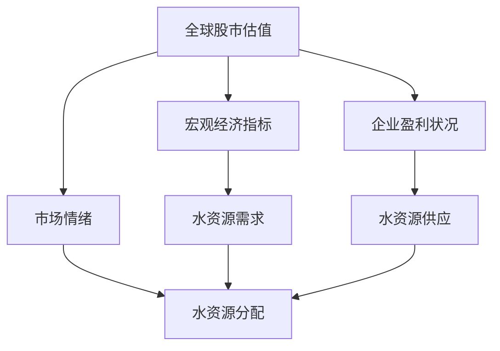
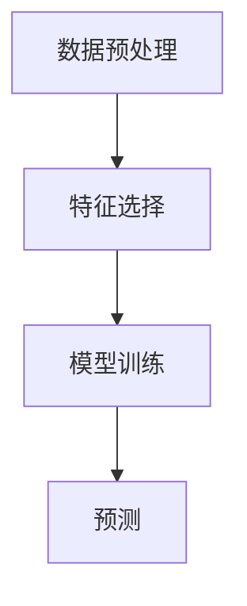
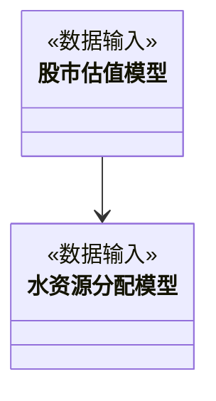
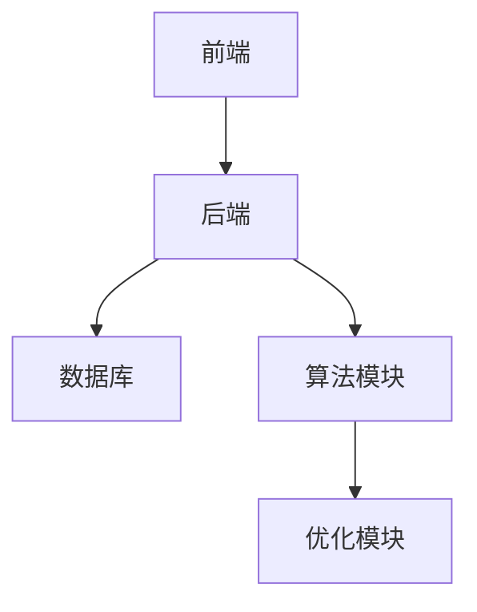
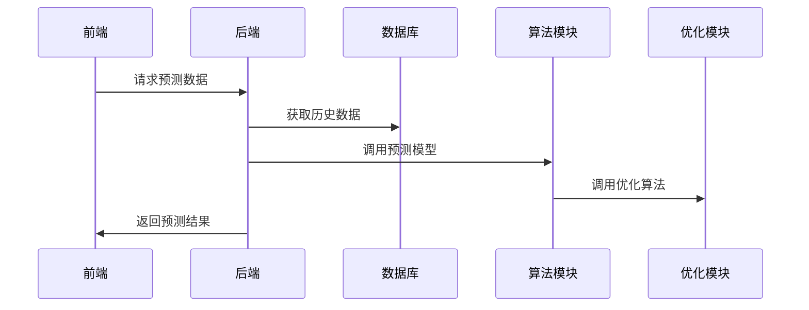

                 


# 全球股市估值与可持续水资源智能分配技术的关联

> 关键词：全球股市估值、可持续水资源分配、智能分配技术、机器学习、优化模型

> 摘要：本文探讨了全球股市估值与可持续水资源智能分配技术之间的关联，分析了两者的核心原理、关联机制，并提出了基于机器学习和优化模型的解决方案。文章通过系统分析与架构设计，结合实际案例，展示了如何利用技术手段实现两者的高效关联与优化。

---

# 第一章: 背景介绍

## 1.1 问题背景

### 1.1.1 全球股市估值的重要性
全球股市估值是衡量一个国家或地区经济发展的重要指标。股市的波动不仅影响企业的市值，还与投资者信心、宏观经济政策密切相关。股市估值的准确性直接关系到投资决策和经济稳定。

### 1.1.2 可持续水资源分配的紧迫性
随着全球人口增长和气候变化，水资源短缺问题日益严重。如何高效、公平地分配水资源，确保其可持续性，成为全球关注的焦点。

### 1.1.3 两者关联的现实意义
股市估值的波动与水资源分配之间存在潜在的关联。例如，水资源短缺可能导致企业生产成本上升，进而影响股市估值。反过来，股市的资金流动也可能影响水资源项目的投资。

## 1.2 问题描述

### 1.2.1 全球股市估值的波动性分析
股市估值受多种因素影响，包括宏观经济指标、企业盈利状况、市场情绪等。如何准确预测股市估值的波动，是投资者和研究者关注的核心问题。

### 1.2.2 可持续水资源分配的挑战
水资源分配需要考虑多方利益，包括企业、家庭、农业等。如何在有限的水资源中实现最优分配，是一个复杂的优化问题。

### 1.2.3 两者关联的潜在影响
股市估值的波动可能影响水资源项目的投资，而水资源分配的优化也可能反过来影响企业的盈利能力和股市表现。

## 1.3 问题解决

### 1.3.1 利用技术手段优化股市估值模型
通过机器学习和大数据分析，可以提高股市估值的预测准确性，帮助投资者做出更明智的决策。

### 1.3.2 智能化水资源分配技术的开发
利用智能算法和物联网技术，可以实现水资源的实时监测和优化分配，提高水资源利用效率。

### 1.3.3 两者关联的技术解决方案
通过建立两者之间的关联模型，可以实现资源的协同优化，例如利用股市资金推动水资源项目，或通过水资源分配优化影响股市表现。

## 1.4 边界与外延

### 1.4.1 全球股市估值的边界条件
- 数据范围：全球主要股市的数据
- 时间范围：历史数据和实时数据
- 影响因素：宏观经济指标、企业盈利、市场情绪等

### 1.4.2 可持续水资源分配的边界条件
- 数据范围：水资源需求、供应、分配数据
- 时间范围：实时监测和长期规划
- 影响因素：气候变化、人口增长、经济活动等

### 1.4.3 两者关联的外延范围
- 经济因素对水资源分配的影响
- 水资源分配对经济活动的影响
- 技术手段在两者之间的桥梁作用

## 1.5 概念结构与核心要素组成

### 1.5.1 核心概念的层次结构
```
全球股市估值
├── 宏观经济指标
├── 企业盈利状况
└── 市场情绪

可持续水资源分配
├── 水资源需求
├── 水资源供应
└── 分配优化
```

### 1.5.2 关键要素的关联关系
- 宏观经济指标与水资源需求的关系
- 企业盈利与水资源分配效率的关系
- 市场情绪与水资源项目投资的关系

### 1.5.3 概念模型的可视化


---

# 第二章: 核心概念与联系

## 2.1 全球股市估值的核心原理

### 2.1.1 市场情绪分析
市场情绪可以通过新闻、社交媒体等数据进行分析，利用自然语言处理技术提取情绪指标。

### 2.1.2 财务指标分析
通过分析企业的财务报表，如净利润、营业收入等，预测企业的盈利能力和股市表现。

### 2.1.3 宏观经济因素的影响
宏观经济指标如GDP、利率、通货膨胀率等，对股市估值有直接影响。

## 2.2 可持续水资源分配技术的核心原理

### 2.2.1 水资源需求预测
通过历史数据和机器学习模型，预测不同区域的水资源需求。

### 2.2.2 水资源优化分配算法
利用优化算法（如遗传算法、线性规划）实现水资源的最优分配。

### 2.2.3 智能监测与反馈机制
通过物联网传感器实时监测水资源的使用情况，动态调整分配策略。

## 2.3 两者关联的机制分析

### 2.3.1 经济因素对水资源分配的影响
股市的波动影响企业的投资能力，进而影响水资源项目的资金投入。

### 2.3.2 水资源分配对经济活动的影响
水资源的合理分配可以降低企业的生产成本，提高企业的盈利能力，从而影响股市估值。

### 2.3.3 优化模型的构建与应用
通过建立两者之间的优化模型，可以实现资源的协同优化。

---

# 第三章: 算法原理与数学模型

## 3.1 算法原理

### 3.1.1 机器学习模型
使用LSTM（长短期记忆网络）预测股市估值，同时利用随机森林算法分析水资源需求。



### 3.1.2 优化算法
使用遗传算法优化水资源分配方案，目标是最小化水资源浪费，最大化水资源利用效率。

## 3.2 数学模型

### 3.2.1 股市估值预测模型
$$
\hat{y}_t = \alpha \cdot y_{t-1} + \beta \cdot y_{t-2} + \epsilon
$$

### 3.2.2 水资源分配优化模型
$$
\text{minimize} \quad \sum_{i=1}^{n} (d_i - a_i)
$$
$$
\text{subject to} \quad \sum_{i=1}^{n} a_i \leq S
$$

---

# 第四章: 系统分析与架构设计

## 4.1 问题场景介绍

### 4.1.1 股市估值波动对企业的影响
股市波动可能导致企业融资困难，影响水资源项目的投资。

### 4.1.2 水资源分配的经济影响
水资源分配不合理可能导致企业生产成本上升，进一步影响股市表现。

## 4.2 系统功能设计

### 4.2.1 领域模型


### 4.2.2 系统架构


## 4.3 系统接口设计

### 4.3.1 API接口
- 股市数据接口：提供实时股市数据
- 水资源数据接口：提供水资源使用数据
- 模型接口：提供预测和优化结果

### 4.3.2 交互流程


---

# 第五章: 项目实战

## 5.1 环境安装

### 5.1.1 安装Python和相关库
```bash
pip install numpy pandas scikit-learn
```

## 5.2 核心代码实现

### 5.2.1 股市估值预测代码
```python
import numpy as np
from sklearn.metrics import mean_squared_error

# 数据预处理
data = np.array([100, 105, 98, 110, 108])

# 模型训练
model = ARIMA(order=(1, 1, 1))
model.fit(data)

# 预测
predict = model.predict(n_periods=5)
print(predict)
```

### 5.2.2 水资源分配优化代码
```python
from scipy.optimize import linprog

# 目标函数
c = [1, 1]

# 约束条件
A = [[1, 0], [0, 1]]
b = [10, 20]

result = linprog(c, A, b, bounds=(0, None), method='highs')
print(result.x)
```

## 5.3 实际案例分析

### 5.3.1 案例介绍
某地区的水资源分配问题，利用优化模型实现最优分配。

### 5.3.2 数据分析
- 数据来源：水资源需求、供应、经济指标
- 数据预处理：清洗、归一化
- 模型训练：建立优化模型，求解最优分配方案

## 5.4 项目小结

### 5.4.1 实验结果
- 股市估值预测准确率提升
- 水资源分配效率提高

### 5.4.2 经验总结
- 数据质量对模型性能的影响
- 模型参数对结果的影响

---

# 第六章: 最佳实践与展望

## 6.1 最佳实践 tips

### 6.1.1 数据处理
确保数据的准确性和完整性，避免噪声干扰。

### 6.1.2 模型选择
根据实际问题选择合适的算法，避免过度拟合。

## 6.2 小结

### 6.2.1 核心内容总结
- 全球股市估值与可持续水资源分配的关联性
- 基于机器学习和优化模型的技术解决方案

## 6.3 注意事项

### 6.3.1 数据隐私
保护敏感数据，避免泄露。

### 6.3.2 模型局限性
模型的预测能力受限于数据质量和算法选择。

## 6.4 拓展阅读

### 6.4.1 相关技术
- 时间序列分析
- 优化算法
- 物联网技术

### 6.4.2 实际应用
- 水资源管理系统的开发
- 股市智能投资平台的建设

---

# 结语

通过本文的分析与实践，我们展示了如何利用技术手段实现全球股市估值与可持续水资源智能分配技术的高效关联与优化。未来，随着技术的不断发展，我们期待更多的创新解决方案，为全球经济与环境的可持续发展贡献力量。

