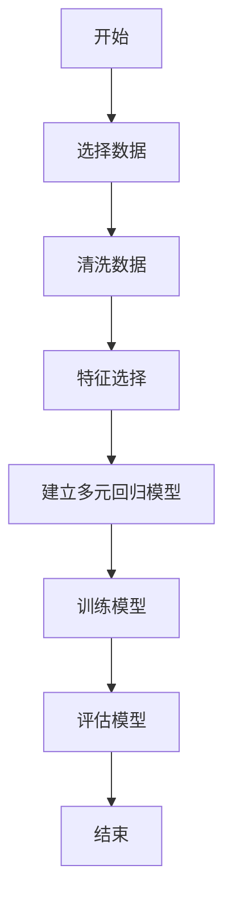
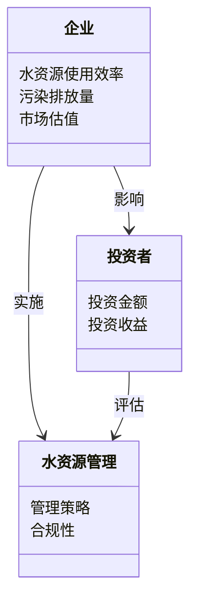
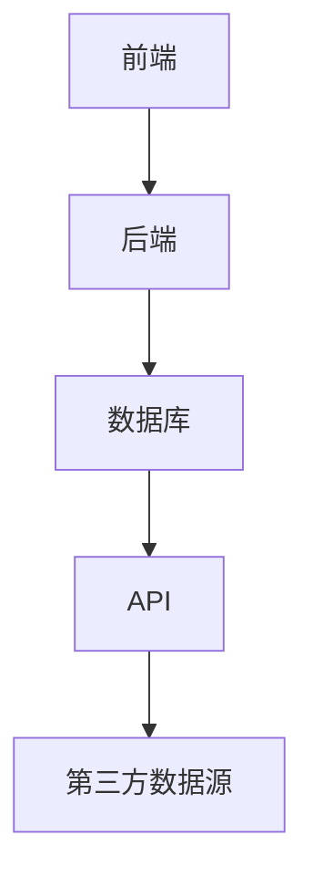

                 


# 全球股市估值与可持续水资源管理的关联

## 关键词：全球股市估值、可持续水资源管理、环境、社会和治理（ESG）、投资决策、水资源管理

## 摘要：本文探讨了全球股市估值与可持续水资源管理之间的关联，分析了环境、社会和治理（ESG）因素在投资决策中的作用，特别是水资源管理如何影响企业的财务表现和市场估值。通过系统分析和数学建模，本文揭示了水资源管理在提升企业价值中的潜在影响，并为投资者提供了评估企业水资源管理绩效的方法。

---

# 第1章 全球股市估值与可持续水资源管理的背景介绍

## 1.1 问题背景

### 1.1.1 气候变化与水资源短缺的全球挑战
气候变化导致的水资源短缺问题日益严重，影响着企业的运营和全球经济发展。水资源短缺不仅威胁到企业的生产活动，还可能导致供应链中断和成本上升，进而影响企业的财务表现和市场估值。

### 1.1.2 可持续发展与投资的关联性
随着全球对可持续发展的关注增加，投资者越来越关注企业的环境和社会责任表现。环境、社会和治理（ESG）因素成为影响投资决策的重要指标，尤其是水资源管理的表现。

### 1.1.3 环境、社会和治理（ESG）投资的兴起
ESG投资的兴起反映了投资者对可持续发展的关注。水资源管理作为ESG中的关键因素，直接影响企业的长期可持续性和市场估值。

## 1.2 问题描述

### 1.2.1 全球股市估值的波动性分析
全球股市估值受多种因素影响，包括经济指标、政策变化和企业绩效。然而，随着环境问题的加剧，企业的水资源管理绩效逐渐成为影响股市估值的重要因素。

### 1.2.2 水资源管理的复杂性与挑战
水资源管理涉及技术、政策和经济等多个方面，企业在水资源管理中的表现受到多种因素的影响，如水资源使用效率、污染排放和合规性。

### 1.2.3 企业水资源管理对股市估值的影响
企业通过有效的水资源管理可以降低运营成本、减少环境风险，并提升品牌形象，从而间接影响股市估值。

## 1.3 问题解决

### 1.3.1 可持续水资源管理的定义与目标
可持续水资源管理是指在满足当前需求的同时，不损害未来代际的水资源利用。目标是通过优化水资源使用、减少污染和提高效率，实现长期的水资源可持续性。

### 1.3.2 企业如何通过水资源管理提升估值
企业通过有效的水资源管理可以降低运营成本、减少环境风险，同时提升品牌形象，从而间接提升市场估值。

### 1.3.3 投资者如何评估企业水资源管理绩效
投资者通过评估企业的水资源使用效率、污染排放和合规性等指标，判断企业的水资源管理绩效，从而做出投资决策。

## 1.4 边界与外延

### 1.4.1 可持续水资源管理的边界条件
可持续水资源管理的边界条件包括企业的水资源使用范围、地理位置和行业特点。不同企业的水资源管理策略可能有所不同，需根据具体情况进行调整。

### 1.4.2 全球股市估值的外延影响
全球股市估值不仅受企业绩效影响，还受到宏观经济、政策和市场情绪等外延因素的影响。然而，随着可持续发展的关注增加，企业的环境表现逐渐成为影响股市估值的重要因素。

### 1.4.3 企业与投资者之间的互动关系
企业与投资者之间的互动关系是双向的。企业通过优化水资源管理提升估值，投资者通过评估企业绩效做出投资决策。这种互动关系推动了可持续水资源管理在投资决策中的重要性。

## 1.5 核心要素组成

### 1.5.1 水资源管理的关键要素
水资源管理的关键要素包括水资源使用效率、污染排放、合规性、技术创新和社区参与。这些要素共同构成了企业的水资源管理绩效。

### 1.5.2 投资评估的核心指标
投资评估的核心指标包括市盈率、市净率、资本回报率和环境风险指数。这些指标帮助投资者评估企业的财务表现和环境风险。

### 1.5.3 企业与投资者的协同作用
企业与投资者的协同作用体现在企业通过优化水资源管理提升估值，投资者通过支持可持续企业推动环境改善。这种协同作用促进了全球股市的可持续发展。

---

# 第2章 核心概念与联系

## 2.1 核心概念原理

### 2.1.1 可持续水资源管理的原理
可持续水资源管理通过优化水资源使用、减少污染和提高效率，实现长期的水资源可持续性。企业通过有效的水资源管理可以降低运营成本、减少环境风险，并提升品牌形象，从而间接提升市场估值。

### 2.1.2 全球股市估值的计算方法
全球股市估值通常通过市盈率、市净率和资本回报率等指标进行评估。这些指标反映了企业的财务表现和市场风险。

### 2.1.3 企业水资源管理与股市估值的关联机制
企业水资源管理通过影响企业的运营成本、环境风险和品牌形象，间接影响股市估值。有效的水资源管理可以降低企业的环境风险，提升投资者信心，从而提升市场估值。

## 2.2 属性特征对比表格

| 特性          | 可持续水资源管理          | 全球股市估值          |
|---------------|--------------------------|-----------------------|
| 定义          | 管理水资源以确保可持续性  | 评估企业市场价值      |
| 关键指标      | 水资源使用效率、污染排放 | 市盈率、市净率        |
| 影响因素      | 气候变化、政策法规       | 企业绩效、市场情绪    |
| 目标          | 保护环境、社会价值      | 提升企业市值          |

## 2.3 ER实体关系图

```mermaid
erd
entity 企业 {
  key id
  attr 企业ID
  attr 水资源使用效率
  attr 污染排放量
  attr 市盈率
  attr 市净率
}

entity 投资者 {
  key id
  attr 投资者ID
  attr 投资金额
  attr 投资收益
}

entity 水资源管理 {
  key id
  attr 水资源管理ID
  attr 管理策略
  attr 合规性
}

relation 企业-投资者 {
  role 企业ID -> 投资者ID
  role 投资者ID -> 企业ID
}

relation 企业-水资源管理 {
  role 企业ID -> 水资源管理ID
  role 水资源管理ID -> 企业ID
}

relation 投资者-水资源管理 {
  role 投资者ID -> 水资源管理ID
  role 水资源管理ID -> 投资者ID
}
```

---

# 第3章 算法原理讲解

## 3.1 算法原理

### 3.1.1 算法选择
我们选择多元回归分析来评估水资源管理对股市估值的影响。通过分析企业的水资源使用效率、污染排放和合规性等变量，构建回归模型，预测企业水资源管理对市场估值的影响。

### 3.1.2 算法流程


## 3.2 算法实现

### 3.2.1 Python代码示例
```python
import pandas as pd
import numpy as np
from sklearn.linear_model import LinearRegression
from sklearn.metrics import r2_score

# 数据加载与预处理
data = pd.read_csv('stock_water.csv')
data = data.dropna()
X = data[['water_usage', 'pollution_emission', 'compliance']]
y = data['market_valuation']

# 建立多元回归模型
model = LinearRegression()
model.fit(X, y)

# 模型评估
predictions = model.predict(X)
r2 = r2_score(y, predictions)
print(f'R²: {r2}')
print(f'回归系数: {model.coef_}')
print(f'截距: {model.intercept_}')
```

### 3.2.2 算法解读
多元回归分析通过回归系数和截距，量化了各变量对市场估值的影响。回归系数表示每增加单位的水资源使用效率或污染排放，市场估值的变化情况。截距表示当所有变量为零时，市场估值的理论值。

## 3.3 业务价值
通过多元回归分析，投资者可以量化企业水资源管理对市场估值的影响，从而做出更科学的投资决策。企业可以通过优化水资源管理策略，提升市场估值。

---

# 第4章 数学模型和公式

## 4.1 模型构建

### 4.1.1 理论基础
我们构建一个多因子模型，将水资源管理因子纳入传统市场估值模型中。通过分析水资源使用效率、污染排放和合规性等因子，构建多因子回归模型。

### 4.1.2 模型假设
假设企业水资源管理绩效与市场估值呈线性关系，且各因子之间无多重共线性。

### 4.1.3 模型推导
通过多元回归分析，推导出包含水资源因子的多因子模型：

$$
\text{Market Valuation} = \beta_0 + \beta_1 \times \text{Water Usage} + \beta_2 \times \text{Pollution Emission} + \beta_3 \times \text{Compliance} + \epsilon
$$

其中，$\beta_i$ 表示各因子对市场估值的回归系数，$\epsilon$ 为误差项。

---

# 第5章 系统分析与架构设计方案

## 5.1 问题场景介绍

### 5.1.1 问题场景
企业希望通过优化水资源管理提升市场估值，投资者希望通过评估企业水资源管理绩效做出投资决策。

## 5.2 项目介绍

### 5.2.1 项目目标
构建一个基于水资源管理的市场估值模型，帮助企业优化水资源管理策略，指导投资者做出科学决策。

## 5.3 系统功能设计

### 5.3.1 领域模型


## 5.4 系统架构设计

### 5.4.1 系统架构


---

# 第6章 项目实战

## 6.1 环境安装

### 6.1.1 安装Python和相关库
安装Python和pandas、numpy、scikit-learn等库，用于数据处理和建模。

## 6.2 系统核心实现源代码

### 6.2.1 核心代码
```python
import pandas as pd
import numpy as np
from sklearn.linear_model import LinearRegression
from sklearn.metrics import r2_score

# 数据加载与预处理
data = pd.read_csv('stock_water.csv')
data = data.dropna()
X = data[['water_usage', 'pollution_emission', 'compliance']]
y = data['market_valuation']

# 建立多元回归模型
model = LinearRegression()
model.fit(X, y)

# 模型评估
predictions = model.predict(X)
r2 = r2_score(y, predictions)
print(f'R²: {r2}')
print(f'回归系数: {model.coef_}')
print(f'截距: {model.intercept_}')
```

## 6.3 代码解读与分析

### 6.3.1 代码解读
上述代码展示了如何使用Python和机器学习库构建多元回归模型，分析水资源管理对市场估值的影响。

### 6.3.2 实际案例分析
以具体企业数据为例，展示如何通过模型预测企业市场估值的变化。

## 6.4 项目小结

### 6.4.1 成果总结
通过本项目，我们构建了一个基于水资源管理的市场估值模型，帮助企业优化水资源管理策略，指导投资者做出科学决策。

---

# 第7章 最佳实践

## 7.1 小结

### 7.1.1 关键点总结
水资源管理是影响企业市场估值的重要因素，投资者应关注企业的水资源管理绩效，企业应优化水资源管理策略，以提升市场估值。

## 7.2 注意事项

### 7.2.1 投资者注意事项
投资者应关注企业的水资源管理绩效，选择具有可持续水资源管理策略的企业进行投资。

### 7.2.2 企业注意事项
企业应优化水资源管理策略，降低环境风险，提升市场估值。

## 7.3 拓展阅读

### 7.3.1 推荐书籍
《可持续投资：环境、社会和治理（ESG）因素在投资决策中的应用》

### 7.3.2 推荐文章
《水资源管理对全球经济的影响：从企业到市场的视角》

---

通过以上章节的详细分析，我们深入探讨了全球股市估值与可持续水资源管理的关联，为企业和投资者提供了科学的决策依据。希望本文能为相关领域的研究和实践提供有价值的参考。

