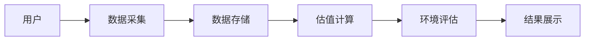

                 


# 全球股市估值与可持续海洋养殖的关系

> **关键词**：全球股市估值、可持续海洋养殖、股票估值模型、环境影响、经济价值

> **摘要**：  
本文探讨全球股市估值与可持续海洋养殖之间的关系，分析其核心概念、理论基础、数学模型、系统架构及实际应用。通过背景介绍、理论分析、案例研究和项目实战，揭示如何利用股票估值模型优化可持续海洋养殖的经济价值，同时考虑其对环境的影响。本文旨在为投资者、政策制定者和企业提供科学的决策支持，推动海洋养殖行业的可持续发展。

---

## 第1章 全球股市估值与可持续海洋养殖的背景介绍

### 1.1 股票估值的核心概念
股票估值是通过对公司财务状况、行业地位和市场前景的分析，确定其股票的合理价格。常用的估值方法包括市盈率（P/E）、市净率（P/B）和股息率等。  
- **市盈率公式**：$$\text{市盈率} = \frac{\text{股票价格}}{\text{每股收益}}$$  
- **市净率公式**：$$\text{市净率} = \frac{\text{股票价格}}{\text{每股净资产}}$$  

### 1.2 可持续海洋养殖的定义与特点
可持续海洋养殖是指在不破坏海洋生态系统的同时，高效利用海洋资源进行养殖的活动。其核心在于平衡经济效益、环境效益和社会效益。  
- **环境友好**：减少污染，保护海洋生物多样性。  
- **资源高效**：合理利用饲料、水和空间。  
- **经济价值**：提供高蛋白食品，支持沿海经济发展。

### 1.3 两者的关联性分析
股票估值与可持续海洋养殖的关系主要体现在：
1. **市场反馈**：股市估值反映投资者对海洋养殖企业的信心。  
2. **环境风险**：环境破坏可能引发企业估值下降。  
3. **政策影响**：政府政策推动可持续发展，影响企业估值。

---

## 第2章 全球股市估值与可持续海洋养殖的核心概念与联系

### 2.1 核心概念的原理分析
股票估值的核心是预测企业未来现金流，而可持续海洋养殖的焦点是优化资源利用和减少环境影响。两者的结合点在于企业如何将可持续性转化为经济价值。

#### 股票估值的数学模型
市盈率模型：
$$\text{股票价格} = \text{市盈率} \times \text{每股收益}$$

#### 可持续海洋养殖的生态模型
资源消耗模型：
$$\text{资源消耗} = a \times \text{生产量} + b \times \text{单位资源消耗}$$

### 2.2 概念属性特征对比表格
| 概念 | 属性 | 特征 |
|------|------|------|
| 股票估值 | 方法 | 市盈率、市净率等 |
| 可持续海洋养殖 | 标准 | 环境友好、资源效率等 |

### 2.3 ER实体关系图
```mermaid
er
  actor 股票投资者
  actor 海洋养殖户
  actor 政府监管机构
  database 股票市场数据
  database 海洋养殖数据
  relationship 投资者影响股市估值
  relationship 海洋养殖影响股市估值
  relationship 政府监管影响养殖与股市
```

---

## 第3章 数学模型与算法原理

### 3.1 股票估值的数学模型
#### 市盈率模型
$$\text{市盈率} = \frac{\text{股票价格}}{\text{每股收益}}$$  
例如，某公司股票价格为$50，每股收益为$5，则市盈率为10。

#### 市净率模型
$$\text{市净率} = \frac{\text{股票价格}}{\text{每股净资产}}$$  
例如，某公司股票价格为$50，每股净资产为$10，则市净率为5。

### 3.2 可持续海洋养殖的生态模型
#### 资源消耗模型
$$\text{资源消耗} = a \times \text{生产量} + b \times \text{单位资源消耗}$$  
例如，假设生产量为100吨，单位资源消耗为$2，则资源消耗为$200。

#### 环境影响模型
$$\text{环境影响} = c \times \text{污染排放} + d \times \text{生态破坏面积}$$  
例如，污染排放为100吨，生态破坏面积为5公顷，假设$c=1$和$d=2$，则环境影响为$100 + 10 = 110$。

---

## 第4章 系统分析与架构设计方案

### 4.1 问题场景介绍
股票投资者希望评估可持续海洋养殖企业的估值，同时确保养殖活动不会对环境造成重大影响。

### 4.2 系统功能设计
- 数据采集模块：收集企业财务数据和环境数据。  
- 估值计算模块：使用数学模型计算股票估值。  
- 环境评估模块：评估养殖活动的环境影响。

### 4.3 系统架构设计


### 4.4 系统交互图
```mermaid
sequenceDiagram
    actor 用户
    system 系统
    用户 -> 系统: 提交企业数据
    系统 -> 用户: 返回估值结果
    用户 -> 系统: 查询环境影响
    系统 -> 用户: 返回环境数据
```

---

## 第5章 项目实战

### 5.1 环境安装
- 安装Python和相关库（Pandas、Matplotlib）。  
- 数据库连接工具（如MySQL）。

### 5.2 核心代码实现
```python
import pandas as pd

# 股票估值计算
def calculate_market_price(eps, pe_ratio):
    return eps * pe_ratio

# 可持续海洋养殖环境影响评估
def calculate_environment_impact(pollution, area):
    return pollution + area

# 示例数据
data = {
    '公司名称': ['公司A', '公司B'],
    '每股收益': [5, 10],
    '污染排放': [100, 200],
    '生态破坏面积': [5, 10]
}

df = pd.DataFrame(data)

# 计算股票价格
df['股票价格'] = df.apply(lambda x: calculate_market_price(x['每股收益'], 10), axis=1)

# 计算环境影响
df['环境影响'] = df.apply(lambda x: calculate_environment_impact(x['污染排放'], x['生态破坏面积']), axis=1)

print(df)
```

### 5.3 案例分析与解读
假设公司A的每股收益为$5，市盈率为10，则股票价格为$50。同时，公司A的污染排放为100吨，生态破坏面积为5公顷，环境影响为$105。相比之下，公司B的环境影响为$210，这可能影响其股票估值。

---

## 第6章 最佳实践与总结

### 6.1 最佳实践
- 投资者应关注企业的环境表现，选择环境影响较小的公司。  
- 企业应优化资源利用，降低环境影响，提升估值。

### 6.2 小结
本文通过理论分析和实际案例，揭示了全球股市估值与可持续海洋养殖之间的关系。通过科学的模型和算法，投资者和企业可以更好地平衡经济效益与环境责任。

### 6.3 注意事项
- 数据的准确性和完整性直接影响结果。  
- 模型需根据实际情况调整参数。

### 6.4 拓展阅读
- 《可持续投资与股票估值》  
- 《海洋养殖与环境保护》

---

通过本文的分析，读者可以全面理解全球股市估值与可持续海洋养殖的关系，并在实际中应用相关模型和方法。

