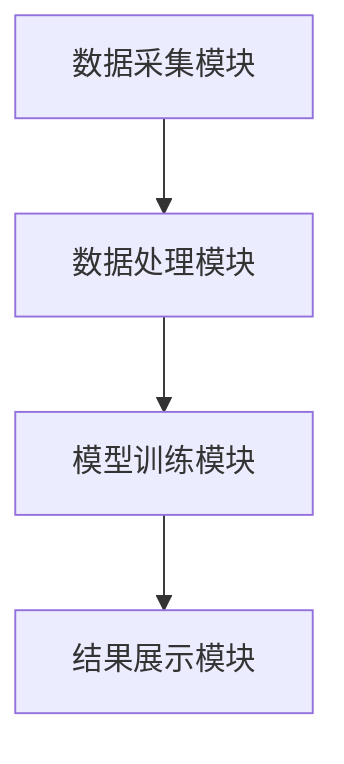
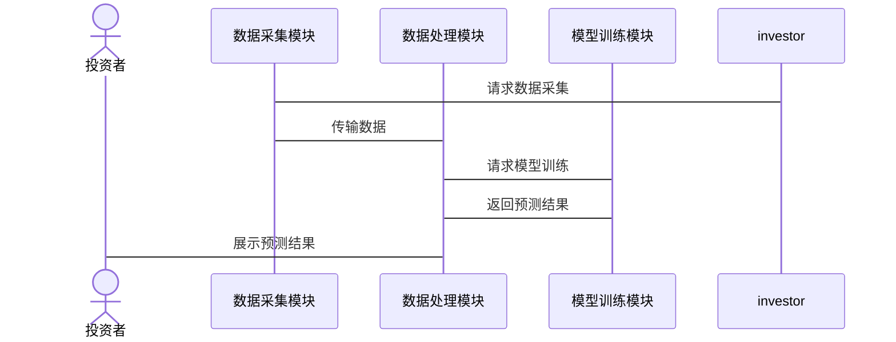

                 


# 全球股市估值与可持续能源固态电池技术的关联

## 关键词：
全球股市估值、可持续能源、固态电池技术、股市与技术关联、技术驱动因素、投资分析

## 摘要：
本文探讨了全球股市估值与可持续能源中的固态电池技术之间的关联。随着全球能源转型的加速，固态电池技术作为新能源汽车和可再生能源存储的核心技术，正逐渐成为影响股市估值的重要因素。通过分析固态电池技术的创新、市场应用和经济影响，结合股市估值的方法和模型，本文揭示了技术进步如何驱动股市价值的变化。同时，文章通过实际案例分析和数据建模，展示了如何利用技术驱动因素预测股市走势，并为投资者提供科学的投资建议。

---

# 正文

## 第一部分：背景与概述

### 第1章：全球能源转型的背景

#### 1.1 当前全球能源结构的现状
全球能源结构正面临深刻的转型，传统化石能源逐渐被清洁、可持续的能源替代。根据国际能源署（IEA）的报告，全球能源消费中可再生能源的比例正在快速上升。然而，能源存储技术的不足仍然是制约可再生能源发展的瓶颈。

#### 1.2 可再生能源的重要性
可再生能源（如风能、太阳能）的波动性特点决定了其需要高效的存储解决方案。固态电池技术因其高能量密度、安全性和循环寿命，被认为是解决可再生能源存储问题的关键技术。

#### 1.3 能源转型的目标与挑战
能源转型的目标是实现低碳、高效、可持续的能源体系。然而，技术瓶颈、成本问题和政策不确定性仍然是阻碍能源转型的主要挑战。

### 第2章：固态电池技术的崛起

#### 2.1 固态电池技术的基本概念
固态电池是一种采用固体电解质的电池技术，与传统液态电池相比，具有更高的能量密度和安全性。其工作原理基于锂离子在固体电解质中的传输。

#### 2.2 固态电池的优势
- **安全性**：固态电解质避免了液态电解质泄漏和燃烧的风险。
- **能量密度**：固态电池的能量密度是传统锂离子电池的2-3倍。
- **循环寿命**：固态电池的循环寿命更长，适合大规模储能应用。

#### 2.3 固态电池在新能源汽车中的应用
新能源汽车（EV）的普及依赖于高效、安全的电池技术。固态电池的高能量密度和安全性使其成为未来新能源汽车电池的首选。

### 第3章：股市估值的基本概念

#### 3.1 股市估值的定义
股市估值是指通过对公司财务数据、市场表现和行业前景的分析，评估其股票的合理价格范围。

#### 3.2 影响股票价格的因素
- **财务指标**：如净利润、营收增长率、市盈率等。
- **市场情绪**：投资者情绪和市场波动会影响股票价格。
- **行业前景**：行业发展趋势和政策支持对股价有重要影响。

#### 3.3 股市估值的方法
- **市盈率法**：通过比较公司的市盈率与行业平均水平，评估其股价是否合理。
- **市净率法**：通过比较公司的市净率与行业平均水平，评估其股价是否合理。
- **股息率法**：通过比较公司的股息率与行业平均水平，评估其投资回报率。

---

## 第二部分：固态电池技术与可持续能源的关系

### 第4章：固态电池技术对能源行业的影响

#### 4.1 固态电池技术对可再生能源存储的推动
固态电池技术的高能量密度和循环寿命使其成为可再生能源存储的理想选择。通过高效的储能解决方案，可再生能源的利用效率得以提高，从而推动能源结构的转型。

#### 4.2 固态电池技术对新能源汽车的影响
新能源汽车的普及依赖于高效、安全的电池技术。固态电池的高能量密度和安全性使其成为未来新能源汽车电池的首选。

#### 4.3 固态电池技术对能源市场格局的影响
固态电池技术的突破将改变能源市场的竞争格局。具备技术优势的企业将在市场中占据主导地位，从而影响股市估值。

### 第5章：固态电池技术与股市估值的关联

#### 5.1 技术创新对股市估值的推动
技术创新是企业核心竞争力的体现。固态电池技术的突破将提升企业的市场地位和盈利能力，从而推动其股价上涨。

#### 5.2 市场应用对股市估值的影响
固态电池技术的市场应用前景直接影响企业的估值。具备广泛应用前景的技术将受到投资者的青睐。

#### 5.3 技术风险对股市估值的冲击
技术风险是影响股市估值的重要因素。固态电池技术的商业化过程中可能面临的技术难题和成本问题将影响企业的股价表现。

---

## 第三部分：算法原理与数据分析

### 第6章：数据分析与预测模型

#### 6.1 数据采集与处理
- **数据来源**：收集固态电池相关企业的财务数据、市场数据和行业数据。
- **数据清洗**：对数据进行清洗和预处理，确保数据的准确性和完整性。

#### 6.2 时间序列分析
- **时间序列模型**：使用ARIMA模型对固态电池企业的股价进行预测。
- **模型验证**：通过历史数据验证模型的准确性。

#### 6.3 机器学习模型
- **LSTM模型**：使用长短期记忆网络对固态电池企业的股价进行预测。
- **模型训练**：通过历史数据训练模型，并进行预测。

### 第7章：数学模型与公式

#### 7.1 时间序列分析公式
$$ ARIMA模型：ARIMA(p, d, q) $$

#### 7.2 LSTM模型
$$ LSTM的输入门控：i_t = \sigma(W_i \cdot [h_{t-1}, x_t] + b_i) $$
$$ LSTM的遗忘门控：f_t = \sigma(W_f \cdot [h_{t-1}, x_t] + b_f) $$
$$ LSTM的输出门控：o_t = \sigma(W_o \cdot [h_{t-1}, x_t] + b_o) $$
$$ LSTM的单元状态：s_t = f_t \cdot s_{t-1} + i_t \cdot tanh(W_c \cdot [h_{t-1}, x_t] + b_c) $$
$$ LSTM的输出：h_t = o_t \cdot tanh(s_t) $$

---

## 第四部分：系统分析与架构设计

### 第8章：系统架构设计

#### 8.1 系统功能设计
- **数据采集模块**：负责采集固态电池相关企业的财务数据、市场数据和行业数据。
- **数据处理模块**：对数据进行清洗和预处理，确保数据的准确性和完整性。
- **模型训练模块**：使用时间序列分析和机器学习模型对股价进行预测。
- **结果展示模块**：将预测结果以可视化形式展示给投资者。

#### 8.2 系统架构图


#### 8.3 系统交互序列图


---

## 第五部分：项目实战与案例分析

### 第9章：项目实战

#### 9.1 环境安装
- **Python环境**：安装Python 3.8及以上版本。
- **依赖库安装**：使用pip安装numpy、pandas、keras、tensorflow等依赖库。

#### 9.2 核心代码实现
```python
# LSTM模型实现代码
import numpy as np
from keras.models import Sequential
from keras.layers import LSTM, Dense

# 数据准备
data = np.random.random((1000, 4))
model = Sequential()
model.add(LSTM(64, input_shape=(None, 4)))
model.add(Dense(1))
model.compile(loss='mean_squared_error', optimizer='adam')
model.fit(data, np.random.random(1000,), epochs=10, batch_size=32)
```

#### 9.3 案例分析
以某家固态电池企业为例，分析其股价走势。通过模型预测其未来股价，并结合行业前景和市场环境，提出投资建议。

---

## 第六部分：总结与展望

### 第10章：总结与展望

#### 10.1 总结
本文探讨了全球股市估值与可持续能源固态电池技术的关联。通过技术分析、算法建模和案例研究，揭示了固态电池技术对股市估值的重要影响。

#### 10.2 展望
未来，随着固态电池技术的进一步发展和商业化，其对股市估值的影响将更加显著。投资者应密切关注技术进步和市场动态，以做出科学的投资决策。

---

## 参考文献
1. 国际能源署（IEA）报告：《全球能源转型路线图》
2. 《LSTM网络：原理与应用》
3. 《固态电池技术与市场分析》

---

通过本文的分析，读者可以深入了解固态电池技术对股市估值的影响，并能够利用数据分析和模型预测的方法，做出科学的投资决策。

