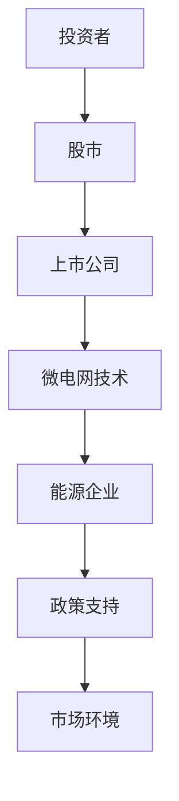
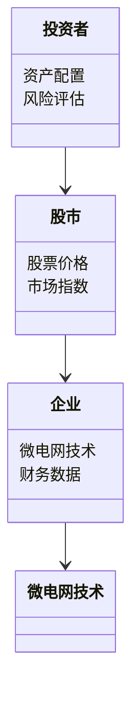
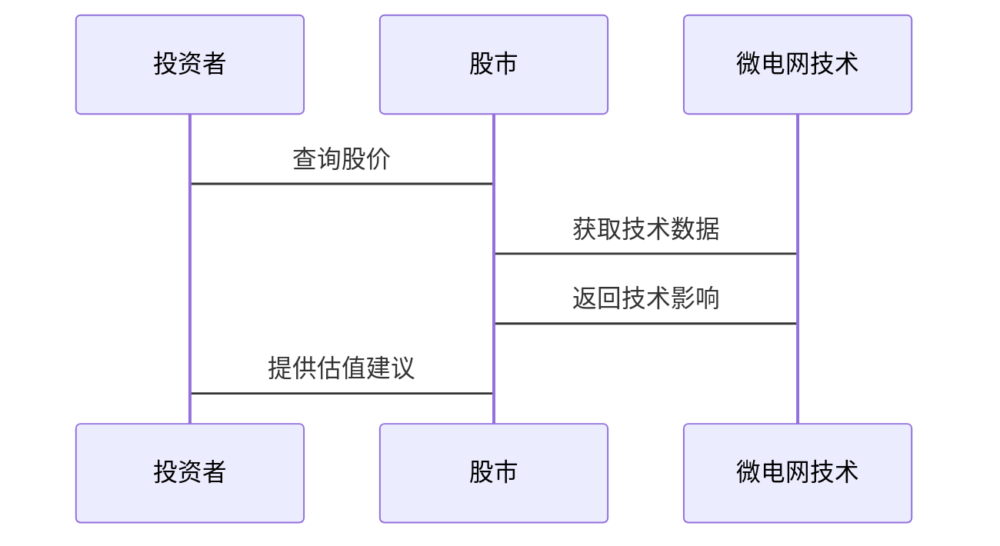

                 


```markdown
# 全球股市估值与可持续能源微电网技术的关联

> 关键词：全球股市估值、可持续能源、微电网技术、关联模型、技术经济分析

> 摘要：本文探讨了全球股市估值与可持续能源微电网技术之间的关联，通过分析微电网技术对企业价值和股市估值的影响，结合实际案例和数学模型，提出了优化企业价值和投资决策的方法。

---

# 第一部分: 全球股市估值与可持续能源微电网技术的背景介绍

# 第1章: 全球股市估值与可持续能源微电网技术的核心概念

## 1.1 问题背景与问题描述
### 1.1.1 全球股市估值的现状与挑战
- 当前全球股市估值的波动性分析
- 微电网技术在可持续能源中的地位

### 1.1.2 可持续能源微电网技术的发展趋势
- 微电网技术的基本概念
- 微电网技术在能源结构转型中的作用

### 1.1.3 两者关联的现实意义
- 微电网技术对股市估值的影响路径
- 可持续发展与经济利益的结合

## 1.2 问题解决与边界外延
### 1.2.1 通过微电网技术优化企业价值
- 微电网技术对企业运营成本的影响
- 微电网技术对企业竞争力的提升

### 1.2.2 微电网技术对股市估值的影响路径
- 技术创新对股价的推动作用
- 政策支持对估值的提升效应

### 1.2.3 问题解决的边界与外延分析
- 微电网技术应用的边界条件
- 股市估值分析的范围限制

## 1.3 核心概念与结构
### 1.3.1 全球股市估值的核心要素
- 公司基本面、市场情绪、宏观经济指标
- 微电网技术对这些要素的具体影响

### 1.3.2 微电网技术的系统构成
- 微电网系统的关键组成部分
- 各部分之间的相互关系

### 1.3.3 两者的关联机制
- 微电网技术如何影响企业盈利能力和市场价值
- 股市估值如何反映技术应用的经济效益

---

# 第2章: 全球股市估值与微电网技术的核心概念对比

## 2.1 核心概念原理
### 2.1.1 全球股市估值的计算方法
- 市盈率（P/E）、市净率（P/B）等指标的计算
- 微电网技术对这些指标的具体影响

### 2.1.2 微电网技术的工作原理
- 微电网系统的能量流动
- 技术创新对能源效率的提升

## 2.2 概念属性特征对比
### 2.2.1 从属性角度对比
- 技术创新性与市场接受度
- 经济效益与环境效益

### 2.2.2 从技术复杂度角度对比
- 微电网技术的复杂性对股市估值的影响
- 技术门槛与市场进入壁垒

### 2.2.3 从经济影响角度对比
- 微电网技术的初始投资与长期收益
- 股市估值对技术创新的敏感性

## 2.3 ER实体关系图


---

# 第3章: 全球股市估值与微电网技术的关联模型

## 3.1 模型建立
### 3.1.1 模型假设
- 微电网技术的经济效益可量化
- 股市估值受技术创新和政策影响显著

### 3.1.2 模型变量定义
- 独立变量：微电网技术的应用程度
- 因变量：股市估值的变化

### 3.1.3 模型构建
- 线性回归模型的构建
- 交互作用的分析

## 3.2 数学模型与公式
### 3.2.1 微电网技术对企业价值的影响公式
$$ V = V_{\text{传统}} + \Delta V_{\text{微电网}} $$
其中，$V$为公司整体价值，$V_{\text{传统}}$为传统模式下的价值，$\Delta V_{\text{微电网}}$为微电网技术带来的增量价值。

### 3.2.2 股市估值与能源政策的关联公式
$$ P = \alpha \cdot E + \beta \cdot G $$
其中，$E$为能源技术影响，$G$为政策影响，$\alpha$和$\beta$为系数。

## 3.3 案例分析
### 3.3.1 某国股市与微电网技术的关联案例
- 某国家股市中采用微电网技术企业的估值变化
- 技术创新与股价波动的实证分析

### 3.3.2 案例的经济意义分析
- 技术创新对股价的推动作用
- 政策支持对估值的提升效应

---

# 第4章: 微电网技术对股市估值的算法影响

## 4.1 算法原理
### 4.1.1 数据预处理
- 时间序列数据的处理
- 多元数据的融合

### 4.1.2 关联分析
- 关联规则挖掘
- 时间序列的外生变量分析

## 4.2 算法实现
### 4.2.1 数据处理与特征提取
```python
import pandas as pd
data = pd.read_csv('stock_data.csv')
features = data[['market_value', 'revenue', 'profit']]
```

### 4.2.2 关联规则挖掘
```python
from mlxtend.frequent_patterns import apriori
frequent_itemsets = apriori(features, min_support=0.1)
```

### 4.2.3 时间序列分析
```python
from statsmodels.tsa.arima_model import ARIMA
model = ARIMA(series, order=(1,1,1))
model_fit = model.fit()
```

## 4.3 实验结果与分析
### 4.3.1 算法的有效性验证
- 算法准确率的计算
- 模型的稳健性分析

### 4.3.2 参数调整与优化
- 算法参数的优化
- 模型的调参实验

---

# 第5章: 系统分析与架构设计

## 5.1 项目背景
- 项目目标与范围
- 项目需求分析

## 5.2 系统功能设计
### 5.2.1 领域模型


### 5.2.2 系统架构设计


### 5.2.3 系统交互


---

# 第6章: 项目实战

## 6.1 环境安装
### 6.1.1 安装必要的工具
- Python、Jupyter Notebook、相关库的安装

### 6.1.2 数据获取
- 数据来源与清洗
- 数据格式的标准化

## 6.2 系统核心实现
### 6.2.1 核心代码实现
```python
def calculate_value(company_data):
    # 计算传统价值
    traditional_value = company_data['revenue'] * company_data['net_profit_margin']
    # 计算微电网技术带来的增量价值
    microgrid_value = company_data['R&D_expense'] * 0.5  # 假设50%的R&D投入转化为价值
    return traditional_value + microgrid_value
```

### 6.2.2 代码应用解读与分析
- 代码的功能模块划分
- 代码的运行与测试

## 6.3 实际案例分析
### 6.3.1 案例介绍
- 某企业应用微电网技术后的估值变化
- 技术创新对股价的具体影响

### 6.3.2 详细解读
- 技术应用前后的对比分析
- 数据分析结果的可视化展示

## 6.4 项目小结
- 项目成果总结
- 经验与教训

---

# 第7章: 最佳实践与总结

## 7.1 最佳实践 tips
### 7.1.1抽选 有效应用微电网技术的策略
### 7.1.2 投资者如何评估技术对企业价值的影响

## 7.2 小结
- 全文总结
- 未来研究方向

## 7.3 注意事项
- 技术应用中的潜在风险
- 数据分析中的局限性

## 7.4 拓展阅读
- 推荐的相关书籍和文献
- 专业论坛和资源链接

---

# 参考文献

[此处列出参考文献]

# 附录

[附录内容，如数据表、代码等]

```

