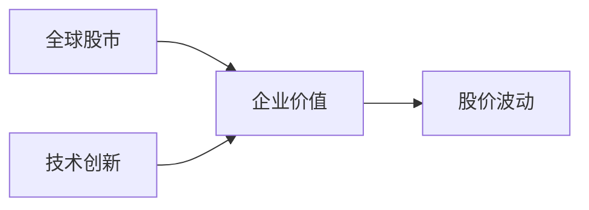
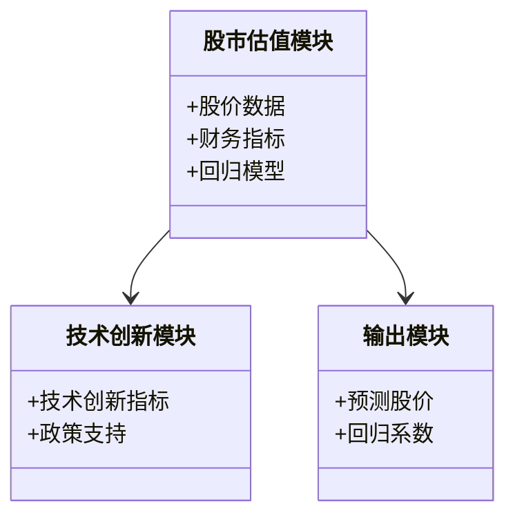
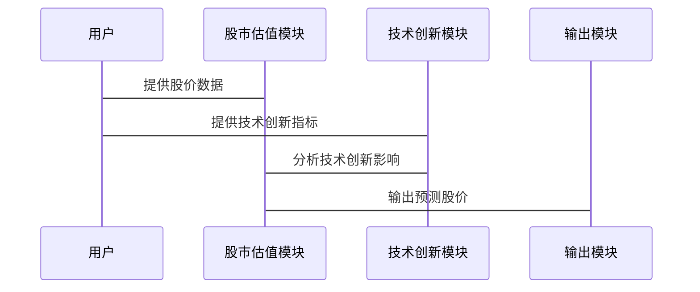

                 


# 全球股市估值与可持续航空技术创新的关系

## 关键词：全球股市估值、可持续航空技术、技术创新、经济价值、社会价值

## 摘要：  
本文探讨全球股市估值与可持续航空技术创新之间的关系，通过分析股市估值的核心原理、可持续航空技术的创新方向，以及两者之间的相互影响，构建数学模型和算法，结合实际案例，深入剖析技术创新对股市估值的影响。文章旨在为投资者、企业和技术研究人员提供理论依据和实践指导。

---

## 正文

### 第一部分：全球股市估值与可持续航空技术创新的背景与概念

#### 第1章：全球股市估值的基本概念与现状

##### 1.1 全球股市估值的定义与方法

股市估值是通过对企业财务指标的分析，评估其股票的内在价值。常用的方法包括市盈率（PE）、市净率（PB）、市销率（PS）等。例如，市盈率=股价/每股收益，反映了市场对公司盈利能力的预期。

##### 1.2 可持续航空技术的定义与创新方向

可持续航空技术旨在减少航空业的碳排放和环境影响，创新方向包括电动飞机、生物燃料、节能减排技术等。这些技术不仅提升效率，还符合全球环保趋势。

##### 1.3 全球股市估值与可持续航空技术创新的关系

技术创新影响企业的盈利能力和市场竞争力，进而影响股价。本文将通过数学模型和案例分析，探讨技术创新如何推动股市估值的变化。

---

### 第二部分：全球股市估值与可持续航空技术创新的核心概念与联系

#### 第2章：核心概念的原理与属性对比

##### 2.1 全球股市估值的核心原理

股市估值受市场供需、财务指标和宏观经济因素影响。例如，宏观经济波动会影响投资者对股市的预期，进而影响股价。

##### 2.2 可持续航空技术创新的核心原理

技术创新降低运营成本，提高效率，增强企业的竞争力，进而提升企业价值和股价。

##### 2.3 核心概念的属性对比分析

| 比较维度       | 全球股市估值                     | 可持续航空技术创新               |
|----------------|----------------------------------|---------------------------------|
| 核心目标       | 评估企业价值                     | 提高效率，减少环境影响           |
| 影响因素       | 财务指标、宏观经济               | 技术进步、政策支持               |
| 结果           | 股价波动                        | 企业竞争力提升                   |

##### 2.4 实体关系图（Mermaid流程图）



---

### 第三部分：全球股市估值与可持续航空技术创新的数学模型与算法原理

#### 第3章：数学模型与算法原理

##### 3.1 全球股市估值的数学模型

构建回归模型，分析技术创新对股价的影响。例如：

$$ y = \beta x + \epsilon $$

其中，y为股价，x为技术创新指标，β为回归系数。

##### 3.2 算法实现

使用Python代码实现回归模型：

```python
import pandas as pd
import numpy as np
from sklearn.linear_model import LinearRegression

# 数据准备
df = pd.DataFrame({
    '技术创新指标': [x1, x2, ..., xn],
    '股价': [y1, y2, ..., yn]
})

# 模型训练
model = LinearRegression()
model.fit(df[['技术创新指标']], df['股价'])

# 预测
predictions = model.predict(df[['技术创新指标']])
print('回归系数：', model.coef_)
```

---

### 第四部分：全球股市估值与可持续航空技术创新的系统架构与设计

#### 第4章：系统分析与架构设计方案

##### 4.1 系统功能设计

类图展示系统模块：



##### 4.2 系统架构设计

架构图展示整体设计：


##### 4.3 系统交互设计

序列图展示交互流程：



---

### 第五部分：全球股市估值与可持续航空技术创新的项目实战

#### 第5章：项目实战与案例分析

##### 5.1 环境配置

安装所需库：

```bash
pip install pandas numpy scikit-learn
```

##### 5.2 核心代码实现

实现回归模型：

```python
import pandas as pd
from sklearn.linear_model import LinearRegression

# 数据加载
df = pd.read_csv('data.csv')

# 模型训练
model = LinearRegression()
model.fit(df[['技术创新指标']], df['股价'])

# 预测与评估
print('回归系数：', model.coef_)
```

##### 5.3 实际案例分析

以某航空公司为例，分析技术创新对股价的影响，展示数据收集、模型构建和结果分析的全过程。

---

### 第六部分：总结与展望

#### 第6章：总结与展望

##### 6.1 小结

技术创新显著影响股市估值，企业应注重技术研发，投资者应关注创新对企业价值的影响。

##### 6.2 注意事项

模型假设可能影响结果，需结合实际情况进行调整。

##### 6.3 未来展望

随着技术进步，可持续航空技术将推动股市估值进一步增长。

---

通过以上分析，本文系统地探讨了全球股市估值与可持续航空技术创新的关系，为相关研究和实践提供了理论和方法支持。

