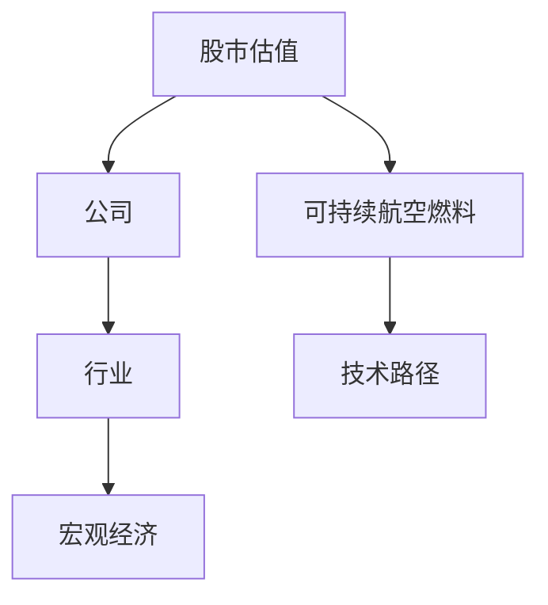

                 

# 《全球股市估值与可持续航空燃料的关系》

## 关键词：全球股市估值，可持续航空燃料，宏观经济，投资者情绪，能源转型

## 摘要：  
本文探讨了全球股市估值与可持续航空燃料之间的关系，分析了宏观经济、行业趋势和投资者情绪对股市估值的影响，特别是能源转型对航空燃料市场的影响。通过建立数学模型和系统架构，本文揭示了可持续航空燃料如何通过影响航空公司的运营成本和投资者偏好，进而影响股市估值。文章还结合实际案例，展示了如何通过系统设计和数据分析，量化这些影响，并提出了优化建议。

---

# 第1章: 全球股市估值与可持续航空燃料的关系概述

## 1.1 问题背景介绍

### 1.1.1 全球股市估值的核心概念
- 股市估值是衡量市场整体价值的指标，受宏观经济、行业趋势和公司基本面影响。
- 影响股市估值的主要因素包括GDP增长率、利率政策、通货膨胀率、行业发展趋势等。

### 1.1.2 可持续航空燃料的定义与特点
- 可持续航空燃料（SAF）是一种由生物基原料制成的低排放燃料，符合国际民航组织的可持续性标准。
- SAF的技术路径包括酯交换法、费托合成法等，具有环境效益，减少碳排放。

### 1.1.3 问题的提出与研究意义
- 随着全球能源转型，SAF的推广可能影响航空公司的运营成本，进而影响股价。
- 研究SAF对股市估值的影响，有助于投资者更好地理解市场动态，优化投资决策。

## 1.2 核心概念与联系

### 1.2.1 核心概念原理
- 股市估值基于公司的盈利能力和成长潜力。
- SAF的成本和供应稳定性影响航空公司的运营成本和利润。

### 1.2.2 概念属性特征对比表格
| 概念 | 属性 | 特征 |
|------|------|------|
| 股市估值 | 影响因素 | 宏观经济、行业趋势、公司基本面 |
| 可持续航空燃料 | 技术路径 | 生物基原料、化学转化、合成燃料 |

### 1.2.3 ER实体关系图

## 1.3 本章小结
- 本章介绍了全球股市估值与可持续航空燃料的基本概念。
- 描述了两者之间的潜在关系，为后续分析奠定了基础。

---

# 第2章: 全球股市估值的影响因素分析

## 2.1 宏观经济因素

### 2.1.1 经济周期对股市估值的影响
- 经济周期的定义：分为复苏、繁荣、衰退和萧条阶段。
- 不同阶段对股市估值的影响：繁荣期股市估值高，衰退期估值低。
- 历史案例：2008年金融危机后，股市估值大幅下降。

### 2.1.2 利率政策对股市估值的影响
- 利率政策的定义：央行调整基准利率以影响市场资金流动性。
- 利率变化对股市估值的影响机制：低利率环境下，投资者转向股票市场寻求高收益。
- 历史案例：美联储降息周期中，股市估值显著上升。

## 2.2 行业趋势对股市估值的影响

### 2.2.1 能源行业转型对股市估值的影响
- 能源行业转型的定义：从化石燃料转向可再生能源。
- 能源转型对股市估值的影响路径：传统能源公司估值下降，新能源公司估值上升。
- 历史案例：石油公司股价在能源转型政策出台后下跌。

### 2.2.2 可持续发展对股市估值的影响
- 可持续发展理念的定义：追求经济、社会和环境的协调发展。
- 可持续发展对股市估值的影响机制：投资者更倾向于投资符合可持续发展理念的公司。
- 历史案例：特斯拉因环保形象提升，股价大幅上涨。

## 2.3 投资者情绪对股市估值的影响

### 2.3.1 投资者情绪的定义
- 投资者情绪：投资者对市场前景的心理预期，影响交易决策。
- 投资者情绪的分类：乐观、悲观、中立。
- 投资者情绪的影响机制：情绪波动引发市场短期波动。

### 2.3.2 投资者情绪与股市估值的关系
- 投资者情绪与股市估值的关系：情绪高涨时，估值上升；情绪低落时，估值下降。
- 投资者情绪对股市估值的短期影响：市场波动加剧。
- 投资者情绪对股市估值的长期影响：理性决策主导长期趋势。

---

## 2.4 本章小结
- 本章分析了宏观经济、行业趋势和投资者情绪对股市估值的影响。
- 强调了能源转型和可持续发展理念对股市估值的长期影响。

---

接下来将详细分析可持续航空燃料对股市估值的具体影响，包括技术路径、成本结构和市场动态等方面。通过建立数学模型和系统架构，量化SAF对股市估值的影响，并结合实际案例进行验证。

