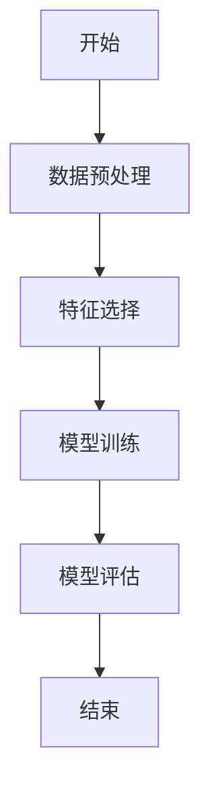

                 


# 全球股市估值与可持续航空生物燃料标准化的关系

## 关键词
全球股市估值, 可持续航空生物燃料, 标准化, 金融建模, 时间序列分析, 系统架构设计

## 摘要
本文探讨了全球股市估值与可持续航空生物燃料标准化之间的关系，通过分析标准化对市场信任的影响，构建数学模型预测股市估值变化，并设计了完整的系统架构。结合Python代码实现和实际案例分析，为绿色能源投资提供了理论依据和实践指导。

---

# 第一部分: 背景与概念

## 第1章: 问题背景与描述

### 1.1 问题背景
#### 1.1.1 可持续发展与全球能源转型
全球能源结构正向绿色低碳转型，航空业作为碳排放大户，对环境影响显著，推动使用可持续航空生物燃料（SAF）。

#### 1.1.2 全球股市估值的重要性
股市估值反映市场对企业的信心和价值判断，绿色能源政策影响投资者决策。

#### 1.1.3 可持续航空生物燃料的定义与作用
SAF由可再生资源制成，减少碳排放，替代传统航空燃料，推动航空业可持续发展。

### 1.2 问题描述
#### 1.2.1 航空业对环境的影响
航空运输占全球碳排放约2.5%，传统燃料不可再生，加剧气候变化。

#### 1.2.2 生物燃料在航空业中的应用现状
生物燃料认证标准不统一，影响市场信任和大规模应用。

#### 1.2.3 全球股市估值与能源政策的关系
能源政策影响行业前景，股市估值随政策变化波动，绿色能源政策提振股市信心。

### 1.3 问题解决
#### 1.3.1 可持续航空生物燃料的标准化需求
统一标准确保产品质量，降低投资风险，提升市场信任。

#### 1.3.2 全球股市对绿色能源投资的驱动作用
投资者偏好绿色企业，推动股市估值上升，促进企业转型。

#### 1.3.3 标准化对市场信任的影响
统一标准降低信息不对称，提升市场透明度，增强投资者信心。

## 第2章: 核心概念与联系

### 2.1 核心概念原理
#### 2.1.1 全球股市估值的计算方法
基于市场供需、企业盈利、宏观经济指标等因素，通过市值计算企业价值。

#### 2.1.2 可持续航空生物燃料的生产与认证标准
需符合ISO/IEC 60793等标准，确保环保效益和安全性能。

#### 2.1.3 标准化对市场信任的影响
统一标准提升产品一致性，降低交易成本，增强市场稳定性。

### 2.2 概念属性特征对比
#### 表2-1: 全球股市估值与可持续航空生物燃料标准化的属性对比

| 属性       | 全球股市估值                   | 可持续航空生物燃料标准化       |
|------------|-------------------------------|----------------------------------|
| 本质       | 市场对企业的价值判断           | 产品和技术规范要求               |
| 影响因素   | 宏观经济、企业盈利、政策       | 生产工艺、环保指标、认证标准     |
| 作用       | 引导投资、反映市场预期         | 保证产品质量、促进市场信任       |
| 时间因素   | 短期波动与长期趋势             | 长期稳定与政策支持               |

### 2.3 ER实体关系图
```mermaid
er
actor: 投资者
actor: 政府监管机构
actor: 航空公司
actor: 生物燃料生产商
actor: 股市交易所
```

---

# 第二部分: 标准化与股市估值的数学模型与算法

## 第3章: 标准化对股市估值的影响模型

### 3.1 模型构建
#### 3.1.1 数据收集与特征选择
收集全球股市数据、生物燃料相关政策、企业财报等，提取标准化程度、时间因素等变量。

#### 3.1.2 模型假设与变量定义
假设市场对标准化的认知会影响估值，引入虚拟变量表示标准化进展。

### 3.2 算法原理


### 3.3 数学模型与公式
#### 公式3-1: 估值影响模型
$$ V = \beta_0 + \beta_1 S + \beta_2 T + \epsilon $$
其中，$V$ 表示股市估值，$S$ 表示标准化程度，$T$ 表示时间因素。

---

## 第4章: 基于时间序列的预测算法

### 4.1 时间序列分析
#### 4.1.1 ARIMA模型的原理与应用
ARIMA模型适合分析时间序列数据，用于预测未来估值。

#### 4.1.2 长短期记忆网络（LSTM）的预测优势
LSTM擅长捕捉长期依赖关系，适用于复杂的时间序列预测。

### 4.2 Python实现
```python
from statsmodels.tsa.arima_model import ARIMA
import numpy as np

# 示例数据
data = np.array([100, 105, 110, 115, 120])

# 模型训练
model = ARIMA(data, order=(1, 1, 1))
model_fit = model.fit()

# 预测
forecast = model_fit.forecast(steps=5)
print(forecast)
```

---

# 第三部分: 系统分析与架构设计

## 第5章: 问题场景介绍

### 5.1 系统功能设计
#### 5.1.1 数据采集模块
收集全球股市数据、生物燃料政策和企业信息。

#### 5.1.2 数据分析模块
应用统计分析和机器学习算法，评估标准化对估值的影响。

#### 5.1.3 数据可视化模块
展示分析结果，辅助决策。

### 5.2 系统架构设计


---

## 第6章: 项目实战

### 6.1 环境安装
安装Python、NumPy、Pandas、Matplotlib、Statsmodels等库。

### 6.2 核心代码实现
```python
import pandas as pd
import matplotlib.pyplot as plt
from statsmodels.tsa.arima_model import ARIMA

# 数据加载与预处理
data = pd.read_csv('stock_data.csv')
data['date'] = pd.to_datetime(data['date'])
data.set_index('date', inplace=True)

# 模型训练与预测
model = ARIMA(data['value'], order=(1, 1, 1))
model_fit = model.fit()

# 可视化
plt.figure(figsize=(10, 6))
plt.plot(data.index[:100], data['value'][:100], label='实际值')
plt.plot(data.index[90:], model_fit.forecast(steps=10), label='预测值')
plt.xlabel('时间')
plt.ylabel('估值')
plt.legend()
plt.show()
```

### 6.3 实际案例分析
分析某航空公司的股价变化，验证模型预测效果，评估标准化对其估值的影响。

### 6.4 项目小结
标准化显著提升市场信任，推动股市估值上升，企业应积极拥抱绿色转型。

---

# 第四部分: 最佳实践与小结

## 第7章: 最佳实践

### 7.1 小结
标准化是连接绿色能源与资本市场的桥梁，提升市场透明度和信任度。

### 7.2 注意事项
确保数据质量和模型准确性，定期更新模型参数，关注政策变化。

### 7.3 拓展阅读
推荐相关书籍和论文，深入学习绿色金融与可持续发展。

---

通过以上章节的系统分析与实践，本文为理解全球股市估值与可持续航空生物燃料标准化的关系提供了全面的视角和实用的方法。

