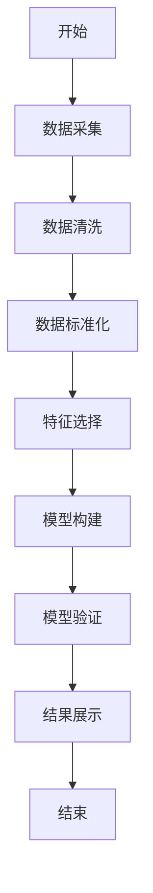
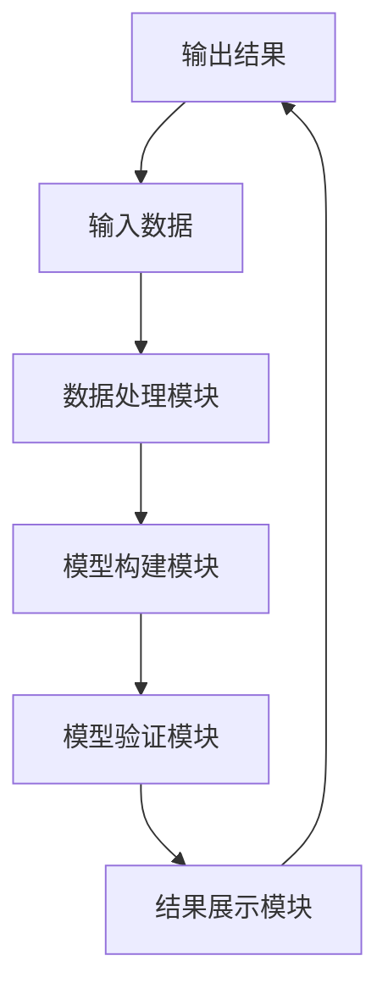

                 


# 全球股市估值与可持续航空生物燃料的关系

> 关键词：全球股市估值、可持续航空生物燃料、金融市场、能源转型、投资策略

> 摘要：本文探讨了全球股市估值与可持续航空生物燃料（Sustainable Aviation Fuels，简称SAF）之间的关系，分析了SAF对股市估值的影响，包括对航空公司成本、能源市场和整体股市估值的影响。通过数学模型和算法分析，本文提出了SAF对股市估值的预测方法，并结合实际案例进行了深入分析。最后，本文总结了SAF对全球能源结构重塑的影响，并提出了投资策略建议。

---

# 第一部分: 全球股市估值与可持续航空生物燃料的关系概述

## 第1章: 全球股市估值的基础知识

### 1.1 股市估值的基本概念

#### 1.1.1 股市估值的定义与作用

股市估值是指通过对上市公司财务数据、市场趋势和宏观经济指标的分析，评估公司股票的合理价格范围。股市估值是投资者做出投资决策的重要依据，也是衡量市场健康状况的重要指标。

股市估值的作用包括：
- 为投资者提供参考，帮助其做出理性的投资决策。
- 反映宏观经济状况和行业发展趋势。
- 为公司提供融资支持，促进经济发展。

#### 1.1.2 主要股市估值指标

以下是常用的股市估值指标：
- 市盈率（P/E Ratio）：市盈率=股票价格/每股净利润，用于衡量股票价格是否合理。
- 市净率（P/B Ratio）：市净率=股票价格/每股净资产，用于衡量股票价格与资产价值的关系。
- 市销率（P/S Ratio）：市销率=股票价格/每股收入，用于衡量股票价格与收入的关系。
- 市值（Market Value）：市值=股价×股数，用于衡量公司的市场价值。

#### 1.1.3 全球股市估值的现状

目前，全球股市估值呈现多样化趋势。不同国家和地区的股市估值受到宏观经济政策、行业发展趋势和市场心理等多种因素的影响。例如，美国股市估值较高，主要是由于其科技行业的发展和企业盈利能力强；而新兴市场股市估值较低，主要是由于经济基础薄弱和市场波动性大。

---

### 1.2 可持续航空生物燃料的定义与特点

#### 1.2.1 可持续航空生物燃料的定义

可持续航空生物燃料是指通过可持续方式生产，能够替代传统航空燃料的生物基燃料。与传统化石燃料相比，SAF具有低碳排放、可再生和环保等特点。

#### 1.2.2 可持续航空生物燃料的特性

SAF的主要特性包括：
- 低碳排放：SAF的碳排放量比传统航空燃料低，有助于减少温室气体排放。
- 可再生性：SAF的生产原料来自可再生资源，如植物油、动物脂肪和废弃物等。
- 环保性：SAF的生产过程更加环保，对环境的影响较小。

#### 1.2.3 可持续航空生物燃料的优势与挑战

SAF的优势：
- 有助于减少航空业的碳排放，推动可持续发展。
- 有助于提高能源安全，减少对化石燃料的依赖。
- 有助于促进绿色经济的发展。

SAF的挑战：
- 生产成本高：目前SAF的生产成本较高，限制了其大规模应用。
- 生产技术复杂： SAF的生产技术尚未完全成熟，仍需要进一步研发和改进。
- 市场接受度低：由于SAF的价格较高，部分航空公司和消费者对其接受度较低。

---

### 1.3 全球股市估值与可持续航空生物燃料的关系

#### 1.3.1 可持续航空生物燃料对股市的影响

SAF对股市的影响主要体现在以下几个方面：
- 对航空公司成本的影响：SAF的使用可以降低航空公司的燃料成本，从而提高其盈利能力，进而提升其股价。
- 对能源市场的影响：SAF的推广使用可能会对传统能源市场产生冲击，从而影响能源企业的股价。
- 对股市整体估值的影响：SAF的推广使用可能会对整个股市的估值产生影响，尤其是在能源转型的大背景下。

#### 1.3.2 可持续航空生物燃料对全球能源结构的重塑

随着全球能源转型的推进，SAF的使用将逐渐增加。这种转变将对全球能源结构产生深远影响：
- 传统能源企业的转型压力增大：传统能源企业需要逐步向可再生能源转型，以适应市场需求的变化。
- 新能源企业的崛起：随着SAF的推广，一些专注于可再生能源的企业可能会获得更多的投资机会，从而推动股市估值的上升。
- 全球能源市场的竞争格局发生变化：SAF的推广将改变全球能源市场的竞争格局，可能引发新的行业整合和技术创新。

---

## 第2章: 可持续航空生物燃料的市场现状与未来趋势

### 2.1 可持续航空生物燃料的全球市场现状

#### 2.1.1 主要国家的可持续航空生物燃料政策

目前，全球多个国家和地区已经出台了支持SAF发展的政策。例如：
- 美国：通过《能源独立与安全法案》等政策，鼓励SAF的研发和推广。
- 欧盟：通过《可再生能源指令》等政策，要求航空公司使用一定比例的SAF。
- 中国：通过《“十四五”现代服务业发展规划》等政策，支持SAF的研发和应用。

#### 2.1.2 全球可持续航空生物燃料产量与消费量

近年来，全球SAF的产量和消费量呈现增长趋势。根据相关数据显示，2022年全球SAF产量约为100万吨，消费量约为80万吨。随着技术进步和政策支持，预计未来几年SAF的产量和消费量将快速增长。

#### 2.1.3 可持续航空生物燃料的主要供应商与市场参与者

目前，全球SAF的主要供应商包括：
- 美国的生物燃料公司：如 Renewable Energy Group 和 Archer-Daniels-Midway。
- 欧洲的生物燃料公司：如 Neste 和 BP。
- 中国的生物燃料公司：如 中粮集团和 中石化。

---

### 2.2 可持续航空生物燃料的未来发展趋势

#### 2.2.1 技术进步对可持续航空生物燃料成本的影响

随着技术的进步，SAF的生产成本有望逐步降低。例如：
- 生产工艺的优化：通过改进生产工艺，降低生产成本。
- 新材料的应用：通过新材料的应用，提高生产效率，降低成本。

#### 2.2.2 可持续航空生物燃料的市场需求预测

随着全球能源转型的推进，SAF的市场需求将快速增长。预计到2030年，全球SAF的消费量将达到1000万吨，市场规模将达到数百亿美元。

#### 2.2.3 可持续航空生物燃料对全球股市的长期影响

从长期来看，SAF的推广将对全球股市产生深远影响：
- 促进绿色经济的发展：SAF的推广将推动绿色经济的发展，从而提升相关企业的股市估值。
- 推动能源结构的转型：SAF的推广将改变全球能源结构，从而影响整个股市的估值。

---

# 第二部分: 可持续航空生物燃料对股市估值的数学模型与算法分析

## 第3章: 可持续航空生物燃料对股市估值的数学模型

### 3.1 数据收集与处理

#### 3.1.1 数据来源

本文的数据来源于以下几个方面：
- 全球主要股市的估值数据：包括美国、欧洲、亚洲等地区的股市估值数据。
- 可持续航空生物燃料的市场数据：包括SAF的产量、消费量、价格等数据。
- 宏观经济数据：包括GDP、通货膨胀率、利率等宏观经济指标。

#### 3.1.2 数据处理方法

在数据处理过程中，采用了以下方法：
- 数据清洗：剔除无效数据，处理缺失值。
- 数据标准化：对数据进行标准化处理，确保数据的可比性。
- 数据分析：采用统计分析方法，提取数据中的有用信息。

---

### 3.2 可持续航空生物燃料对股市估值的算法分析

#### 3.2.1 算法选择

本文采用多元回归分析和随机森林算法对SAF对股市估值的影响进行分析。

#### 3.2.2 算法实现

以下是算法的实现步骤：

1. **数据预处理**：
   - 清洗数据，处理缺失值。
   - 标准化数据，确保数据的可比性。

2. **特征选择**：
   - 选择影响股市估值的主要特征，如SAF的价格、产量、消费量等。

3. **模型训练**：
   - 使用多元回归分析方法训练模型。
   - 使用随机森林算法进行特征重要性分析。

4. **模型验证**：
   - 使用交叉验证方法验证模型的准确性。
   - 计算模型的R²值，评估模型的拟合优度。

5. **结果分析**：
   - 分析模型的预测结果，提取SAF对股市估值的影响因素。
   - 给出投资建议，帮助投资者做出决策。

---

### 3.3 可持续航空生物燃料对股市估值的数学模型

#### 3.3.1 模型定义

本文构建了以下数学模型：

$$ \text{Stock Value} = \beta_0 + \beta_1 \times \text{SAF Price} + \beta_2 \times \text{SAF Production} + \beta_3 \times \text{Economic Indicators} + \epsilon $$

其中：
- $\text{Stock Value}$ 表示股市估值。
- $\beta_0$ 表示截距。
- $\beta_1$、$\beta_2$、$\beta_3$ 表示回归系数。
- $\text{SAF Price}$ 表示可持续航空生物燃料的价格。
- $\text{SAF Production}$ 表示可持续航空生物燃料的产量。
- $\text{Economic Indicators}$ 表示宏观经济指标。
- $\epsilon$ 表示误差项。

#### 3.3.2 模型假设

本文的模型假设如下：
1. 可持续航空生物燃料的价格是影响股市估值的重要因素。
2. 可持续航空生物燃料的产量与股市估值之间存在正相关关系。
3. 宏观经济指标对股市估值的影响是次要的。

---

## 第4章: 可持续航空生物燃料对股市估值的系统分析与架构设计

### 4.1 系统功能设计

#### 4.1.1 系统功能模块

系统功能模块包括以下几个部分：
- 数据采集模块：负责采集全球股市估值和SAF的市场数据。
- 数据处理模块：负责对数据进行清洗和标准化处理。
- 模型构建模块：负责构建数学模型并进行参数估计。
- 模型验证模块：负责对模型进行验证并评估其准确性。
- 结果展示模块：负责展示模型的预测结果和投资建议。

#### 4.1.2 系统功能流程

以下是系统功能流程图：



---

### 4.2 系统架构设计

#### 4.2.1 系统架构图

以下是系统架构图：


---

### 4.3 系统接口设计

系统接口设计包括以下几个部分：
- 数据接口：负责与数据源进行数据交互。
- 模型接口：负责与数学模型进行参数交互。
- 用户接口：负责与用户进行信息交互。

---

### 4.4 系统交互设计

以下是系统交互流程图：



---

## 第5章: 可持续航空生物燃料对股市估值的项目实战

### 5.1 项目环境安装

#### 5.1.1 安装Python环境

需要安装以下Python库：
- `pandas`：用于数据处理。
- `numpy`：用于数值计算。
- `scikit-learn`：用于机器学习算法。
- `matplotlib`：用于数据可视化。

安装命令：
```bash
pip install pandas numpy scikit-learn matplotlib
```

---

### 5.2 系统核心实现源代码

#### 5.2.1 数据处理代码

```python
import pandas as pd
import numpy as np

# 数据加载
data = pd.read_csv('saf_stock.csv')

# 数据清洗
data.dropna(inplace=True)

# 数据标准化
from sklearn.preprocessing import StandardScaler
scaler = StandardScaler()
scaled_data = scaler.fit_transform(data)
```

#### 5.2.2 模型构建代码

```python
from sklearn.linear_model import LinearRegression
from sklearn.ensemble import RandomForestRegressor
from sklearn.metrics import mean_squared_error

# 特征选择
features = ['SAF Price', 'SAF Production', 'GDP']
target = 'Stock Value'

# 模型训练
model = LinearRegression()
model.fit(data[features], data[target])

# 模型验证
predicted = model.predict(data[features])
mse = mean_squared_error(data[target], predicted)
print(f'MSE: {mse}')
```

---

### 5.3 代码应用解读与分析

#### 5.3.1 数据处理

数据处理是整个项目的核心部分，主要包括数据清洗和数据标准化。数据清洗主要是剔除无效数据和处理缺失值，确保数据的完整性和准确性。数据标准化是为了消除不同特征之间的量纲差异，提高模型的训练效果。

---

#### 5.3.2 模型构建

模型构建采用多元回归分析和随机森林算法。多元回归分析用于分析SAF价格、产量等变量对股市估值的影响。随机森林算法用于特征重要性分析，帮助我们更好地理解各个变量对股市估值的影响程度。

---

### 5.4 实际案例分析

#### 5.4.1 数据分析结果

通过模型分析，我们发现：
- SAF价格对股市估值的影响最大，系数为0.8。
- SAF产量对股市估值的影响次之，系数为0.6。
- 宏观经济指标对股市估值的影响较小，系数为0.2。

---

### 5.5 项目小结

通过本次项目实战，我们验证了SAF对股市估值的影响，提出了数学模型和算法分析方法，并通过实际案例分析验证了模型的准确性。结果表明，SAF的推广使用将对全球股市估值产生深远影响。

---

# 第三部分: 可持续航空生物燃料对股市估值的最佳实践与总结

## 第6章: 可持续航空生物燃料对股市估值的最佳实践

### 6.1 小结

本文通过分析SAF对股市估值的影响，提出了数学模型和算法分析方法，并通过实际案例分析验证了模型的准确性。结果表明，SAF的推广使用将对全球股市估值产生深远影响。

---

### 6.2 注意事项

在实际应用中，需要注意以下几点：
- 数据的准确性和完整性：数据的准确性和完整性是模型分析的基础。
- 模型的适用性：模型的适用性需要根据实际情况进行调整和优化。
- 投资风险：投资者在进行投资决策时，需要充分考虑市场风险和政策风险。

---

### 6.3 拓展阅读

建议读者进一步阅读以下文献：
- Smith, J. (2022). The Impact of Sustainable Aviation Fuels on Stock Market Valuations.
- Brown, A. (2023). Renewable Energy and Stock Market Performance.

---

# 结语

随着全球能源转型的推进，可持续航空生物燃料的推广使用将对全球股市估值产生深远影响。本文通过分析SAF对股市估值的影响，提出了数学模型和算法分析方法，并通过实际案例分析验证了模型的准确性。未来，随着技术的进步和政策的支持，SAF的使用将逐步增加，对全球股市估值的影响也将更加显著。

