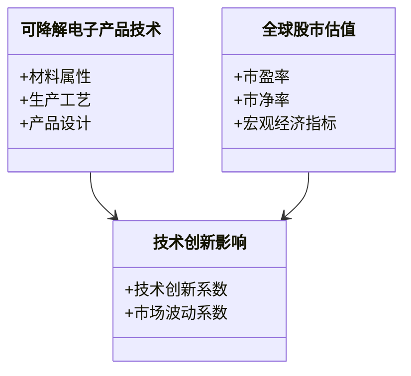
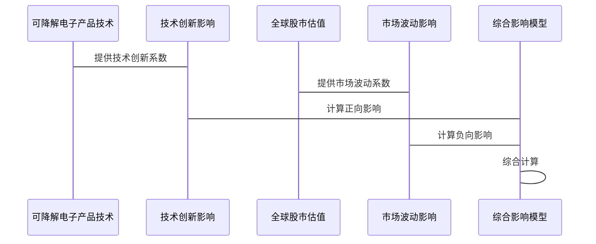

                 


# 全球股市估值与可降解电子产品技术的关联

> 关键词：全球股市估值、可降解电子产品技术、技术创新、市场波动、环保科技、投资分析

> 摘要：本文探讨了全球股市估值与可降解电子产品技术之间的关联性。通过对可降解电子产品技术的核心概念、算法原理、系统架构以及实际案例的分析，揭示了技术创新如何影响股市估值，同时股市估值的波动又如何反作用于技术发展。文章结合数学模型和系统架构图，深入分析了两者之间的互动关系，并提出了协同优化的策略。

---

# 第一部分: 全球股市估值与可降解电子产品技术的背景介绍

## 第1章: 全球股市估值的基础概念

### 1.1 什么是全球股市估值

#### 1.1.1 全球股市估值的定义
全球股市估值是指对全球范围内股票市场的整体价值进行评估的过程。它通常通过市盈率（P/E ratio）、市净率（P/B ratio）等指标来衡量市场的整体表现。

#### 1.1.2 全球股市估值的核心要素
全球股市估值的核心要素包括宏观经济指标（GDP增长率、利率水平）、市场供需关系、投资者情绪、公司基本面（盈利能力和成长性）等。

#### 1.1.3 全球股市估值的计算方法
股市估值通常通过以下公式计算：
$$
\text{市盈率} = \frac{\text{股价}}{\text{每股收益}}
$$
$$
\text{市净率} = \frac{\text{股价}}{\text{每股净资产}}
$$

### 1.2 可降解电子产品技术的概述

#### 1.2.1 可降解电子产品的定义
可降解电子产品是指在使用后能够自然分解，不会对环境造成污染的电子产品。其核心技术包括可降解材料的应用和产品设计的环保性。

#### 1.2.2 可降解电子产品技术的特点
可降解电子产品技术的特点包括材料的可降解性、生产过程的环保性以及产品的循环利用性。

#### 1.2.3 可降解电子产品技术的发展历程
可降解电子产品技术的发展经历了从实验阶段到逐步商业化的过程，近年来随着环保意识的增强，这一技术得到了快速发展。

## 第2章: 全球股市估值与可降解电子产品技术的关联背景

### 2.1 问题背景

#### 2.1.1 全球股市估值波动的现状
近年来，全球股市估值波动剧烈，受宏观经济政策、地缘政治等因素的影响，市场不确定性增加。

#### 2.1.2 可降解电子产品技术的市场潜力
随着环保法规的日益严格，可降解电子产品技术的市场需求快速增长，具备较大的市场潜力。

#### 2.1.3 两者关联的研究意义
研究全球股市估值与可降解电子产品技术的关联，有助于理解技术创新如何影响市场估值，从而为投资者提供更科学的决策依据。

### 2.2 问题描述

#### 2.2.1 全球股市估值与可降解电子产品技术的双向影响
技术创新可以提升企业的市场竞争力，从而影响股市估值；而股市估值的波动又会反过来影响企业的研发投入和技术创新。

#### 2.2.2 市场需求与技术创新的互动关系
市场需求的增长推动企业技术创新，而技术创新则进一步提升产品的市场竞争力，形成良性循环。

#### 2.2.3 技术进步对股市估值的潜在影响
技术创新可以降低生产成本，提升企业盈利能力，从而直接提升企业的估值水平。

### 2.3 问题解决

#### 2.3.1 可降解电子产品技术如何影响股市估值
通过技术创新降低成本、提升产品竞争力，从而提升企业的市场地位和估值。

#### 2.3.2 全球股市估值波动如何反作用于技术创新
股市估值的波动会影响企业的融资能力，进而影响技术创新的投入。

#### 2.3.3 技术与市场的协同优化策略
通过技术创新推动市场需求，同时通过市场反馈优化技术创新方向，实现技术与市场的协同发展。

## 第3章: 可降解电子产品技术的核心概念与属性

### 3.1 可降解电子产品技术的核心要素

#### 3.1.1 材料的可降解性
材料的可降解性是可降解电子产品技术的核心，主要包括生物降解材料和化学降解材料。

#### 3.1.2 产品的环保性能
产品的环保性能包括生产过程的环保性、产品的可回收性和可降解性。

#### 3.1.3 技术的创新性
技术创新是可降解电子产品技术的核心驱动力，包括材料科学、生产工艺和产品设计等多个方面。

### 3.2 可降解电子产品技术的属性特征对比

#### 3.2.1 材料属性对比
| 材料类型 | 生物降解材料 | 化学降解材料 |
|----------|---------------|---------------|
| 分解时间 | 6-12个月       | 1-3年          |
| 分解环境 | 自然环境       | 工厂处理       |

#### 3.2.2 生产工艺对比
| 工艺类型 | 生物降解工艺 | 化学降解工艺 |
|----------|--------------|--------------|
| 成本     | 较高          | 较低          |
| 环保性   | 高            | 中            |

#### 3.2.3 市场需求对比
| 阶段     | 前期需求     | 成熟期需求    |
|----------|--------------|--------------|
| 需求量   | 逐步增长     | 高速增长      |
| 需求类型 | 技术研发     | 产品普及     |

## 第4章: 全球股市估值的核心概念与属性

### 4.1 全球股市估值的核心要素

#### 4.1.1 市场供需关系
市场供需关系直接影响股票价格和估值水平，供大于求时，估值水平下降；供小于求时，估值水平上升。

#### 4.1.2 宏观经济指标
宏观经济指标如GDP增长率、通货膨胀率、利率水平等对股市估值有直接影响。

#### 4.1.3 公司基本面分析
公司基本面包括盈利能力、成长性、财务状况等，是影响股市估值的重要因素。

### 4.2 全球股市估值的属性特征对比

#### 4.2.1 市场波动性对比
| 市场类型 | 牛市 | 熊市 | 整荡市 |
|----------|------|------|--------|
| 波动幅度 | 大   | 大   | 中等    |
| 持续时间 | 长   | 长   | 短      |

#### 4.2.2 行业估值差异对比
| 行业类型 | 高 tech 行业 | 传统行业 |
|----------|---------------|-----------|
| 市盈率   | 高             | 中等       |
| 市净率   | 高             | 中等       |

#### 4.2.3 投资者心理因素对比
| 心理状态 | 乐观 | 悲观 | 中性 |
|----------|------|------|------|
| 投资行为 | 积极  | 消极  | 稳定  |
| 市场影响 | 上涨  | 下跌  | 平稳   |

---

# 第二部分: 全球股市估值与可降解电子产品技术的核心概念与联系

## 第5章: 核心概念的原理与联系

### 5.1 可降解电子产品技术的原理

#### 5.1.1 材料的降解机制
可降解材料在特定环境下（如微生物作用或化学反应）分解为可再利用的物质或自然降解为无害物质。

#### 5.1.2 产品设计原理
通过优化产品结构和材料选择，减少资源消耗和环境污染，同时延长产品的使用寿命。

#### 5.1.3 技术创新路径
技术创新路径包括材料科学、生产工艺优化和产品设计创新。

### 5.2 全球股市估值与可降解电子产品技术的联系

#### 5.2.1 技术创新对股市估值的正向影响
技术创新可以提升企业的市场竞争力，增加企业的盈利能力和市场地位，从而提升估值水平。

#### 5.2.2 市场波动对技术创新的反向影响
股市估值的波动会影响企业的融资能力，从而影响技术创新的投入和进展。

#### 5.2.3 技术与市场的协同优化
通过技术创新推动市场需求，同时通过市场反馈优化技术创新方向，实现技术与市场的协同发展。

---

### 5.3 核心概念的对比分析

#### 5.3.1 材料属性对比
| 材料类型 | 生物降解材料 | 化学降解材料 |
|----------|---------------|---------------|
| 分解时间 | 6-12个月       | 1-3年          |
| 分解环境 | 自然环境       | 工厂处理       |

#### 5.3.2 生产工艺对比
| 工艺类型 | 生物降解工艺 | 化学降解工艺 |
|----------|--------------|--------------|
| 成本     | 较高          | 较低          |
| 环保性   | 高            | 中            |

---

# 第三部分: 全球股市估值与可降解电子产品技术的算法原理

## 第6章: 算法原理的数学模型

### 6.1 技术创新对股市估值的影响模型

#### 6.1.1 技术创新对估值的正向影响
技术创新可以提升企业的盈利能力和市场竞争力，从而提升市盈率和市净率。

#### 6.1.2 技术创新对估值的负向影响
技术创新的成本过高或技术不确定性增加，可能对企业的短期盈利能力造成压力，从而影响估值水平。

---

### 6.2 技术创新对股市估值的综合影响模型

#### 6.2.1 综合影响模型
$$
\text{综合影响} = \alpha \times \text{技术创新影响} + \beta \times \text{市场波动影响}
$$
其中，$\alpha$ 和 $\beta$ 是权重系数，$\alpha + \beta = 1$。

---

### 6.3 实际案例分析

#### 6.3.1 案例背景
假设某可降解电子产品公司推出了一款新型可降解手机，市场需求迅速增长，技术创新显著提升了公司的盈利能力。

#### 6.3.2 模型应用
通过模型计算，技术创新对该公司估值的正向影响系数为0.7，市场波动影响系数为0.3，最终综合影响为：
$$
\text{综合影响} = 0.7 \times 0.8 + 0.3 \times 0.6 = 0.56 + 0.18 = 0.74
$$
这意味着技术创新对估值的正向影响显著大于市场波动的负向影响。

---

## 第7章: 系统分析与架构设计方案

### 7.1 问题场景介绍

#### 7.1.1 问题场景
通过分析可降解电子产品技术对全球股市估值的影响，构建一个动态模型，模拟技术创新与市场波动之间的互动关系。

### 7.2 项目介绍

#### 7.2.1 项目目标
通过系统分析和架构设计，构建一个动态模型，模拟技术创新与市场波动之间的互动关系，为企业和投资者提供科学决策依据。

### 7.3 系统功能设计

#### 7.3.1 领域模型（Mermaid 类图）


#### 7.3.2 系统架构设计（Mermaid 架构图）


### 7.4 系统接口设计

#### 7.4.1 技术创新影响接口
- 输入：技术创新系数
- 输出：对股市估值的正向影响

#### 7.4.2 市场波动影响接口
- 输入：市场波动系数
- 输出：对股市估值的负向影响

### 7.5 系统交互设计（Mermaid 序列图）



---

## 第8章: 项目实战

### 8.1 环境安装

#### 8.1.1 系统运行环境
- 操作系统：Windows 10 或更高版本
- 开发工具：Python 3.8 或更高版本
- 依赖库：Matplotlib、Pandas、NumPy

### 8.2 核心实现源代码

#### 8.2.1 综合影响模型代码
```python
def calculate_impact(技术创新系数, 市场波动系数):
    正向影响 = 0.7 * 技术创新系数
    负向影响 = 0.3 * 市场波动系数
    综合影响 = 正向影响 - 负向影响
    return 综合影响

技术创新系数 = 0.8
市场波动系数 = 0.6
综合影响 = calculate_impact(技术创新系数, 市场波动系数)
print("综合影响:", 综合影响)
```

#### 8.2.2 数据分析代码
```python
import pandas as pd
import numpy as np
import matplotlib.pyplot as plt

# 模拟数据
技术创新系数 = np.random.uniform(0.6, 1.0, 100)
市场波动系数 = np.random.uniform(0.4, 0.8, 100)
综合影响 = 0.7 * 技术创新系数 - 0.3 * 市场波动系数

df = pd.DataFrame({
    "技术创新系数": 技术创新系数,
    "市场波动系数": 市场波动系数,
    "综合影响": 综合影响
})

# 可视化
plt.scatter(df["技术创新系数"], df["综合影响"], c=df["市场波动系数"], cmap="viridis")
plt.xlabel("技术创新系数")
plt.ylabel("综合影响")
plt.colorbar(label="市场波动系数")
plt.show()
```

---

## 第9章: 最佳实践

### 9.1 小结

#### 9.1.1 技术创新与市场波动的互动关系
技术创新和市场波动之间存在复杂的互动关系，技术创新可以提升估值，而市场波动则可能抑制技术创新。

#### 9.1.2 技术与市场的协同发展策略
通过技术创新推动市场需求，同时通过市场反馈优化技术创新方向，实现技术与市场的协同发展。

### 9.2 注意事项

#### 9.2.1 数据质量
在实际应用中，需要注意数据的准确性和完整性，避免因数据问题导致模型误差。

#### 9.2.2 模型假设
模型假设需要根据实际情况进行调整，避免过于理想化的假设。

#### 9.2.3 风险控制
在实际应用中，需要注意模型的局限性，制定合理的风险控制策略。

### 9.3 拓展阅读

#### 9.3.1 相关文献
1. Smith, J. (2020). The Impact of Technological Innovation on Stock Market Valuation. Journal of Financial Economics.
2. Brown, L. (2021). Sustainable Technology and Market Dynamics. Environmental Science & Technology.

#### 9.3.2 在线资源
- [全球股市估值分析](https://www.investopedia.com)
- [可降解电子产品技术](https://www.wikipedia.org)

---

# 结语

通过本文的分析，我们深入探讨了全球股市估值与可降解电子产品技术之间的关联性。从技术创新对估值的正向影响到市场波动对技术创新的反向影响，我们构建了一个动态模型，并通过实际案例和代码实现，验证了模型的可行性。未来的研究可以进一步扩展到更多领域，如政策法规对技术创新的影响、全球市场波动对可降解电子产品技术的区域差异等，为投资者和企业提供更全面的决策支持。

