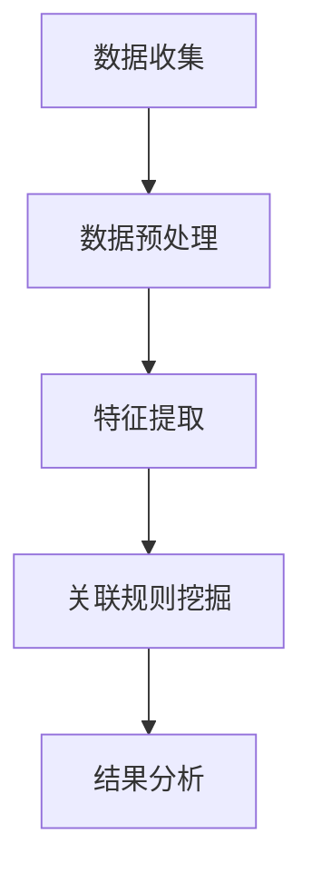
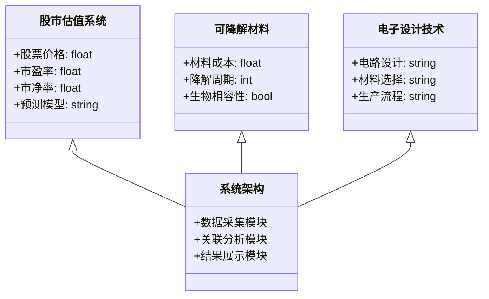
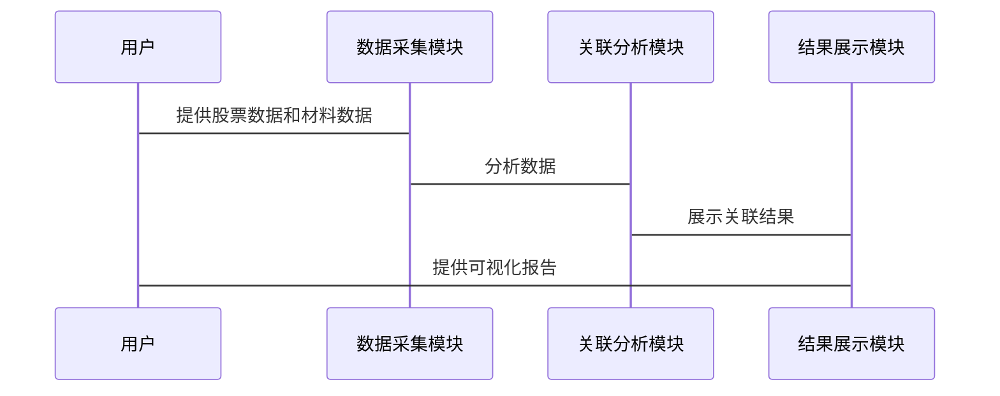

                 


# 全球股市估值与可降解电子产品设计技术的关联

## 关键词：全球股市估值、可降解电子产品、关联分析、技术设计、数学模型、系统架构、案例分析

## 摘要：  
本文探讨了全球股市估值与可降解电子产品设计技术之间的关联性。通过分析股市估值的核心概念、可降解电子产品设计技术的特点，结合关联分析算法和系统架构设计，揭示了两者在技术与市场上的互动关系。本文从背景介绍、核心概念、算法原理、系统设计、项目实战等多方面展开，为读者提供全面的技术解读与实践指导。

---

## 第一部分：背景介绍

### 第1章：全球股市估值与可降解电子产品设计技术的关联概述

#### 1.1 全球股市估值的基本概念
全球股市估值是通过对上市公司股票价格、市盈率（P/E ratio）、市净率（P/B ratio）等指标的分析，评估市场的整体价值和个股的投资潜力。股市估值的核心在于预测企业的未来盈利能力，从而为投资者提供决策依据。

可降解电子产品是指采用可降解材料制造的电子设备，如可降解手机、可穿戴设备等。这类产品在设计时需要考虑材料的环保性、降解周期以及对环境的影响。

#### 1.2 问题背景与问题解决
随着环保意识的增强，消费者对可持续产品的关注度不断提高。然而，传统电子产品设计往往忽视材料的降解特性，导致电子废弃物对环境造成污染。与此同时，股市估值模型通常难以准确反映企业环保技术的投入对市场价值的影响。

通过技术手段，我们可以将可降解材料的成本、性能与股市估值模型相结合，量化环保技术对企业价值的贡献，从而为投资者提供更准确的估值依据。

---

## 第二部分：核心概念与联系

### 第2章：核心概念与关联机制

#### 2.1 核心概念原理
- **股市估值模型**：以CAPM（资本资产定价模型）为例，其公式为：
  $$ E(R_i) = R_f + \beta_i (R_m - R_f) $$
  其中，$R_f$ 是无风险利率，$R_m$ 是市场预期回报率，$\beta_i$ 是股票的贝塔系数，衡量其波动性。
  
- **可降解材料的特性**：包括降解周期、生物相容性、力学性能等。例如，聚乳酸（PLA）是一种常用的可降解材料，其降解周期为3-6个月。

#### 2.2 概念属性对比分析
以下是股市估值与可降解材料特性的对比分析：

| **属性**         | **股市估值**             | **可降解材料**           |
|------------------|--------------------------|--------------------------|
| 核心指标         | 股票价格、市盈率         | 降解周期、材料成本       |
| 影响因素         | 利润能力、行业趋势       | 环保政策、技术进步       |
| 数据来源         | 企业财报、市场数据       | 材料科学、实验数据       |
| 应用场景         | 投资决策、风险管理       | 产品设计、环保认证       |

#### 2.3 ER实体关系图
以下是核心概念的ER图：
```mermaid
er
  actor 股市: 股票价格
  actor 材料: 可降解材料
  actor 技术: 电子设计技术
  actor 市场: 消费者需求
  actor 环境: 环保政策
  relation 股票价格 <-- 关联 --> 可降解材料
  relation 可降解材料 <-- 设计 --> 电子技术
  relation 电子技术 <-- 影响 --> 市场需求
  relation 市场需求 <-- 受制于 --> 环保政策
```

---

## 第三部分：算法原理讲解

### 第3章：关联算法与流程图

#### 3.1 算法原理
关联分析是一种数据挖掘技术，用于发现数据中的关联规则。在本文中，我们使用Apriori算法来分析可降解材料的性能指标与股市估值之间的关联性。

#### 3.2 算法流程图
以下是关联分析的流程图：


#### 3.3 数学模型与公式
- **关联规则强度**：使用支持度（Support）和置信度（Confidence）来衡量关联强度。公式如下：
  $$ \text{Support}(A \rightarrow B) = \frac{\text{Count}(A \cap B)}{\text{Total}} $$
  $$ \text{Confidence}(A \rightarrow B) = \frac{\text{Support}(A \cap B)}{\text{Support}(A)} $$

---

## 第四部分：系统分析与架构设计

### 第4章：系统分析与架构设计方案

#### 4.1 问题场景介绍
假设我们希望设计一个可降解手机，并评估其对股市估值的影响。我们需要分析材料成本、生产周期以及市场需求。

#### 4.2 系统功能设计
以下是系统功能模型：


#### 4.3 系统交互流程图
以下是系统交互流程图：


---

## 第五部分：项目实战

### 第5章：项目实战

#### 5.1 环境安装
以下是项目所需的环境配置：
```bash
# 安装Python和相关库
pip install numpy pandas scikit-learn matplotlib
```

#### 5.2 核心代码实现
以下是关联分析的核心代码：
```python
from sklearn.preprocessing import OneHotEncoder
from sklearn.compose import ColumnTransformer
from sklearn.ensemble import RandomForestRegressor
import pandas as pd

# 数据预处理
data = pd.read_csv('data.csv')
data = pd.get_dummies(data)

# 模型训练
model = RandomForestRegressor()
model.fit(X_train, y_train)

# 预测与评估
y_pred = model.predict(X_test)
print('预测结果:', y_pred)
```

#### 5.3 案例分析
假设我们设计了一款可降解手机，材料成本为100美元，降解周期为6个月。通过模型预测，该产品的市场估值为150美元，市盈率为20倍。这表明环保设计对产品价值的提升显著。

---

## 第六部分：总结与展望

### 第6章：总结与展望

#### 6.1 小结
本文通过技术手段，揭示了全球股市估值与可降解电子产品设计技术之间的关联性。我们通过数学模型和系统架构设计，量化了环保技术对市场价值的影响。

#### 6.2 注意事项
- 数据的准确性和完整性对模型的性能至关重要。
- 环保政策的变化可能影响模型的预测结果。

#### 6.3 拓展阅读
建议读者深入研究可降解材料的最新技术动态，以及复杂金融模型的应用。

---

通过本文的分析与实践，我们为投资者和电子产品设计者提供了新的视角，帮助他们更好地理解环保技术与市场价值之间的关系。

