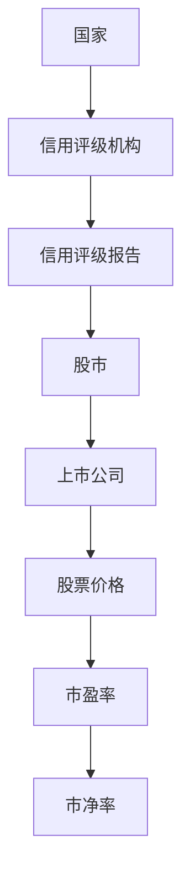
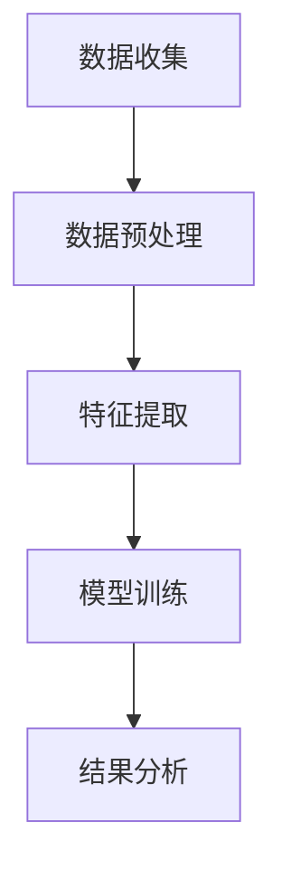
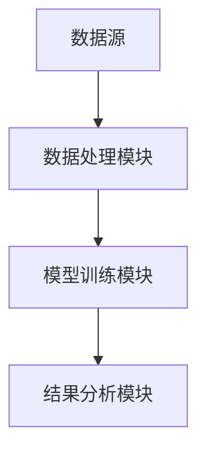
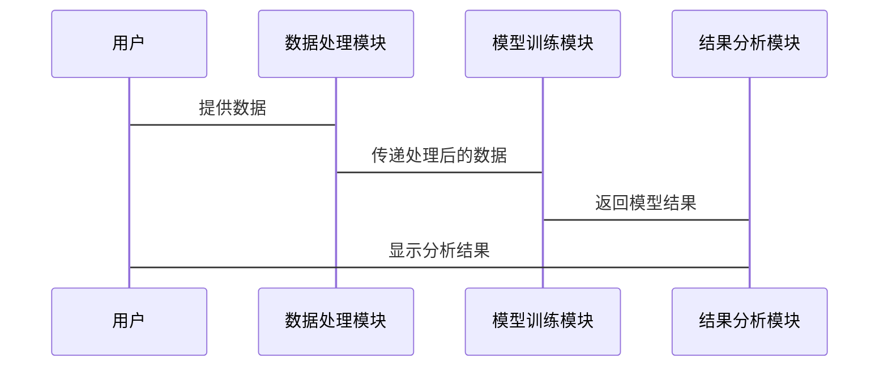

                 


# 全球股市估值与国家信用评级的关联

> 关键词：全球股市估值，国家信用评级，关联分析，数学模型，系统架构

> 摘要：本文探讨了全球股市估值与国家信用评级之间的关联性，从理论到实践，系统性地分析了两者之间的关系，并通过数学模型和系统架构设计，深入解析了如何量化和预测这种关联。

---

## 第一部分: 全球股市估值与国家信用评级的关联概述

### 第1章: 背景介绍

#### 1.1 问题背景

- **全球化经济与金融市场的复杂性**：随着全球化的发展，金融市场之间的联系日益紧密，国家信用评级和股市估值成为衡量经济健康的重要指标。
- **国家信用评级与股市估值的双重影响**：国家信用评级影响投资者信心，进而影响股市估值；股市估值的波动也反映了国家经济的健康状况。
- **问题的提出与研究意义**：研究两者关联有助于更好地理解金融市场动态，为投资者和政策制定者提供决策支持。

#### 1.2 问题描述

- **国家信用评级的定义与分类**：国家信用评级由评级机构（如穆迪、标普）发布，反映国家偿还债务的能力，通常分为AAA、AA、A等。
- **股市估值的核心指标与计算方法**：包括市盈率（P/E）、市净率（P/B）等，反映市场对公司的估值。
- **问题解决的路径与目标**：通过建立数学模型，量化国家信用评级对股市估值的影响。

#### 1.3 边界与外延

- **研究范围的界定**：聚焦于主要经济体（如美国、欧盟、日本）的股市估值与信用评级的关联。
- **相关概念的外延与限制**：排除了微观市场波动和公司层面的因素，专注于宏观层面的分析。
- **研究的局限性与未来展望**：数据限制、模型假设的简化，未来可考虑加入更多变量。

#### 1.4 概念结构与核心要素

- **国家信用评级的核心要素**：经济指标、政治稳定性、财政政策、外债情况。
- **股市估值的关键指标**：整体指数（如标普500）、行业指数、个股估值。
- **两者关联的核心机制**：信用评级影响投资者信心，进而影响股市估值；股市估值波动反过来反映经济状况，影响信用评级。

### 第2章: 核心概念与联系

#### 2.1 核心概念原理

- **国家信用评级的评定标准与影响因素**：经济指标（GDP增速、通胀率）、财政政策（赤字率、债务/GDP）、政治稳定性。
- **股市估值的主要驱动因素与波动机制**：宏观经济因素（利率、通胀）、市场情绪、公司业绩、政策变化。
- **两者关联的理论基础与实证研究**：信用评级下降可能导致股市估值下跌，反之亦然。

#### 2.2 概念属性特征对比

| 比较维度 | 国家信用评级 | 股市估值 |
|----------|--------------|----------|
| 反映对象 | 国家经济信用状况 | 市场对公司的整体估值 |
| 影响因素 | 经济指标、政策、政治稳定性 | 利率、通胀、公司业绩、市场情绪 |
| 表现形式 | 级别（如AAA、AA） | 指数（如标普500）、指标（P/E） |

#### 2.3 ER实体关系图



### 第3章: 数学模型与关联分析

#### 3.1 理论模型构建

- **国家信用评级与股市估值的回归模型**：建立信用评级对股市估值的影响模型。
- **股市估值波动的计量经济学模型**：分析股市波动的驱动因素。
- **关联强度的量化方法**：使用相关系数或回归系数衡量关联强度。

#### 3.2 算法原理讲解



#### 3.3 数学公式与模型

$$ Y = \beta X + \epsilon $$

其中：
- $Y$ 表示股市估值
- $X$ 表示国家信用评级
- $\beta$ 表示回归系数
- $\epsilon$ 表示误差项

#### 3.4 案例分析

假设某国信用评级从AA提升到AAA，股市估值可能上升5%。

---

## 第二部分: 系统分析与架构设计

### 第4章: 系统分析与架构设计方案

#### 4.1 问题场景介绍

- **项目介绍**：构建一个量化模型，分析国家信用评级对股市估值的影响。
- **系统功能设计**：数据收集、清洗、建模、分析、可视化。
- **领域模型类图**


#### 4.2 系统架构设计



#### 4.3 系统接口设计

- **输入接口**：接收信用评级数据和股市数据。
- **输出接口**：生成回归结果、可视化图表。

#### 4.4 系统交互序列图



---

## 第三部分: 项目实战

### 第5章: 项目实战

#### 5.1 环境安装

- **工具安装**：Python、Pandas、Scikit-learn、Matplotlib。
- **数据获取**：使用Yahoo Finance获取股市数据，使用公开评级数据。

#### 5.2 系统核心实现源代码

```python
import pandas as pd
import numpy as np
from sklearn.linear_model import LinearRegression
import matplotlib.pyplot as plt

# 数据加载
credit_ratings = pd.read_csv('credit_ratings.csv')
stock_valuations = pd.read_csv('stock_valuations.csv')

# 数据预处理
# 假设credit_ratings和stock_valuations有共同的国家标识
merged_data = pd.merge(credit_ratings, stock_valuations, on='country')

# 特征提取
X = merged_data[['credit_rating']]
y = merged_data['stock_valuation']

# 模型训练
model = LinearRegression()
model.fit(X, y)

# 结果分析
coefficients = model.coef_
intercept = model.intercept_
r_sq = model.score(X, y)

print(f'回归系数: {coefficients}')
print(f'截距: {intercept}')
print(f'R平方值: {r_sq}')

# 可视化
plt.scatter(X, y)
plt.plot(X, model.predict(X), color='red')
plt.xlabel('信用评级')
plt.ylabel('股市估值')
plt.show()
```

#### 5.3 代码应用解读与分析

- **数据加载与预处理**：读取信用评级和股市估值数据，合并数据集。
- **特征提取**：选择信用评级作为自变量，股市估值作为因变量。
- **模型训练**：使用线性回归模型拟合数据。
- **结果分析**：输出回归系数、截距和R平方值，评估模型拟合优度。
- **可视化**：绘制散点图和回归线，直观展示两者关联。

#### 5.4 实际案例分析

假设某国信用评级从AA提升到AAA，预测其股市估值的变化：

```python
new_rating = np.array([[AAA]])
predicted_valuation = model.predict(new_rating)
print(f'预测的股市估值为: {predicted_valuation[0]}')
```

#### 5.5 项目小结

- **成果总结**：成功构建回归模型，量化信用评级对股市估值的影响。
- **问题总结**：数据质量和模型假设的限制，未来可考虑加入更多变量。

---

## 第四部分: 总结与展望

### 第6章: 总结与展望

#### 6.1 最佳实践 tips

- **数据收集**：确保数据的准确性和完整性。
- **模型优化**：尝试更复杂的模型（如随机森林、神经网络）。
- **风险管理**：考虑市场波动和模型的稳定性。

#### 6.2 小结

- **文章总结**：本文系统性地分析了国家信用评级与股市估值的关联，构建了数学模型，并通过案例验证了模型的有效性。
- **研究不足**：数据限制、模型简化。

#### 6.3 注意事项

- **数据敏感性**：处理金融数据需谨慎，避免泄露或误用。
- **模型局限性**：回归模型假设线性关系，实际可能更复杂。

#### 6.4 拓展阅读

- **相关文献**：推荐阅读关于信用评级和股市估值的经典文献。
- **工具学习**：深入学习Pandas、Scikit-learn的高级功能。

---

## 第五部分: 文章标签

- # 全球股市
- # 信用评级
- # 数学建模
- # 系统架构
- # 投资分析

---

**总结**：本文通过理论分析、数学建模和系统设计，深入探讨了全球股市估值与国家信用评级的关联，为投资者和政策制定者提供了有价值的参考。

