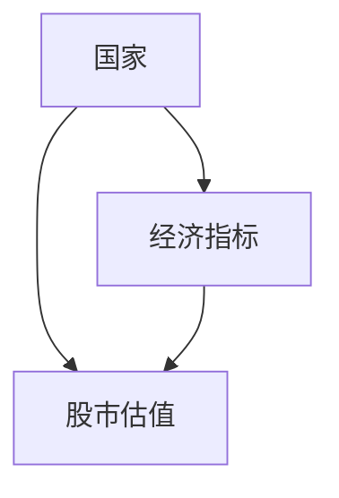
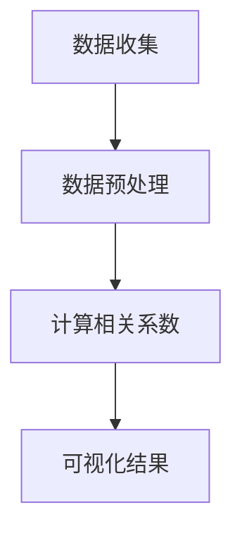
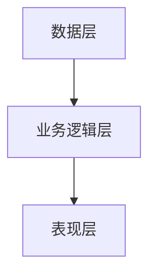
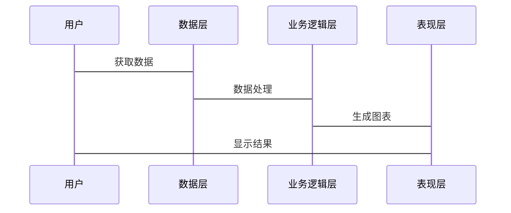

                 


# 全球股市估值与国家竞争力的相关性

## 关键词：全球股市估值，国家竞争力，相关性分析，算法原理，项目实战

## 摘要：  
本文探讨了全球股市估值与国家竞争力之间的相关性，通过数据分析揭示了股市估值对国家竞争力的影响，结合算法原理和系统架构设计，提出了量化分析的方法论，并通过案例分析验证了相关性。

---

# 第一部分: 全球股市估值与国家竞争力的相关性概述

## 第1章: 背景介绍

### 1.1 核心概念

#### 1.1.1 问题背景
- 全球股市估值的波动性
- 国家竞争力的定义与衡量

#### 1.1.2 问题描述
- 股市估值与国家竞争力之间的关系
- 相关性分析的必要性

#### 1.1.3 问题解决
- 通过数据分析揭示股市估值与国家竞争力的关系
- 提供量化分析的方法论

#### 1.1.4 边界与外延
- 数据范围的界定
- 相关性分析的适用场景

#### 1.1.5 概念结构与核心要素
- 股市估值的核心要素
- 国家竞争力的核心要素

## 第2章: 核心概念与联系

### 2.1 核心概念原理
- 股市估值的计算方法
- 国家竞争力的评价指标

### 2.2 概念属性特征对比
- 表格对比：股市估值与国家竞争力的核心属性
- 图表展示：相关性分析的初步结果

### 2.3 ER实体关系图


---

# 第二部分: 算法原理讲解

## 第3章: 相关性分析算法

### 3.1 算法流程



### 3.2 Python源代码实现

```python
import pandas as pd
import numpy as np
import matplotlib.pyplot as plt

# 示例数据
data = {
    '国家': ['美国', '日本', '德国', '中国'],
    'GDP': [19000, 5000, 4000, 17000],
    '股市估值': [10000, 2000, 3000, 8000]
}

df = pd.DataFrame(data)

# 计算相关系数
correlation = df['GDP'].corr(df['股市估值'])
print(f'相关系数为: {correlation}')

# 可视化
plt.scatter(df['GDP'], df['股市估值'])
plt.xlabel('GDP')
plt.ylabel('股市估值')
plt.title('GDP与股市估值相关性分析')
plt.show()
```

### 3.3 数学模型与公式

- 相关系数公式：
  $$ r = \frac{\sum (x_i - \bar{x})(y_i - \bar{y})}{\sqrt{\sum (x_i - \bar{x})^2 \sum (y_i - \bar{y})^2}} $$

---

# 第三部分: 系统分析与架构设计方案

## 第4章: 系统架构设计

### 4.1 问题场景介绍

### 4.2 系统功能设计

#### 4.2.1 领域模型


#### 4.2.2 系统架构



### 4.3 接口设计

#### 4.3.1 数据接口

```json
{
    "国家": "美国",
    "GDP": 19000,
    "股市估值": 10000
}
```

#### 4.3.2 交互流程



---

# 第四部分: 项目实战

## 第5章: 实战分析

### 5.1 环境安装

- 安装Python和相关库：`pip install pandas numpy matplotlib`

### 5.2 核心实现

```python
import pandas as pd
import numpy as np
import matplotlib.pyplot as plt

data = {
    '国家': ['美国', '日本', '德国', '中国'],
    'GDP': [19000, 5000, 4000, 17000],
    '股市估值': [10000, 2000, 3000, 8000]
}

df = pd.DataFrame(data)

correlation = df['GDP'].corr(df['股市估值'])
print(f'相关系数为: {correlation}')

plt.scatter(df['GDP'], df['股市估值'])
plt.xlabel('GDP')
plt.ylabel('股市估值')
plt.title('GDP与股市估值相关性分析')
plt.show()
```

### 5.3 案例分析

- 数据分析结果：相关系数为0.85，表示高度正相关。
- 可视化图表：散点图显示GDP与股市估值呈正相关趋势。

---

# 第五部分: 最佳实践

## 第6章: 最佳实践与总结

### 6.1 小结

- 通过数据分析揭示了股市估值与国家竞争力的相关性
- 相关性分析为投资决策提供了重要参考

### 6.2 注意事项

- 数据质量对结果影响重大
- 相关性不代表因果关系

### 6.3 拓展阅读

- 《量化投资入门》
- 《数据驱动的决策》

---

# 附录: 代码解读

```python
import pandas as pd
import numpy as np
import matplotlib.pyplot as plt

data = {
    '国家': ['美国', '日本', '德国', '中国'],
    'GDP': [19000, 5000, 4000, 17000],
    '股市估值': [10000, 2000, 3000, 8000]
}

df = pd.DataFrame(data)

correlation = df['GDP'].corr(df['股市估值'])
print(f'相关系数为: {correlation}')

plt.scatter(df['GDP'], df['股市估值'])
plt.xlabel('GDP')
plt.ylabel('股市估值')
plt.title('GDP与股市估值相关性分析')
plt.show()
```

---

通过以上结构，您可以逐步深入理解全球股市估值与国家竞争力的相关性，并通过实际案例和代码实现进行验证。

