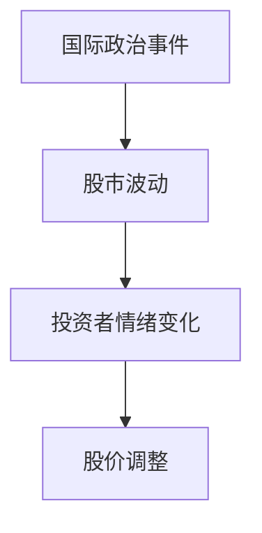

                 

# 全球股市估值与国际政治格局变化的互动

## 关键词：全球股市估值、国际政治格局、地缘政治风险、经济政策变化、投资策略、风险管理

## 摘要

本文深入探讨了全球股市估值与国际政治格局变化之间的互动关系。通过分析国际政治事件、经济政策变化对股市估值的影响，结合具体案例，提出了系统化的互动模型和投资策略。文章结构清晰，内容详实，适合对金融与政治互动感兴趣的专业人士阅读。

---

# 第1章: 全球政治经济格局概述

## 1.1 全球化背景下的国际政治经济关系

### 1.1.1 全球化的历史演变与现状

全球化是20世纪末至21世纪初的重要经济现象，推动了国际分工和资本流动的自由化。当前，全球化与逆全球化并存，区域经济一体化成为新的趋势。

**概念属性对比表：**

| 属性         | 全球化         | 逆全球化       |
|--------------|---------------|----------------|
| 表现形式     | 贸易自由化     | 贸易保护主义    |
| 主要动因     | 经济效率提升   | 地方保护诉求    |
| 代表案例     | 世界贸易组织   | 美国贸易政策调整 |

### 1.1.2 国际政治经济格局的核心要素

国际政治经济格局由主要经济体、国际组织和地缘政治关系构成。核心要素包括：

- **主要经济体**：美国、欧盟、中国等。
- **国际组织**：联合国、IMF、WTO等。
- **地缘政治关系**：区域冲突、联盟关系等。

### 1.1.3 全球化与逆全球化的辩证关系

全球化促进了资本流动和经济一体化，但逆全球化反映了对全球化负面影响的抵制，两者共同塑造了当前的国际经济环境。

---

## 1.2 国际政治经济格局对股市的影响

### 1.2.1 国际政治事件对股市的直接冲击

地缘政治冲突（如中美贸易摩擦）会导致股市短期波动。例如，2018年中美贸易摩擦期间，全球股市普遍下跌。

**Mermaid流程图：**

---

# 第2章: 股市估值的理论基础

## 2.1 股市估值的基本概念与方法

### 2.1.1 股票估值的定义与核心要素

股票估值是通过分析公司财务数据和市场环境预测股票价值的过程。核心要素包括：

- **市盈率（P/E）**：股价与每股收益的比率。
- **市净率（P/B）**：股价与每股净资产的比率。

### 2.1.2 市盈率、市净率等核心指标解析

市盈率和市净率是衡量股市估值的常用指标。例如，市盈率低于行业平均水平可能意味着低估。

### 2.1.3 股票估值的三大主要方法

1. **基本面分析**：通过财务数据评估公司价值。
2. **技术分析**：通过股价走势预测未来趋势。
3. **行为金融学视角**：分析投资者情绪对股价的影响。

---

## 2.2 股市估值与宏观经济的关系

### 2.2.1 经济周期对股市估值的影响

经济周期波动直接影响股市估值。例如，经济衰退期，股市估值通常较低。

### 2.2.2 利率政策对股市估值的长期影响

低利率环境通常会推高股市估值，因为资金更多流入股市。

### 2.2.3 汇率波动对股市估值的传导机制

汇率波动会影响出口型企业盈利，进而影响股市估值。

---

# 第3章: 国际政治格局变化对股市估值的直接影响

## 3.1 国际政治事件对股市的即时影响

### 3.1.1 贸易摩擦与股市波动的案例分析

中美贸易摩擦期间，全球股市普遍下跌，尤其是出口导向型企业股价大幅调整。

### 3.1.2 地缘政治冲突对股市的短期冲击

地缘政治冲突会导致投资者恐慌，引发股市短期下跌。

### 3.1.3 政治选举与股市走势的关系

政治选举结果可能影响政策预期，从而影响股市走势。

---

## 3.2 经济政策变化对股市估值的长期影响

### 3.2.1 财政政策对股市的刺激与抑制作用

财政刺激政策通常会推高股市估值，而紧缩政策则相反。

### 3.2.2 货币政策对股市估值的影响机制

宽松货币政策通常会推高股市估值，因为资金成本降低。

### 3.2.3 国际经济政策协调对股市的综合影响

国际政策协调可以缓解经济不确定性，稳定股市估值。

---

# 第4章: 全球主要经济体股市估值的区域差异

## 4.1 美国股市估值的分析与启示

### 4.1.1 美国股市的历史表现与估值水平

美国股市长期表现优异，但近期估值较高，存在回调风险。

### 4.1.2 美元霸权对全球股市估值的影响

美元霸权导致全球资本集中于美国市场，影响全球股市估值。

### 4.1.3 美国经济政策对全球股市的溢出效应

美国经济政策变化对全球股市有显著影响，例如美联储加息会导致全球股市调整。

---

## 4.2 欧洲股市估值的区域特征

### 4.2.1 欧洲经济一体化对股市估值的影响

欧洲经济一体化促进了区域内资本流动，稳定了股市估值。

### 4.2.2 欧洲债务危机对股市估值的启示

债务危机可能导致股市估值大幅波动，例如希腊债务危机期间，欧洲股市大幅下跌。

### 4.2.3 欧洲央行政策对股市估值的调节作用

欧洲央行的货币政策对欧洲股市估值有重要影响，例如量化宽松政策推高了股市估值。

---

## 4.3 亚洲股市估值的区域特征

### 4.3.1 中国经济政策对股市估值的影响

中国经济政策变化对A股影响显著，例如“十四五”规划推动了科技股上涨。

### 4.3.2 中美贸易摩擦对亚洲股市的影响

中美贸易摩擦导致亚洲股市普遍下跌，尤其是出口导向型企业受到较大冲击。

### 4.3.3 日本股市估值的特殊性

日本股市受老龄化和低增长影响，估值长期低迷。

---

# 第5章: 地缘政治风险与股市估值的互动模型

## 5.1 地缘政治风险的量化与评估

### 5.1.1 地缘政治风险的量化指标

- **政治风险指数**：衡量国家政治风险的指标。
- **经济制裁风险**：衡量国际制裁对公司的影响。

### 5.1.2 地缘政治风险对股市估值的传导路径

地缘政治风险通过影响企业盈利和投资者情绪影响股市估值。

---

## 5.2 地缘政治风险与股市估值的系统分析

### 5.2.1 地缘政治风险对股市的短期影响

短期影响主要通过投资者情绪和市场流动性变化实现。

### 5.2.2 地缘政治风险对股市的长期影响

长期影响主要通过企业盈利和政策环境变化实现。

### 5.2.3 地缘政治风险的多层次影响模型

- **微观层面**：企业层面的影响。
- **中观层面**：行业层面的影响。
- **宏观层面**：国家和全球层面的影响。

---

# 第6章: 投资策略与风险管理

## 6.1 投资策略的制定

### 6.1.1 投资者如何应对国际政治变化

投资者应关注国际政治事件，及时调整投资组合。

### 6.1.2 风险厌恶型投资者的策略选择

风险厌恶型投资者应减少高风险资产配置。

### 6.1.3 风险偏好型投资者的策略选择

风险偏好型投资者可适当增加高风险资产配置。

---

## 6.2 风险管理的最佳实践

### 6.2.1 投资组合的分散化策略

通过分散化降低单一资产的风险。

### 6.2.2 期权与保险工具的应用

利用期权和保险工具对冲风险。

### 6.2.3 定期再平衡策略

定期调整投资组合，保持风险敞口在合理范围。

---

# 结语

全球股市估值与国际政治格局变化的互动是一个复杂但重要的课题。通过深入分析国际政治事件、经济政策变化对股市估值的影响，投资者可以制定更有效的投资策略，降低风险，抓住机遇。

---

**附录**：提供相关数据和代码，供读者进一步研究。

