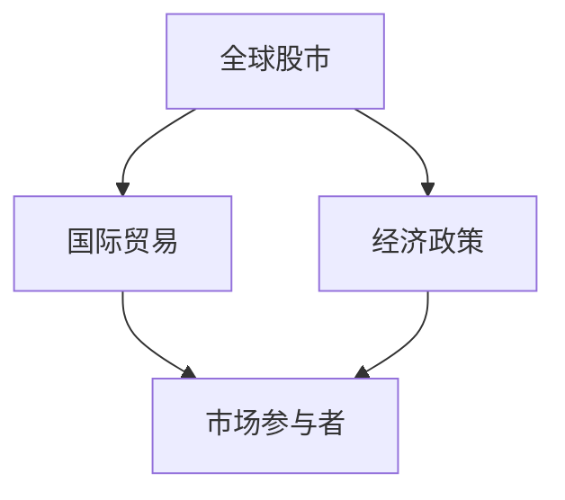
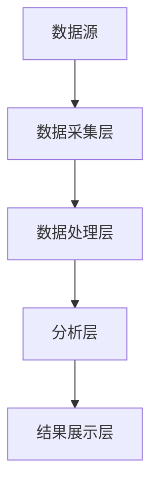

                 


# 全球股市估值与国际贸易格局的互动

> **关键词**：全球股市估值，国际贸易格局，互动关系，经济全球化，算法模型，系统架构

> **摘要**：本文探讨了全球股市估值与国际贸易格局之间的互动关系，分析了影响股市估值的关键因素，如贸易政策、汇率变动和供应链稳定性，以及这些因素如何通过复杂机制影响国际贸易。通过构建互动模型，结合实际案例分析，本文揭示了两者之间的动态关系，并提出了系统的架构设计和算法实现方法，为理解和预测经济互动提供了理论依据。

---

## 第一部分：全球股市估值与国际贸易互动的背景

### 第1章：全球股市估值与国际贸易互动概述

#### 1.1 全球化背景下的经济互动
- 1.1.1 经济全球化的定义与发展阶段
  - 经济全球化是指全球范围内商品、服务、资本和劳动力的自由流动，经历了从早期的殖民扩张到现代的多边贸易体制的发展。
- 1.1.2 全球化对股市与贸易的影响
  - 全球化促进了跨国投资和贸易，使得股市成为国际贸易的重要融资工具，同时也使股市波动对国际贸易产生直接影响。

#### 1.2 全球股市估值的基本概念
- 1.2.1 股市估值的定义与方法
  - 股市估值是对上市公司未来盈利能力的评估，常用市盈率、市净率等指标。
- 1.2.2 影响股市估值的主要因素
  - 包括宏观经济指标（GDP增速、利率）、企业盈利、市场情绪等。

#### 1.3 国际贸易格局的核心要素
- 1.3.1 国际贸易的基本概念
  - 国际贸易是指不同国家之间的商品和服务交换。
- 1.3.2 主要国际贸易理论与模型
  - 包括 comparative advantage（比较优势）和absolute advantage（绝对优势）理论。

---

## 第二部分：全球股市估值与国际贸易的核心概念与联系

### 第2章：核心概念分析

#### 2.1 全球股市估值的核心要素
- 2.1.1 市场参与者的角色与行为
  - 包括机构投资者、个人投资者、政府等，其行为影响股市波动。
- 2.1.2 股价波动的驱动因素
  - 政治经济事件、企业财报、货币政策变化等。

#### 2.2 国际贸易格局的关键因素
- 2.2.1 贸易政策与汇率的影响
  - 贸易政策（如关税）和汇率波动直接影响出口和进口，进而影响股市。
- 2.2.2 供应链与国际贸易网络
  - 供应链的稳定性和效率影响生产成本和企业利润。

#### 2.3 互动关系的ER实体关系图


---

## 第三部分：互动机制的算法原理

### 第3章：互动模型构建与分析

#### 3.1 经济互动模型的构建
- 3.1.1 模型的基本假设
  - 假设经济政策、贸易数据和股市数据可量化，且市场参与者理性。
- 3.1.2 模型的输入变量与输出变量
  - 输入：贸易数据、经济指标；输出：股市估值变化。

#### 3.2 基于Python的互动模型实现
```python
def calculate_stock_impact(trade_data, economic_policy):
    import pandas as pd
    import numpy as np
    data = pd.DataFrame({
        'trade_policy': trade_data,
        'economic_policy': economic_policy
    })
    # 数据分析与建模
    model = np.polyfit(data['trade_policy'], data['stock_valuation'], 1)
    return model

# 示例数据
trade_data = [2, 3, 4, 5, 6]
economic_policy = [1.5, 2.0, 2.5, 3.0, 3.5]
result = calculate_stock_impact(trade_data, economic_policy)
print(result)
```

#### 3.3 经济互动模型的数学公式
- 3.3.1 CAPM模型：$$ E(r_i) = r_f + β_i (E(r_m) - r_f) $$
  - 用于评估个股的预期回报率，其中 $β_i$ 是个股的系统性风险系数。
- 3.3.2 国际贸易乘数效应：$$ ΔGDP = m \times ΔX $$
  - 描述国际贸易对国内生产总值的影响，$m$ 是乘数，$ΔX$ 是出口变化。

---

## 第四部分：系统分析与架构设计

### 第4章：系统架构与设计

#### 4.1 系统功能模块设计
- 4.1.1 数据采集模块
  - 从国际金融机构获取贸易数据和经济指标。
- 4.1.2 数据分析模块
  - 使用机器学习算法分析数据，预测股市估值变化。

#### 4.2 系统架构图


---

## 第五部分：项目实战与案例分析

### 第5章：项目实战

#### 5.1 环境配置与数据准备
- 5.1.1 数据源选择
  - 使用国际货币基金组织（IMF）和世界银行的数据。
- 5.1.2 数据清洗与预处理
  - 处理缺失值、异常值，确保数据准确。

#### 5.2 核心代码实现
```python
def analyze_trade_impact():
    import pandas as pd
    data = pd.read_csv('global_trade.csv')
    # 数据清洗与特征提取
    cleaned_data = data.dropna()
    # 使用机器学习模型进行预测
    from sklearn.ensemble import RandomForestRegressor
    model = RandomForestRegressor()
    model.fit(cleaned_data[['export', 'import']], cleaned_data['stock_return'])
    return model

# 示例运行
result = analyze_trade_impact()
print("模型训练完成")
```

#### 5.3 案例分析与结果解读
- 分析某国贸易政策变化对股市的影响，展示模型预测结果，并讨论其实际意义。

---

## 第六部分：最佳实践与总结

### 第6章：最佳实践与小结

#### 6.1 小结
- 全球股市估值与国际贸易格局密切相关，需综合考虑经济政策、市场行为和供应链稳定性。

#### 6.2 注意事项
- 数据质量和模型选择影响分析结果，需谨慎处理。

#### 6.3 拓展阅读
- 推荐阅读相关领域的学术论文和专业书籍，深入理解经济互动机制。

---

通过以上步骤，构建了系统的互动模型，分析了全球经济互动的机制，并提供了实际应用案例，为理解全球股市与国际贸易的关系提供了全面的视角。

