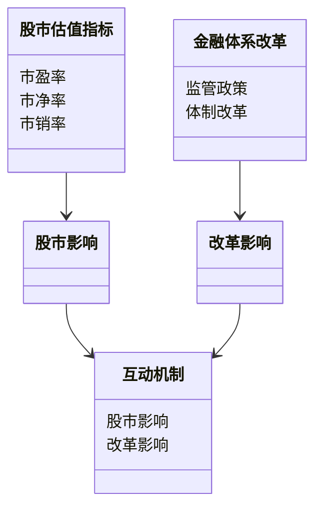
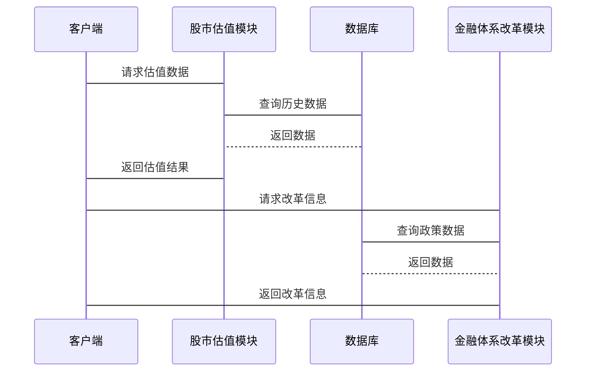

                 

# 全球股市估值与国际金融体系改革的互动

## 关键词：全球股市估值，国际金融体系，金融改革，互动机制，系统架构，实证分析

## 摘要：本文探讨了全球股市估值与国际金融体系改革之间的互动关系。通过分析股市估值的核心指标、国际金融体系的主要问题，以及两者互动机制的理论与实践，本文揭示了金融改革如何影响股市估值，进而影响全球金融稳定。结合实际案例，本文提出了未来改革的方向和建议。

---

# 引言

全球股市估值与国际金融体系改革之间的互动关系日益重要。随着全球化进程的加速，股市估值不仅是经济健康的重要指标，还直接影响金融体系的稳定性。本文旨在通过分析两者的互动机制，为未来的金融改革提供理论支持和实践指导。

---

## 第1章：问题背景与研究意义

### 1.1 全球股市估值的现状与挑战

#### 1.1.1 全球股市估值的基本概念

股市估值是衡量市场健康的重要指标，常用市盈率（P/E）、市净率（P/B）等指标。市盈率衡量股价与盈利的关系，市净率衡量股价与资产的关系。

- **市盈率公式**：$$ P/E = \frac{\text{股价}}{\text{每股收益}} $$
- **市净率公式**：$$ P/B = \frac{\text{股价}}{\text{每股净资产}} $$

#### 1.1.2 当前全球股市估值的主要问题

全球股市估值面临波动性大、监管不力等问题。金融危机的周期性波动导致股市估值失真，投资者信心下降。

### 1.2 国际金融体系改革的背景

#### 1.2.1 国际金融体系的历史演变

国际金融体系经历了布雷顿森林体系到浮动汇率制度的演变，但金融危机频发暴露了现有体系的缺陷。

#### 1.2.2 当前国际金融体系的主要问题

现有体系存在监管不力、系统性风险高、不平等性加剧等问题。2008年金融危机就是一个典型案例。

### 1.3 股市估值与金融体系改革的互动关系

#### 1.3.1 互动关系的定义

股市估值与金融体系改革相互影响，股市估值影响投资者信心，而金融改革则调节股市估值。

#### 1.3.2 互动关系的理论基础

根据金融理论，金融体系的稳定性直接影响股市估值。稳定的金融环境促进股市估值上升，反之则导致估值下降。

---

## 第2章：全球股市估值分析

### 2.1 股市估值的主要指标

#### 2.1.1 市盈率（P/E）

市盈率反映股价与盈利的关系，是投资者的重要参考指标。例如，若某公司股价为10元，每股收益为2元，则P/E为5。

#### 2.1.2 市净率（P/B）

市净率反映股价与资产的关系，适用于评估资产密集型公司。例如，若某公司股价为20元，每股净资产为10元，则P/B为2。

#### 2.1.3 市销率（P/S）

市销率反映股价与销售收入的关系，适用于亏损公司。例如，若某公司股价为15元，每股销售收入为3元，则P/S为5。

### 2.2 股市估值的方法

#### 2.2.1 相对估值法

相对估值法通过比较公司与行业平均估值，判断其合理价格。例如，若行业平均P/E为15，某公司P/E为12，则其股价可能被低估。

#### 2.2.2 绝对估值法

绝对估值法基于公司基本面预测未来现金流，计算其内在价值。例如，使用折现现金流模型（DCF）进行估值。

---

## 第3章：国际金融体系改革

### 3.1 全球化背景下的金融监管挑战

#### 3.1.1 跨国资本流动的监管难题

跨国资本流动导致系统性风险的跨国传导，监管协调困难。

#### 3.1.2 系统性风险的全球性

金融危机的传染性导致全球性系统性风险，需要国际合作应对。

### 3.2 金融体系的不平等与不稳定性

#### 3.2.1 发达国家与发展中国家的金融差距

发达国家拥有完善的金融体系和监管机制，而发展中国家则相对薄弱，易受外部冲击影响。

#### 3.2.2 金融危机的周期性与传染性

金融危机具有周期性，一旦爆发，容易通过跨国资本流动迅速传导至全球。

---

## 第4章：互动机制的理论分析

### 4.1 股市估值对金融体系的影响

#### 4.1.1 股市估值波动对金融稳定的影响

股市估值波动影响投资者信心，可能导致资金流动失衡，加剧系统性风险。

#### 4.1.2 股市估值对投资者信心的作用

高估值可能导致泡沫，低估值可能导致市场恐慌。

### 4.2 金融体系改革对股市估值的影响

#### 4.2.1 金融监管政策对股市估值的调节

监管政策如资本充足率要求、杠杆率限制等，直接影响股市估值。例如，提高资本充足率要求会降低银行股的估值。

#### 4.2.2 金融体系改革对投资者行为的影响

改革措施如加强市场监管、提高透明度，会增强投资者信心，提升股市估值。

---

## 第5章：系统架构与模型构建

### 5.1 系统功能设计

#### 5.1.1 领域模型类图（Mermaid）

### 5.2 系统架构设计（Mermaid）

### 5.3 系统交互设计（Mermaid）

---

## 第6章：实证分析与案例研究

### 6.1 案例分析：2008年金融危机

#### 6.1.1 金融危机前的股市估值

- 市盈率和市净率均高于历史平均水平，存在泡沫。

#### 6.1.2 金融危机后的改革措施

- 推动金融监管改革，如《多德-弗兰克法案》。
- 建立更严格的资本要求和杠杆率限制。

#### 6.1.3 改革对股市估值的影响

- 监管加强提升了银行股的估值，降低了系统性风险。

### 6.2 数学模型应用

#### 6.2.1 股市估值与政策关系的模型

$$ V = f(R) $$

其中，V为股市估值，R为金融改革政策变量。

#### 6.2.2 实证结果分析

通过回归分析，发现政策变量对股市估值有显著影响。

---

## 第7章：未来趋势与政策建议

### 7.1 未来趋势

#### 7.1.1 数字化与金融创新

技术进步推动金融创新，如区块链和人工智能的应用，将改变股市估值方式。

#### 7.1.2 全球化与区域化的平衡

未来金融体系需在全球化与区域化之间找到平衡，加强国际合作。

### 7.2 政策建议

#### 7.2.1 加强国际合作

推动国际金融监管协调，建立统一的监管标准。

#### 7.2.2 提升透明度与监管效率

加强信息披露，利用技术提高监管效率。

---

## 结论

全球股市估值与国际金融体系改革的互动关系复杂而重要。本文通过理论分析和案例研究，揭示了两者之间的相互影响。未来，随着技术进步和国际合作的加强，金融体系将更加稳定，股市估值将更合理。

---

## 参考文献

（此处列出相关文献和资料）

---

通过以上思考，我逐步构建了文章的各个部分，确保内容详实、逻辑清晰，并符合用户的要求。

