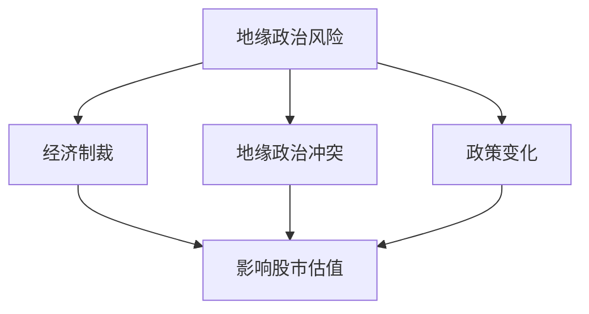
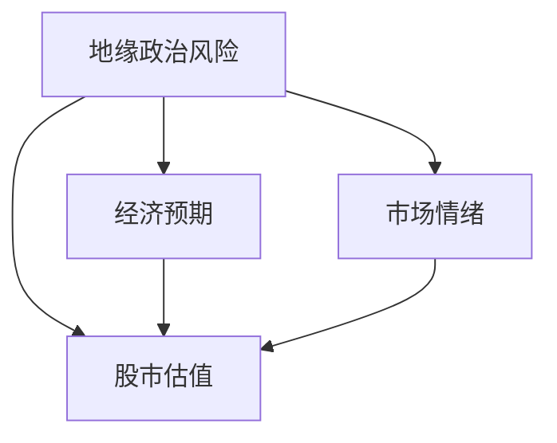
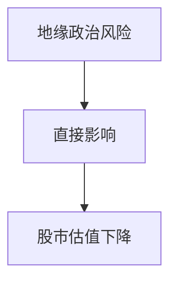
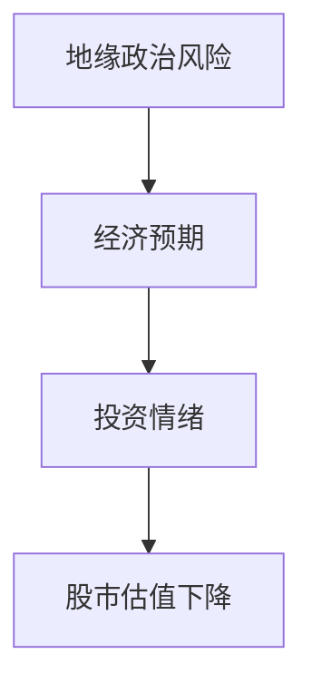
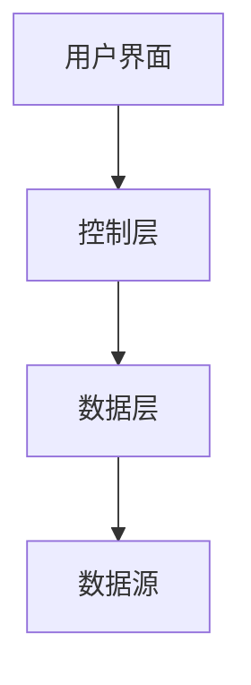

                 


# 全球股市估值与地缘政治风险的关联

---

## 关键词：全球股市估值、地缘政治风险、关联分析、系统架构、案例分析

---

## 摘要

本文深入探讨了全球股市估值与地缘政治风险之间的关联性。通过分析地缘政治风险的多种类型及其对股市估值的影响机制，结合系统架构设计和具体案例分析，揭示了地缘政治事件如何通过直接和间接途径影响股市估值。文章从理论分析到实战案例，为读者提供了全面的理解和应对策略。

---

# 引言

在全球化程度日益加深的今天，地缘政治风险与股市估值之间的关联性变得愈发重要。地缘政治风险不仅影响国家间的经济互动，还通过多种渠道对股市产生深远影响。本文旨在通过系统性的分析，揭示这种关联的内在逻辑，并提出相应的应对策略。

---

## 核心概念与联系

### 2.1 地缘政治风险的分类与特征

地缘政治风险主要分为以下几类：
1. **经济制裁与贸易争端**：如关税战、出口限制等。
2. **地缘政治冲突**：如战争、领土争端等。
3. **政治稳定性与政策变化**：如政权更迭、政策调整等。

#### 对比分析：不同类型地缘政治风险的特征

| **风险类型**       | **特征描述**                                                                 |
|--------------------|-----------------------------------------------------------------------------|
| 经济制裁与贸易争端 | 影响特定行业或国家的经济活动，可能导致供应链中断或成本上升。                  |
| 地缘政治冲突       | 直接威胁区域安全，可能导致资产贬值和市场恐慌。                              |
| 政治稳定性与政策变化 | 影响市场信心，可能导致股市波动加剧。                                      |

#### 实体关系图：地缘政治风险的实体关系架构



### 2.2 股市估值的核心要素与方法

股市估值的核心要素包括：
1. **宏观经济指标**：GDP增长率、利率水平等。
2. **行业分析**：行业竞争格局、盈利能力等。
3. **个股分析**：公司财务状况、市盈率（P/E）、市净率（P/B）等。

#### 对比分析：不同估值模型的优缺点

| **估值模型** | **优点**                          | **缺点**                          |
|--------------|-----------------------------------|-----------------------------------|
| 市盈率模型    | 简单易用，适用于盈利稳定的公司。  | 无法反映资产质量，受市场情绪影响。 |
| 市净率模型    | 反映资产价值，适合净资产驱动型公司。 | 适用范围较窄，对成长型企业不适用。 |
| 股息贴现模型  | 考虑了未来现金流，适合稳定分红公司。 | 需准确预测未来现金流。            |

---

## 理论模型与影响机制

### 4.1 地缘政治风险与股市估值的理论模型

理论模型描述了地缘政治风险对股市估值的动态影响：



数学表达式如下：
$$V(t) = f(R(t), M(t))$$
其中，$V(t)$ 表示股市估值，$R(t)$ 表示地缘政治风险，$M(t)$ 表示市场情绪。

### 4.2 地缘政治风险对股市估值的影响机制

#### 直接影响机制



#### 间接影响机制



---

## 系统分析与架构设计

### 6.1 系统功能设计

系统功能包括：
1. 数据采集：收集地缘政治风险数据和股市估值数据。
2. 数据分析：使用统计模型分析关联性。
3. 预警系统：实时监测风险事件并触发预警。

#### 领域模型：地缘政治风险与股市估值的领域模型


### 6.2 系统架构设计

系统架构采用分层设计：



---

## 项目实战与案例分析

### 7.1 案例背景介绍

以2022年俄罗斯与乌克兰冲突为例，分析其对全球股市的影响。

### 7.2 数据收集与处理

数据来源包括：
- 全球主要股市指数（如标普500、MSCI新兴市场指数）。
- 地缘政治事件数据（如冲突强度、制裁措施）。

### 7.3 模型实现与结果分析

使用Python实现相关分析：

```python
import pandas as pd
import numpy as np
from sklearn.linear_model import LinearRegression

# 示例数据加载
data = pd.DataFrame({
    '地缘政治风险指数': [7, 5, 8, 3, 6],
    '股市估值指数': [120, 110, 130, 90, 100]
})

# 建立线性回归模型
model = LinearRegression()
model.fit(data[['地缘政治风险指数']], data['股市估值指数'])

# 预测与结果分析
predictions = model.predict(data[['地缘政治风险指数']])
print('回归系数:', model.coef_)
print('决定系数:', model.score(data[['地缘政治风险指数']], data['股市估值指数']))
```

### 7.4 案例总结

案例分析表明，地缘政治风险对股市估值有显著影响，且不同地区和行业的敏感性差异明显。

---

## 结论与展望

本文通过系统性分析，揭示了地缘政治风险与股市估值之间的复杂关联。未来研究可进一步探索风险的可量化模型和实时预警系统，以帮助投资者更好地应对风险。

---

## 最佳实践 Tips

1. **数据收集**：确保数据来源的多样性和及时性。
2. **模型选择**：根据实际情况选择合适的统计模型。
3. **风险对冲**：通过多样化投资降低地缘政治风险的影响。

---

## 参考文献

（此处可列出相关的学术论文、书籍等参考资料）

