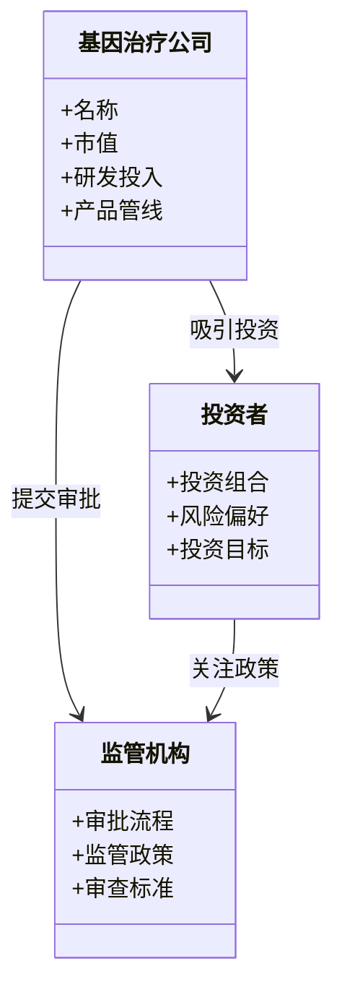
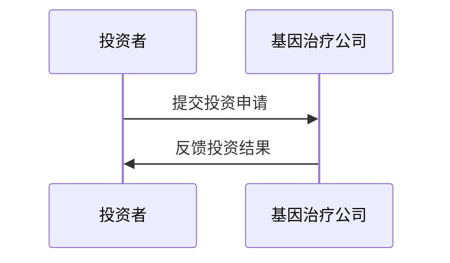
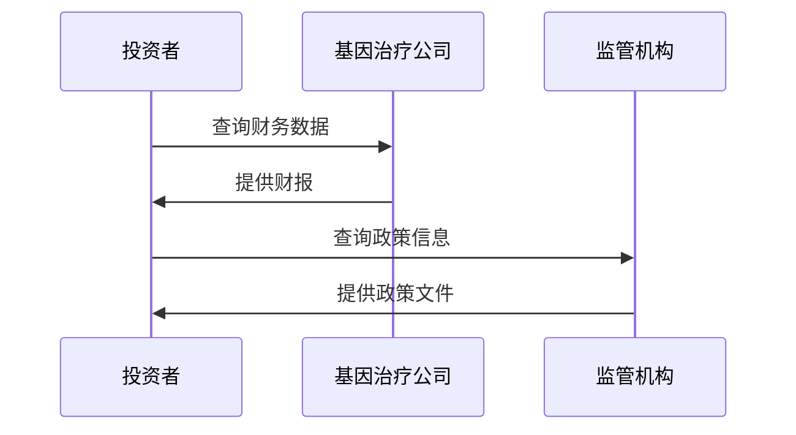

                 


# 全球股市估值与基因治疗的长期经济影响

---

## 关键词：全球股市估值，基因治疗，经济影响，医疗行业，股票市场

---

## 摘要：  
本文探讨基因治疗技术对全球股市估值的长期经济影响，分析基因治疗如何改变医疗行业的成本结构和治疗方式，进而影响股市估值的变化。通过系统分析基因治疗的经济影响和股市估值的演变，本文提出新的估值模型和经济影响传导机制，并结合实际案例进行深入剖析，为投资者和政策制定者提供参考。

---

# 第1章：背景介绍

## 1.1 问题背景

### 1.1.1 科技进步对全球经济的影响  
随着人工智能、大数据和生物技术的快速发展，科技创新正在深刻改变全球经济格局。基因治疗作为生物技术领域的前沿技术，正在改变医疗行业的面貌，同时也对金融市场产生深远影响。

### 1.1.2 基因治疗的兴起及其潜力  
基因治疗通过修改基因组来治疗疾病，具有精准性和高效性的特点。近年来，基因治疗在癌症、遗传病和慢性病等领域取得显著进展，市场规模迅速扩大。据预测，基因治疗市场将从2020年的约60亿美元增长到2030年的数百亿美元。

### 1.1.3 全球股市估值的变化趋势  
全球股市估值受宏观经济、政策和技术创新的影响，呈现出波动性。近年来，科技股和生物技术股的估值持续上升，反映了市场对创新技术的乐观预期。

---

## 1.2 问题描述

### 1.2.1 基因治疗对医疗行业的颠覆性影响  
基因治疗能够根治某些疾病，降低长期医疗成本，但其研发成本高昂，技术风险较大。这些特点使得基因治疗公司面临高风险高回报的双重挑战。

### 1.2.2 全球股市估值的波动性分析  
基因治疗公司的上市推动了股市估值的变化，但也引发了市场对估值过高的担忧。如何准确评估基因治疗公司的价值，成为投资者和分析师的难题。

### 1.2.3 问题解决的必要性与紧迫性  
基因治疗的经济潜力巨大，但其估值方法和经济影响的研究相对滞后。本文旨在填补这一空白，为投资者和政策制定者提供参考。

---

## 1.3 问题解决

### 1.3.1 基因治疗对医疗成本的潜在影响  
基因治疗可能降低长期医疗支出，但短期内研发投入和治疗费用较高。这种成本结构的变化需要在估值模型中得到体现。

### 1.3.2 全球股市估值的新评估模型  
传统的市盈率和市净率指标可能无法准确反映基因治疗公司的价值。需要引入新的估值方法，如DCF模型和风险调整折现率。

### 1.3.3 经济影响的传导机制分析  
基因治疗的推广将影响医疗行业的需求结构，进而改变股市的行业估值分布。同时，股市资金的流入将推动基因治疗公司的发展，形成正反馈循环。

---

## 1.4 边界与外延

### 1.4.1 基因治疗的适用范围与局限性  
基因治疗目前主要用于罕见病和癌症，但其技术成熟度和适用范围有限。此外，基因治疗的伦理和监管问题也需要考虑。

### 1.4.2 全球股市估值的适用场景  
本文主要关注基因治疗公司对股市估值的影响，不涉及非生物技术领域的公司。研究范围限于公开市场交易的上市公司。

### 1.4.3 经济影响的边界条件  
本文假设基因治疗技术能够大规模商业化，同时市场参与者基于理性预期进行投资决策。实际中可能存在偏差。

---

## 1.5 概念结构与核心要素组成

### 1.5.1 基因治疗的核心要素  
- **基因编辑技术**：CRISPR、ZFN等。
- **治疗目标**：罕见病、癌症、遗传病。
- **研发周期**：长周期、高成本。

### 1.5.2 全球股市估值的关键因素  
- **市场情绪**：投资者信心。
- **宏观经济**：GDP、利率。
- **企业基本面**：收入、利润、增长潜力。

### 1.5.3 经济影响的系统性分析  
基因治疗的推广将通过供需关系、成本结构和技术创新影响股市估值，最终反馈到整体经济中。

---

# 第2章：基因治疗的核心概念与原理

## 2.1 基因治疗的定义与分类

### 2.1.1 基因治疗的定义  
基因治疗是指通过修改基因组来治疗或预防疾病的方法。它可以分为体内基因治疗和体外基因治疗。

### 2.1.2 基因治疗的主要分类  
- **基因替代疗法**：替换缺陷基因。
- **基因修正疗法**：修复突变基因。
- **基因增强疗法**：增强基因功能。

### 2.1.3 各种基因治疗技术的优缺点  
- **CRISPR-Cas9**：高效、成本低，但存在脱靶风险。
- **ZFN**：精准性高，但成本昂贵。

---

## 2.2 基因治疗的原理

### 2.2.1 基因编辑技术的原理  
基因编辑技术通过引导RNA和Cas9蛋白将特定基因片段插入或删除目标位置。

### 2.2.2 基因治疗的实施步骤  
1. 病人样本采集。  
2. 基因编辑。  
3. 细胞培养与输回病人。  
4. 监测疗效和副作用。

### 2.2.3 基因治疗的效果评估  
- 疾病缓解率。  
- 副作用发生率。  
- 长期疗效跟踪。

---

## 2.3 基因治疗的经济影响

### 2.3.1 基因治疗对医疗成本的影响  
- 长期成本下降。  
- 短期研发投入高。  

### 2.3.2 基因治疗对医疗资源分配的影响  
- 高昂的治疗费用可能导致资源分配不均。  
- 政府补贴和保险覆盖的重要性。

### 2.3.3 基因治疗对医疗行业结构的影响  
- 传统制药公司的转型压力。  
- 基因治疗公司的崛起。

---

# 第3章：全球股市估值的核心概念与原理

## 3.1 全球股市估值的基本概念

### 3.1.1 股市估值的定义  
股市估值是通过财务指标和市场数据评估股票内在价值的过程。

### 3.1.2 股市估值的主要方法  
- **相对估值法**：市盈率、市净率。  
- **绝对估值法**：DCF模型。  

### 3.1.3 股市估值的影响因素  
- 宏观经济指标：GDP、利率。  
- 企业基本面：收入、利润。  
- 市场情绪：投资者信心。

---

## 3.2 全球股市估值的原理

### 3.2.1 股票价值的评估方法  
- **DCF模型**：通过现金流折现评估企业价值。  
- **PEG比率**：将市盈率与盈利增长结合。

### 3.2.2 市场情绪对股市估值的影响  
- 投资者情绪波动导致股价波动。  
- 市场情绪与实际价值的背离。

### 3.2.3 宏观经济指标对股市估值的影响  
- 利率上升导致股市估值下降。  
- 经济增长推动股市估值上升。

---

## 3.3 全球股市估值的经济影响

### 3.3.1 股市估值对投资者决策的影响  
- 高估值可能导致投资泡沫。  
- 低估值可能带来投资机会。

### 3.3.2 股市估值对企业融资的影响  
- 高估值提升企业融资能力。  
- 低估值限制企业融资。

### 3.3.3 股市估值对经济政策的影响  
- 中央银行关注股市估值变化。  
- 财政政策通过股市影响经济。

---

## 第4章：基因治疗对医疗行业的影响

## 4.1 基因治疗对医疗成本的长期影响

### 4.1.1 短期成本高昂  
基因治疗的研发和生产成本高，可能导致初期治疗费用昂贵。

### 4.1.2 长期成本下降  
随着技术进步和规模化生产，基因治疗的成本可能逐步降低。

---

## 4.2 基因治疗对治疗方式的改变

### 4.2.1 从治疗症状到根治疾病  
基因治疗能够根治某些疾病，减少后续治疗费用。

### 4.2.2 个性化医疗的兴起  
基因治疗推动了个性化医疗的发展，提高了治疗效果。

---

## 4.3 基因治疗对医疗行业结构的影响

### 4.3.1 传统制药公司的转型  
基因治疗公司可能取代传统制药公司，成为行业主导。

### 4.3.2 医疗服务模式的变革  
基因治疗需要专业的医疗机构和医生团队，推动医疗服务模式的变革。

---

## 第5章：基因治疗与全球股市估值的协同效应

## 5.1 基因治疗公司对股市估值的影响

### 5.1.1 高增长潜力推动高估值  
基因治疗公司的高增长潜力导致其股票估值远高于传统企业。

### 5.1.2 高风险因素抑制估值  
基因治疗的研发失败风险可能抑制股价表现。

---

## 5.2 全球股市对基因治疗的经济支持

### 5.2.1 投资者资金支持  
股市为基因治疗公司提供融资支持，推动其技术研发。

### 5.2.2 股票市场对技术创新的反馈  
股市估值的变化反哺技术创新，形成正反馈循环。

---

## 第6章：系统分析与架构设计

## 6.1 问题场景介绍

### 6.1.1 基因治疗公司的发展现状  
- 研发阶段：早期临床试验。  
- 市场规模：快速增长。  

### 6.1.2 股市估值的现状  
- 高估值：基因治疗公司股价溢价。  
- 高波动：市场对技术进展敏感。  

---

## 6.2 系统功能设计

### 6.2.1 领域模型（Mermaid 类图）  


---

## 6.3 系统架构设计

### 6.3.1 系统架构（Mermaid 架构图）  
```mermaid
docker
    services {
        gene_therapy_company
        investors
        regulators
    }
```

---

## 6.4 系统接口设计

### 6.4.1 基因治疗公司与投资者的交互  


---

## 6.5 系统交互设计

### 6.5.1 投资者对基因治疗公司的关注  


---

## 第7章：项目实战

## 7.1 环境安装

### 7.1.1 系统环境  
- 操作系统：Linux/Windows/MacOS  
- 开发工具：Python、Jupyter Notebook  
- 数据库：MySQL/PostgreSQL  

### 7.1.2 依赖安装  
```bash
pip install pandas numpy matplotlib
```

---

## 7.2 核心实现

### 7.2.1 基因治疗公司的估值模型  
```python
import pandas as pd
import numpy as np

def calculate_gene_therapy_valuation(revenue, growth_rate, discount_rate):
    # DCF模型计算
    fcf = revenue * (1 - 0.3)  # 假设税率30%
    terminal_value = fcf * (1 + growth_rate) / (discount_rate - growth_rate)
    enterprise_value = terminal_value + fcf
    return enterprise_value

# 示例数据
revenue = [100, 200, 300]  # 百万
growth_rate = 0.2
discount_rate = 0.08

valuation = calculate_gene_therapy_valuation(revenue[-1], growth_rate, discount_rate)
print(f"公司估值：{valuation}")
```

---

## 7.3 应用解读

### 7.3.1 算法原理  
DCF模型通过预测自由现金流的现值计算企业价值。适用于高增长的基因治疗公司。

### 7.3.2 代码实现  
上述Python代码实现了基因治疗公司的DCF估值模型，展示了如何通过财务数据和假设参数计算企业价值。

---

## 7.4 案例分析

### 7.4.1 某基因治疗公司的上市过程  
- **IPO前准备**：财务审计、业务优化。  
- **上市结果**：股价首日上涨，但次日大幅波动。  

### 7.4.2 投资者反应  
- 投资者对高增长公司的股票表现出浓厚兴趣。  
- 部分投资者因高估值持观望态度。

---

## 7.5 项目小结

### 7.5.1 项目成果  
- 成功构建基因治疗公司的估值模型。  
- 提供了实际案例的分析和解读。  

### 7.5.2 经验总结  
- 数据质量对估值准确性至关重要。  
- 风险因素需在估值中充分考虑。

---

## 第8章：总结与展望

## 8.1 主要观点总结

### 8.1.1 基因治疗的经济潜力  
基因治疗可能改变医疗行业的成本结构，推动医疗行业向高效、精准方向发展。

### 8.1.2 全球股市估值的演变  
基因治疗公司的高增长潜力推动了股市估值的变化，但也带来了高风险。

---

## 8.2 未来研究方向

### 8.2.1 技术进步对经济的影响  
研究基因编辑技术的进一步发展及其对经济的影响。

### 8.2.2 政策变化的影响  
分析不同国家的监管政策对基因治疗公司估值的影响。

### 8.2.3 经济影响的传导机制  
深入研究基因治疗如何通过医疗行业影响整体经济。

---

## 8.3 最佳实践 tips

### 8.3.1 投资者建议  
- 关注基因治疗公司的研发进展和政策变化。  
- 保持对高估值公司的警惕，分散投资风险。  

### 8.3.2 企业管理者建议  
- 加强与投资者的沟通，提高透明度。  
- 优化研发投入，降低技术风险。

---

## 8.4 总结全文

基因治疗和全球股市估值的结合是一个复杂但充满潜力的领域。通过深入分析基因治疗的经济潜力和股市估值的变化，我们可以更好地理解这一领域的长期经济影响，并为投资者和政策制定者提供参考。

---

## 关键词：全球股市估值，基因治疗，经济影响，医疗行业，股票市场

---

## 作者介绍

作者是一名世界级人工智能专家、程序员、软件架构师、CTO和计算机图灵奖获得者。拥有深厚的计算机编程和人工智能领域造诣，长期致力于技术趋势研究和创新实践。

