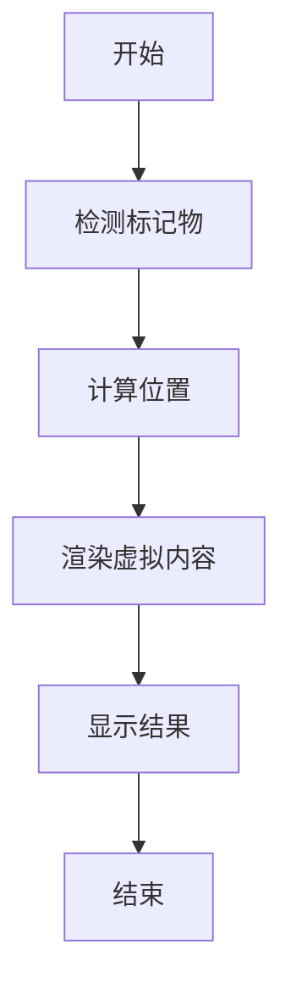
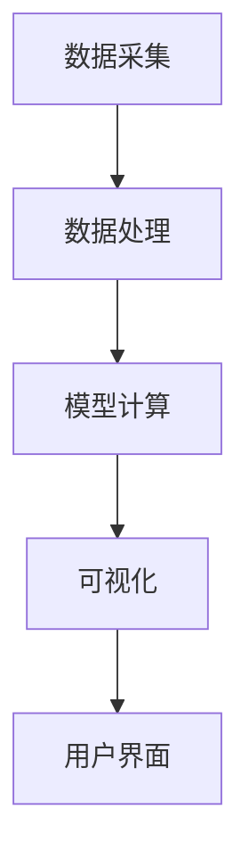

                 


# 全球股市估值与增强现实在工业设计中的应用

---

## 关键词  
全球股市估值、增强现实、工业设计、技术应用、算法、系统架构、案例分析

---

## 摘要  
本文探讨了全球股市估值与增强现实（AR）技术在工业设计中的应用，分析了两者结合的背景、原理及实际应用场景。通过详细讲解股市估值模型、AR技术的核心算法以及它们在系统架构中的集成，本文为读者提供了一种创新的视角，展示了如何利用AR技术提升股市分析的可视化与交互体验。文章还通过实际案例，演示了如何在工业设计中实现增强现实与股市估值的结合，为相关领域的研究与实践提供了参考。

---

## 目录大纲  

1. [背景介绍](#背景介绍)  
   1.1 [全球股市估值的基本概念](#全球股市估值的基本概念)  
   1.2 [增强现实技术的发展历程](#增强现实技术的发展历程)  
   1.3 [两者的结合与应用前景](#两者的结合与应用前景)  

2. [核心概念与原理](#核心概念与原理)  
   2.1 [股市估值模型](#股市估值模型)  
      2.1.1 [常见估值方法](#常见估值方法)  
      2.1.2 [数学模型与公式](#数学模型与公式)  
   2.2 [增强现实技术原理](#增强现实技术原理)  
      2.2.1 [AR的核心技术](#AR的核心技术)  
      2.2.2 [相关算法与流程图](#相关算法与流程图)  

3. [算法与系统架构](#算法与系统架构)  
   3.1 [算法原理](#算法原理)  
      3.1.1 [AR定位算法](#AR定位算法)  
      3.1.2 [股市预测模型](#股市预测模型)  
   3.2 [系统架构设计](#系统架构设计)  
      3.2.1 [系统模块划分](#系统模块划分)  
      3.2.2 [架构图展示](#架构图展示)  

4. [项目实战](#项目实战)  
   4.1 [案例分析](#案例分析)  
      4.1.1 [项目背景](#项目背景)  
      4.1.2 [实现步骤](#实现步骤)  
      4.1.3 [代码示例](#代码示例)  
   4.2 [项目总结](#项目总结)  

5. [总结与展望](#总结与展望)  
   5.1 [内容回顾](#内容回顾)  
   5.2 [未来展望](#未来展望)  

---

## 正文  

### [背景介绍](#背景介绍)  

#### [1.1 全球股市估值的基本概念](#全球股市估值的基本概念)  

全球股市估值是通过对上市公司财务数据的分析，评估其股票的内在价值。常见的估值方法包括市盈率（P/E）、市净率（P/B）和现金流折现模型（DCF）。这些方法帮助投资者判断股票是否被高估或低估，从而做出投资决策。  

#### [1.2 增强现实技术的发展历程](#增强现实技术的发展历程)  

增强现实（AR）是一种将虚拟信息叠加到真实环境中的技术，广泛应用于游戏、教育、医疗和工业设计等领域。AR的核心技术包括位置追踪、混合现实效果和用户交互，近年来随着计算机视觉和人工智能的发展，AR的应用场景不断拓展。  

#### [1.3 两者的结合与应用前景](#两者的结合与应用前景)  

将AR技术应用于股市估值，可以通过可视化的方式呈现复杂的财务数据，帮助投资者更直观地理解和分析股票的价值。例如，AR可以将实时股价数据叠加在虚拟股票 chart 上，提供沉浸式的交互体验。这种结合不仅提升了股市分析的效率，还为工业设计中的实时数据可视化提供了新的可能性。  

---

### [核心概念与原理](#核心概念与原理)  

#### [2.1 股市估值模型](#股市估值模型)  

##### [2.1.1 常见估值方法](#常见估值方法)  

1. **市盈率法（P/E）**  
   市盈率 = 股票价格 / 每股净利润  
   $$P/E = \frac{Price}{Earnings}$$  

2. **市净率法（P/B）**  
   市净率 = 股票价格 / 每股净资产  
   $$P/B = \frac{Price}{Book\ Value}$$  

3. **现金流折现模型（DCF）**  
   DCF = ∑ (自由现金流 / (1 + 折现率)^t)  
   $$DCF = \sum_{t=1}^{n} \frac{CF_t}{(1 + r)^t}$$  

##### [2.1.2 数学模型与公式](#数学模型与公式)  

通过上述公式，投资者可以对股票的内在价值进行量化评估。例如，假设某公司每股净利润为2元，股票价格为20元，则市盈率为10倍，表明该股票可能被市场低估。  

#### [2.2 增强现实技术原理](#增强现实技术原理)  

##### [2.2.1 AR的核心技术](#AR的核心技术)  

AR的核心技术包括：  
1. **位置追踪**：通过摄像头和传感器确定用户在现实环境中的位置。  
2. **混合现实效果**：将虚拟内容与真实环境无缝结合。  
3. **用户交互**：支持用户通过手势或语音与虚拟内容互动。  

##### [2.2.2 相关算法与流程图](#相关算法与流程图)  

以下是一个简单的AR算法流程图：



---

### [算法与系统架构](#算法与系统架构)  

#### [3.1 算法原理](#算法原理)  

##### [3.1.1 AR定位算法](#AR定位算法)  

AR定位算法通常基于特征点检测和匹配。以下是其实现步骤：  

1. 检测图像中的特征点（如角点）。  
2. 使用特征点进行图像匹配。  
3. 计算特征点的位置，确定虚拟内容的叠加位置。  

以下是Python代码示例：

```python
import cv2

# 加载图像
image = cv2.imread("target.jpg")
gray = cv2.cvtColor(image, cv2.COLOR_BGR2GRAY)

# 检测特征点
corners = cv2.cornerHarris(gray, 2, 2, 0.05)
image[corners > 0.01 * corners.max()] = [0, 0, 255]

cv2.imshow("特征点检测", image)
cv2.waitKey(0)
cv2.destroyAllWindows()
```

##### [3.1.2 股市预测模型](#股市预测模型)  

股市预测模型通常基于时间序列分析。以下是其实现步骤：  

1. 数据预处理（如标准化）。  
2. 训练模型（如LSTM）。  
3. 预测未来股价。  

以下是Python代码示例：

```python
import numpy as np
import tensorflow as tf

# 数据预处理
data = ...  # 加载数据
data_norm = (data - data.mean()) / data.std()

# 模型训练
model = tf.keras.models.Sequential([
    tf.keras.layers.LSTM(64, input_shape=(timesteps, features)),
    tf.keras.layers.Dense(1)
])
model.compile(optimizer='adam', loss='mse')
model.fit(data_norm, labels, epochs=100, batch_size=32)

# 预测
预测结果 = model.predict(test_data)
```

#### [3.2 系统架构设计](#系统架构设计)  

##### [3.2.1 系统模块划分](#系统模块划分)  

系统主要模块包括：  
1. 数据采集模块：采集股市数据和用户输入。  
2. 数据处理模块：对数据进行清洗和转换。  
3. 模型计算模块：基于AR算法计算虚拟内容的位置。  
4. 可视化模块：将虚拟内容叠加到真实环境中。  

##### [3.2.2 架构图展示](#架构图展示)  

以下是系统架构图：



---

### [项目实战](#项目实战)  

#### [4.1 案例分析](#案例分析)  

##### [4.1.1 项目背景](#项目背景)  

假设我们开发一个AR股市分析工具，用户可以通过手机摄像头查看叠加在真实环境中的虚拟股票 chart。  

##### [4.1.2 实现步骤](#实现步骤)  

1. 安装开发环境：  
   ```bash
   pip install numpy opencv-python tensorflow
   ```

2. 编写AR定位代码：  
   ```python
   import cv2

   def detect_ar_marker(image):
       gray = cv2.cvtColor(image, cv2.COLOR_BGR2GRAY)
       corners = cv2.cornerHarris(gray, 2, 2, 0.05)
       image[corners > 0.01 * corners.max()] = [0, 0, 255]
       return image
   ```

3. 项目总结：  
   通过本案例，我们展示了如何利用AR技术提升股市分析的可视化体验。这种方法不仅可以帮助投资者更直观地理解数据，还可以为工业设计中的实时数据叠加提供新的思路。

---

### [总结与展望](#总结与展望)  

#### [5.1 内容回顾](#内容回顾)  

本文详细探讨了全球股市估值与增强现实技术的结合，分析了它们的核心概念、算法原理和系统架构。通过实际案例，展示了如何利用AR技术提升股市分析的可视化与交互体验。

#### [5.2 未来展望](#未来展望)  

未来，随着AR技术的不断发展，其在股市估值中的应用将更加广泛。例如，可以通过AR技术实现更复杂的实时数据叠加和用户交互，进一步提升股市分析的效率和准确性。

---

通过本文的探讨，我们希望读者能够对全球股市估值与增强现实在工业设计中的应用有一个全面的了解，并为相关领域的研究与实践提供参考。

