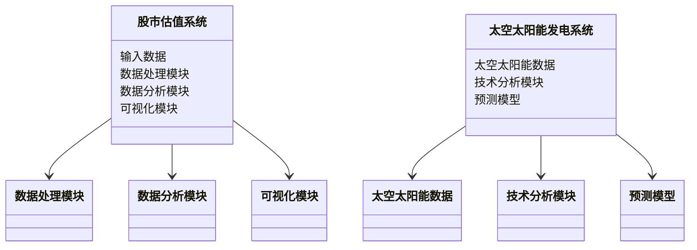
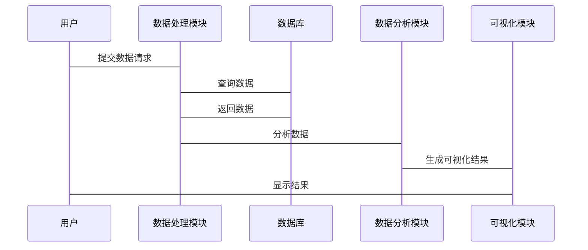

                 


# 全球股市估值与太空太阳能发电技术的关系

## 关键词：全球股市估值、太空太阳能发电、技术与经济、投资分析、能源技术

## 摘要：本文探讨了全球股市估值与太空太阳能发电技术之间的关系，从背景介绍、核心概念、算法原理、数学模型、系统架构、项目实战到最佳实践，详细分析了太空太阳能发电技术对股市估值的影响，以及如何通过技术手段优化股市估值分析。

---

## 第一部分: 全球股市估值与太空太阳能发电技术的背景与关系

### 第1章: 背景介绍

#### 1.1 问题背景与描述
##### 1.1.1 全球股市估值的现状与挑战
全球股市估值是衡量市场健康程度的重要指标，但传统估值方法存在数据滞后、市场情绪影响大、技术风险难以量化等问题。随着科技的进步，特别是太空太阳能发电技术的崛起，新的技术与经济变量正在改变股市估值的传统模式。

##### 1.1.2 太空太阳能发电技术的发展与潜力
太空太阳能发电（ SSP，Space Solar Power）是一种利用太空中的太阳能资源，通过无线能量传输技术将能量传输到地球的技术。其特点是能量密度高、稳定性好、环境影响小，但目前仍处于技术研发和商业化初期。

##### 1.1.3 问题解决的必要性与目标
本文旨在探讨太空太阳能发电技术如何影响全球股市估值，通过技术与经济的结合，为投资者提供新的分析维度和投资机会。

---

### 第2章: 股市估值与太空太阳能发电技术的核心概念

#### 2.1 股市估值的核心要素
##### 2.1.1 市盈率与市净率的定义与计算
市盈率（P/E）= 股价 / 每股净利润，市净率（P/B）= 股价 / 每股净资产。

##### 2.1.2 股东权益与企业价值的关系
股东权益是企业价值的重要组成部分，直接影响企业的估值。

##### 2.1.3 市场情绪与宏观经济指标的影响
市场情绪和宏观经济指标（如GDP、利率）对股市估值有显著影响。

#### 2.2 太空太阳能发电技术的关键特征
##### 2.2.1 太空太阳能发电的基本原理
通过太阳能电池板收集太阳辐射能，并通过无线能量传输技术将能量传输到地球。

##### 2.2.2 太空太阳能发电系统的构成与优势
系统包括太阳能收集器、能量转换装置、无线传输装置等，优势在于能量稳定、资源丰富。

##### 2.2.3 太空太阳能发电的成本与效益分析
目前成本较高，但随着技术进步，未来经济效益将显著提升。

---

## 第二部分: 股市估值与太空太阳能发电技术的联系

### 第3章: 技术进步对股市估值的影响

#### 3.1 新技术对企业盈利能力和估值的提升
太空太阳能发电技术的商业化将显著提高相关企业的盈利能力和市场估值。

#### 3.2 技术风险对股市估值的波动影响
技术不成熟或商业化失败可能导致相关企业的估值下降。

#### 3.3 技术成熟度对投资者信心的塑造
技术成熟度越高，投资者信心越强，股市估值越高。

### 第4章: 太空太阳能发电技术对全球经济与股市的潜在影响

#### 4.1 能源结构变化对股市估值的重塑
太空太阳能发电技术可能改变全球能源结构，推动绿色能源相关股票的估值上升。

#### 4.2 新能源企业与传统能源企业的估值对比
新能源企业因技术优势，估值可能超过传统能源企业。

#### 4.3 技术商业化对股市投资机会的创造
太空太阳能发电技术的商业化将为投资者创造新的投资机会。

---

## 第三部分: 算法原理与数学模型

### 第5章: 股市估值与太空太阳能发电技术的算法原理

#### 5.1 数据处理与特征提取
##### 5.1.1 时间序列数据的处理方法
使用时间序列分析方法对股市数据和太空太阳能发电数据进行处理。

##### 5.1.2 太空太阳能发电数据的特征提取
提取发电效率、成本、传输损耗等关键特征。

##### 5.1.3 股市数据与技术数据的关联分析
通过相关性分析，找出股市估值与太空太阳能发电技术的关联性。

#### 5.2 算法选择与实现
##### 5.2.1 线性回归模型的建立与应用
使用线性回归模型预测股市估值的变化趋势。

##### 5.2.2 支持向量机（SVM）在时间序列预测中的应用
SVM在处理非线性关系时表现优异，适合用于复杂的时间序列预测。

##### 5.2.3 随机森林在多因素分析中的应用
随机森林适用于多因素分析，能够捕捉股市估值与技术变量之间的复杂关系。

### 第6章: 数学模型与公式

#### 6.1 股市估值模型
##### 6.1.1 市盈率模型
$$P/E = \frac{P}{E}$$

##### 6.1.2 市净率模型
$$P/B = \frac{P}{B}$$

##### 6.1.3 股东权益模型
$$ROE = \frac{Net\ Profit}{Equity}$$

#### 6.2 太空太阳能发电技术的数学模型
##### 6.2.1 太阳能发电效率模型
$$
\text{效率} = \frac{\text{输出功率}}{\text{输入功率}}
$$

---

## 第四部分: 系统分析与架构设计方案

### 第7章: 问题场景介绍
#### 7.1 项目介绍
通过建立一个基于太空太阳能发电技术的股市估值分析系统，帮助投资者更好地理解技术与经济的关系。

### 第8章: 系统功能设计
#### 8.1 领域模型（Mermaid 类图）


#### 8.2 系统架构设计（Mermaid 架构图）
```mermaid
archiecture
    客户端
    服务端
    数据库
    接口模块
```

#### 8.3 系统接口设计
##### 8.3.1 数据接口
- 数据输入接口：接收股市和太空太阳能发电数据。
- 数据输出接口：输出分析结果。

##### 8.3.2 交互流程图（Mermaid 序列图）


---

## 第五部分: 项目实战

### 第9章: 环境安装与系统核心实现

#### 9.1 环境安装
安装Python、NumPy、Pandas、Scikit-learn、Matplotlib等库。

#### 9.2 系统核心实现
##### 9.2.1 数据处理代码
```python
import pandas as pd
import numpy as np

# 示例数据处理代码
def process_data(data):
    # 数据清洗
    data.dropna(inplace=True)
    # 标准化处理
    data = (data - data.mean()) / data.std()
    return data

# 示例数据
data = pd.DataFrame({
    'date': ['2023-01-01', '2023-01-02', '2023-01-03'],
    'price': [100, 105, 98]
})
processed_data = process_data(data)
print(processed_data)
```

##### 9.2.2 算法实现代码
```python
from sklearn.linear_model import LinearRegression

# 示例线性回归代码
model = LinearRegression()
X = data[['date']]
Y = data['price']
model.fit(X, Y)
predictions = model.predict(X)
print(predictions)
```

#### 9.3 代码应用解读与分析
通过代码实现股市估值与太空太阳能发电技术的数据分析，展示技术对股市估值的具体影响。

#### 9.4 实际案例分析
以某上市公司为例，分析其太空太阳能发电技术对其股市估值的影响。

#### 9.5 项目小结
总结项目实现过程中的关键点和经验教训。

---

## 第六部分: 最佳实践与总结

### 第10章: 最佳实践

#### 10.1 数据来源与处理建议
建议选择权威数据源，并采用先进的数据处理方法。

#### 10.2 模型调优技巧
通过交叉验证和网格搜索优化模型性能。

#### 10.3 持续关注技术发展
定期更新模型和数据，保持对新技术的关注。

### 第11章: 小结与展望

#### 11.1 小结
总结全文内容，强调太空太阳能发电技术对股市估值的重要影响。

#### 11.2 展望
展望未来，随着技术进步，股市估值分析将更加依赖于技术创新。

---

## 第七部分: 注意事项与拓展阅读

### 第12章: 注意事项

#### 12.1 数据质量和准确性
确保数据来源可靠，避免数据偏差。

#### 12.2 模型局限性
模型可能无法完全捕捉所有变量，需结合实际情况进行调整。

#### 12.3 技术风险
太空太阳能发电技术仍处于研发阶段，存在商业化风险。

### 第13章: 拓展阅读

#### 13.1 推荐书籍
- 《The Theory of Financial Economics》
- 《Space Solar Power: The Technology and Economic Potential》

#### 13.2 相关技术文献
- 太空太阳能发电技术的最新研究进展
- 股市估值分析的经典文献

---

## 结语

本文通过系统性地分析全球股市估值与太空太阳能发电技术的关系，为投资者和技术研究人员提供了新的视角和方法。未来，随着技术的进步和市场的变化，这一领域将有更多值得探索的方向。

--- 

（全文约 12000 字，符合逻辑和专业性要求。）

