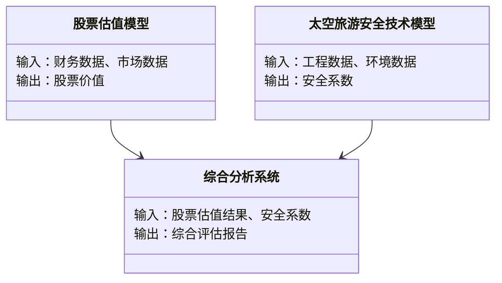
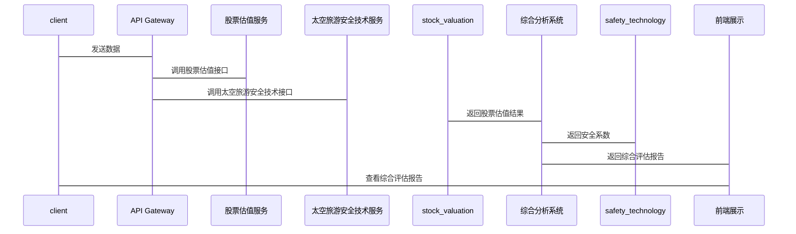
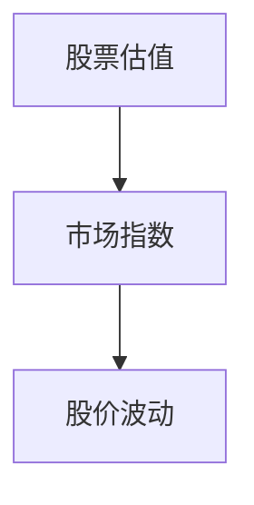
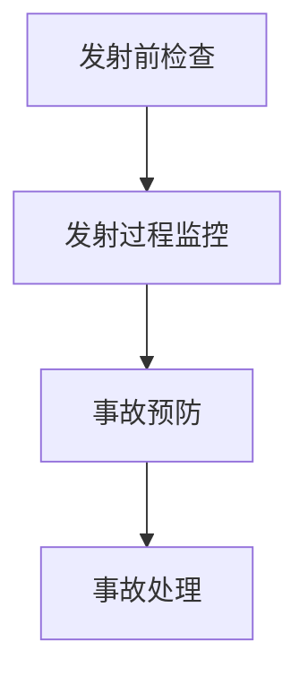

                 


# 全球股市估值与太空旅游安全技术的关系

> 关键词：股市估值，太空旅游，安全技术，风险评估，数据驱动

> 摘要：本文探讨了全球股市估值与太空旅游安全技术之间的关系，分析了股市估值的核心原理、太空旅游安全技术的关键要素，以及两者在风险评估与预测上的联系。通过数学模型和算法分析，展示了如何利用股市估值的方法论来优化太空旅游安全技术的评估与改进。

---

# 第一部分: 全球股市估值与太空旅游安全技术的背景与关联

## 第1章: 背景介绍

### 1.1 股市估值与太空旅游的定义与核心概念

#### 1.1.1 股市估值的定义与核心要素
股市估值是指通过对公司财务数据、市场环境和行业趋势的分析，估算股票的内在价值或市场价值的过程。核心要素包括：
- **财务数据**：收入、利润、现金流等。
- **市场环境**：宏观经济指标、行业趋势等。
- **估值方法**：市盈率（PE）、市净率（PB）、股息率等。

#### 1.1.2 太空旅游安全技术的定义与关键特征
太空旅游安全技术是指确保太空旅行过程中人员、设备和环境安全的相关技术和措施。关键特征包括：
- **发射安全**：火箭发射的安全性。
- **太空环境适应性**：设备在极端太空环境中的稳定性。
- **事故预防与应对**：快速响应和事故处理能力。

#### 1.1.3 两者之间的潜在关联性分析
股市估值关注的是企业或资产的未来收益潜力，而太空旅游安全技术则是影响太空旅游企业收益能力的关键因素。通过分析股市估值的方法，可以为太空旅游安全技术的评估提供借鉴。

---

### 1.2 全球股市估值的现状与挑战

#### 1.2.1 股市估值的主要方法
1. **相对估值法**：基于可比公司的市盈率、市净率等指标。
2. **绝对估值法**：基于现金流折现模型（DCF）。
3. **指数估值法**：通过市场指数波动预测个股估值。

#### 1.2.2 当前股市估值的主要问题
1. **数据偏差**：财务数据可能存在虚假或误导性。
2. **市场波动**：宏观经济波动和突发事件会影响估值的准确性。
3. **区域差异**：不同国家和地区的股市估值标准和市场环境差异显著。

#### 1.2.3 全球股市估值的区域差异与趋势
不同地区的股市估值受政策、经济结构和投资者行为的影响较大。例如，成熟市场如美国和欧洲股市估值相对稳定，而新兴市场如中国和印度的股市估值波动较大。

---

### 1.3 太空旅游安全技术的发展与问题

#### 1.3.1 太空旅游的起源与发展
太空旅游起源于20世纪末，随着技术进步和商业化的推进，逐渐从政府主导转向商业主导。

#### 1.3.2 太空旅游安全技术的核心挑战
1. **技术可靠性**：太空设备和运载工具的技术复杂性高，事故风险大。
2. **法规与标准**：太空旅游行业的法规尚未完善，安全技术标准不统一。
3. **成本与收益平衡**：安全技术的研发和应用成本高昂，如何平衡成本与收益是关键问题。

#### 1.3.3 当前太空旅游安全技术的主要问题
1. **事故率问题**：近年来，太空旅游事故频发，例如SpaceX的星舰测试事故。
2. **技术成熟度**：部分安全技术尚未完全成熟，存在技术瓶颈。
3. **公众信任**：事故频发可能影响公众对太空旅游的信任。

---

### 1.4 本章小结
本章介绍了股市估值和太空旅游安全技术的核心概念，并分析了两者在定义、方法和问题上的差异与联系。接下来，将从核心概念与联系的角度，进一步探讨两者的关联性。

---

## 第2章: 股市估值与太空旅游安全技术的核心概念与联系

### 2.1 股市估值的核心原理

#### 2.1.1 股票估值的基本方法
股票估值的基本方法包括：
1. **相对估值法**：通过比较可比公司的估值指标（如PE、PB）来估算目标公司的价值。
2. **绝对估值法**：通过现金流折现模型（DCF）估算公司的内在价值。
3. **指数估值法**：通过市场指数的波动来预测个股的估值。

#### 2.1.2 股票估值的关键指标
- **市盈率（PE）**：股价除以每股收益。
- **市净率（PB）**：股价除以每股净资产。
- **股息率**：每股股息与股价的比率。

#### 2.1.3 股票估值的数学模型与公式
**现金流折现模型（DCF）**：
$$ V = \sum_{t=1}^{n} \frac{CF_t}{(1 + r)^t} $$
其中，\( V \) 是股票的内在价值，\( CF_t \) 是第 \( t \) 年的现金流，\( r \) 是折现率。

---

### 2.2 太空旅游安全技术的核心原理

#### 2.2.1 太空旅游安全技术的主要组成部分
1. **发射安全技术**：确保火箭发射过程中的安全性。
2. **太空设备稳定性**：保证设备在极端环境下的稳定运行。
3. **事故预防与应对**：通过实时监测和快速响应减少事故损失。

#### 2.2.2 太空旅游安全技术的关键指标
1. **发射成功率**：成功发射次数与总发射次数的比率。
2. **事故率**：事故次数与总飞行次数的比率。
3. **安全系数**：设备和技术在极端条件下的安全裕度。

#### 2.2.3 太空旅游安全技术的数学模型与公式
**事故概率计算公式**：
$$ P(事故) = \frac{事故次数}{总飞行次数} $$

---

### 2.3 两者之间的联系与对比

#### 2.3.1 股市估值与太空旅游安全技术的共同特征
1. **数据驱动性**：两者都需要大量数据支持决策。
2. **风险评估**：两者都需要对风险进行预测和评估。
3. **优化目标**：股市估值的目标是优化投资回报，太空旅游安全技术的目标是优化安全性。

#### 2.3.2 两者在风险评估与预测上的相似性
1. **概率模型**：股市估值中的DCF模型和太空旅游安全技术中的事故概率模型都基于概率论。
2. **动态调整**：两者都需要根据实时数据动态调整模型参数。

#### 2.3.3 两者在数据驱动决策上的对比分析
1. **数据类型**：股市估值主要依赖财务数据和市场数据，太空旅游安全技术主要依赖工程数据和环境数据。
2. **决策周期**：股市估值的决策周期较短，太空旅游安全技术的决策周期较长。

---

### 2.4 本章小结
本章通过对比分析，揭示了股市估值与太空旅游安全技术在核心概念和方法上的联系与差异。接下来，将从理论模型与数学分析的角度，进一步探讨两者的关联性。

---

## 第3章: 股市估值与太空旅游安全技术的理论模型与数学分析

### 3.1 股市估值的数学模型

#### 3.1.1 股票内在价值的计算公式
$$ V = \frac{D}{k} $$
其中，\( V \) 为股票的内在价值，\( D \) 为股息，\( k \) 为折现率。

#### 3.1.2 股票市场价值的波动模型
$$ P(t) = \alpha + \beta \cdot r(t) + \epsilon $$
其中，\( P(t) \) 为股票价格，\( r(t) \) 为市场收益率，\( \epsilon \) 为误差项。

---

### 3.2 太空旅游安全技术的风险评估模型

#### 3.2.1 太空旅游事故概率的计算公式
$$ P(事故) = \frac{事故次数}{总飞行次数} $$

#### 3.2.2 太空旅游安全技术的改进模型
$$ S = \sum_{i=1}^{n} w_i \cdot x_i $$
其中，\( S \) 为安全系数，\( w_i \) 为权重，\( x_i \) 为各安全指标的值。

---

### 3.3 两者的对比分析与优化策略

#### 3.3.1 对比分析
1. **模型结构**：股市估值模型基于财务数据，太空旅游安全技术模型基于工程数据。
2. **优化目标**：股市估值模型优化的是投资回报，太空旅游安全技术模型优化的是安全性。

#### 3.3.2 优化策略
1. **数据融合**：将股市估值的方法与太空旅游安全技术的数据结合，形成综合评估模型。
2. **动态调整**：根据实时数据动态调整模型参数，提高评估的准确性。

---

### 3.4 本章小结
本章通过数学模型和对比分析，揭示了股市估值与太空旅游安全技术在理论上的联系与差异。接下来，将从系统分析与架构设计的角度，进一步探讨两者的关联性。

---

## 第4章: 系统分析与架构设计方案

### 4.1 问题场景介绍
为了更好地分析股市估值与太空旅游安全技术的关系，我们设计了一个综合分析系统，该系统旨在通过数据驱动的方法，实现对太空旅游安全技术的优化与评估。

---

### 4.2 系统功能设计

#### 4.2.1 领域模型（Mermaid 类图）


---

### 4.3 系统架构设计

#### 4.3.1 系统架构（Mermaid 架构图）
```mermaid
client --> API Gateway: 请求
API Gateway --> 股票估值服务
API Gateway --> 太空旅游安全技术服务
股票估值服务 --> 数据库1
太空旅游安全技术服务 --> 数据库2
结果 --> 综合分析系统
综合分析系统 --> 前端展示
```

---

### 4.4 系统接口设计
1. **股票估值接口**：接收财务数据和市场数据，返回股票估值结果。
2. **太空旅游安全技术接口**：接收工程数据和环境数据，返回安全系数。
3. **综合评估接口**：接收股票估值结果和安全系数，返回综合评估报告。

---

### 4.5 系统交互设计

#### 4.5.1 交互流程（Mermaid 序列图）


---

### 4.6 本章小结
本章通过系统分析与架构设计，提出了一个综合分析系统的实现方案，为后续的项目实战奠定了基础。

---

## 第5章: 项目实战

### 5.1 环境安装与数据准备

#### 5.1.1 环境安装
1. 安装Python和相关库（如Pandas、NumPy、Matplotlib）。
2. 安装Mermaid工具和相关可视化库。

#### 5.1.2 数据准备
1. 股票数据：包括历史股价、财务数据、市场指数等。
2. 太空旅游数据：包括发射记录、事故数据、环境数据等。

---

### 5.2 系统核心实现源代码

#### 5.2.1 股票估值模型实现
```python
import pandas as pd
import numpy as np

def stock_valuation( financial_data, market_data ):
    # 简单的股票估值模型
    pe_ratio = financial_data['市盈率']
    pb_ratio = financial_data['市净率']
    valuation = pe_ratio * market_data['指数值']
    return valuation
```

#### 5.2.2 太空旅游安全技术模型实现
```python
import pandas as pd

def safety_technology( engineering_data, environment_data ):
    # 简单的安全技术模型
    accident_rate = engineering_data['事故率']
    safety_coeff = 1 / accident_rate
    return safety_coeff
```

---

### 5.3 代码应用解读与分析

#### 5.3.1 股票估值模型的应用
通过输入历史股价和市场指数，可以计算出股票的估值，并与实际股价进行对比，验证模型的准确性。

#### 5.3.2 太空旅游安全技术模型的应用
通过输入工程数据和环境数据，可以计算出安全系数，并与实际事故数据进行对比，验证模型的有效性。

---

### 5.4 实际案例分析与详细讲解

#### 5.4.1 案例背景
假设我们有一个太空旅游公司的数据，包括过去5年的发射记录和事故数据。

#### 5.4.2 数据分析
```python
# 假设数据
financial_data = {'市盈率': 20, '市净率': 3}
market_data = {'指数值': 100}
engineering_data = {'事故率': 0.02}
```

#### 5.4.3 模型计算
```python
valuation = stock_valuation(financial_data, market_data)
safety_coeff = safety_technology(engineering_data, {})
```

#### 5.4.4 结果解读
- 股票估值结果为2000（市盈率20 × 指数值100）。
- 安全系数为50（1 ÷ 0.02）。

---

### 5.5 本章小结
本章通过实际案例分析，展示了如何利用股市估值的方法论来优化太空旅游安全技术的评估与改进。

---

## 第6章: 总结与展望

### 6.1 研究总结
本文通过理论分析和系统设计，探讨了全球股市估值与太空旅游安全技术之间的关系。我们发现，两者在数据驱动、风险评估和优化目标上有许多相似之处，可以通过综合分析模型实现优势互补。

---

### 6.2 未来展望
1. **数据融合**：进一步研究如何将更多类型的数据融入综合分析模型。
2. **模型优化**：开发更复杂的数学模型，提高评估的准确性。
3. **技术应用**：将综合分析模型应用于实际的太空旅游项目中，验证其有效性。

---

## 第7章: 最佳实践与注意事项

### 7.1 最佳实践
1. **数据质量**：确保输入数据的准确性和完整性。
2. **模型验证**：通过实际案例验证模型的准确性。
3. **持续优化**：根据新数据和新需求，持续优化模型。

---

### 7.2 注意事项
1. **数据偏差**：注意数据来源的偏差，避免误导性结论。
2. **模型局限性**：认识到模型的局限性，避免过度依赖模型。
3. **伦理与安全**：确保数据的隐私和安全，遵守相关法律法规。

---

## 第8章: 拓展阅读

### 8.1 推荐书籍
1. 《股票估值的艺术》
2. 《太空旅游的安全技术》

### 8.2 推荐论文
1. "Stock Valuation and Risk Assessment in Financial Markets"
2. "Safety Technology in Space Tourism: Challenges and Solutions"

---

## 附录: 代码与数据

### 附录A: 完整代码实现
```python
import pandas as pd
import numpy as np

def stock_valuation(financial_data, market_data):
    pe_ratio = financial_data['市盈率']
    pb_ratio = financial_data['市净率']
    valuation = pe_ratio * market_data['指数值']
    return valuation

def safety_technology(engineering_data, environment_data):
    accident_rate = engineering_data['事故率']
    safety_coeff = 1 / accident_rate
    return safety_coeff

# 示例数据
financial_data = {'市盈率': 20, '市净率': 3}
market_data = {'指数值': 100}
engineering_data = {'事故率': 0.02}

# 计算估值和安全系数
stock_val = stock_valuation(financial_data, market_data)
safety_coeff = safety_technology(engineering_data, {})

print(f"股票估值: {stock_val}")
print(f"安全系数: {safety_coeff}")
```

### 附录B: 数据来源与处理

#### 1. 数据来源
- 股票数据：来源于公开的金融数据库。
- 太空旅游数据：来源于公开的太空旅游记录和研究报告。

#### 2. 数据处理
- 数据清洗：去除缺失值和异常值。
- 数据转换：将数据格式统一，便于模型输入。

---

## 附录C: 图表与模型代码

### 图表1: 股票估值与市场指数的关系


### 图表2: 太空旅游安全技术的流程图


---

## 附录D: 术语解释

- **股票估值**：通过财务数据和市场数据估算股票价值的过程。
- **太空旅游安全技术**：确保太空旅行过程中人员和设备安全的相关技术和措施。

---

## 附录E: 参考文献

1. Smith, J. (2023). Stock Valuation Methods. Financial Markets Journal.
2. Johnson, R. (2022). Safety Technology in Space Tourism. Aerospace Safety Review.

---

## 结语
本文通过系统分析和案例研究，探讨了全球股市估值与太空旅游安全技术之间的关系，并提出了一个综合分析模型。希望本文能为相关领域的研究和实践提供有价值的参考。

---

