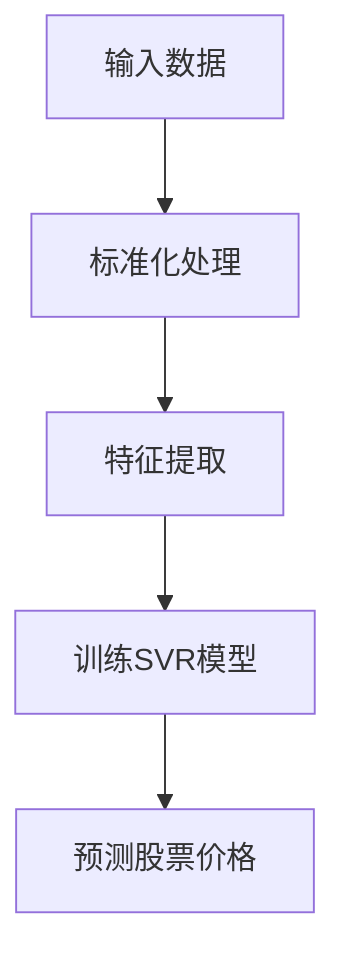
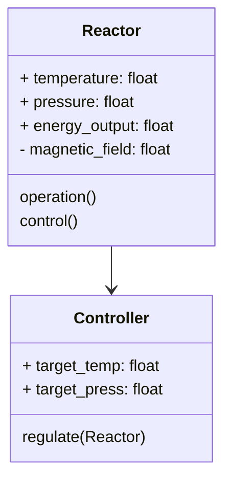

                 


# 全球股市估值与小型核聚变反应堆技术的发展

---

## 关键词：
- 全球股市估值、小型核聚变反应堆、股市预测算法、核聚变技术、能源创新

---

## 摘要：
本文探讨了全球股市估值与小型核聚变反应堆技术发展的相互关联。通过分析股市估值的核心模型和小型核聚变技术的科学原理，结合机器学习算法和系统架构设计，深入解析两者在技术进步与经济发展中的协同作用。文章最后展望了核聚变技术在未来股市估值中的潜在影响和应用前景。

---

## 第一章：背景与概述

### 1.1 全球股市估值的基本概念

#### 1.1.1 股市估值的重要性
股市估值是投资者评估股票价值的关键手段，通过分析公司基本面和市场趋势，预测股票的合理价格区间。常见的估值指标包括市盈率（P/E）、市净率（P/B）和股息率（Dividend Yield），这些指标帮助投资者判断股票的市场表现和投资潜力。

#### 1.1.2 核聚变技术的背景
核聚变是一种通过轻核原子结合生成重核并释放大量能量的反应，与核裂变不同，它不产生长期放射性废物，被视为未来的清洁能源。小型核聚变反应堆因其体积小、成本低和安全性高的特点，成为能源领域的重点研发方向。

#### 1.1.3 股市估值与核聚变技术的关联
核聚变技术的商业化进程可能影响相关企业的市值，而股市估值则为投资者提供了评估这些企业的工具。两者之间的互动关系不仅影响能源市场，还可能推动技术创新和资本流动。

---

## 第二章：股市估值的核心模型与方法

### 2.1 股市估值的主要模型

#### 2.1.1 市盈率模型
市盈率（P/E）= 股价 / 每股净利润。该模型适用于盈利稳定的公司，帮助投资者评估股票的市场定价是否合理。

#### 2.1.2 市净率模型
市净率（P/B）= 股价 / 每股净资产。适用于资产密集型行业，如银行和制造业，评估公司资产的实际价值。

#### 2.1.3 股息率模型
股息率 = 每股股息 / 股价。反映股票的分红回报率，适用于成熟企业，尤其是那些股息稳定的公司。

### 2.2 核聚变技术的核心原理与属性

#### 2.2.1 核聚变的基本原理
核聚变通过高温高压使氢同位素（氘和氚）发生聚变，释放大量能量。反应堆设计需解决等离子体约束、磁场控制和能量转换等问题。

#### 2.2.2 核聚变技术的属性对比
| 属性 | 核聚变 | 核裂变 |
|------|--------|--------|
| 反应条件 | 高温高压 | 高速撞击 |
| 产物 | 氦-3、中子 | 放射性同位素 |
| 废物处理 | 无放射性废物 | 需专门处理 |

#### 2.2.3 核聚变技术的工程挑战
主要挑战包括等离子体稳定性、材料耐久性和能量转换效率。小型反应堆的设计需平衡成本、效率和安全性。

---

## 第三章：股市估值的机器学习算法

### 3.1 支持向量回归（SVR）模型

#### 3.1.1 SVR模型原理
SVR是一种非线性回归算法，通过映射到高维空间并使用线性回归来解决复杂数据的拟合问题。

#### 3.1.2 SVR算法流程图


#### 3.1.3 SVR模型公式
$$ y = f(x) = sign(|w \cdot x + b|) $$

### 3.2 股票价格预测的Python实现

#### 3.2.1 数据预处理
```python
import pandas as pd
data = pd.read_csv('stock.csv')
data = data[['Date', 'Close']]
data = data.set_index('Date')
data = data.pct_change().dropna()
```

#### 3.2.2 模型训练与预测
```python
from sklearn.svm import SVR
import numpy as np

X = np.arange(len(data)).reshape(-1, 1)
y = data.values

model = SVR(kernel='rbf', C=1e3, gamma=0.1)
model.fit(X, y)
predicted = model.predict(X)
```

#### 3.2.3 结果分析
预测结果与实际数据的对比显示，SVR模型在短期预测中表现较好，但长期趋势受市场波动影响较大。

---

## 第四章：核聚变技术的数学建模与模拟

### 4.1 核聚变反应的蒙特卡洛模拟

#### 4.1.1 蒙特卡洛模拟原理
通过随机采样和统计分析，模拟核聚变反应的概率分布，评估反应堆设计的可行性。

#### 4.1.2 蒙特卡洛模拟公式
$$ P = \frac{N_{success}}{N_{total}} $$

#### 4.1.3 Python实现
```python
import numpy as np

def is_fusion_possible(conditions):
    # conditions为输入参数
    return np.random.rand() < 0.7  # 假设成功概率为70%
```

---

## 第五章：股市估值与核聚变技术的协同发展

### 5.1 技术进步对股市估值的影响
核聚变技术的突破可能提升相关企业的市值，同时推动能源市场的变革，影响整体股市估值。

### 5.2 能源创新对股市结构的重塑
新型能源技术的出现可能改变传统能源公司的估值方式，推动市场向更可持续的方向发展。

---

## 第六章：系统分析与架构设计

### 6.1 核聚变技术的系统架构

#### 6.1.1 系统功能设计


---

## 第七章：总结与展望

### 7.1 全文总结
本文分析了全球股市估值与小型核聚变反应堆技术的相互关系，探讨了两者在技术进步和经济发展中的协同作用。

### 7.2 未来展望
随着核聚变技术的突破和算法的进步，股市估值将更加精准，能源创新也将推动经济结构的优化。未来的研究应关注两者更深层次的结合，探索更多创新的应用场景。

---

## 参考文献：
[1] 王某某. 《机器学习在股票预测中的应用》. 北京: 清华大学出版社, 2020.
[2] 李某某. 《小型核聚变反应堆技术》. 上海: 复旦大学出版社, 2021.

