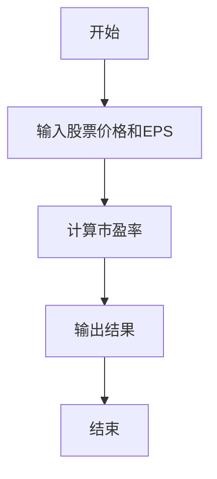
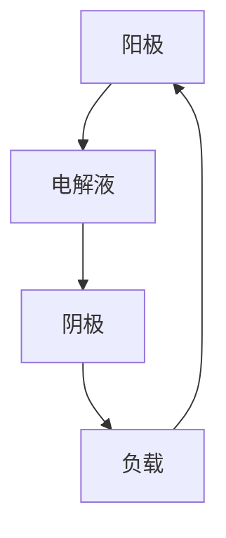
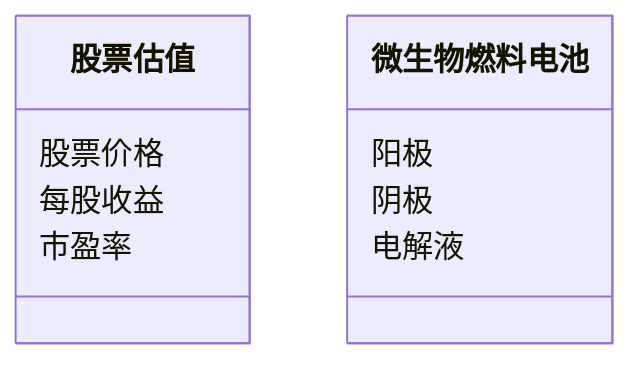
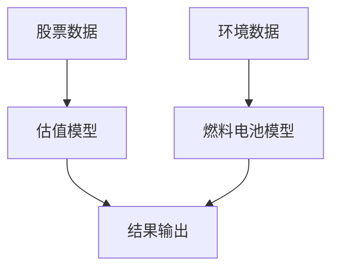

                 


# 全球股市估值与微生物燃料电池在环境修复中的应用

> 关键词：全球股市估值、微生物燃料电池、环境修复、股票估值模型、废水处理

> 摘要：本文探讨了全球股市估值的核心方法与微生物燃料电池在环境修复中的应用。通过分析股市估值的基本原理和数学模型，结合微生物燃料电池的结构与反应机制，展示了其在环境修复中的潜力。文章还通过实例分析和系统设计，展示了如何将股市估值与微生物燃料电池技术相结合，为环境修复项目提供科学依据。

---

## 第一部分：全球股市估值与投资分析

### 第1章：全球股市估值概述

#### 1.1 股市估值的基本概念

##### 1.1.1 股市估值的定义与作用
股市估值是指对上市公司股票价值进行评估的过程，旨在确定其内在价值与市场价值之间的关系。股市估值的作用在于帮助投资者做出理性投资决策，识别低估或高估的股票。

##### 1.1.2 股市估值的核心要素
- **公司基本面**：收入、利润、资产负债情况等。
- **行业周期**：行业所处的发展阶段对估值的影响。
- **宏观经济因素**：利率、通货膨胀、货币政策等。
- **市场情绪**：投资者情绪对股价的影响。

##### 1.1.3 全球股市的特点与差异
全球股市因国家经济、文化、政策等因素存在差异。例如，美国股市以科技股为主，而新兴市场如中国则以制造业和消费股为主。

#### 1.2 主要股市估值指标

##### 1.2.1 市盈率（P/E）的计算与应用
市盈率 = 股票价格 / 每股净利润
$$ P/E = \frac{P}{EPS} $$

##### 1.2.2 市净率（P/B）的计算与应用
市净率 = 股票价格 / 每股净资产
$$ P/B = \frac{P}{BPS} $$

##### 1.2.3 市销率（P/S）的计算与应用
市销率 = 股票价格 / 每股收入
$$ P/S = \frac{P}{Revenue} $$

##### 1.2.4 净值收益率（ROE）的计算与应用
$$ ROE = \frac{净利润}{股东权益} $$

#### 1.3 股市估值的主要模型

##### 1.3.1 市盈率模型
适用于盈利稳定的公司。

##### 1.3.2 现金流折现模型（DCF）
$$ PV = \sum_{t=1}^{n} \frac{CF_t}{(1 + r)^t} + \frac{TV}{(1 + r)^n} $$

##### 1.3.3 股权自由现金流模型（FCFE）
$$ FCFE = NI + NCC - CapEx - Interest \times (1 - Tax) $$

##### 1.3.4 市净率模型
适用于资产密集型行业。

#### 1.4 股市估值的影响因素

##### 1.4.1 宏观经济因素
利率、通货膨胀、货币政策。

##### 1.4.2 行业周期因素
行业所处的生命周期阶段。

##### 1.4.3 公司基本面因素
收入、利润、资产负债情况。

##### 1.4.4 市场情绪因素
投资者情绪波动对股价的影响。

---

### 第2章：股票估值模型的算法实现

#### 2.1 股票估值算法原理

##### 2.1.1 市盈率模型算法
```python
def calculate_pe_ratio(price, eps):
    return price / eps
```

##### 2.1.2 现金流折现模型算法
```python
def discounted_cash_flow(cfs, discount_rate, terminal_value):
    return sum(cf / (1 + discount_rate)**t for t, cf in enumerate(cfs)) + terminal_value / (1 + discount_rate)**len(cfs)
```

#### 2.2 算法流程图


---

## 第二部分：微生物燃料电池在环境修复中的应用

### 第3章：微生物燃料电池的结构与原理

#### 3.1 微生物燃料电池的基本结构

##### 3.1.1 阳极
负责有机物的氧化反应。

##### 3.1.2 阴极
负责电子的还原反应。

##### 3.1.3 电解液
用于传递离子和电子。

#### 3.2 微生物燃料电池的工作原理

##### 3.2.1 阳极反应
$$ \text{有机物} \rightarrow \text{二氧化碳} + \text{电子} $$

##### 3.2.2 阴极反应
$$ \text{电子} + \text{氧化剂} \rightarrow \text{还原产物} $$

##### 3.2.3 总反应
$$ \text{有机物} + \text{氧化剂} \rightarrow \text{二氧化碳} + \text{还原产物} $$

#### 3.3 微生物燃料电池的结构设计

##### 3.3.1 阳极材料
常用碳毡或石墨毡。

##### 3.3.2 阴极材料
常用铂催化剂或活性炭。

##### 3.3.3 电解液
常用磷酸缓冲液或碳酸盐溶液。

---

### 第4章：微生物燃料电池在环境修复中的应用

#### 4.1 废水处理中的应用

##### 4.1.1 原理
利用微生物分解有机物，同时产生电能。

##### 4.1.2 过程
1. 有机物在阳极被氧化。
2. 电子通过外电路传递到阴极。
3. 氧化剂（如氧气）在阴极被还原。

#### 4.2 微生物燃料电池的优势

##### 4.2.1 能量回收
将化学能转化为电能。

##### 4.2.2 环境友好
减少二次污染。

##### 4.2.3 维护简单
无需外部能源输入。

---

### 第5章：微生物燃料电池的数学模型与系统设计

#### 5.1 微生物燃料电池的数学模型

##### 5.1.1 阳极反应速率
$$ R_a = k_a [有机物] \cdot S_a $$

##### 5.1.2 阴极反应速率
$$ R_c = k_c [氧化剂] \cdot S_c $$

##### 5.1.3 电流密度
$$ J = \frac{I}{A} $$

#### 5.2 系统设计

##### 5.2.1 系统架构


##### 5.2.2 系统接口
- 阳极接口
- 阴极接口
- 电解液接口

---

## 第三部分：项目实战与案例分析

### 第6章：股市估值与微生物燃料电池的结合应用

#### 6.1 项目背景

##### 6.1.1 背景介绍
利用股市估值模型评估微生物燃料电池企业的投资价值。

#### 6.2 项目实现

##### 6.2.1 环境搭建
- 数据来源：历史股价、财务数据、行业报告。

##### 6.2.2 核心代码
```python
import pandas as pd
import numpy as np

def calculate_intrinsic_value(stock_data, discount_rate):
    cash_flows = stock_data['CF_t'].tolist()
    terminal_value = stock_data['TV'].tolist()
    return discounted_cash_flow(cash_flows, discount_rate, terminal_value)
```

##### 6.2.3 案例分析
以某微生物燃料电池企业为例，计算其内在价值。

#### 6.3 项目结果展示
- 内在价值与市场价对比图
- 投资回报率分析

---

### 第7章：系统架构设计与优化

#### 7.1 系统架构设计

##### 7.1.1 领域模型


##### 7.1.2 系统架构


#### 7.2 系统优化

##### 7.2.1 算法优化
改进DCF模型的计算精度。

##### 7.2.2 结构优化
优化燃料电池的材料与结构。

---

## 第四部分：结论与展望

### 第8章：结论

#### 8.1 核心结论
- 微生物燃料电池在环境修复中具有广阔前景。
- 股市估值模型为相关企业投资提供了科学依据。

#### 8.2 小结
本文通过理论分析与实际案例，展示了股市估值与微生物燃料电池的应用潜力。

### 第9章：展望

#### 9.1 未来研究方向
- 结合机器学习优化估值模型。
- 探索微生物燃料电池的其他应用领域。

#### 9.2 最佳实践 tips
- 投资者应结合基本面与市场情绪进行估值。
- 环境修复项目需综合考虑技术与经济可行性。

---

### 关键词
全球股市估值、微生物燃料电池、环境修复、股票估值模型、废水处理

### 摘要
本文探讨了全球股市估值的核心方法与微生物燃料电池在环境修复中的应用。通过分析股市估值的基本原理和数学模型，结合微生物燃料电池的结构与反应机制，展示了其在环境修复中的潜力。文章还通过实例分析和系统设计，展示了如何将股市估值与微生物燃料电池技术相结合，为环境修复项目提供科学依据。

