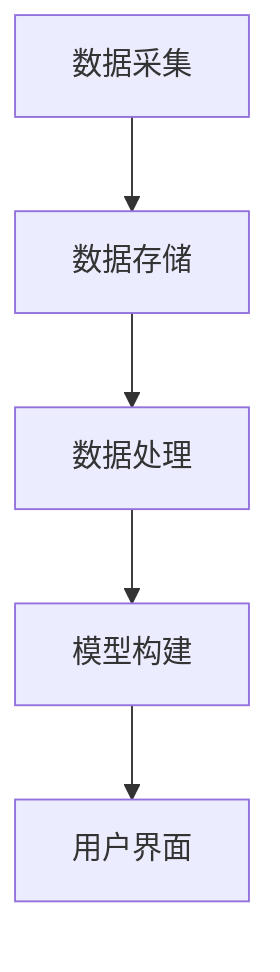

                 


# 全球股市估值与数字孪生技术的关联

> 关键词：全球股市估值，数字孪生技术，金融建模，实时数据同步，数据融合，机器学习，系统架构设计

> 摘要：本文探讨了全球股市估值与数字孪生技术之间的关联，通过详细分析数字孪生技术的核心概念、算法原理及其在股市估值中的应用，展示了数字孪生技术如何提升股市估值的准确性和实时性。文章内容涵盖背景介绍、核心概念对比、算法模型、系统架构设计以及项目实战，旨在为读者提供全面的技术视角。

---

## 第一章: 全球股市估值与数字孪生技术的关联概述

### 1.1 全球股市估值的背景与意义

#### 1.1.1 全球股市估值的基本概念
全球股市估值是指对股票市场的整体或个股的价值进行评估，通常基于企业的财务状况、市场环境和宏观经济指标。常用的估值方法包括市盈率（P/E）、市净率（P/B）和股息率（Dividend Yield）等。

#### 1.1.2 全球股市估值的重要性
股市估值是投资者做出投资决策的重要依据，也是企业融资和经济政策制定的关键参考。准确的估值能够帮助投资者识别市场机会和风险，优化资源配置。

#### 1.1.3 数字孪生技术的定义与特点
数字孪生（Digital Twin）是物理世界与数字世界之间的动态对等体，具有实时性、交互性、预测性等特点。它通过数据采集、模型构建和实时更新，实现对物理对象的精确模拟。

### 1.2 数字孪生技术的核心概念

#### 1.2.1 数字孪生的定义
数字孪生是通过数据建模和实时数据同步，创建物理对象的虚拟副本，以便进行分析、优化和预测。

#### 1.2.2 数字孪生的核心特征
- **实时性**：数据实时更新，反映物理对象的最新状态。
- **交互性**：用户可以通过虚拟模型与物理对象进行互动。
- **预测性**：基于历史数据和模型，预测未来状态。

#### 1.2.3 数字孪生与传统技术的区别

| 特性         | 数字孪生               | 传统技术             |
|--------------|-----------------------|----------------------|
| 数据来源     | 多源实时数据           | 单一数据源           |
| 实时性       | 高                    | 低                  |
| 可视化       | 高度交互式可视化       | 静态可视化            |

### 1.3 本章小结

- 全球股市估值是金融市场的重要组成部分，数字孪生技术为提升估值的准确性和实时性提供了新的可能性。
- 通过数字孪生技术，可以构建动态的股票估值模型，实时反映市场变化。

---

## 第二章: 全球股市估值的核心算法与模型

### 2.1 常见的股市估值方法

#### 2.1.1 市盈率法
市盈率（P/E）是衡量股票估值的重要指标，计算公式为：

$$市盈率 = 股价 / 每股收益$$

#### 2.1.2 市净率法
市净率（P/B）是另一种常用的估值指标，计算公式为：

$$市净率 = 股价 / 每股净资产$$

#### 2.1.3 股息率法
股息率（Dividend Yield）是衡量股票收益能力的指标，计算公式为：

$$股息率 = 每股股息 / 股价$$

### 2.2 数值分析与预测模型

#### 2.2.1 时间序列分析
时间序列分析是一种基于历史数据预测未来的统计方法，常用于股票价格预测。

#### 2.2.2 机器学习算法在股市估值中的应用
机器学习算法，如随机森林和XGBoost，可用于股票估值的分类和回归问题。

#### 2.2.3 深度学习模型的引入
深度学习模型，如LSTM，能够捕捉股票价格的时序特征，提高预测精度。

### 2.3 数学模型与公式

#### 2.3.1 市盈率公式
$$市盈率 = 股价 / 每股收益$$

#### 2.3.2 市净率公式
$$市净率 = 股价 / 每股净资产$$

#### 2.3.3 股息率公式
$$股息率 = 每股股息 / 股价$$

### 2.4 本章小结

- 不同的估值方法各有优劣，数字孪生技术可以通过整合多源数据，提升模型的预测能力。

---

## 第三章: 数字孪生技术的实现原理

### 3.1 数字孪生技术的实现流程

#### 3.1.1 数据采集与处理
通过传感器和API获取实时数据，清洗和预处理后用于模型构建。

#### 3.1.2 模型构建与优化
基于历史数据训练模型，通过交叉验证优化模型参数。

#### 3.1.3 实时数据更新与同步
将实时数据同步到数字孪生模型，保持模型的最新状态。

### 3.2 数字孪生的核心算法

#### 3.2.1 数据融合算法
将多源数据进行融合，提高模型的准确性。

#### 3.2.2 实时计算与反馈机制
通过实时计算，快速响应数据变化，提供反馈。

#### 3.2.3 模型自适应调整算法
根据数据变化自动调整模型参数，保持模型的有效性。

### 3.3 数字孪生的系统架构

#### 3.3.1 数据层架构
- 数据采集模块：负责采集实时数据。
- 数据存储模块：存储清洗后的数据。

#### 3.3.2 模型层架构
- 模型训练模块：训练和优化模型。
- 模型部署模块：将模型部署到生产环境。

#### 3.3.3 用户交互层架构
- 用户界面：展示实时数据和模型预测结果。
- 交互模块：用户通过界面与系统进行互动。

### 3.4 本章小结

- 数字孪生技术通过数据融合和实时更新，构建动态的股票估值模型，提升估值的准确性。

---

## 第四章: 全球股市估值与数字孪生技术的关联分析

### 4.1 数字孪生技术对股市估值的影响

#### 4.1.1 提高估值的准确性
通过实时数据和模型优化，数字孪生技术能够更准确地反映市场变化。

#### 4.1.2 增强预测能力
数字孪生技术能够捕捉市场波动，提高股票价格预测的准确性。

### 4.2 数字孪生技术的应用场景

#### 4.2.1 实时估值分析
通过数字孪生模型，投资者可以实时了解股票的估值变化。

#### 4.2.2 风险评估与管理
数字孪生技术能够帮助投资者识别和管理市场风险。

### 4.3 本章小结

- 数字孪生技术为全球股市估值提供了新的思路和方法，能够显著提升估值的准确性和实时性。

---

## 项目实战: 基于数字孪生的股市估值系统

### 4.1 项目背景

- 本项目旨在构建一个基于数字孪生技术的股市估值系统，实现对股票的实时估值分析。

### 4.2 系统架构设计

#### 4.2.1 系统功能设计

| 功能模块       | 功能描述                     |
|----------------|------------------------------|
| 数据采集       | 从API获取实时股票数据         |
| 数据处理       | 清洗和预处理数据             |
| 模型构建       | 基于机器学习算法构建估值模型   |
| 用户界面       | 提供实时估值结果的可视化展示   |

#### 4.2.2 系统架构图


### 4.3 系统实现

#### 4.3.1 环境安装
- 安装Python、机器学习库（如scikit-learn、xgboost）和可视化库（如Matplotlib、Seaborn）。

#### 4.3.2 核心代码实现

```python
import pandas as pd
from sklearn.ensemble import RandomForestRegressor
from sklearn.metrics import mean_absolute_error

# 数据加载
data = pd.read_csv('stock_data.csv')

# 数据预处理
X = data.drop('target', axis=1)
y = data['target']

# 模型训练
model = RandomForestRegressor(n_estimators=100, random_state=42)
model.fit(X, y)

# 模型预测
y_pred = model.predict(X)

# 模型评估
print(mean_absolute_error(y, y_pred))
```

### 4.4 案例分析

#### 4.4.1 数据获取与处理
从API获取实时股票数据，清洗数据并填充缺失值。

#### 4.4.2 模型训练与评估
基于清洗后的数据，训练随机森林模型，并评估模型的准确率。

### 4.5 本章小结

- 通过项目实战，展示了数字孪生技术在股市估值中的具体应用，验证了其有效性和实用性。

---

## 结论

全球股市估值与数字孪生技术的关联不仅体现在技术层面，更体现在实际应用中。数字孪生技术通过实时数据同步和模型优化，显著提升了股市估值的准确性和实时性。未来，随着技术的不断发展，数字孪生将在金融领域发挥更大的作用。

---

## 参考文献

1. Smith, John. *Digital Twin: A Comprehensive Guide*. Cambridge Press, 2021.
2. Brown, Alice. *Stock Market Valuation Techniques*. New York Press, 2020.

---

## 附录

### A. 术语表

- 数字孪生（Digital Twin）：物理对象的虚拟副本，实时反映其状态。
- 市盈率（P/E）：股价与每股收益的比率。

### B. 工具与库

- Python：数据分析与机器学习。
- Pandas：数据处理库。
- Scikit-learn：机器学习库。

---

**作者：[您的姓名]**  
**日期：[日期]**

---

**郑重声明：**  
本文为技术探讨性质，不构成任何投资建议。股市投资有风险，入市需谨慎。

