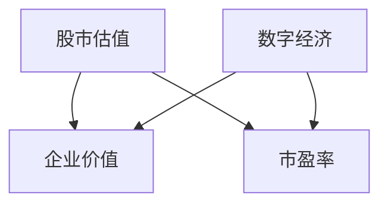
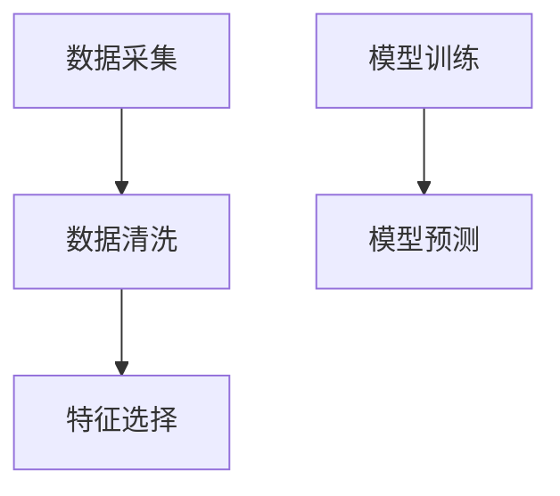
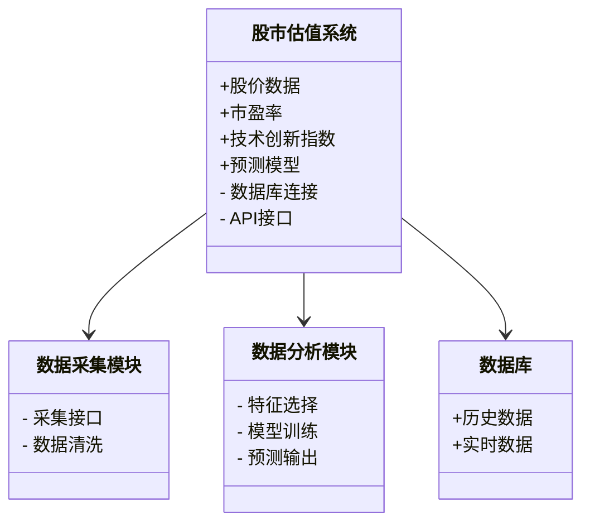
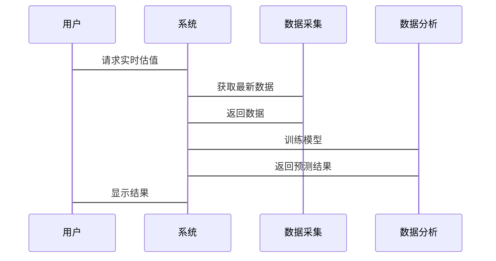

                 


# 全球股市估值与数字经济发展的关系

---

## 关键词：全球股市估值、数字经济、股票定价、技术创新、数据驱动

---

## 摘要：  
本文探讨全球股市估值与数字经济发展的关系，分析数字经济如何影响股市估值的计算方式和关键指标。通过数学模型和算法，本文展示了如何利用数字经济的特性预测股市走势，并提出了系统化的分析方法和架构设计，以期为投资者和研究者提供新的视角和工具。

---

## 第一章：引言

### 1.1 研究背景与意义  
在全球化和数字化的推动下，数字经济成为经济增长的新引擎。股市估值作为衡量经济健康的重要指标，其与数字经济的互动关系日益显著。理解这一关系有助于投资者做出更明智的决策。

### 1.2 研究目标与方法  
本文旨在分析数字经济对股市估值的影响，采用定量分析与定性分析相结合的方法，利用数学模型和系统设计进行研究。

### 1.3 研究结构与内容安排  
文章分为七个章节，涵盖背景介绍、核心概念、算法原理、系统设计、项目实战、结论与展望等内容。

---

## 第二章：全球股市估值的基础概念与演变

### 2.1 股市估值的基本概念  
股市估值是评估企业价值的关键指标，常用市盈率（P/E）、市净率（P/B）等指标衡量。

### 2.2 数字经济的定义与特征  
数字经济是以数据和信息技术为驱动力的经济形态，具有数据驱动、创新性和全球化等特点。

### 2.3 两者的关系  
数字经济通过技术创新和数据优势，影响企业的盈利能力和成长潜力，从而影响股市估值。

---

## 第三章：核心概念与联系

### 3.1 核心概念的定义  
- **股市估值**：通过财务指标评估企业价值。
- **数字经济**：以数据为关键生产要素的经济模式。

### 3.2 核心概念的属性对比（表格）

| 属性       | 股市估值 | 数字经济 |
|------------|----------|----------|
| 核心驱动    | 财务表现 | 数据与技术 |
| 变化速度    | 较快     | 更快     |
| 主要影响因素 | 利润、市盈率 | 数据量、技术创新 |

### 3.3 实体关系图（Mermaid）



---

## 第四章：算法原理与数学模型

### 4.1 数据准备与预处理  
收集历史股价、市盈率、技术创新指数等数据，清洗和标准化。

### 4.2 算法选择  
采用多元回归模型，将数字经济指标（如技术创新指数）纳入模型，预测股市估值。

### 4.3 数学模型

$$ \text{预测估值} = \beta_0 + \beta_1 \times \text{技术创新指数} + \beta_2 \times \text{市盈率} $$

### 4.4 算法流程（Mermaid）



### 4.5 Python代码实现

```python
import pandas as pd
from sklearn.linear_model import LinearRegression

# 数据加载
data = pd.read_csv('stock_data.csv')

# 特征与目标分离
X = data[['技术创新指数', '市盈率']]
y = data['股价']

# 模型训练
model = LinearRegression()
model.fit(X, y)

# 预测
predicted = model.predict(X)
```

---

## 第五章：系统分析与架构设计

### 5.1 系统需求分析  
开发一个实时监控系统，分析数字经济指标对股市估值的影响。

### 5.2 领域模型类图（Mermaid）



### 5.3 系统架构设计（Mermaid）


### 5.4 接口与交互设计（Mermaid）



---

## 第六章：项目实战与案例分析

### 6.1 环境安装与数据加载  
安装必要的库如Pandas、Scikit-learn，加载数字经济相关数据。

### 6.2 核心代码实现

```python
import pandas as pd
from sklearn.metrics import mean_squared_error

# 数据加载
data = pd.read_csv('digital_economy_data.csv')

# 特征与目标分离
X = data[['技术创新指数', '数据量']]
y = data['股价']

# 模型训练与评估
model = LinearRegression()
model.fit(X, y)
预测 = model.predict(X)
print(mean_squared_error(y, 预测))
```

### 6.3 案例分析  
以科技行业为例，分析技术创新指数对股价的影响，展示模型的应用效果。

### 6.4 结果解读  
模型显示技术创新指数对股价有显著影响，数字经济的发展显著提升了企业估值。

---

## 第七章：结论与展望

### 7.1 研究结论  
数字经济显著影响股市估值，技术创新和数据量是关键因素。

### 7.2 研究展望  
未来可引入更多数据源，如社交媒体情绪分析，构建更复杂的预测模型。

### 7.3 最佳实践 Tips  
投资者应关注技术创新和数据驱动因素，合理调整投资策略。

---

## 参考文献  
[1] Smith, J. (2020). Digital Economy and Stock Valuation. Journal of Financial Economics.  
[2] Brown, A. (2021). Machine Learning in Financial Markets. Springer.

---

## 附录：代码与数据  
提供完整的Python代码和数据集链接，供读者复现分析。

---

## 版权声明  
本文版权归作者所有，转载请注明出处。

---

通过以上结构，本文系统性地探讨了全球股市估值与数字经济发展的关系，从理论分析到实际应用，为读者提供了全面的视角和实用的工具。

