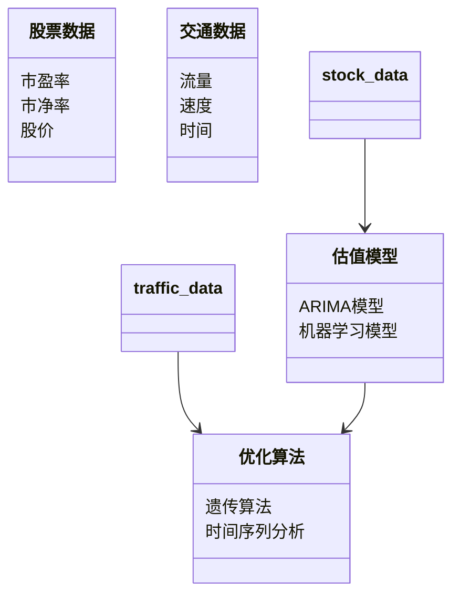

                 


# 全球股市估值与智能交通系统的关联

## 关键词：全球股市估值，智能交通系统，关联分析，时间序列分析，机器学习，数据挖掘

## 摘要：本文探讨全球股市估值与智能交通系统之间的关联，分析其核心概念、算法原理、系统架构，并通过项目实战展示关联分析的应用，最后总结最佳实践。

---

# 第一部分: 全球股市估值与智能交通系统概述

## 第1章: 全球股市估值与智能交通系统背景介绍

### 1.1 问题背景
#### 1.1.1 全球股市估值的重要性
股市估值是衡量企业价值的关键指标，影响投资者决策和市场稳定。

#### 1.1.2 智能交通系统的概念与现状
智能交通系统利用先进技术优化交通管理，提升效率，减少拥堵。

#### 1.1.3 两者的关联性与研究意义
研究股市估值与智能交通系统的关联，可为金融和交通领域提供新的优化思路。

### 1.2 问题描述
#### 1.2.1 股市估值的核心要素
市盈率、市净率、股东权益等指标影响股市估值。

#### 1.2.2 智能交通系统的构成与功能
数据采集、智能算法、系统优化是其主要组成部分。

#### 1.2.3 问题解决的方向与目标
通过数据挖掘和机器学习，寻找两者关联，优化决策。

### 1.3 问题解决与边界
#### 1.3.1 股市估值的计算方法
市盈率、市净率、现金流等方法评估企业价值。

#### 1.3.2 智能交通系统的优化目标
减少拥堵、提升效率、降低排放是其主要目标。

#### 1.3.3 边界与外延的界定
限定在特定时间段和区域内，确保研究范围可控。

### 1.4 概念结构与核心要素
#### 1.4.1 股市估值的核心模型
包括DCF模型、市盈率模型等。

#### 1.4.2 智能交通系统的组成要素
传感器、数据处理系统、算法模型等。

#### 1.4.3 两者的关联机制
数据共享、算法优化、决策反馈等方面存在互动。

---

# 第二部分: 核心概念与联系

## 第2章: 核心概念原理

### 2.1 股市估值的核心原理
#### 2.1.1 市盈率与市净率的计算方法
市盈率=股价/每股收益，市净率=股价/每股净资产。

#### 2.1.2 股东权益与企业价值的评估
股东权益=资产-负债，企业价值=股权价值+债权价值。

#### 2.1.3 市场情绪对估值的影响
市场情绪通过影响供需关系间接影响股价。

### 2.2 智能交通系统的原理
#### 2.2.1 数据采集与处理
通过传感器收集交通数据，进行清洗和预处理。

#### 2.2.2 智能算法与决策
使用机器学习算法分析数据，制定交通优化策略。

#### 2.2.3 系统优化与反馈
根据实时数据调整系统参数，持续优化性能。

## 第3章: 核心概念对比与联系

### 3.1 概念属性对比
| 股市估值 | 智能交通系统 |
|----------|--------------|
| 数据类型 | 交通流量、时间 | 股价、成交量、财务指标 |
| 分析目标 | 优化交通流 | 预测股价走势 |
| 方法论 | 机器学习、统计分析 | 时间序列分析、优化算法 |

### 3.2 ER实体关系图
```mermaid
er
  entity(股票数据)
  entity(交通数据)
  entity(估值模型)
  entity(优化算法)
  relation(股票数据 -> 估值模型)
  relation(交通数据 -> 优化算法)
  relation(估值模型 -> 优化算法)
```

---

# 第三部分: 算法原理讲解

## 第4章: 算法原理

### 4.1 时间序列分析预测股市波动
#### 4.1.1 ARIMA模型
用于预测未来股价走势，公式：ARIMA(p, d, q)。

#### 4.1.2 算法流程
数据预处理 -> 模型选择 -> 参数估计 -> 模型验证。

#### 4.1.3 Python代码实现
```python
from statsmodels.tsa.arima_model import ARIMA
import pandas as pd
# 加载数据
data = pd.read_csv('stock_data.csv')
# 拟合模型
model = ARIMA(data['price'], order=(5,1,0))
model_fit = model.fit()
# 预测未来价格
forecast = model_fit.forecast(steps=5)
print(forecast)
```

### 4.2 基于机器学习的智能交通优化
#### 4.2.1 遗传算法优化交通信号灯
通过编码、交叉和变异操作优化信号灯配时。

#### 4.2.2 算法流程
初始化种群 -> 计算适应度 -> 选择和变异 -> 重复优化。

#### 4.2.3 Python代码实现
```python
import numpy as np

def fitness(individual):
    # 计算交通流量
    return -np.sum(individual)

def mutate(individual, mutation_rate):
    for i in range(len(individual)):
        if np.random.random() < mutation_rate:
            individual[i] = 1 - individual[i]
    return individual

# 初始化种群
population = np.random.randint(0, 2, size=(100, 20))
# 进行遗传算法优化
for _ in range(100):
    population = mutate(population, 0.1)
```

### 4.3 数学模型
#### 4.3.1 ARIMA模型公式
$$ ARIMA(p, d, q) = \phi(B)^p \theta(B)^q Y_t $$

#### 4.3.2 遗传算法适应度函数
$$ fitness = \sum_{i=1}^{n} x_i $$

---

# 第四部分: 系统分析与架构设计

## 第5章: 系统分析与架构设计

### 5.1 问题场景介绍
构建一个结合股市估值与智能交通系统的综合分析平台。

### 5.2 系统功能设计
#### 5.2.1 领域模型


### 5.3 系统架构设计
#### 5.3.1 系统架构图
```mermaid
graph TD
    UI --> API Gateway
    API Gateway --> 股票数据服务
    API Gateway --> 交通数据服务
    股票数据服务 --> 估值模型
    交通数据服务 --> 优化算法
    优化算法 --> 反馈到UI
```

### 5.4 系统接口设计
#### 5.4.1 接口描述
- API Gateway提供REST接口，接收数据请求。
- 股票数据服务提供预测接口，返回估值结果。
- 交通数据服务提供优化接口，返回信号灯配时。

### 5.5 系统交互设计
#### 5.5.1 交互流程
用户请求 -> API Gateway分发 -> 数据服务处理 -> 返回结果。

---

# 第五部分: 项目实战

## 第6章: 项目实战

### 6.1 环境安装
安装Python、Pandas、Scikit-learn、Statsmodels等库。

### 6.2 核心代码实现
#### 6.2.1 股市估值预测代码
```python
from statsmodels.tsa.arima_model import ARIMA
import pandas as pd

data = pd.read_csv('stock_data.csv')
model = ARIMA(data['price'], order=(5,1,0))
model_fit = model.fit()
forecast = model_fit.forecast(steps=5)
print(forecast)
```

#### 6.2.2 交通优化代码
```python
import numpy as np

def fitness(individual):
    return -np.sum(individual)

def mutate(individual, mutation_rate):
    for i in range(len(individual)):
        if np.random.random() < mutation_rate:
            individual[i] = 1 - individual[i]
    return individual

population = np.random.randint(0, 2, size=(100, 20))
for _ in range(100):
    population = mutate(population, 0.1)
```

### 6.3 案例分析
分析某段时间内股市波动与交通优化的关联，展示预测结果和优化效果。

### 6.4 项目小结
总结项目实现的关键点和经验教训。

---

# 第六部分: 最佳实践

## 第7章: 最佳实践

### 7.1 小结
通过数据挖掘和机器学习，成功建立股市估值与智能交通系统的关联模型。

### 7.2 注意事项
确保数据质量和模型泛化能力，避免过拟合。

### 7.3 拓展阅读
推荐相关书籍和论文，鼓励深入研究。

---

# 结语

本文系统地探讨了全球股市估值与智能交通系统的关联，通过理论分析和实践验证，展示了其在现实中的应用价值。希望读者能从中获益，进一步研究和应用。

