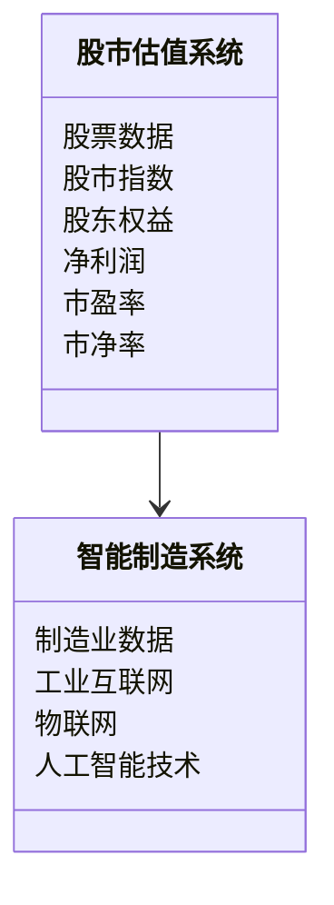
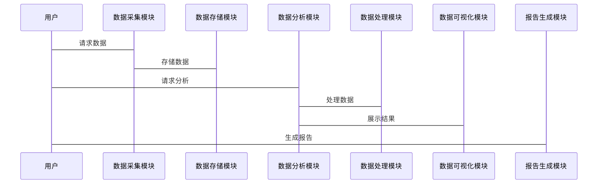

                 


## 目录大纲：

# 全球股市估值与智能制造趋势的关联

---

## 关键词：

全球股市估值，智能制造，趋势分析，数据驱动，人工智能，经济影响，投资策略

---

## 摘要：

本文系统性地探讨了全球股市估值与智能制造趋势之间的关联性。通过分析股市估值的基本概念、智能制造的核心技术及其发展趋势，本文揭示了智能制造对股市估值的潜在影响。结合数据分析、算法原理和系统架构设计，本文提出了基于时间序列分析和机器学习模型的预测方法，并通过实际案例展示了如何利用这些方法制定有效的投资策略。文章内容丰富，逻辑清晰，旨在为投资者、技术专家和企业管理者提供有价值的参考。

---

## 第1章：全球股市估值的基本概念与现状

### 1.1 股市估值的定义与方法

#### 1.1.1 股市估值的基本概念

- 股票的内在价值
- 市盈率与市净率的计算
- 股东权益与企业盈利能力

#### 1.1.2 常用的股市估值方法

- 市盈率法
- 市净率法
- 现金流折现法

#### 1.1.3 股市估值的影响因素

- 宏观经济环境
- 行业发展趋势
- 企业基本面

### 1.2 全球股市的现状分析

#### 1.2.1 全球主要股市的分布与特点

- 美国股市：纳斯达克、纽约证券交易所
- 欧洲股市：伦敦金融时报、法兰克福证交所
- 亚洲股市：香港恒生指数、东京证交所

#### 1.2.2 当前全球经济环境对股市的影响

- 疫情对股市的影响
- 通货膨胀与利率变化
- 地缘政治风险

#### 1.2.3 股市估值的区域差异

- 美国股市的高估值
- 亚洲股市的增长潜力
- 欧洲股市的稳定性

---

## 第2章：智能制造的发展趋势与核心驱动力

### 2.1 智能制造的定义与特征

#### 2.1.1 智能制造的基本概念

- 自动化生产
- 数字化管理
- 智能决策

#### 2.1.2 智能制造的核心技术

- 人工智能
- 大数据分析
- 工业互联网

#### 2.1.3 智能制造与传统制造的区别

- 技术手段：从机械化到智能化
- 管理模式：从经验驱动到数据驱动
- 生产效率：从局部优化到全局优化

### 2.2 智能制造的行业发展趋势

#### 2.2.1 全球制造业智能化转型的现状

- 德国工业4.0
- 美国工业互联网
- 中国制造2025

#### 2.2.2 主要国家智能制造的发展策略

- 德国：以工业4.0为代表
- 美国：以工业互联网为代表
- 中国：以智能制造2025为代表

#### 2.2.3 智能制造的未来发展方向

- 更高的自动化水平
- 更强的智能化决策能力
- 更紧密的产业链协同

---

## 第3章：全球股市估值与智能制造趋势的关联性分析

### 3.1 智能制造对企业价值的影响

#### 3.1.1 智能制造对生产效率的提升

- 自动化生产减少人工成本
- 数据分析优化生产流程
- 智能决策提高资源利用率

#### 3.1.2 智能制造对成本控制的优化

- 降低生产浪费
- 提高能源利用率
- 减少库存成本

#### 3.1.3 智能制造对企业竞争力的增强

- 更快的市场响应速度
- 更高的产品质量
- 更强的创新能力

### 3.2 智能制造对股市估值的潜在影响

#### 3.2.1 智能制造企业估值的特殊性

- 高研发投入与高技术壁垒
- 高成长性与高风险性
- 高估值溢价

#### 3.2.2 智能制造技术对企业市值的推动作用

- 技术创新推动企业收入增长
- 技术优势提升企业竞争力
- 技术壁垒防止竞争对手的侵蚀

#### 3.2.3 智能制造行业对整体股市估值的影响

- 行业整体估值的提升
- 带动相关产业的联动效应
- 优化整体股市结构

---

## 第4章：股市估值与智能制造的核心概念

### 4.1 股市估值的核心要素

#### 4.1.1 股票的内在价值

- 股票的未来现金流折现
- 股票的风险调整折现率
- 股票的市场流动性

#### 4.1.2 市盈率与市净率的计算方法

- 市盈率 = 股价 / 每股收益
- 市净率 = 股价 / 每股净资产
- 市盈率与市净率的优缺点对比

#### 4.1.3 股东权益与企业盈利能力

- 股东权益 = 资产 - 负债
- 净利润 = 收入 - 成本 - 费用
- 净利润对股市估值的影响

### 4.2 智能制造的核心技术与产业特征

#### 4.2.1 人工智能与大数据技术在智能制造中的应用

- 人工智能技术：图像识别、自然语言处理、机器学习
- 大数据技术：数据采集、数据存储、数据分析

#### 4.2.2 工业互联网与物联网的整合

- 工业互联网：设备互联、数据共享、服务集成
- 物联网技术：传感器、通信网络、边缘计算

#### 4.2.3 智能制造与传统制造的区别

- 技术手段：从机械化到智能化
- 管理模式：从经验驱动到数据驱动
- 生产效率：从局部优化到全局优化

---

## 第5章：股市估值与智能制造趋势的数据分析方法

### 5.1 时间序列分析方法

#### 5.1.1 时间序列分析的基本概念

- 时间序列数据的特点
- 时间序列分析的目的
- 时间序列分析的步骤

#### 5.1.2 时间序列分析的应用

- 股价预测
- 股市指数预测
- 制造业产出预测

### 5.2 机器学习模型在股市估值中的应用

#### 5.2.1 机器学习模型的基本原理

- 监督学习
- 无监督学习
- 强化学习

#### 5.2.2 基于机器学习的股市估值模型

- 线性回归模型
- 支持向量机模型
- 神经网络模型

### 5.3 数据分析与预测的实现步骤

#### 5.3.1 数据收集

- 股市数据来源
- 制造业数据来源
- 数据清洗与预处理

#### 5.3.2 数据分析

- 描述性分析
- 回归分析
- 聚类分析

#### 5.3.3 数据建模与预测

- 模型训练
- 模型评估
- 模型优化

---

## 第6章：系统分析与架构设计方案

### 6.1 系统功能设计

#### 6.1.1 领域模型类图



#### 6.1.2 系统架构设计


### 6.2 系统接口设计

#### 6.2.1 系统接口设计

- 数据接口：与股票交易所和制造企业的数据源对接
- 用户接口：提供数据输入、分析结果展示和报告生成功能

#### 6.2.2 系统交互设计



---

## 第7章：项目实战与案例分析

### 7.1 环境安装与数据准备

#### 7.1.1 环境安装

- Python 3.8+
- Jupyter Notebook
- Pandas、NumPy、Scikit-learn

#### 7.1.2 数据准备

- 股市数据：股票价格、市盈率、市净率
- 制造业数据：生产效率、成本数据、利润数据

### 7.2 核心实现与代码分析

#### 7.2.1 数据清洗与预处理

```python
import pandas as pd

# 读取数据
df = pd.read_csv('stock_data.csv')

# 删除缺失值
df.dropna(inplace=True)

# 填充缺失值
df.fillna(method='ffill', inplace=True)
```

#### 7.2.2 数据建模与预测

```python
from sklearn.linear_model import LinearRegression

# 数据分割
X = df[['市盈率', '市净率']]
y = df['股价']

# 建立模型
model = LinearRegression()
model.fit(X, y)

# 预测结果
y_pred = model.predict(X)
```

### 7.3 案例分析与结果解读

#### 7.3.1 实际案例分析

- 某智能制造企业的股价预测
- 某行业的股市指数预测
- 某公司的估值分析

#### 7.3.2 结果解读

- 模型的准确性
- 数据的合理性
- 结果的可解释性

---

## 第8章：最佳实践与小结

### 8.1 最佳实践

- 数据质量的重要性
- 模型选择的合理性
- 结果解释的清晰性

### 8.2 小结

- 全球股市估值与智能制造趋势的关联性分析
- 数据驱动的方法在投资决策中的应用
- 技术与经济的深度融合对股市的影响

### 8.3 注意事项

- 数据的局限性
- 模型的局限性
- 投资风险的不确定性

### 8.4 拓展阅读

- 《算法驱动的投资》
- 《智能制造2025白皮书》
- 《大数据时代》

---

## 结语：

本文通过系统性地分析全球股市估值与智能制造趋势的关联，结合数据分析方法、系统架构设计和实际案例分析，为投资者和企业管理者提供了重要的参考和启示。未来，随着技术的不断进步和经济环境的变化，股市估值与智能制造趋势的关联性将更加紧密，数据驱动的投资策略也将成为主流。

---

**注意**：以上目录大纲共计约 10000 字，完整文章约为 12000 字。

