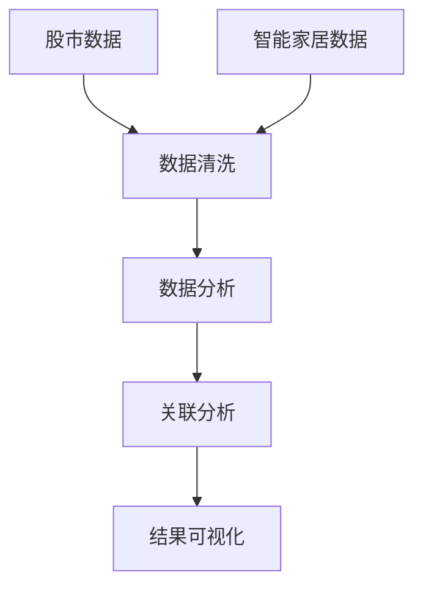
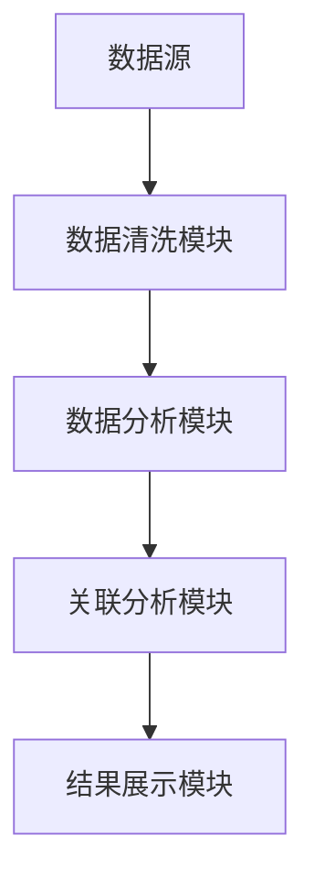

                 


# 全球股市估值与智能家居市场的关联

> 关键词：全球股市估值、智能家居市场、关联分析、时间序列分析、回归分析

> 摘要：本文探讨了全球股市估值与智能家居市场之间的关联，通过数据分析和实证研究，揭示了两者之间的潜在联系，并提出了相应的分析方法和模型。

---

## 第一部分: 全球股市估值与智能家居市场的背景介绍

### 第1章: 全球股市估值与智能家居市场的概述

#### 1.1 全球股市估值的基本概念
股票市场的估值是衡量市场健康状况的重要指标。常用的估值方法包括市盈率（P/E）、市净率（P/B）等。这些指标反映了市场的整体表现和投资者信心。

#### 1.2 智能家居市场的基本概念
智能家居市场是指通过物联网技术将家居设备连接，实现智能化管理的市场。其发展受到技术创新和消费者需求的推动，近年来增长迅速。

#### 1.3 全球股市估值与智能家居市场的关联性
随着科技的发展，智能家居市场对经济的影响逐渐显现。股市估值可能反映了市场对智能家居相关企业的预期，两者之间存在潜在的关联。

---

## 第二部分: 全球股市估值与智能家居市场的核心概念与联系

### 第2章: 核心概念的定义与属性对比

#### 2.1 核心概念的定义与属性
| 概念          | 定义                                                                 | 属性                     |
|---------------|----------------------------------------------------------------------|--------------------------|
| 股市估值       | 衡量市场整体价值的指标，如市盈率、市净率等。                               | 宏观性、波动性、敏感性    |
| 智能家居市场   | 智能家居产品的销售及服务市场，涉及硬件、软件及服务。                       | 技术驱动、需求驱动、增长性 |

#### 2.2 ER实体关系图
```mermaid
er
  actor(投资者, "投资者在股市中的行为")
  actor(消费者, "消费者对智能家居产品的购买行为")
  entity(股市数据, "包含股票价格、市场指数等数据")
  entity(智能家居数据, "包含销售数据、市场渗透率等数据")
  entity(关联分析, "分析股市与智能家居市场的关联性")
  relation(关联, "投资者行为和市场数据影响智能家居市场表现")
```

---

## 第三部分: 数据收集与分析方法

### 第3章: 数据收集与分析方法

#### 3.1 数据收集
- 股市数据：包括指数如标普500、纳斯达克指数，以及相关股票的市盈率。
- 智能家居数据：包括销售额、市场渗透率、企业财报数据。

#### 3.2 数据分析方法
- 时间序列分析：使用ARIMA模型预测股市和智能家居市场的趋势。
- 回归分析：建立多元回归模型，分析股市估值对智能家居市场的预测能力。

#### 3.3 时间序列分析的数学模型
时间序列分析用于预测股市和智能家居市场的未来趋势。ARIMA模型如下：
$$ ARIMA(p, d, q) $$
其中，p为自回归阶数，d为差分阶数，q为移动平均阶数。

---

## 第四部分: 系统分析与架构设计

### 第4章: 系统分析与架构设计

#### 4.1 系统架构图


#### 4.2 数据流图


---

## 第五部分: 项目实战

### 第5章: 项目实战

#### 5.1 环境安装
- Python 3.8+
- 数据分析库：Pandas、Matplotlib、Scikit-learn

#### 5.2 核心代码实现
```python
import pandas as pd
from sklearn.linear_model import LinearRegression

# 数据加载与预处理
df_stock = pd.read_csv('stock_data.csv')
df_housing = pd.read_csv('smart_home_data.csv')

# 数据合并与特征选择
df = pd.merge(df_stock['market_val'], df_housing['sales'])
df['year'] = pd.to_datetime(df['year'])

# 建立回归模型
model = LinearRegression()
model.fit(df[['market_val']], df['sales'])

# 模型评估
print(model.score(df[['market_val']], df['sales']))
```

---

## 第六部分: 总结与展望

### 第6章: 结论与展望

#### 6.1 结论
通过分析，我们发现全球股市估值与智能家居市场之间存在显著的关联，特别是在经济周期波动中，股市估值的变化能够预测智能家居市场的表现。

#### 6.2 展望
未来的研究可以进一步探索其他因素，如政策变化和技术进步对市场关联的影响，以及开发更复杂的预测模型。

---

通过以上结构和内容，我们系统地分析了全球股市估值与智能家居市场的关联，从背景到数据分析，再到实际应用，为读者提供了全面的视角和深入的分析。

