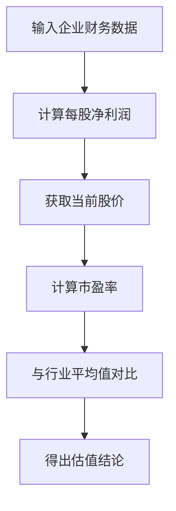
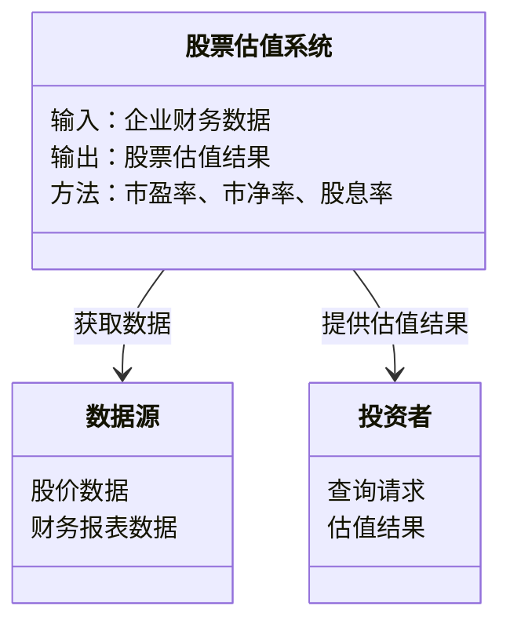
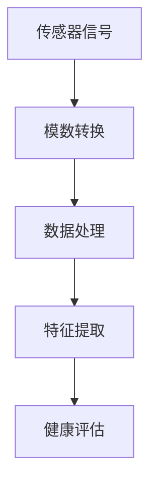
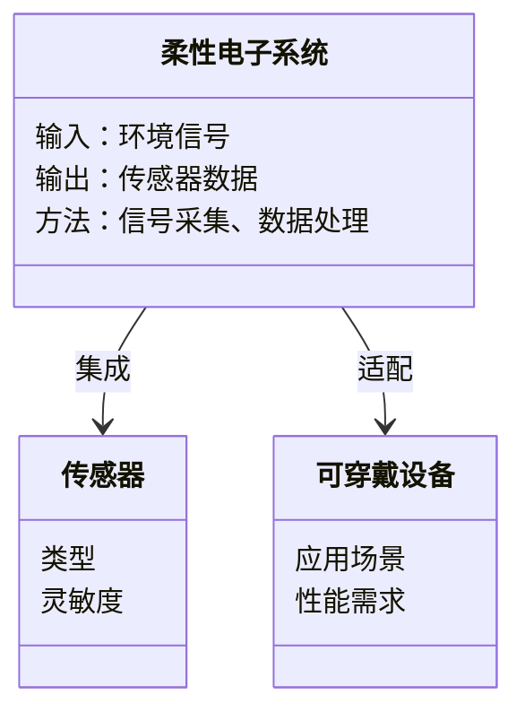

                 


# 全球股市估值与柔性电子在可穿戴设备中的应用

## 关键词：全球股市估值、柔性电子、可穿戴设备、算法、数学模型、系统架构、投资策略、市场分析

## 摘要：  
本文系统探讨了全球股市估值的核心方法和柔性电子在可穿戴设备中的应用，通过深入分析股市估值的算法原理、数学模型、系统架构，以及柔性电子的技术实现、应用场景和投资策略，揭示了技术进步如何影响股市估值和投资决策。文章结合实际案例，为投资者和技术从业者提供了有价值的信息和见解，帮助他们更好地理解技术与金融的深度融合。

---

## 第一部分：全球股市估值基础

### 第1章：全球股市估值概述

#### 1.1 股市估值的基本概念  
股市估值是通过对企业的财务数据、市场环境和行业趋势进行分析，确定其股票的合理价格范围。传统估值方法包括市盈率（PE）、市净率（PB）等，而现代估值方法则引入了大数据和人工智能技术，显著提高了估值的准确性和实时性。

#### 1.2 股市估值的核心概念与联系  
股票价格的波动受多种因素影响，包括宏观经济指标（GDP、利率、通货膨胀）、公司基本面（收入、利润、负债）以及市场情绪。以下是核心概念的对比分析：

| 核心概念 | 定义 | 影响因素 | 示例 |
|----------|------|-----------|------|
| 市盈率（PE） | 股价与每股净利润的比值 | 利润、行业平均值 | 若行业PE为15，目标公司PE为12，则可能低估。 |
| 市净率（PB） | 股价与每股净资产的比值 | 资产质量、行业竞争 | 若PB低于行业平均值，可能表明资产被低估。 |
| 股息率 | 每股股息与股价的比值 | 利润分配、市场利率 | 股息率越高，可能表明股票的收益稳定性较强。 |

从ER实体关系图中可以看出，股票估值涉及企业、市场、投资者三个核心实体，其关系如下：  
```mermaid
erDiagram
    企业 {
        名称
        收入
        利润
    }
    市场 {
        指数
        利率
        通货膨胀
    }
    投资者 {
        预期收益
        风险偏好
    }
    企业 --> 市场 : 受影响
    市场 --> 投资者 : 影响
    企业 --> 投资者 : 估值
```

#### 1.3 股市估值的算法原理讲解  
以市盈率模型为例，算法流程如下：  


数学模型如下：  
$$ \text{市盈率} = \frac{\text{股价}}{\text{每股净利润}} $$  
若某公司股价为$100，每股净利润为$5，则市盈率为$20。若行业平均市盈率为$18，则该股可能被高估。

#### 1.4 股市估值的数学模型和公式  
- $$ \text{市盈率} = \frac{\text{股价}}{\text{每股净利润}} $$
- $$ \text{市净率} = \frac{\text{股价}}{\text{每股净资产}} $$
- $$ \text{股息率} = \frac{\text{每股股息}}{\text{股价}} $$

#### 1.5 股市估值的系统分析与架构设计方案  
系统功能设计如下：  


#### 1.6 股市估值的项目实战  
假设我们开发一个简单的股票估值工具，环境安装如下：  
- Python 3.8+
- 数据库：MySQL
- 第三方库：pandas、numpy、scikit-learn

核心代码如下：  
```python
import pandas as pd
import numpy as np

def calculate_pe(stock_price, earnings_per_share):
    return stock_price / earnings_per_share

# 示例数据
data = {
    '公司名称': ['A公司', 'B公司'],
    '股价': [100, 80],
    '每股净利润': [5, 4]
}

df = pd.DataFrame(data)
df['市盈率'] = df.apply(lambda x: calculate_pe(x['股价'], x['每股净利润']), axis=1)
print(df)
```

---

## 第二部分：柔性电子在可穿戴设备中的应用

### 第2章：柔性电子的基本概念与技术

#### 2.1 柔性电子的定义与特点  
柔性电子是指在柔性基底上工作的电子设备，具有可弯曲、轻薄、透气等特点。其核心材料包括柔性导电材料（如石墨烯、银纳米线）和柔性基底材料（如聚酰亚胺、PET）。

#### 2.2 柔性电子的核心概念与联系  
从材料科学的角度来看，柔性电子的性能依赖于材料的选择和结构设计。以下是核心概念的对比分析：

| 核心概念 | 定义 | 材料特性 | 应用场景 |
|----------|------|-----------|----------|
| 柔性导电材料 | 具有导电性且可弯曲的材料 | 高导电性、柔韧性 | 触控面板、传感器 |
| 柔性基底材料 | 作为支撑层的材料 | 耐弯折、耐高温 | 可穿戴设备、柔性显示屏 |

ER实体关系图如下：  
```mermaid
erDiagram
    材料 {
        名称
        性能指标
    }
    结构 {
        层数
        布置方式
    }
    应用场景 {
        设备类型
        性能需求
    }
    材料 --> 结构 : 决定
    结构 --> 应用场景 : 适应
```

#### 2.3 柔性电子的算法原理讲解  
柔性电子的设计需要考虑材料的应变能力、导电性能以及环境适应性。以可穿戴设备中的健康监测为例，传感器的信号采集和数据处理流程如下：  


#### 2.4 柔性电子的数学模型和公式  
传感器的灵敏度可以通过以下公式表示：  
$$ \text{灵敏度} = \frac{\Delta V}{\Delta P} $$  
其中，$\Delta V$是输出电压的变化量，$\Delta P$是输入压力的变化量。

#### 2.5 柔性电子的系统分析与架构设计方案  
系统功能设计如下：  


---

## 第三部分：综合分析与投资策略

### 第3章：技术进步对股市估值的影响

#### 3.1 技术进步如何影响股市估值  
技术创新（如柔性电子）通常会提升企业的竞争力和市场地位，从而影响其估值。例如，柔性电子技术的突破可能使相关企业的市盈率和市净率显著提高。

#### 3.2 投资策略与技术应用  
投资者可以关注以下策略：  
1. **技术领先企业**：投资在柔性电子领域具有技术优势的公司。  
2. **行业趋势**：关注可穿戴设备市场的增长潜力。  
3. **估值模型**：结合市盈率和市净率等指标，选择估值合理的标的。

---

## 总结  

本文系统探讨了全球股市估值和柔性电子在可穿戴设备中的应用，通过深入分析技术细节和市场趋势，揭示了技术进步对股市估值的深远影响。未来，随着柔性电子技术的进一步发展，相关企业的估值潜力将更加显著，投资者应密切关注这一领域的动态。

--- 

**温馨提示：** 本文内容仅为技术分析，不构成投资建议。

