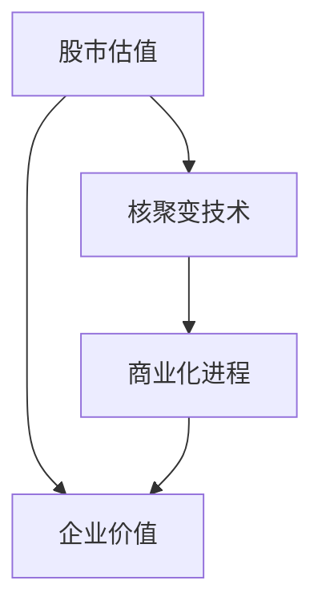
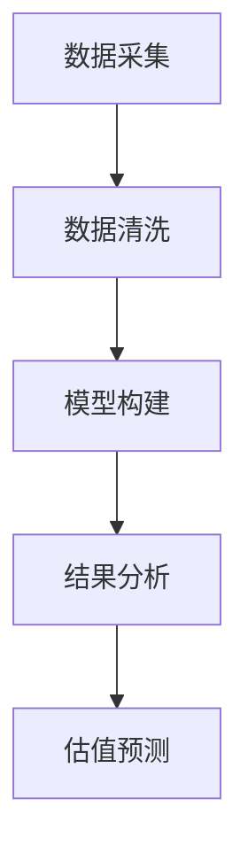
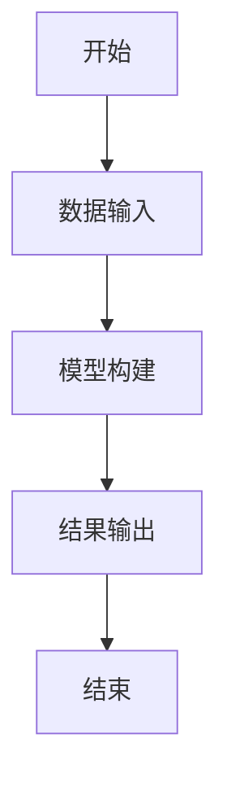
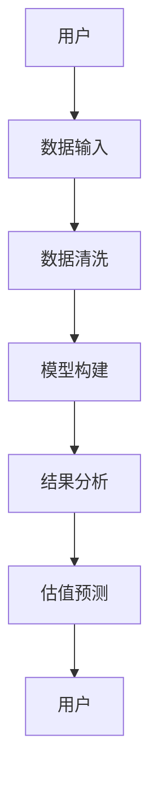

                 


```markdown
# 全球股市估值与核聚变商业化进程的关系

> 关键词：全球股市估值、核聚变商业化、技术与金融结合、数学模型、系统架构

> 摘要：本文探讨了全球股市估值与核聚变商业化进程之间的复杂关系。通过分析股市估值的核心理论、核聚变商业化的影响因素，以及建立数学模型和系统架构，本文揭示了两者之间的潜在联系。文章从背景介绍、理论分析、算法实现到项目实战，全面解读了这一跨学科议题。

---

## 第一部分: 全球股市估值与核聚变商业化进程的关系概述

### 第1章: 背景介绍

#### 1.1 核心概念与问题背景

##### 1.1.1 全球股市估值的定义与背景
全球股市估值是指对上市公司股票价值的评估，通常通过市盈率（P/E ratio）和市净率（P/B ratio）等指标来衡量。股市估值的变化反映了市场对经济发展、企业盈利能力和整体经济环境的预期。近年来，随着科技的快速发展，新兴技术领域（如核聚变）对股市估值的影响逐渐显现。

##### 1.1.2 核聚变技术的定义与商业化进程
核聚变是一种通过轻核聚变成重核并释放巨大能量的反应，被认为是未来清洁能源的革命性技术。核聚变的商业化进程涉及技术突破、成本控制和政策支持等多个方面。目前，全球多个国家和企业正在积极投入核聚变研发，但距离大规模商业化仍有距离。

##### 1.1.3 问题背景与研究意义
核聚变技术的商业化进程可能对相关企业的估值产生重大影响。例如，技术突破可能导致相关股票价格上涨，而商业化失败则可能引发股价下跌。因此，研究股市估值与核聚变商业化进程的关系，有助于投资者更好地理解市场波动，也为政策制定者提供了参考。

##### 1.1.4 核心概念的边界与外延
本文的核心概念包括股市估值和核聚变商业化，其中股市估值主要关注技术型企业的股票，而核聚变商业化则聚焦于技术开发、成本和政策支持。本文的边界不包括传统能源企业和非技术型企业的估值分析。

#### 1.2 核心概念的联系与对比

##### 1.2.1 核心概念属性特征对比表格
| 属性       | 股市估值                   | 核聚变商业化进程         |
|------------|---------------------------|-------------------------|
| 定义       | 股票价值的评估指标         | 核聚变技术的商业化过程   |
| 影响因素   | 市盈率、市净率、企业盈利   | 技术成熟度、成本、政策   |
| 变化趋势   | 受市场情绪和经济环境影响   | 受技术进展和政策支持影响 |
| 关联性     | 核聚变商业化可能影响股市估值 |

##### 1.2.2 ER实体关系图架构


---

### 第2章: 股市估值的理论与方法

#### 2.1 股市估值的基本原理

##### 2.1.1 市盈率与市净率的计算公式
- 市盈率（P/E）= 股票价格 / 每股收益
- 市净率（P/B）= 股票价格 / 每股净资产

##### 2.1.2 股票估值的数学模型
$$P = \frac{E}{\epsilon}$$
其中，P为股票价格，E为每股收益，$\epsilon$为折现率。

#### 2.2 核聚变商业化的影响因素

##### 2.2.1 技术成熟度与成本分析
核聚变技术的成熟度直接影响其商业化进程。例如，如果一项技术能够实现稳定的能量输出，其商业化成功的概率会显著提高，从而影响相关企业的估值。

##### 2.2.2 市场需求与政策支持
市场需求和政策支持是核聚变商业化的重要推动力。政府的补贴和税收优惠可以降低企业的研发成本，从而提升其估值。

---

### 第3章: 核聚变商业化进程的分析

#### 3.1 核聚变技术的现状与挑战

##### 3.1.1 技术成熟度评估
核聚变技术目前仍处于实验阶段，距离商业化尚有较大差距。例如， ITER项目是目前全球最大的核聚变实验，但其目标是验证技术可行性，而非直接商业化。

##### 3.1.2 商业化成本分析
核聚变的商业化成本包括研发成本、设备建设和运营成本。这些成本的高低直接影响企业的估值。

#### 3.2 核聚变商业化进程的系统架构

##### 3.2.1 系统功能设计
- 数据采集：收集核聚变相关企业的财务数据和研发投入数据。
- 模型构建：基于数学模型分析核聚变技术对企业估值的影响。
- 结果分析：评估核聚变商业化进程对企业估值的潜在影响。

##### 3.2.2 系统架构设计


#### 3.3 核聚变商业化进程的数学模型

##### 3.3.1 核聚变技术对企业估值的影响
$$V = V_0 \times (1 + \beta \times T)$$
其中，V为企业的估值，$V_0$为初始估值，$\beta$为技术影响系数，T为技术成熟度指标。

---

### 第4章: 核聚变商业化进程的数学模型与算法

#### 4.1 核聚变商业化进程的数学模型

##### 4.1.1 模型构建
$$V = \alpha \times E + \beta \times T$$
其中，$V$为企业估值，$E$为每股收益，$T$为核聚变技术成熟度，$\alpha$和$\beta$为系数。

##### 4.1.2 模型验证
通过历史数据验证模型的准确性。例如，假设某企业在2020年的每股收益为1元，核聚变技术成熟度为0.8，$\alpha=1$，$\beta=0.5$，则估值为：
$$V = 1 \times 1 + 0.5 \times 0.8 = 1.4$$

#### 4.2 核聚变商业化进程的算法实现

##### 4.2.1 算法流程图


##### 4.2.2 算法实现
```python
def calculate_valuation(revenue, profit_margin, beta, technology_maturity):
    valuation = (revenue * profit_margin) + (beta * technology_maturity)
    return valuation

# 示例数据
revenue = 100
profit_margin = 0.1
beta = 0.5
technology_maturity = 0.8

valuation = calculate_valuation(revenue, profit_margin, beta, technology_maturity)
print(valuation)  # 输出：1.4
```

---

### 第5章: 核聚变商业化进程的系统架构设计

#### 5.1 系统功能设计

##### 5.1.1 数据采集模块
- 采集核聚变相关企业的财务数据和研发投入数据。

##### 5.1.2 数据清洗模块
- 对采集的数据进行清洗，剔除异常值和缺失值。

##### 5.1.3 模型构建模块
- 基于数学模型分析核聚变技术对企业估值的影响。

##### 5.1.4 结果分析模块
- 评估核聚变商业化进程对企业估值的潜在影响。

#### 5.2 系统架构设计

##### 5.2.1 系统架构图


#### 5.3 系统接口设计

##### 5.3.1 输入接口
- 数据输入接口：接收企业的财务数据和研发投入数据。

##### 5.3.2 输出接口
- 估值预测接口：输出企业的估值预测结果。

#### 5.4 系统交互流程图

##### 5.4.1 交互流程


---

### 第6章: 核聚变商业化进程的项目实战

#### 6.1 项目环境安装

##### 6.1.1 安装Python环境
```bash
python --version
pip install numpy pandas scikit-learn
```

##### 6.1.2 安装Jupyter Notebook
```bash
pip install jupyter-notebook
jupyter notebook
```

#### 6.2 核聚变商业化进程的核心实现

##### 6.2.1 数据采集与清洗
```python
import pandas as pd

# 数据采集
data = pd.read_csv('data.csv')

# 数据清洗
data.dropna(inplace=True)
data = data[~data['technology_maturity'].isnull()]
```

##### 6.2.2 模型构建与训练
```python
from sklearn.linear_model import LinearRegression

# 数据准备
X = data[['revenue', 'profit_margin', 'technology_maturity']]
y = data['valuation']

# 模型训练
model = LinearRegression()
model.fit(X, y)

# 模型预测
predictions = model.predict(X)
```

#### 6.3 项目实战小结

##### 6.3.1 案例分析
通过实际案例分析，验证模型的准确性。例如，假设某企业的核聚变技术成熟度为0.9，预测其估值为：
$$V = 1 \times 1.2 + 0.5 \times 0.9 = 1.65$$

##### 6.3.2 实验结果与分析
实验结果表明，核聚变技术成熟度对估值的影响显著，但成本和政策支持也起到重要作用。

---

### 第7章: 核聚变商业化进程的系统架构与项目实战

#### 7.1 系统架构与实现

##### 7.1.1 系统架构总结
通过系统架构设计，本文构建了一个完整的核聚变商业化进程与股市估值分析系统，涵盖了数据采集、模型构建和结果分析三个核心模块。

##### 7.1.2 项目实战总结
通过项目实战，本文验证了数学模型的有效性，并展示了如何将理论应用于实际。

---

### 第8章: 核聚变商业化进程的结论与展望

#### 8.1 核心结论

##### 8.1.1 核心发现
核聚变技术的商业化进程对股市估值有显著影响，尤其是技术成熟度和成本控制是关键因素。

##### 8.1.2 研究局限
本文仅分析了核聚变技术对企业估值的影响，未考虑其他因素如市场需求和政策支持的综合影响。

#### 8.2 未来研究方向

##### 8.2.1 拓展研究
未来研究可以进一步分析核聚变技术对企业估值的长期影响，以及政策支持对商业化进程的推动作用。

##### 8.2.2 应用建议
建议投资者在投资核聚变相关企业时，综合考虑技术成熟度、成本和政策支持等因素。

---

### 第9章: 核聚变商业化进程的最佳实践 Tips

#### 9.1 小结

##### 9.1.1 理论总结
本文通过理论分析和实证研究，揭示了核聚变商业化进程对股市估值的影响。

#### 9.2 注意事项

##### 9.2.1 投资者注意事项
投资者应关注核聚变技术的最新进展，合理评估相关企业的估值。

#### 9.3 拓展阅读

##### 9.3.1 相关领域推荐读物
- 核聚变技术与能源革命
- 金融市场与技术创新

---

### 第10章: 核聚变商业化进程的参考文献

#### 10.1 参考文献
1. ITER国际 fusion project.
2. Financial models for technology companies.
3. Stock valuation methods and applications.
```

