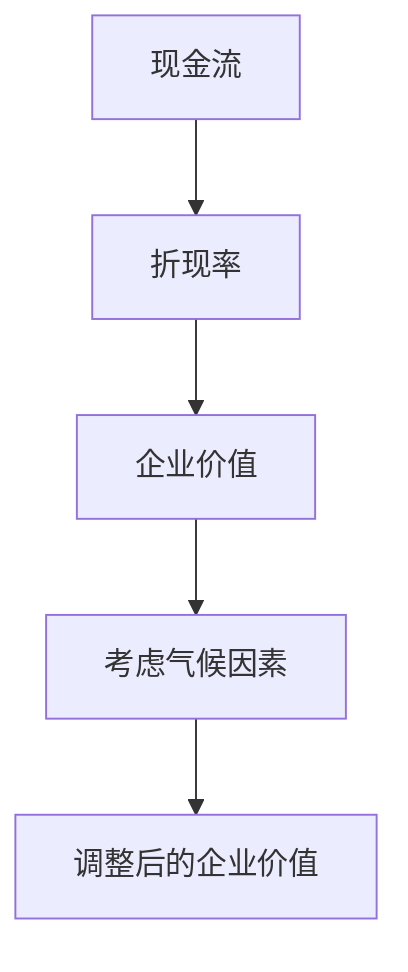
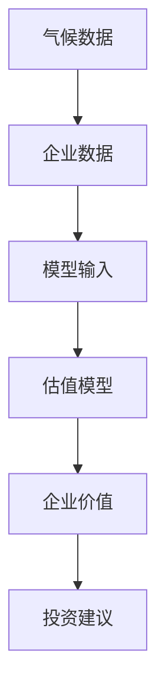

                 

# 全球股市估值与气候变化适应策略的关联

## 关键词：
- 全球股市估值、气候变化、企业价值评估、风险管理、可持续投资、适应策略

## 摘要：
气候变化作为全球性挑战，不仅影响着环境，也对全球经济和金融市场产生深远影响。本文探讨气候变化如何与全球股市估值相互关联，分析气候变化对企业价值的影响路径，并提出适应策略，以帮助投资者在变化的环境中做出更明智的决策。通过系统分析和实际案例，本文旨在为投资者提供气候变化下的投资策略参考。

---

## 第1章: 气候变化对全球经济与股市的影响

### 1.1 气候变化的定义与核心特征

#### 1.1.1 气候变化的定义
气候变化指的是地球气候系统的长期变化，主要表现为全球气温上升、极端天气事件频发、海平面上升等。这些变化对全球经济、社会和生态系统产生深远影响。

#### 1.1.2 气候变化的核心特征
- **长期性**：气候变化的影响是长期累积的，涉及多代人。
- **全球性**：气候变化影响全球，没有国界限制。
- **复杂性**：气候变化涉及自然和人类活动的多重因素。
- **不可逆性**：某些气候变化的影响可能是不可逆转的。

#### 1.1.3 气候变化对全球经济的潜在影响
气候变化可能导致资源枯竭、生态破坏、经济成本上升等问题，进而影响股市的整体估值和行业表现。

---

### 1.2 全球股市估值的基本概念

#### 1.2.1 股市估值的定义
股市估值是指对上市公司股权价值的评估，通常通过市盈率（P/E）、市净率（P/B）等指标来衡量。

#### 1.2.2 股市估值的主要指标
- 市盈率（P/E）：股票价格与每股收益的比率。
- 市净率（P/B）：股票价格与每股净资产的比率。
- 股息率：股息与股票价格的比率。

#### 1.2.3 股市估值与经济发展的关系
股市估值反映了经济健康状况，经济增长通常会推高股市估值，反之亦然。

---

## 第2章: 气候变化对股市估值的影响

### 2.1 气候变化对全球经济的影响

#### 2.1.1 气候变化对能源行业的冲击
极端天气可能导致能源供应中断，影响能源企业的盈利能力和估值。

#### 2.1.2 气候变化对农业的影响
气候变化可能导致农作物减产，影响农业企业的收益和股市估值。

#### 2.1.3 气候变化对保险业的挑战
极端天气事件增多，保险公司的理赔成本上升，影响其股价表现。

---

### 2.2 气候变化对股市估值的具体影响

#### 2.2.1 气候变化对行业估值的影响
- 高碳行业（如煤炭、石油）的估值可能下降。
- 可再生能源行业的估值可能上升。

#### 2.2.2 气候变化对个股估值的影响
- 企业碳排放风险可能影响其市盈率。
- 环保政策趋严可能导致部分企业股价下跌。

#### 2.2.3 气候变化对整体股市估值的潜在影响
气候变化可能导致股市波动加剧，整体估值水平可能受到压力。

---

## 第3章: 气候变化与企业价值评估的关联

### 3.1 企业价值评估的基本框架

#### 3.1.1 企业价值评估的主要方法
- 现金流折现法（DCF）：通过未来现金流的现值评估企业价值。
- 市盈率法：基于市盈率与行业平均值的比较。
- 经济价值法：考虑企业资产的经济价值。

#### 3.1.2 企业价值评估的关键指标
- 净资产收益率（ROE）：衡量企业资产使用效率。
- 资产负债率：衡量企业财务风险。

#### 3.1.3 企业价值评估与财务报表的关系
企业价值评估主要基于财务报表中的收入、利润、现金流等数据。

---

### 3.2 气候变化对企业价值的影响路径

#### 3.2.1 气候变化对企业盈利的影响
- 气候变化可能导致企业收入下降或成本上升。
- 例如，干旱可能导致农业企业收入减少。

#### 3.2.2 气候变化对企业风险的影响
- 气候相关风险可能增加企业的财务风险。
- 例如，洪水可能导致企业的资产损失。

#### 3.2.3 气候变化对企业资产价值的影响
- 气候变化可能导致企业固定资产减值。
- 例如，海平面上升可能导致沿海企业资产贬值。

---

## 第4章: 气候变化对企业财务状况的影响

### 4.1 气候变化对企业收入的影响

#### 4.1.1 气候变化对企业销售收入的影响
- 例如，极端天气可能导致零售业销售额下降。

#### 4.1.2 气候变化对企业成本的影响
- 例如，干旱可能导致农业企业的生产成本上升。

#### 4.1.3 气候变化对企业利润的影响
- 气候变化可能导致企业利润下降，进而影响股价表现。

---

## 第5章: 气候变化与企业价值评估的数学模型

### 5.1 气候变化影响下的现金流模型

#### 5.1.1 现金流模型的构建
企业价值 = 现金流 / 折现率。

#### 5.1.2 气候变化对现金流的影响
- 气候变化可能导致现金流波动。
- 例如，极端天气可能导致收入下降。

#### 5.1.3 气候变化对折现率的影响
- 气候风险可能增加折现率，从而降低企业价值。

---

## 第6章: 气候变化下的投资策略与风险管理

### 6.1 投资策略

#### 6.1.1 低碳投资
- 投资可再生能源企业，减少碳排放。

#### 6.1.2 风险对冲
- 通过分散投资降低气候相关风险。

#### 6.1.3 气候指数投资
- 投资与气候变化相关的指数基金。

---

### 6.2 风险管理

#### 6.2.1 压力测试
- 评估企业在极端气候情况下的财务状况。

#### 6.2.2 情景分析
- 分析不同气候情景下的企业表现。

#### 6.2.3 风险定价
- 考虑气候风险对企业估值的影响。

---

## 第7章: 气候变化与企业价值评估的系统架构

### 7.1 系统架构设计

---

## 第8章: 气候变化与企业价值评估的项目实战

### 8.1 环境安装
- 数据来源：气候数据、企业财务数据。
- 工具：Python、Pandas、NumPy。

---

## 第9章: 结论与展望

### 9.1 研究总结
气候变化对股市估值的影响不容忽视，投资者需要积极应对。

### 9.2 未来研究方向
- 开发更精确的气候风险评估模型。
- 探索更多气候适应策略。

### 9.3 最佳实践
- 投资者应关注气候变化对企业的影响。
- 企业应制定气候适应计划。

---

## 参考文献
- [1] Stern, N. (2006). Stern Review on the Economics of Climate Change.
- [2] Financial Stability Board (2021).气候变化与金融稳定。

---

# 结语
气候变化不仅是环境问题，更是经济和金融问题。投资者需要将气候变化纳入决策过程，以应对未来的挑战。

