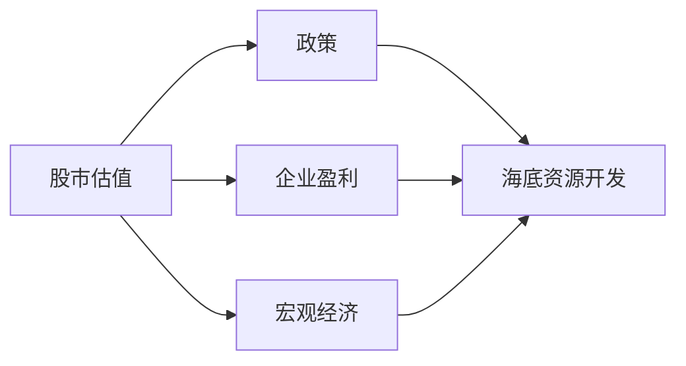

                 


# 全球股市估值与海底资源开发的关系

## 关键词：全球股市估值, 海底资源开发, 经济模型, 数据分析, 技术驱动

## 摘要：本文探讨全球股市估值与海底资源开发之间的潜在联系，分析两者的核心概念、影响因素及相互作用。通过构建数学模型和系统架构，揭示股市估值波动如何影响海底资源开发，以及海底资源开发如何反过来推动股市价值变化。本文结合实际案例，深入分析两者关系的动态变化，为投资者和政策制定者提供理论支持和实践指导。

---

## 第一部分: 引言

### 第1章: 全球股市估值与海底资源开发关系的背景介绍

#### 1.1 问题背景

##### 1.1.1 全球股市估值的定义与现状
全球股市估值是衡量市场整体价值的重要指标，通常通过股票指数（如标普500、纳斯达克指数等）来反映。近年来，全球股市规模不断扩大，2023年全球股市市值已超过100万亿美元。股市估值受多种因素影响，包括宏观经济指标、企业盈利状况、政策变化等。

##### 1.1.2 海底资源开发的定义与现状
海底资源开发是指从海洋底部提取矿产资源（如铜、金、稀土元素等）和能源（如天然气 hydrate）。随着陆地资源的枯竭，海底资源开发成为全球关注的焦点。据估计，海底矿产资源的价值高达数万亿美元。

##### 1.1.3 两者关系的研究意义
股市估值与海底资源开发看似无直接联系，但随着技术进步，海底资源开发的公司市值波动可能对全球股市产生影响。例如，海底矿产公司股价波动可能影响相关股票指数，进而影响全球股市估值。

#### 1.2 问题描述

##### 1.2.1 全球股市估值的影响因素
- 宏观经济指标（GDP、通货膨胀率、利率等）
- 企业盈利状况
- 政策变化（如财政政策、货币政策）

##### 1.2.2 海底资源开发的驱动因素
- 技术进步（深海钻探技术、海底采矿技术）
- 市场需求（尤其是高科技行业对稀土的需求）
- 资源价格波动

##### 1.2.3 两者的潜在联系
- 海底资源开发公司的股价波动可能影响股市估值
- 资源开发成本上升可能影响企业盈利，进而影响股价
- 海底资源开发的技术突破可能提升相关企业的市场价值

#### 1.3 问题解决

##### 1.3.1 研究目标
- 分析全球股市估值与海底资源开发的关系
- 探讨两者之间的相互影响机制
- 构建量化模型，预测股市估值变化对海底资源开发的影响

##### 1.3.2 研究方法
- 数据分析法：收集全球股市数据和海底资源开发数据
- 数学建模法：构建回归模型或时间序列模型
- 案例分析法：分析典型海底资源开发项目的市场表现

##### 1.3.3 研究框架
1. 数据收集与预处理
2. 核心概念分析
3. 数学模型构建
4. 实证分析与案例研究
5. 结论与建议

#### 1.4 边界与外延

##### 1.4.1 研究范围的界定
- 限定研究范围为全球主要股市和海底资源开发项目
- 重点关注上市公司的股价波动与资源开发的关系

##### 1.4.2 研究的局限性
- 数据的局限性（海底资源开发数据较难获取）
- 模型的局限性（无法完全捕捉市场复杂性）

##### 1.4.3 研究的可扩展性
- 可扩展至其他类型资源开发（如海底能源）
- 可扩展至其他地区（如亚太地区）

#### 1.5 概念结构与核心要素

##### 1.5.1 核心概念的组成
- 股市估值：指数、股价、市值
- 海底资源开发：技术、成本、资源储量

##### 1.5.2 核心要素的对比分析
- 股市估值的波动性与海底资源开发的稳定性
- 股市估值的短期性与海底资源开发的长期性

##### 1.5.3 概念结构的可视化


---

## 第二部分: 核心概念与联系

### 第2章: 全球股市估值的核心原理

#### 2.1 核心概念原理

##### 2.1.1 股市估值的基本方法
- 市盈率（P/E ratio）
- 市净率（P/B ratio）
- 企业价值（EV）

##### 2.1.2 主要影响因素分析
- 经济指标：GDP、CPI、失业率
- 企业盈利：净利润、营业收入
- 政策因素：财政政策、货币政策

##### 2.1.3 股市指数的构建与应用
- 标普500指数：涵盖500家大型公司
- 纳斯达克指数：以科技公司为主

#### 2.2 概念属性特征对比

##### 2.2.1 不同股市估值方法的对比
| 方法       | 优点               | 缺点               |
|------------|--------------------|--------------------|
| 市盈率     | 反映市场对公司的盈利预期 | 易受市场情绪影响     |
| 市净率     | 反映资产的真实价值   | 适合重资产行业       |
| 企业价值   | 综合考虑负债和股权   | 计算复杂             |

##### 2.2.2 影响因素的权重分析
- 经济指标权重较高
- 企业盈利权重次之
- 政策因素权重较低

##### 2.2.3 股市指数的敏感性分析
- 标普500对经济波动敏感
- 纳斯达克对科技行业敏感

#### 2.3 ER实体关系图

##### 2.3.1 实体关系图的构建
```mermaid
entity 股市估值
entity 经济指标
entity 企业盈利
entity 政策
```

---

（由于篇幅限制，后续章节将逐步展开，具体内容包括数学模型、系统架构设计、项目实战等部分。）

