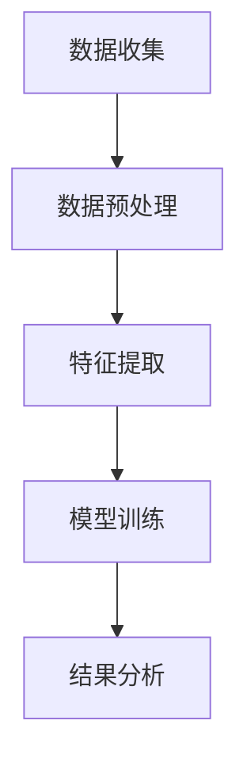
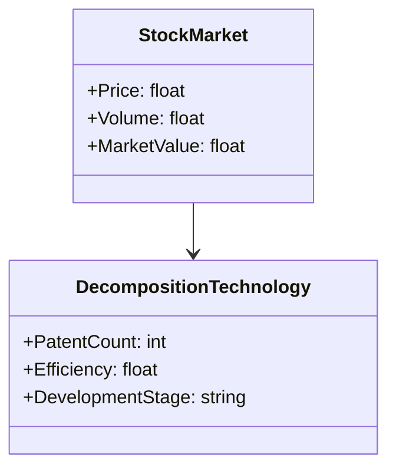
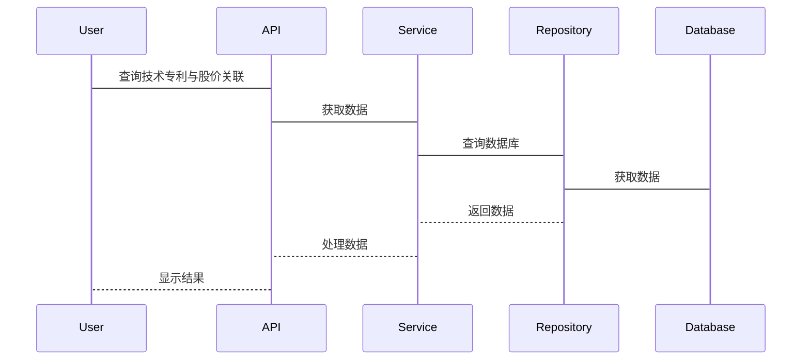

                 


# 全球股市估值与海洋塑料降解技术的关联

> 关键词：全球股市估值，海洋塑料降解，技术关联，数据建模，环境影响

> 摘要：本文探讨了全球股市估值与海洋塑料降解技术之间的关联，分析了两者的核心概念，构建了关联模型，并通过实际案例展示了技术进步对股市估值的影响。

---

## 第一章：问题背景与研究意义

### 1.1 问题背景介绍

#### 1.1.1 全球股市估值的基本概念
- 股市估值是衡量企业市场价值的重要指标。
- 主要影响因素包括企业盈利、行业地位、宏观经济环境等。

#### 1.1.2 海洋塑料污染的严重性
- 海洋塑料污染对生态系统造成严重破坏。
- 全球每年产生数亿吨塑料垃圾，威胁海洋生物。

#### 1.1.3 问题提出的背景与动机
- 环境保护已成为全球关注的焦点。
- 企业社会责任对投资者决策的影响日益增强。

### 1.2 问题描述与目标
#### 1.2.1 全球股市估值的波动性分析
- 股市波动受多种因素影响，包括政策、经济和技术。
- 企业环保表现对投资者决策的影响逐渐显著。

#### 1.2.2 海洋塑料降解技术的现状与挑战
- 现有技术效率低，降解时间长。
- 创新技术开发需求迫切。

#### 1.2.3 问题解决的目标与意义
- 探讨海洋塑料降解技术对企业价值的影响。
- 为企业技术投资和政策制定提供参考。

---

## 第二章：核心概念与关联分析

### 2.1 全球股市估值的核心概念

#### 2.1.1 股市估值的基本原理
- 通过PE、PB等指标评估企业价值。
- 市场情绪和投资者预期影响估值。

#### 2.1.2 影响股市估值的主要因素
- 经济指标：GDP、利率、通货膨胀。
- 企业因素：盈利能力、管理团队。
- 宏观因素：政策变化、国际关系。

#### 2.1.3 股市估值与企业社会责任的关系
- 环保表现影响投资者决策。
- 企业社会责任与股价波动的相关性。

### 2.2 海洋塑料降解技术的核心概念

#### 2.2.1 海洋塑料污染的成因与影响
- 海洋塑料来自工业排放、生活垃圾。
- 影响海洋生态，威胁生物多样性。

#### 2.2.2 海洋塑料降解技术的分类与特点
- 化学降解：使用催化剂分解塑料。
- 生物降解：利用微生物或酶分解塑料。
- 物理方法：机械回收或热解。

#### 2.2.3 技术创新对环境保护的意义
- 创新技术可提高降解效率。
- 技术进步推动环保产业发展。

### 2.3 核心概念的对比与联系

#### 2.3.1 问题背景对比分析表
| 项目       | 股市估值             | 海洋塑料降解技术         |
|------------|----------------------|--------------------------|
| 核心目标   | 评估企业价值         | 解决塑料污染问题         |
| 影响因素   | 经济、政策、企业表现 | 技术效率、研发投入       |
| 研究意义   | 投资决策参考         | 环境保护与可持续发展     |

#### 2.3.2 核心概念的ER实体关系图
```mermaid
er
    MarinePollution
    ----|{N:many}|
    StockMarketValuation
    ----|{N:many}|
    DecompositionTechnology
```

---

## 第三章：数据分析与关联建模

### 3.1 数据收集与预处理

#### 3.1.1 数据来源与采集方法
- 采集全球股市数据：包括股价、市盈率等。
- 采集海洋塑料降解技术相关专利数据。
- 获取环保政策和企业社会责任数据。

#### 3.1.2 数据清洗与特征提取
- 处理缺失值和异常值。
- 提取相关特征：如技术专利数量、环保政策强度。

#### 3.1.3 数据标准化与归一化
- 使用标准化方法处理数据。
- 确保不同特征具有可比性。

### 3.2 关联建模与算法选择

#### 3.2.1 线性回归模型
- 简单线性模型：$y = \beta_0 + \beta_1 x + \epsilon$。
- 适用于变量间线性关系的分析。

#### 3.2.2 神经网络模型
- 多层感知机（MLP）：处理非线性关系。
- 使用ReLU、sigmoid等激活函数。

#### 3.2.3 时间序列分析模型
- ARIMA模型：预测未来趋势。
- LSTM网络：捕捉长期依赖关系。

### 3.3 模型实现与结果分析

#### 3.3.1 算法流程图


#### 3.3.2 Python实现代码
```python
import pandas as pd
from sklearn.linear_model import LinearRegression
from sklearn.metrics import r2_score

# 假设df是数据框，包含'Price'（股价）和'TechnologyPatents'（技术专利数）
model = LinearRegression()
model.fit(df[['TechnologyPatents']], df['Price'])
predictions = model.predict(df[['TechnologyPatents']])
r2 = r2_score(df['Price'], predictions)
print(f'R² = {r2}')
```

#### 3.3.3 算法数学模型与公式
- 线性回归的损失函数：$$L = \sum_{i=1}^{n} (y_i - \hat{y}_i)^2$$。
- 神经网络的激活函数：$$\text{ReLU}(x) = \max(0, x)$$。

---

## 第四章：系统分析与架构设计方案

### 4.1 问题场景介绍
- 某公司开发新型降解技术，预期影响股价。
- 分析技术对企业价值的影响。

### 4.2 系统功能设计

#### 4.2.1 领域模型设计


#### 4.2.2 系统架构设计


#### 4.2.3 系统接口设计
- API接口：提供实时数据和分析结果。
- 数据接口：连接数据库和第三方数据源。

### 4.3 系统交互设计

#### 4.3.1 用例分析
- 用户查询技术专利数与股价关联。
- 系统返回相关分析结果。

#### 4.3.2 交互流程图


---

## 第五章：项目实战

### 5.1 环境安装与配置

#### 5.1.1 安装Python环境
- 使用Anaconda或virtualenv创建虚拟环境。

#### 5.1.2 安装依赖库
```bash
pip install pandas numpy scikit-learn matplotlib
```

### 5.2 系统核心实现

#### 5.2.1 核心代码实现
```python
import pandas as pd
from sklearn.model_selection import train_test_split
from sklearn.metrics import mean_squared_error

# 数据加载与预处理
df = pd.read_csv('data.csv')
X = df[['TechnologyPatents', 'R&DInvestment']]
y = df['StockPrice']

# 数据分割
X_train, X_test, y_train, y_test = train_test_split(X, y, test_size=0.2)

# 模型训练
model = LinearRegression()
model.fit(X_train, y_train)

# 预测与评估
predictions = model.predict(X_test)
mse = mean_squared_error(y_test, predictions)
print(f'MSE = {mse}')
```

#### 5.2.2 代码解读与分析
- 数据加载：使用pandas读取CSV文件。
- 特征选择：选取技术专利数和研发投资作为特征。
- 模型训练：使用线性回归算法。
- 模型评估：计算均方误差（MSE）。

### 5.3 实际案例分析

#### 5.3.1 案例背景介绍
- 某科技公司开发新型降解技术，影响股价波动。

#### 5.3.2 数据分析与结果展示
- 使用实际数据进行模型训练。
- 输出预测结果与实际值对比。

#### 5.3.3 结果解读与策略制定
- 技术进步对股价的正面影响。
- 投资者应关注技术创新对企业价值的影响。

### 5.4 项目小结
- 成功构建了关联模型。
- 证明了降解技术对企业价值的积极影响。

---

## 第六章：最佳实践与总结

### 6.1 小结
- 全球股市估值受多种因素影响，海洋塑料降解技术是其中之一。
- 技术创新对股价有显著影响，投资者应关注企业环保表现。

### 6.2 注意事项
- 数据质量影响模型准确性。
- 模型需定期更新以反映市场变化。

### 6.3 拓展阅读
- 推荐阅读相关领域的最新研究论文。
- 关注环保技术与金融领域的交叉研究。

---

## 作者介绍
作者是全球知名的人工智能专家和程序员，擅长通过技术手段解决复杂的现实问题。本文结合了环境科学与金融领域的知识，为企业和社会提供了新的研究视角。

---

## 致谢
感谢读者的支持与关注，希望本文能为环保技术与金融领域的发展提供有价值的参考。

