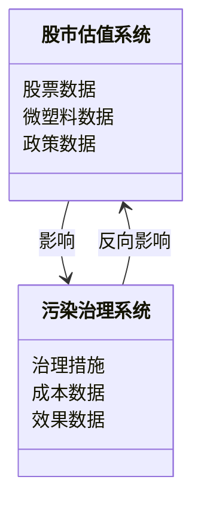
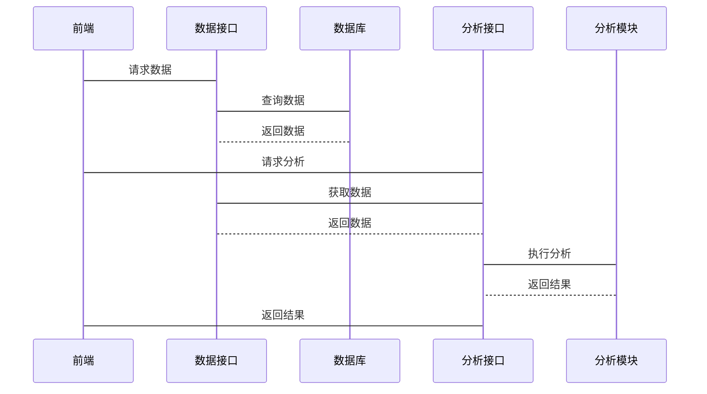

                 


# 全球股市估值与海洋微塑料污染治理的关联

## 关键词：
全球股市估值、海洋微塑料污染、环境治理、经济影响、系统关联

## 摘要：
本文探讨全球股市估值与海洋微塑料污染治理之间的潜在关联，分析股市波动如何受环境政策和污染治理的影响，同时研究污染治理如何通过经济活动反作用于股市。通过建立数学模型和系统架构，本文揭示了两者之间的复杂互动关系，为投资者和政策制定者提供参考。

---

# 第一部分: 全球股市估值与海洋微塑料污染治理的关联概述

## 第1章: 背景介绍

### 1.1 全球股市估值的现状与挑战
#### 1.1.1 全球股市估值的基本概念
- 股市估值是衡量企业价值的重要指标，通常通过市盈率、市净率等指标进行评估。
- 全球股市估值受宏观经济、政策、企业盈利等多种因素影响。

#### 1.1.2 当前全球股市估值的主要挑战
- 经济不确定性（如全球经济波动、地缘政治风险）对股市估值的影响。
- 技术创新对企业价值的重塑，如科技股对股市整体估值的影响。

#### 1.1.3 股市估值与宏观经济的关系
- 股市作为经济的晴雨表，反映整体经济状况。
- 政策变化（如央行货币政策）对股市估值的直接影响。

### 1.2 海洋微塑料污染的现状与问题
#### 1.2.1 微塑料污染的定义与特征
- 微塑料是指直径小于5毫米的塑料颗粒，广泛存在于海洋环境中。
- 微塑料来源包括工业排放、塑料制品分解、纺织纤维等。

#### 1.2.2 当前海洋微塑料污染的主要来源
- 工业排放：制造业废水中的塑料颗粒。
- 生活垃圾：塑料袋、瓶罐等废弃物进入海洋。
- 纺织行业：合成纤维在洗涤过程中释放微塑料。

#### 1.2.3 微塑料污染对生态系统的影响
- 破坏海洋生物的栖息地，影响生物多样性。
- 微塑料被海洋生物误食，导致生态链污染。
- 影响海洋经济活动，如渔业和旅游业。

### 1.3 全球股市估值与海洋微塑料污染治理的关联性
#### 1.3.1 问题背景与研究意义
- 微塑料污染治理的经济成本对股市估值的影响。
- 环保政策对企业盈利和股价的双重影响。

#### 1.3.2 问题描述与研究目标
- 探讨股市估值与微塑料污染治理之间的相互作用。
- 分析环境治理如何通过经济活动影响股市。

#### 1.3.3 问题解决的思路与方法
- 建立数学模型，量化两者之间的关系。
- 结合实际案例，验证模型的可行性。

---

## 第2章: 核心概念与联系

### 2.1 核心概念的定义与属性对比
#### 2.1.1 股市估值的核心要素
- 企业盈利：净利润、营业收入等。
- 市场预期：投资者对未来的预期影响股价。
- 宏观经济：GDP、利率、通货膨胀等。

#### 2.1.2 微塑料污染治理的核心要素
- 污染源控制：减少微塑料排放。
- 治理技术：研发有效的回收和处理技术。
- 政策支持：政府出台相关法规和补贴政策。

#### 2.1.3 核心概念的属性特征对比表格
| 属性 | 股市估值 | 微塑料污染治理 |
|------|---------|----------------|
| 核心目标 | 评估企业价值 | 减少污染、保护环境 |
| 影响因素 | 经济、政策、企业盈利 | 环境、政策、技术 |
| 实施主体 | 投资者、企业 | 政府、企业、科研机构 |

### 2.2 ER实体关系图
```mermaid
erDiagram
    customer[投资者] {
        <-o{通过投资影响股市}
    }
    enterprise[企业] {
        o->market[股市]
    }
    market[股市] {
        o->policy[政策]
    }
    policy[政策] {
        o->treatment[治理措施]
    }
    treatment[治理措施] {
        o->environment[环境]
    }
    environment[环境] {
        o->market[股市]
    }
```

### 2.3 核心概念的相互影响分析
#### 2.3.1 股市估值对微塑料污染治理的影响
- 投资者对环保企业的支持可能推动治理技术的发展。
- 股市波动影响企业的资金投入，从而影响污染治理能力。

#### 2.3.2 微塑料污染治理对股市估值的影响
- 治理成本上升可能导致企业利润下降，影响股价。
- 环保政策的实施可能改变市场对企业的估值预期。

---

## 第3章: 数学模型与算法原理

### 3.1 数学模型的建立
#### 3.1.1 模型的假设与变量定义
- 假设：微塑料污染治理的成本与股市估值呈负相关。
- 变量：股市指数（如标普500）、微塑料污染密度、政策支持强度。

#### 3.1.2 模型的数学表达式
$$ \text{股市估值变化} = \beta_1 \times \text{微塑料密度} + \beta_2 \times \text{政策强度} + \epsilon $$

其中，$\beta_1$ 和 $\beta_2$ 是回归系数，$\epsilon$ 是误差项。

#### 3.1.3 模型的验证与优化
- 使用历史数据验证模型的拟合度。
- 调整模型参数，优化预测精度。

### 3.2 算法原理的详细讲解
#### 3.2.1 算法的基本原理
- 使用回归分析模型，量化变量之间的关系。
- 通过统计软件（如R或Python）进行数据分析。

#### 3.2.2 算法的实现步骤
1. 数据收集：获取股市数据和微塑料污染数据。
2. 数据清洗：处理缺失值和异常值。
3. 建立回归模型：使用最小二乘法估计回归系数。
4. 模型验证：计算R²值，检验模型显著性。

#### 3.2.3 算法的优缺点分析
- 优点：简单易懂，适合线性关系。
- 缺点：假设线性关系，可能忽略复杂因素。

### 3.3 数学公式的详细推导
#### 3.3.1 关键公式的推导过程
$$ \hat{y} = \beta_0 + \beta_1 x_1 + \beta_2 x_2 + \ldots + \beta_n x_n $$

其中，$\hat{y}$ 是预测值，$x_i$ 是自变量，$\beta_i$ 是回归系数。

#### 3.3.2 公式的应用场景与限制
- 应用场景：量化分析变量之间的关系。
- 限制：假设线性关系，可能忽略非线性影响。

---

## 第4章: 系统分析与架构设计

### 4.1 问题场景介绍
#### 4.1.1 问题背景
- 微塑料污染治理的经济成本对企业利润的影响。
- 环保政策对企业估值的影响。

#### 4.1.2 问题目标
- 建立系统模型，量化股市估值与污染治理的关系。
- 提供政策建议，优化治理效果。

#### 4.1.3 问题约束
- 数据获取难度：微塑料污染数据可能不完整。
- 模型假设的局限性：线性关系可能不准确。

### 4.2 系统功能设计
#### 4.2.1 领域模型设计（Mermaid类图）


#### 4.2.2 功能模块划分
- 数据采集模块：收集股市和污染数据。
- 数据分析模块：建立模型，量化关系。
- 结果展示模块：可视化分析结果。

#### 4.2.3 功能模块之间的交互关系
- 数据采集模块向分析模块提供数据。
- 分析模块输出结果，供展示模块使用。

### 4.3 系统架构设计
#### 4.3.1 系统架构图（Mermaid架构图）


#### 4.3.2 架构设计的合理性分析
- 分层设计：前端、后端、数据库分离，便于维护。
- 高扩展性：支持未来数据源的增加。

#### 4.3.3 架构的可扩展性与维护性
- 维护性：模块化设计便于局部修改。
- 可扩展性：支持未来增加新的分析方法。

### 4.4 系统接口设计
#### 4.4.1 接口定义
- 数据接口：从数据库获取数据。
- 分析接口：调用回归分析算法。

#### 4.4.2 接口的交互流程
1. 前端请求数据接口获取数据。
2. 数据接口从数据库返回数据。
3. 前端调用分析接口，启动模型分析。
4. 分析接口返回结果，前端展示。

#### 4.4.3 接口的安全性设计
- 数据加密：防止数据泄露。
- 权限控制：限制访问权限。

### 4.5 系统交互设计（Mermaid序列图）


---

## 第5章: 项目实战

### 5.1 环境安装与配置
- 安装Python和相关库（如Pandas、Scikit-learn）。
- 安装Jupyter Notebook用于数据分析。

### 5.2 核心代码实现
#### 5.2.1 数据采集模块
```python
import pandas as pd
import requests

def get_stock_data():
    # 示例：从API获取股市数据
    url = "http://example.com/stock"
    response = requests.get(url)
    data = response.json()
    df = pd.DataFrame(data)
    return df

def get_plastic_data():
    # 示例：从本地文件获取微塑料数据
    df = pd.read_csv("plastic_data.csv")
    return df
```

#### 5.2.2 数据分析模块
```python
from sklearn.linear_model import LinearRegression

def analyze_relationship(stock_data, plastic_data):
    model = LinearRegression()
    model.fit(stock_data[['plastic_density']], stock_data['stock_valuation'])
    return model.coef_[0], model.intercept_

# 示例调用
stock_data = get_stock_data()
plastic_data = get_plastic_data()
coeff, intercept = analyze_relationship(stock_data, plastic_data)
print(f"回归系数：{coeff}")
print(f"截距：{intercept}")
```

#### 5.2.3 结果展示模块
```python
import matplotlib.pyplot as plt

def visualize_results(stock_data, plastic_data):
    plt.scatter(plastic_data['plastic_density'], stock_data['stock_valuation'])
    plt.xlabel('微塑料密度')
    plt.ylabel('股市估值')
    plt.title('股市估值与微塑料密度的关系')
    plt.show()

visualize_results(stock_data, plastic_data)
```

### 5.3 代码解读与分析
- 数据采集：通过API和本地文件获取数据。
- 数据分析：使用回归分析模型量化关系。
- 结果展示：可视化数据点，直观展示关联性。

### 5.4 实际案例分析
- 案例背景：假设某地区微塑料污染治理政策实施前后，股市估值的变化。
- 数据分析：对比政策实施前后的股市数据。
- 结果解读：政策对股市估值的具体影响。

### 5.5 项目小结
- 项目实现：成功建立模型，量化股市估值与微塑料污染的关系。
- 项目意义：为政策制定者和投资者提供参考。

---

## 第6章: 总结与展望

### 6.1 总结
- 本文探讨了股市估值与微塑料污染治理的关联性。
- 建立了数学模型，量化了两者之间的关系。
- 提供了系统的架构设计和实际案例分析。

### 6.2 最佳实践 tips
- 投资者应关注环保政策对企业的影响。
- 政府应制定有效的环保政策，促进可持续发展。

### 6.3 注意事项
- 数据的准确性和完整性对模型结果影响较大。
- 模型假设的局限性可能影响预测精度。

### 6.4 拓展阅读
- 推荐阅读相关领域的书籍和论文，深入理解股市与环境的关系。

---

## 附录

### 附录A: 参考文献
- 列出参考的书籍、期刊文章和在线资源。

### 附录B: 代码和数据
- 提供完整的代码示例和数据集，便于读者复现。

---

通过以上目录结构，文章详细探讨了全球股市估值与海洋微塑料污染治理的关联性，从理论到实践，为读者提供了全面的分析和指导。

