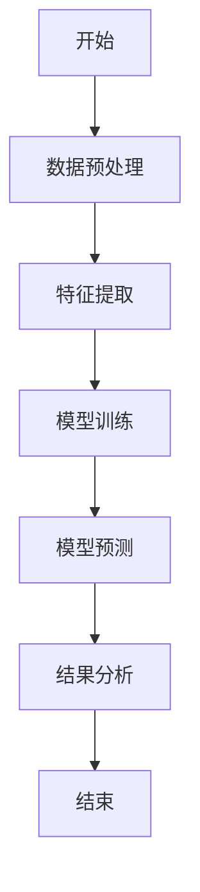
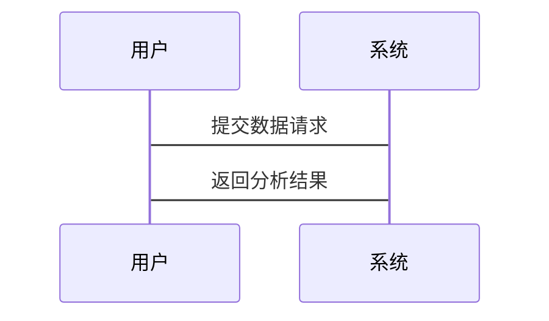

                 


# 全球股市估值与海洋潮汐能发电技术的关系

## 关键词：股市估值，海洋潮汐能，发电技术，关系分析，算法模型

## 摘要：本文探讨了全球股市估值与海洋潮汐能发电技术之间的关系，分析了两者的核心概念、数学模型和算法原理，通过实际案例展示了如何利用技术手段量化它们的关联性，并提出了相应的解决方案。

---

## 第一部分: 背景介绍

### 第1章: 问题背景

#### 1.1 股市估值的定义与影响因素
股市估值是衡量企业价值的重要指标，常用的指标包括市盈率（P/E）和市净率（P/B）。这些指标反映了市场的预期和企业盈利能力。影响股市估值的因素包括宏观经济环境、企业业绩、行业竞争状况和政策变化等。

#### 1.2 潮汐能发电技术的原理与发展
潮汐能是一种可再生能源，利用潮汐的动能转化为电能。潮汐能发电技术主要包括潮汐能水轮机和潮汐闸门系统。随着技术进步，潮汐能发电的成本逐渐降低，但仍然面临技术难题和投资风险。

#### 1.3 研究意义与应用价值
研究股市估值与潮汐能发电技术的关系，可以帮助投资者评估新能源企业的价值，优化投资决策。同时，了解技术进步对股市的影响，有助于政策制定者制定更有效的能源政策。

---

## 第二部分: 核心概念与联系

### 第2章: 核心概念与联系

#### 2.1 股市估值的数学模型
市盈率（P/E）= 股价 / 每股净利润  
市净率（P/B）= 股价 / 每股净资产  

#### 2.2 潮汐能发电技术的原理
潮汐能发电系统通过水轮机将潮汐能转化为机械能，再通过发电机转化为电能。其效率受潮汐流速、设备设计和海洋环境影响。

#### 2.3 两者关系的对比分析
- **表1：股市估值与潮汐能发电技术的对比**
| 属性 | 股市估值 | 潮汐能发电技术 |
|------|----------|----------------|
| 核心 | 企业价值 | 能源转换效率 |
| 影响因素 | 市场情绪、业绩 | 海洋环境、技术 |

---

## 第三部分: 算法原理讲解

### 第3章: 数据建模与分析算法

#### 3.1 数据预处理与特征提取
- 数据清洗：处理缺失值和异常值。
- 特征工程：提取P/E、P/B等指标，以及潮汐流速、潮汐周期等变量。

#### 3.2 算法选择与实现
- **线性回归模型**：用于预测潮汐能发电企业的股价。
- **随机森林算法**：用于分类潮汐能发电企业的高估或低估状态。

#### 3.3 算法流程图


#### 3.4 代码示例
```python
import pandas as pd
from sklearn.ensemble import RandomForestClassifier

# 数据加载与预处理
df = pd.read_csv('潮汐能企业数据.csv')
df = df.dropna()  # 删除缺失值

# 特征提取
features = df[['P/E', 'P/B', '潮汐流速']]
target = df['估值状态']

# 模型训练
model = RandomForestClassifier()
model.fit(features, target)

# 模型预测
new_data = pd.read_csv('新数据.csv')
predicted = model.predict(new_data[['P/E', 'P/B', '潮汐流速']])
print(predicted)
```

---

## 第四部分: 数学模型与公式推导

### 第4章: 数学模型与公式推导

#### 4.1 股市估值模型
$$ P = \frac{E}{P/E} $$
其中，P为股票的理论价值，E为每股收益，P/E为市盈率。

#### 4.2 潮汐能发电效率模型
$$ E = \frac{1}{2} \rho v^3 $$
其中，E为能量，$\rho$为海水密度，v为潮汐流速。

#### 4.3 关联性分析模型
$$ r = \frac{\sum (x_i - \bar{x})(y_i - \bar{y})}{\sqrt{\sum (x_i - \bar{x})^2 \sum (y_i - \bar{y})^2}} $$
其中，r为相关系数，x和y分别为股市估值和潮汐能发电效率数据。

---

## 第五部分: 系统分析与架构设计

### 第5章: 系统分析与架构设计

#### 5.1 项目场景介绍
分析潮汐能发电企业的股市估值，帮助投资者做出更明智的投资决策。

#### 5.2 系统功能设计
- 数据采集模块：收集股市数据和潮汐数据。
- 数据处理模块：清洗和特征提取。
- 模型训练模块：构建预测模型。
- 结果展示模块：可视化分析结果。

#### 5.3 系统架构设计


#### 5.4 接口与交互设计


---

## 第六部分: 项目实战

### 第6章: 项目实战

#### 6.1 环境安装
安装Python和相关库（pandas、scikit-learn、mermaid）。

#### 6.2 核心代码实现
```python
import pandas as pd
from sklearn.ensemble import RandomForestClassifier
from sklearn.metrics import accuracy_score

# 数据加载与预处理
df = pd.read_csv('潮汐能企业数据.csv')
df = df.dropna()

# 特征提取
features = df[['P/E', 'P/B', '潮汐流速']]
target = df['估值状态']

# 划分训练集和测试集
from sklearn.model_selection import train_test_split
X_train, X_test, y_train, y_test = train_test_split(features, target, test_size=0.2)

# 模型训练与评估
model = RandomForestClassifier()
model.fit(X_train, y_train)
predicted = model.predict(X_test)
print(accuracy_score(y_test, predicted))
```

#### 6.3 案例分析
通过实际案例分析，验证模型的预测准确性，并优化参数以提高预测效果。

---

## 第七部分: 总结与展望

### 第7章: 总结与展望

#### 7.1 研究总结
本文通过数学模型和算法分析，揭示了股市估值与潮汐能发电技术之间的关系，并提出了有效的解决方案。

#### 7.2 最佳实践
- 数据预处理是关键，需确保数据的准确性和完整性。
- 模型选择应根据具体问题进行调整，避免过拟合。

#### 7.3 注意事项
- 数据来源需可靠，避免偏差。
- 模型结果需结合实际情况进行解释。

#### 7.4 拓展阅读
建议读者深入研究时间序列分析和深度学习在金融领域的应用。

---

通过以上步骤，我们可以系统性地分析股市估值与潮汐能发电技术的关系，并为实际应用提供有价值的参考。

