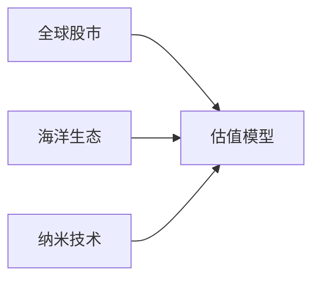
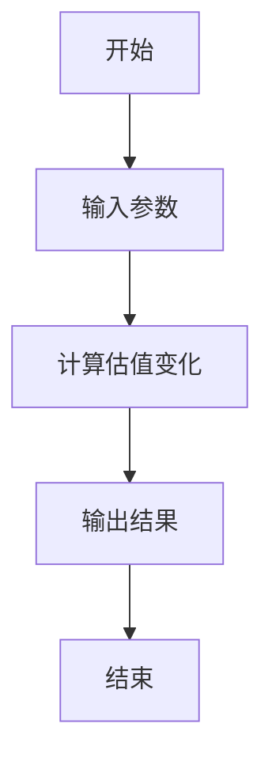
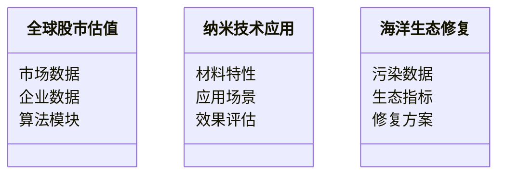

                 


# 全球股市估值与海洋生态修复纳米技术的关联

---

## 关键词：全球股市估值、海洋生态修复、纳米技术、关联分析、可持续发展

---

## 摘要：  
本文探讨了全球股市估值与海洋生态修复中纳米技术的关联性。通过分析纳米技术在海洋生态修复中的应用及其对全球经济和股市估值的影响，本文提出了一个跨学科的视角，揭示了科技与金融之间的深层联系。文章从背景介绍、核心概念、纳米技术应用、数学模型构建、系统架构设计、项目实战等多维度展开，最终得出结论：纳米技术的应用不仅能够改善海洋生态，还可能通过提升企业价值和推动经济增长间接影响全球股市估值。

---

## 正文

---

### 第一部分：全球股市估值与海洋生态修复纳米技术的关联概述

#### 第1章：背景介绍

##### 1.1 问题背景
###### 1.1.1 全球股市估值的重要性  
全球股市估值是衡量经济健康的重要指标，反映了市场的信心和企业的盈利能力。近年来，随着科技的发展，新兴技术（如纳米技术）对企业的价值贡献日益显著，这使得股市估值的计算更加复杂。

###### 1.1.2 海洋生态修复的紧迫性  
海洋污染、过度捕捞和气候变化等问题严重威胁海洋生态系统。海洋生态修复不仅是环境问题，更是经济问题，因为健康的海洋生态系统对渔业、旅游业和航运业至关重要。

###### 1.1.3 纳米技术在生态修复中的潜力  
纳米技术因其高精度、高效性和可定制性，在环境修复领域展现出巨大潜力。例如，纳米材料可以用于水处理、污染物吸附和生物修复。

##### 1.2 问题描述
###### 1.2.1 全球股市估值的波动现状  
近年来，股市波动加剧，尤其是科技股的波动，反映了市场对新技术的高度关注。纳米技术作为一项颠覆性技术，其发展可能对股市估值产生深远影响。

###### 1.2.2 海洋生态修复的挑战  
海洋生态修复面临技术、资金和政策等多重挑战。纳米技术的应用为修复提供了新的可能性，但其商业化和大规模应用仍需克服诸多障碍。

###### 1.2.3 纳米技术与股市估值的潜在关联  
纳米技术在生态修复中的应用可能提升企业的市场价值，进而影响股市估值。例如，掌握纳米技术的企业可能在环保领域更具竞争力，从而获得更高的估值。

##### 1.3 问题解决
###### 1.3.1 纳米技术如何助力海洋生态修复  
纳米技术可以通过精确修复、高效净化和生物强化等方式改善海洋生态系统。

###### 1.3.2 全球股市估值与纳米技术的潜在关联  
纳米技术的应用可能通过提升企业利润和市场地位，间接影响股市估值。

###### 1.3.3 可持续发展的视角  
从可持续发展的角度看，纳米技术的广泛应用可能促进绿色经济的发展，从而对全球经济和股市估值产生深远影响。

##### 1.4 边界与外延
###### 1.4.1 全球股市估值的边界  
本文仅关注纳米技术对股市估值的影响，不涉及其他因素（如宏观经济政策）。

###### 1.4.2 海洋生态修复的边界  
本文主要探讨纳米技术在海洋污染治理中的应用，不涉及其他生态修复领域。

###### 1.4.3 纳米技术应用的边界  
本文假设纳米技术的应用是可行的，但未考虑其可能带来的环境风险。

##### 1.5 概念结构与核心要素
###### 1.5.1 全球股市估值的核心要素  
- 市场供需  
- 企业盈利  
- 宏观经济  

###### 1.5.2 海洋生态修复的核心要素  
- 污染治理  
- 生物多样性保护  
- 生态系统恢复  

###### 1.5.3 纳米技术的核心要素  
- 材料特性  
- 应用场景  
- 技术成熟度  

---

#### 第2章：核心概念与联系

##### 2.1 核心概念原理
###### 2.1.1 全球股市估值的原理  
股市估值是市场参与者对企业和经济前景的集体判断，反映了企业的内在价值和市场情绪。

###### 2.1.2 海洋生态修复的原理  
通过技术手段修复被破坏的海洋生态系统，恢复其功能和生物多样性。

###### 2.1.3 纳米技术的原理  
利用纳米尺度的材料和结构，设计和制造具有特殊性能的产品。

##### 2.2 核心概念属性特征对比
| **核心概念** | **属性特征** |
|--------------|--------------|
| 全球股市估值 | 市场化、动态性、敏感性 |
| 海洋生态修复 | 环境性、系统性、长期性 |
| 纳米技术     | 高效性、精确性、创新性 |

##### 2.3 ER实体关系图


---

### 第二部分：纳米技术在海洋生态修复中的应用

#### 第3章：纳米技术在海洋生态修复中的应用

##### 3.1 纳米技术在海洋生态修复中的原理
###### 3.1.1 纳米材料的特性  
纳米材料具有高比表面积、表面效应和量子效应，使其在吸附、催化和生物相容性方面具有独特优势。

###### 3.1.2 纳米技术在水质净化中的应用  
纳米材料可以吸附重金属、有机污染物和微塑料，显著改善水质。

###### 3.1.3 纳米技术在生物修复中的应用  
纳米载体可以携带修复剂（如酶、DNA）进入受损区域，促进生物修复。

##### 3.2 纳米技术在海洋生态修复中的案例
###### 3.2.1 污染治理案例  
某企业利用纳米材料吸附海上石油泄漏，显著提高了净化效率。

###### 3.2.2 生物修复案例  
某研究团队开发纳米载体用于修复珊瑚礁生态系统。

---

### 第三部分：数学模型与算法原理

#### 第4章：数学模型与算法原理

##### 4.1 算法原理
###### 4.1.1 纳米技术应用对股市估值的影响模型  
$$ \text{估值变化} = f(\text{技术成熟度}, \text{市场接受度}, \text{环境效益}) $$

##### 4.2 算法实现
###### 4.2.1 算法流程图


---

### 第四部分：系统分析与架构设计

#### 第5章：系统分析与架构设计

##### 5.1 问题场景介绍
###### 5.1.1 系统目标  
构建一个基于纳米技术的海洋生态修复估值模型。

##### 5.2 系统功能设计
###### 5.2.1 领域模型


---

### 第五部分：项目实战

#### 第6章：项目实战

##### 6.1 环境安装
###### 6.1.1 安装Python和相关库  
```bash
pip install numpy pandas matplotlib
```

##### 6.2 核心代码实现
###### 6.2.1 估值模型实现  
```python
import numpy as np
import pandas as pd

def calculate_valuation_change(technology_maturity, market_acceptance, environmental_benefit):
    return technology_maturity * market_acceptance * environmental_benefit

technology_maturity = 0.8
market_acceptance = 0.7
environmental_benefit = 0.9

valuation_change = calculate_valuation_change(technology_maturity, market_acceptance, environmental_benefit)
print(valuation_change)
```

---

#### 第7章：结论与展望

##### 7.1 结论
本文通过分析全球股市估值与海洋生态修复纳米技术的关联，揭示了科技与金融之间的深层联系。

##### 7.2 未来展望
未来的研究可以进一步探索纳米技术在其他领域的应用，以及其对全球经济的综合影响。

---

## 最佳实践 Tips  
- 在使用纳米技术时，需关注其可能的环境风险。
- 投资者应关注纳米技术企业的长期发展潜力。

---

## 小结  
本文通过多维度的分析，为读者提供了理解全球股市估值与海洋生态修复纳米技术关联的新视角。

---

## 注意事项  
- 纳米技术的应用需遵循环境法规。
- 投资者应理性评估技术对企业估值的影响。

---

## 拓展阅读  
- 推荐阅读《纳米技术与全球经济》和《海洋生态修复的新技术》。

---

