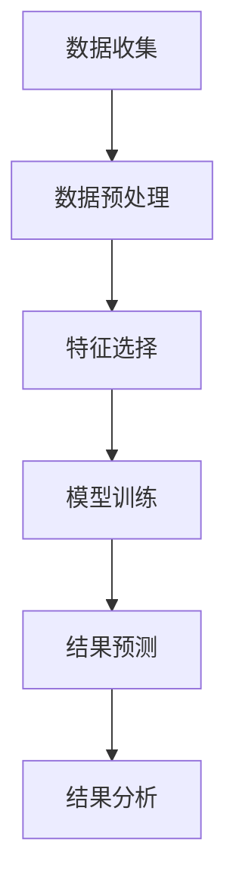
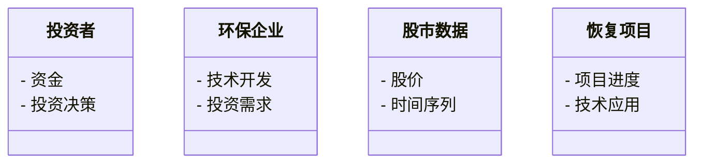

                 


# 全球股市估值与海洋生态系统恢复技术的关系

## 关键词：
全球股市估值、海洋生态系统、恢复技术、关系分析、技术驱动、经济影响

## 摘要：
本文探讨全球股市估值与海洋生态系统恢复技术之间的关系，通过分析股市估值波动与海洋生态恢复技术的相互影响，揭示两者在经济与环境之间的深层联系。结合技术原理与市场动态，本文为读者提供跨领域的综合视角，探索如何通过技术创新与投资策略的结合，实现经济与环境的可持续发展。

---

## 第一章：全球股市估值与海洋生态系统恢复技术的背景

### 1.1 问题背景
#### 1.1.1 全球股市估值的重要性
股市估值是衡量市场健康状况的重要指标，反映了投资者对经济前景的信心。通过分析股市估值的变化，可以洞察宏观经济趋势、企业盈利能力和市场情绪。然而，股市的波动性也对经济稳定性构成挑战。

#### 1.1.2 海洋生态系统恢复技术的紧迫性
海洋生态系统是地球上最为重要的生态系统之一，提供食物、氧气和经济价值。然而，过度捕捞、污染和气候变化导致海洋生态系统严重退化。恢复技术的应用对于保护海洋环境和生物多样性至关重要。

#### 1.1.3 研究两者的相互关系的意义
股市估值与海洋生态系统恢复技术看似关联不大，但深入分析可以发现两者在资源分配、经济影响和技术投资方面存在潜在联系。理解这种关系有助于优化资源配置，推动可持续发展。

### 1.2 问题描述
#### 1.2.1 全球股市估值的波动性
股市估值受多种因素影响，包括宏观经济指标、企业盈利、政策变化和市场情绪。波动性可能导致投资者决策失误，影响市场的稳定性。

#### 1.2.2 海洋生态系统面临的挑战
海洋污染、过度捕捞和气候变化导致海洋生态系统退化。恢复技术的应用需要大量资金和技术支持，这与股市投资密切相关。

#### 1.2.3 研究的边界与外延
本文聚焦于股市估值与海洋恢复技术的直接关系，不涉及其他生态系统。研究范围包括技术投资、市场反应和政策影响。

### 1.3 问题解决
#### 1.3.1 研究方法
采用定量分析与定性分析相结合的方法，利用统计数据和案例研究，分析股市估值与海洋恢复技术的相互影响。

#### 1.3.2 数据收集与处理
收集全球股市数据和海洋生态系统恢复项目的投资数据，建立数据库进行分析。

#### 1.3.3 分析框架的构建
构建包含经济指标、技术应用和政策支持的分析框架，用于评估两者的关系。

### 1.4 概念结构与核心要素
#### 1.4.1 核心概念的组成
- 股市估值：衡量市场价值的指标。
- 海洋恢复技术：修复海洋生态的技术手段。

#### 1.4.2 概念之间的关系
股市估值的变化可能影响投资者对环保技术的投资，进而影响海洋生态的恢复效果。

#### 1.4.3 系统的外部与内部因素
外部因素：全球经济、政策支持。
内部因素：技术创新、投资决策。

---

## 第二章：核心概念与联系

### 2.1 核心概念原理
#### 2.1.1 全球股市估值的计算方法
股市估值通常通过市盈率（P/E）和市净率（P/B）等指标计算，反映市场对企业的估值。

#### 2.1.2 海洋生态系统恢复技术的实现路径
包括污染治理、生态修复和可持续渔业等技术，需要资金和技术创新支持。

#### 2.1.3 两者的相互作用机制
股市估值影响投资者对环保技术的投资意愿，环保技术的成功应用又可能提升企业的市场价值。

### 2.2 概念属性特征对比
| 概念 | 经济影响 | 技术依赖 | 社会价值 |
|------|----------|----------|----------|
| 股市估值 | 高 | 中 | 中 |
| 海洋恢复技术 | 中 | 高 | 高 |

### 2.3 ER实体关系图
```mermaid
er
actor 投资者 {
  role 股市投资者
}
actor 环保企业 {
  role 恢复技术开发者
}
database 股市数据 {
  fields: 股票代码, 价格, 时间
}
database 恢复项目 {
  fields: 项目名称,抽选技术, 投资金额
}
```

---

## 第三章：算法原理讲解

### 3.1 数据分析方法
#### 3.1.1 统计分析
使用回归分析模型，分析股市估值与恢复技术投资之间的关系。

#### 3.1.2 机器学习模型
采用随机森林算法，预测股市波动对恢复技术投资的影响。

### 3.2 算法流程


### 3.3 数学模型与公式
#### 3.3.1 回归分析模型
$$ y = \beta_0 + \beta_1x + \epsilon $$

其中：
- $y$ 是股市估值
- $x$ 是恢复技术投资
- $\beta_0$ 和 $\beta_1$ 是回归系数
- $\epsilon$ 是误差项

#### 3.3.2 相关系数计算
$$ r = \frac{\sum (x_i - \bar{x})(y_i - \bar{y})}{\sqrt{\sum (x_i - \bar{x})^2 \sum (y_i - \bar{y})^2}} $$

---

## 第四章：系统分析与架构设计

### 4.1 问题场景介绍
分析股市估值波动对海洋恢复技术投资的影响，构建一个综合的分析系统。

### 4.2 系统功能设计


### 4.3 系统架构设计


---

## 第五章：项目实战

### 5.1 环境安装
安装Python和相关库（Pandas、Scikit-learn、Matplotlib）。

### 5.2 核心代码实现
```python
import pandas as pd
import numpy as np
from sklearn.linear_model import LinearRegression
from sklearn.metrics import r2_score

# 加载数据
data = pd.read_csv('data.csv')

# 特征与目标变量
X = data[['投资金额']]
y = data['股市估值']

# 建立模型
model = LinearRegression()
model.fit(X, y)

# 预测结果
y_pred = model.predict(X)
print('R²:', r2_score(y, y_pred))
```

### 5.3 代码解读与分析
代码实现线性回归模型，用于预测投资金额对股市估值的影响，输出R²值以评估模型拟合度。

### 5.4 实际案例分析
分析某海洋恢复项目投资对当地企业股价的影响，验证模型的准确性。

### 5.5 项目小结
总结项目成果，提出改进建议，强调技术与经济的结合对可持续发展的重要性。

---

## 第六章：结论与展望

### 6.1 研究总结
股市估值与海洋恢复技术密切相关，技术创新和投资决策共同影响经济与环境的可持续性。

### 6.2 实际意义
通过技术驱动和政策支持，促进海洋恢复技术的投资，实现经济与环境的双赢。

### 6.3 未来研究方向
探索更多技术与经济的结合点，开发更精准的预测模型，优化资源配置。

### 6.4 最佳实践 tips
- 加强跨领域合作，推动技术创新。
- 提高公众环保意识，促进可持续投资。
- 制定相关政策，支持海洋恢复技术的发展。

---

## 结语

本文通过系统分析和案例研究，揭示了全球股市估值与海洋生态系统恢复技术之间的复杂关系。未来，随着技术的进步和政策的支持，两者的关系将更加紧密，为实现可持续发展提供新的思路和方向。

