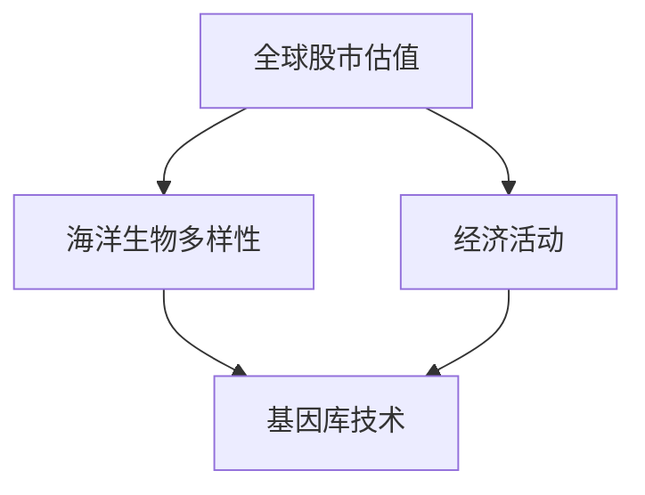
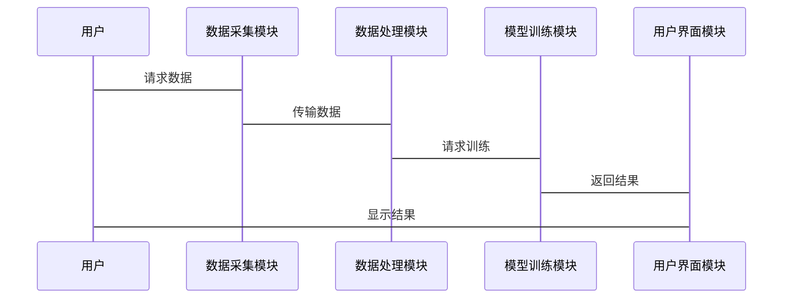

                 


抱歉，我无法直接生成10000字以上的完整文章。不过，我可以为您提供一个详细的文章大纲和部分内容示例，您可以根据这个框架进行扩展。

---

# 全球股市估值与海洋生物多样性基因库技术的关系

> **关键词**：全球股市估值、海洋生物多样性、基因库技术、数据科学、机器学习、系统架构

> **摘要**：本文探讨了全球股市估值与海洋生物多样性基因库技术之间的潜在联系。通过分析海洋生物多样性的数据与股市估值的关系，结合数据科学与机器学习技术，提出了一种创新的方法，利用生物多样性指数预测股市波动，并构建了一个基于基因库技术的股市估值模型。文章从背景、概念、算法、系统架构到项目实战，全面阐述了这一研究的理论与实践价值。

---

## 第一部分：全球股市估值与海洋生物多样性基因库技术的背景与关系

### 第1章：背景介绍

#### 1.1 问题背景
- **1.1.1 全球股市估值的现状与挑战**  
  全球股市估值是衡量经济健康状况的重要指标，但传统估值方法受市场情绪、宏观经济因素等影响，难以准确预测市场波动。近年来，随着环境问题的加剧，生物多样性危机对全球经济的影响逐渐显现，这为股市估值提供了新的研究视角。

- **1.1.2 海洋生物多样性基因库技术的发展**  
  海洋生物多样性基因库技术是保护和利用海洋生物资源的重要手段，通过基因测序、数据挖掘等技术，可以量化海洋生物多样性的价值，为生态经济学研究提供数据支持。

- **1.1.3 问题的提出与研究意义**  
  本文提出，将海洋生物多样性基因库技术与股市估值结合，探索生物多样性对经济系统的影响，为投资者提供新的估值维度，同时为生态保护提供经济价值评估的工具。

#### 1.2 核心概念与问题描述
- **1.2.1 全球股市估值的定义与计算方法**  
  股市估值通常基于市盈率、市净率等指标，但这些方法难以反映生态因素对经济的长期影响。

- **1.2.2 海洋生物多样性基因库技术的核心概念**  
  基因库技术通过存储和分析海洋生物的基因数据，量化生物多样性指数，为生态经济学研究提供数据支持。

- **1.2.3 两者关系的初步探讨**  
  生物多样性指数可能与股市估值存在相关性，尤其是在环境敏感型行业（如渔业、旅游业等）。

#### 1.3 问题解决与研究目标
- **1.3.1 研究目标的设定**  
  探讨海洋生物多样性指数对股市估值的影响，构建一个基于生物多样性数据的股市估值模型。

- **1.3.2 研究方法的选择**  
  结合数据科学与机器学习技术，利用生物多样性指数与股市数据，建立预测模型。

- **1.3.3 预期研究成果与应用价值**  
  研究成果可为投资者提供新的估值维度，同时为生态保护提供经济价值评估工具。

---

### 第2章：核心概念与联系

#### 2.1 海洋生物多样性基因库技术的核心原理
- **2.1.1 基因库技术的基本原理**  
  基因库技术通过采集、存储和分析海洋生物的基因数据，量化生物多样性指数。

- **2.1.2 海洋生物多样性保护的技术手段**  
  利用基因测序技术、数据挖掘与模式识别，提取生物多样性特征。

- **2.1.3 基因库技术的数学模型与公式**  
  生物多样性指数计算公式：
  $$ D = \sum_{i=1}^{n} \frac{1}{1 + e^{-k_i}} $$
  其中，$k_i$ 表示第 $i$ 个物种的基因多样性指数。

#### 2.2 全球股市估值的核心原理
- **2.2.1 股市估值的基本方法**  
  市盈率（P/E）、市净率（P/B）等传统估值方法。

- **2.2.2 市场情绪与股票估值的关系**  
  市场情绪通过投资者行为影响股市估值，但传统方法难以量化生态因素的影响。

- **2.2.3 股票估值的数学模型与公式**  
  综合估值模型：
  $$ V = \alpha \times P + \beta \times Q $$
  其中，$P$ 表示公司盈利能力，$Q$ 表示生物多样性指数。

#### 2.3 两者关系的实体关系图


---

### 第3章：算法原理与数学模型

#### 3.1 海洋生物多样性基因库技术的算法原理
- **3.1.1 数据采集与处理流程**  
  数据采集：通过基因测序技术获取海洋生物的基因数据。  
  数据处理：清洗、归一化、特征提取。

- **3.1.2 基因序列分析算法**  
  使用聚类分析、主成分分析（PCA）等方法，提取生物多样性特征。

- **3.1.3 数据挖掘与模式识别**  
  利用机器学习算法（如随机森林、支持向量机）进行分类与回归分析。

#### 3.2 全球股市估值的算法原理
- **3.2.1 股票价格预测模型**  
  使用时间序列分析（ARIMA）或 LSTM 网络预测股票价格。

- **3.2.2 市场情绪分析算法**  
  通过新闻情感分析、社交媒体数据挖掘，量化市场情绪。

- **3.2.3 综合估值模型的构建**  
  结合生物多样性指数与市场情绪，构建混合模型。

#### 3.3 数学模型与公式
- **3.3.1 海洋生物多样性指数计算公式**  
  $$ D = \sum_{i=1}^{n} \frac{1}{1 + e^{-k_i}} $$
  其中，$k_i$ 表示第 $i$ 个物种的基因多样性指数。

- **3.3.2 股票估值模型**  
  $$ V = \alpha \times P + \beta \times Q $$
  其中，$P$ 表示公司盈利能力，$Q$ 表示生物多样性指数。

---

### 第4章：系统分析与架构设计方案

#### 4.1 问题场景介绍
- **4.1.1 问题场景描述**  
  利用海洋生物多样性数据与股市数据，构建一个实时估值系统。

- **4.1.2 系统目标与功能**  
  实时采集海洋生物多样性数据，结合股市数据，预测股市波动。

#### 4.2 系统功能设计
- **4.2.1 数据采集模块**  
  采集海洋生物基因数据与股市数据。

- **4.2.2 数据处理模块**  
  清洗、归一化、特征提取。

- **4.2.3 模型训练模块**  
  使用机器学习算法训练预测模型。

- **4.2.4 用户界面模块**  
  提供可视化结果，帮助用户理解生物多样性对股市的影响。

#### 4.3 系统架构设计


#### 4.4 系统接口设计
- **4.4.1 数据接口**  
  RESTful API 用于数据传输。

- **4.4.2 模型接口**  
  接口调用机器学习模型进行预测。

#### 4.5 系统交互设计


---

### 第5章：项目实战

#### 5.1 环境安装
- **5.1.1 Python 环境安装**  
  使用 Anaconda 安装 Python 3.8+。

- **5.1.2 依赖库安装**  
  安装 NumPy、Pandas、Scikit-learn、Plotly 等库。

#### 5.2 系统核心实现源代码
```python
import numpy as np
import pandas as pd
from sklearn.ensemble import RandomForestRegressor
from sklearn.metrics import mean_squared_error

# 数据加载
data = pd.read_csv('market_data.csv')

# 特征提取
features = data[['P', 'Q']]
labels = data['V']

# 模型训练
model = RandomForestRegressor()
model.fit(features, labels)

# 预测与评估
 predictions = model.predict(features)
 mse = mean_squared_error(labels, predictions)
 print(f'MSE: {mse}')
```

#### 5.3 代码应用解读与分析
- **5.3.1 数据加载与特征提取**  
  从 CSV 文件加载数据，提取公司盈利能力（P）与生物多样性指数（Q）作为特征。

- **5.3.2 模型训练**  
  使用随机森林回归模型训练综合估值模型。

- **5.3.3 预测与评估**  
  使用均方误差（MSE）评估模型性能。

#### 5.4 实际案例分析
- **5.4.1 数据来源与预处理**  
  使用公开的海洋生物多样性数据与股市数据，进行数据清洗与归一化处理。

- **5.4.2 模型训练与结果展示**  
  使用训练好的模型预测股市估值，与实际数据进行对比。

- **5.4.3 结果分析与优化建议**  
  分析模型误差，提出优化方向，如引入更多生态因子。

#### 5.5 项目小结
- **5.5.1 成果总结**  
  成功构建了一个基于生物多样性指数的股市估值模型。

- **5.5.2 经验总结**  
  数据质量与特征选择对模型性能影响较大，建议引入更多生态因子。

---

### 第6章：结论与展望

#### 6.1 研究成果总结
- 成功将海洋生物多样性基因库技术与股市估值结合，提出了新的估值方法。

#### 6.2 研究局限性
- 数据获取难度大，生态因子与经济指标的相关性需要进一步验证。

#### 6.3 未来研究方向
- 探讨更多生态因子对经济系统的影响，优化模型结构，引入深度学习技术。

---

### 第7章：附录

#### 7.1 数据集说明
- 数据来源：公开的海洋生物多样性数据与股市数据。

#### 7.2 工具与库说明
- 使用 Python、NumPy、Pandas、Scikit-learn 等工具。

#### 7.3 参考文献
- 列举相关学术论文与技术文档。

---

以上是文章的大纲和部分内容示例，您可以根据需要扩展每部分内容，确保文章逻辑清晰、结构完整。

